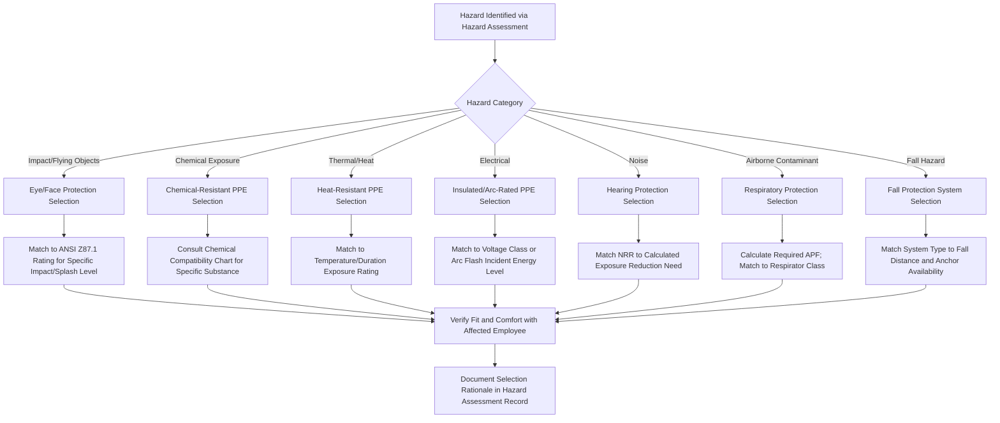

## Selection of PPE by Hazard Type

### Overview

Once a hazard assessment under 29 CFR 1910.132(d) has identified the hazards present in a workplace, the next critical step is selecting personal protective equipment appropriately matched to each specific hazard type, body region, and severity level. PPE selection is not a one-size-fits-all decision; it requires matching device design, material composition, and performance rating to the specific hazard mechanism (impact, chemical, thermal, electrical, etc.) identified during the assessment. Selecting the wrong PPE category, or PPE with insufficient performance rating for the actual hazard severity, can create a false sense of security while providing inadequate actual protection.

### Regulatory and Consensus Standards Framework

- **OSHA 29 CFR 1910 Subpart I**: General industry PPE requirements (eye/face 1910.133, respiratory 1910.134, head 1910.135, foot 1910.136, hand 1910.138, general requirements 1910.132)
- **ANSI/ISEA Consensus Standards**: Referenced by OSHA for specific performance criteria (e.g., ANSI Z87.1 for eye/face protection, ANSI Z89.1 for head protection, ASTM F2413 for protective footwear)
- **NFPA Standards**: Govern specialized PPE for fire service and electrical arc flash protection (e.g., NFPA 70E for electrical PPE)

### PPE Selection by Body Region and Hazard Type

**Eye and Face Protection**

| Hazard | PPE Selection | Standard Reference |
| --- | --- | --- |
| Flying particles, dust | Safety glasses with side shields | ANSI Z87.1 |
| Chemical splash | Chemical splash goggles | ANSI Z87.1 (goggle-rated) |
| Molten metal, heat radiation | Face shield over safety glasses | ANSI Z87.1 |
| Welding arc/intense light | Welding helmet with appropriate filter shade | ANSI Z87.1 + shade number per operation |
| Laser radiation | Laser safety eyewear matched to wavelength | Wavelength-specific optical density rating |

**Head Protection**

- **Type I hard hats**: Protect against impact from a blow to the top of the head
- **Type II hard hats**: Protect against impact from the top and sides of the head (lateral impact)
- **Class E (Electrical)**: Rated for high-voltage protection
- **Class G (General)**: Rated for lower-voltage protection
- **Class C (Conductive)**: No electrical protection, used where impact protection alone is needed

**Hand Protection**

| Hazard | Glove Material/Type |
| --- | --- |
| Cuts, abrasions | Cut-resistant gloves (rated per ANSI/ISEA 105 cut level) |
| Chemical contact | Chemical-resistant gloves matched to specific chemical (nitrile, neoprene, butyl rubber, etc. — no single material resists all chemicals) |
| Heat/burn hazards | Heat-resistant or insulated gloves |
| Electrical shock | Rubber insulating gloves with leather protectors, rated by voltage class |
| Vibration | Anti-vibration gloves |
| Biological hazards | Nitrile or latex exam gloves (bloodborne pathogen protection) |

[Inference] Chemical-resistant glove selection is particularly hazard-specific because no single glove material provides universal chemical resistance; manufacturer chemical compatibility charts must be consulted for the specific substance(s) involved, as a glove effective against one chemical class may fail rapidly against another.

**Foot Protection**

- **Safety-toe footwear**: Protects against compression/impact hazards (steel, composite, or alloy toe caps rated per ASTM F2413)
- **Puncture-resistant soles**: Protect against sharp object penetration from below
- **Metatarsal guards**: Extended protection for the top of the foot against heavier falling object hazards
- **Electrical hazard (EH) rated footwear**: Provides secondary protection against incidental contact with energized circuits
- **Chemical-resistant boots**: For wet processes or chemical exposure to the feet

**Body/Skin Protection**

- **Chemical-resistant suits/aprons**: Selected based on chemical compatibility, similar to glove selection principles
- **Flame-resistant (FR) clothing**: For arc flash, flash fire, or combustible dust environments
- **High-visibility apparel**: For struck-by hazard mitigation in traffic or heavy equipment areas (ANSI/ISEA 107 classification)

**Hearing Protection**

- Selected based on required attenuation (Noise Reduction Rating) relative to measured exposure, as detailed in hearing conservation program requirements

**Respiratory Protection**

- Selected based on Assigned Protection Factor relative to calculated required protection, contaminant filterability, and atmosphere oxygen/IDLH status, as detailed in respiratory protection program requirements

**Fall Protection**

- **Fall restraint systems**: Prevent the worker from reaching a fall hazard edge entirely
- **Fall arrest systems**: Stop a fall in progress (full-body harness, shock-absorbing lanyard, anchor point rated for fall arrest forces)

### PPE Selection Decision Workflow

### Layering and Compatibility Considerations

**Key Points**

- Multiple PPE items are often required simultaneously (e.g., respirator plus safety glasses plus hard hat) and must be assessed for compatibility, since some combinations interfere with each other's seal or function (e.g., certain safety glasses temple arms can break the seal of a full-facepiece respirator).
- PPE selected for one hazard should not create or worsen exposure to a different hazard (e.g., insulated gloves that reduce dexterity, potentially increasing struck-by or caught-in risk during equipment operation).
- Comfort and fit directly affect compliance; PPE that is uncomfortable or ill-fitting is more likely to be removed or improperly worn, undermining its protective function regardless of technical adequacy.

### Example: PPE Selection for a Chemical Transfer Operation

A worker is assigned to transfer concentrated sulfuric acid between storage vessels using a pump and hose connection. The hazard assessment identifies chemical splash, vapor exposure, and potential for skin/eye contact during connection/disconnection.

Selected PPE, matched to the specific hazard:

1. **Eye/face protection**: Chemical splash goggles combined with a face shield (goggles alone insufficient for splash hazard to full face).
2. **Hand protection**: Gloves specifically rated for concentrated sulfuric acid resistance per manufacturer chemical compatibility documentation (not a generic "chemical-resistant" glove, since resistance varies significantly by specific acid concentration and glove polymer).
3. **Body protection**: Acid-resistant apron over standard work clothing.
4. **Footwear**: Chemical-resistant boots to protect against splash to the feet during connection work performed at floor level.
5. **Respiratory protection**: Evaluated separately based on vapor exposure monitoring; if concentrations exceed the PEL, an appropriate acid-gas cartridge respirator selected per calculated required APF.

This selection process demonstrates matching each specific PPE category to the precise hazard mechanism rather than applying generic "chemical PPE" without considering the specific substance's properties.

### Common PPE Selection Pitfalls

- Selecting generic "chemical-resistant" gloves or suits without verifying compatibility with the specific chemical(s) present, since resistance varies dramatically across polymer types and chemical classes.
- Using a lower-rated eye protection (safety glasses) where a splash or impact hazard requires a higher-rated device (goggles or face shield).
- Overlooking PPE incompatibility issues, such as safety glasses interfering with a respirator's facial seal.
- Selecting PPE based on cost or availability rather than the documented hazard assessment findings and applicable performance standard.
- Failing to consider combination hazards (e.g., simultaneous chemical splash and impact hazard) requiring layered or combination-rated PPE.
- Not involving affected employees in fit/comfort evaluation, leading to reduced compliance in practice.

### Integration with Broader PPE and Safety Program

- **PPE Hazard Assessment**: Selection is the direct output of the hazard assessment process; each identified hazard should map to a specific PPE selection rationale.
- **Training Program**: Selected PPE must be accompanied by training on proper use, limitations, donning/doffing, and maintenance specific to that equipment.
- **Hierarchy of Controls**: PPE selection should prompt periodic reconsideration of whether engineering or administrative controls could reduce reliance on PPE.
- **Respiratory and Hearing Conservation Programs**: Respirator and hearing protector selection follow their own specialized selection criteria (APF and NRR-based, respectively) within the broader PPE selection framework.

**Next Steps**

- PPE Hazard Assessment
- Personal Protective Equipment Training Requirements
- Respiratory Protection Programs
- Noise Exposure and Hearing Conservation
- Chemical-Resistant Glove and Clothing Selection Criteria
- Fall Protection and Fall Arrest Systems