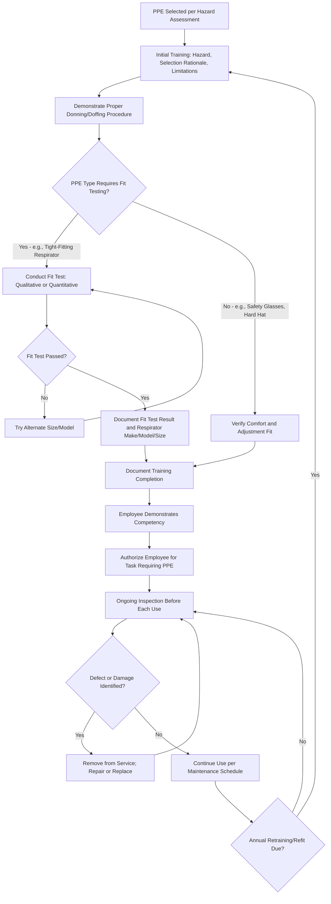

## PPE Training Fit Testing and Maintenance

### Overview

Selecting appropriate personal protective equipment is only effective if paired with proper employee training, correct fit, and diligent ongoing maintenance. OSHA's general PPE standard, 29 CFR 1910.132(f), mandates specific training content and documentation requirements, while fit testing (most rigorously codified for respiratory protection under 1910.134) and maintenance procedures ensure that selected equipment continues to perform as designed throughout its service life. Equipment that is improperly fitted, poorly maintained, or used by untrained personnel provides substantially reduced—or in some cases illusory—protection, regardless of its technical performance rating.

### Regulatory Basis

- **OSHA 29 CFR 1910.132(f)**: General PPE training requirements applicable across all PPE categories
- **OSHA 29 CFR 1910.134**: Respiratory protection fit testing requirements (most detailed fit testing protocol in the PPE regulatory framework)
- **OSHA 29 CFR 1910.95**: Hearing protector fitting requirements within the Hearing Conservation Program
- Manufacturer instructions and applicable ANSI/ISEA standards govern inspection, cleaning, and maintenance intervals for most PPE categories

### Required PPE Training Content (1910.132(f))

**Key Points**

- When PPE is necessary and which PPE is required for the specific task
- How to properly don, doff, adjust, and wear the PPE
- Limitations of the PPE (what it does and does not protect against)
- Proper care, maintenance, useful life, and disposal of the PPE
- Employees must demonstrate understanding and ability to use PPE properly before being allowed to perform work requiring its use
- Retraining is required when: workplace changes render prior training obsolete, PPE type changes, or an employee demonstrates a lack of proficiency in required PPE use

### PPE Training and Fit Verification Workflow

### Fit Testing Requirements by PPE Category

**Respirators (Most Rigorous Fit Testing Protocol)**

- Required for all tight-fitting respirators before initial use, at least annually, and upon facial/facepiece changes
- **Qualitative Fit Testing (QLFT)**: Pass/fail based on wearer's sensory detection of a test challenge agent; limited to respirators with APF of 10 or less
- **Quantitative Fit Testing (QNFT)**: Instrument-measured fit factor, required for higher APF respirator classes
- Facial hair intersecting the sealing surface invalidates fit for tight-fitting respirators

**Hearing Protectors**

- While OSHA does not mandate a formal instrumented fit test for standard hearing protectors, proper fitting instruction and, increasingly, individual fit-verification systems (e.g., real-ear attenuation testing) are used as best practice to confirm adequate seal and attenuation
- [Inference] Individual fit-verification for hearing protectors, while not universally mandated, has grown in adoption because labeled NRR values assume ideal laboratory conditions that are rarely achieved with generic fitting alone

**Fall Protection Harnesses**

- Proper fit verification includes chest strap positioning, leg strap tightness, and D-ring placement per manufacturer instructions
- Improperly fitted harnesses can result in suspension trauma or failure to distribute arrest forces properly across the body

**Gloves and Protective Clothing**

- Fit affects dexterity, grip, and potential for entanglement hazards; oversized gloves can create their own caught-in hazard near moving machinery
- Properly sized selection, rather than a formal "fit test," is the typical verification method

### PPE Inspection and Maintenance Practices

**Pre-Use Inspection**

- Visual and functional check performed by the user before each use
- Checks for cracks, tears, degraded elastomeric components, damaged straps/buckles, and contamination

**Scheduled Maintenance**

- Cleaning and disinfecting per manufacturer schedule (particularly critical for shared-use respirators and reusable protective clothing)
- Replacement of consumable components (respirator cartridges/filters, hearing protector foam tips) per manufacturer-specified service life or exposure indicators

**Storage Requirements**

- Proper storage prevents contamination, deformation, and premature degradation (e.g., storing respirators away from direct sunlight and contaminants, storing fall protection equipment away from chemical exposure that could degrade webbing)

**Record-Keeping**

- Fit test results (respirator make, model, size, date, tester, method)
- Training completion records (date, content, employee acknowledgment)
- Inspection and maintenance logs, particularly for life-safety equipment such as fall protection and respiratory protection

### PPE Care Comparison by Category

| PPE Category | Typical Maintenance Frequency | Key Failure Indicators |
| --- | --- | --- |
| Safety glasses/goggles | Inspect before each use | Scratched lenses, damaged frame, degraded seal (goggles) |
| Respirators (elastomeric) | Clean after each use (shared) or per schedule (assigned); replace cartridges per service life | Cracked facepiece, degraded straps, exhalation valve failure |
| Hard hats | Inspect before each use; replace per manufacturer service life or after impact | Cracks, UV degradation (chalking), impact damage |
| Fall protection harness | Inspect before each use; formal inspection per schedule | Frayed webbing, damaged stitching, corroded hardware, impact indicator deployment |
| Hearing protectors (reusable) | Clean regularly; replace foam tips per schedule | Hardened/cracked material, loss of resilience |
| Chemical-resistant gloves | Inspect before each use | Pinholes, discoloration, degradation from chemical exposure |

### Example: Respirator Fit Testing Session

An employee newly assigned to a task requiring a half-mask elastomeric respirator undergoes the following process:

1. **Medical evaluation**: Completed and cleared by a PLHCP prior to fit testing.
2. **Size/model selection**: Employee tries multiple manufacturer models/sizes to identify candidates with a good preliminary seal.
3. **Quantitative fit test**: Conducted using a fit test instrument measuring ambient particle count versus in-mask particle count across a series of standardized exercises (normal breathing, deep breathing, head movement, talking, bending).
4. **Fit factor result**: Calculated fit factor must meet or exceed the minimum passing threshold for the respirator class.
5. **Documentation**: Make, model, size, fit factor result, and date recorded in the employee's respirator file.
6. **Training**: Employee trained on proper donning sequence, user seal check procedure (positive/negative pressure check), and cartridge change-out schedule.
7. **Annual refit**: Scheduled for one year later, or sooner if facial changes occur.

### Common Training, Fit Testing, and Maintenance Pitfalls

- Conducting PPE training as a one-time event without retraining when PPE type or workplace conditions change.
- Allowing facial hair or other seal-interfering conditions to persist for employees using tight-fitting respirators.
- Using expired or degraded fit-test challenge agents, producing unreliable qualitative fit test results.
- Failing to document fit test results with sufficient specificity (make/model/size), leading to reissued equipment that does not match the tested configuration.
- Neglecting scheduled maintenance on life-safety equipment (fall protection, respirators), allowing undetected degradation to persist until failure or inspection reveals damage.
- Storing PPE improperly (e.g., respirators exposed to contaminants between uses, harnesses exposed to UV or chemical degradation), shortening effective service life without user awareness.

### Integration with Broader PPE and Safety Program

- **PPE Hazard Assessment**: Training and fit testing requirements derive from the PPE categories selected during hazard assessment.
- **Respiratory Protection Program**: Fit testing is a core, heavily regulated element of the broader respiratory protection program.
- **Hearing Conservation Program**: Hearing protector fitting and training intersect with the broader hearing conservation program structure.
- **Preventive Maintenance Programs**: PPE maintenance scheduling often integrates with broader facility preventive maintenance and asset management systems.

**Next Steps**

- PPE Hazard Assessment
- Selection of PPE by Hazard Type
- Respiratory Protection Programs
- Noise Exposure and Hearing Conservation
- Fall Protection and Fall Arrest Systems
- Preventive Maintenance Programs for Safety-Critical Equipment