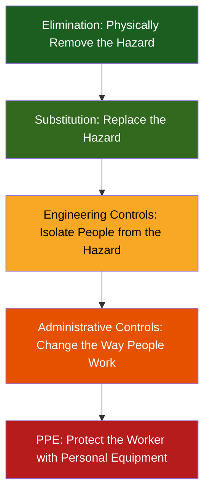

## Limitations of PPE in a Hierarchy of Controls

### Overview

Personal Protective Equipment occupies the lowest and least reliable tier of the hierarchy of controls, a conceptual framework endorsed by NIOSH and widely adopted across occupational safety and health practice for prioritizing hazard mitigation strategies. While PPE plays an essential role in a comprehensive safety program, its inherent limitations mean it should never be relied upon as the primary or sole control measure when higher-tier controls are feasible. Understanding these limitations is critical for safety professionals to avoid over-reliance on PPE and to properly advocate for more effective control strategies.

### The Hierarchy of Controls Framework

Effectiveness and reliability generally decrease moving down this hierarchy, while dependence on consistent human behavior increases. PPE sits at the bottom precisely because it addresses exposure only after the hazard has already reached the worker, rather than eliminating, reducing, or isolating the hazard itself.

### Fundamental Limitations of PPE

**1. Dependence on Consistent Human Compliance**

- PPE provides no protection if not worn, or worn incorrectly, at every moment of potential exposure
- Unlike engineering controls that function continuously and independently of behavior, PPE requires ongoing, correct human action
- [Inference] This dependence on compliance is arguably the single greatest limitation of PPE, since even highly effective equipment provides zero protection during the moments it is not properly worn

**2. Reduced Protection from Improper Fit or Use**

- A respirator with an inadequate seal, a glove with the wrong chemical resistance, or an improperly adjusted harness can provide substantially less protection than the equipment's rated performance suggests
- Facial hair, damaged components, or incorrect donning technique can render otherwise adequate PPE ineffective

**3. Does Not Reduce Hazard at the Source**

- PPE protects the individual wearer but does nothing to reduce the hazard's presence in the workplace
- Other workers, visitors, or the wearer during moments of non-use remain fully exposed to the unmitigated hazard

**4. Physiological and Ergonomic Burden**

- Respirators impose breathing resistance and can contribute to heat stress
- Heavy or restrictive PPE can reduce dexterity, mobility, visibility, or communication ability, potentially introducing new hazards (e.g., reduced situational awareness, increased trip/fall risk, impaired ability to escape in an emergency)
- Extended PPE use can cause discomfort that leads to reduced compliance over time

**5. Limited Protection Scope**

- Most PPE is designed to protect against specific hazard types and does not provide comprehensive protection against all hazards present
- A respirator does not protect against dermal chemical absorption; safety glasses do not protect against inhalation hazards

**6. Maintenance and Degradation Issues**

- PPE performance degrades over time through wear, UV exposure, chemical contact, and improper storage
- Without diligent inspection and maintenance programs, degraded PPE may appear functional while providing substantially reduced actual protection

**7. False Sense of Security**

- Workers wearing PPE may take greater risks, believing themselves fully protected, a phenomenon sometimes described as risk compensation
- [Inference] This behavioral effect can partially offset the protective benefit PPE is intended to provide, particularly when workers overestimate the equipment's actual protective capability

**8. Cost of Ongoing Consumables and Program Administration**

- Unlike a one-time engineering control investment, PPE often requires ongoing replacement of consumables (filters, cartridges, disposable gloves), fit testing, training, and medical evaluation, representing a recurring rather than fixed cost
- [Speculation] Over a sufficiently long time horizon, the cumulative cost of an extensive PPE program may in some cases approach or exceed the cost of engineering controls that would have addressed the hazard more reliably at the source, though this comparison depends heavily on the specific hazard, workforce size, and control options available.

### Comparative Reliability Across the Hierarchy

| Control Level | Independent of Worker Behavior? | Reduces Hazard at Source? | Protects Others in Area? | Typical Reliability |
| --- | --- | --- | --- | --- |
| Elimination | Yes | Yes (hazard removed) | Yes | Highest |
| Substitution | Yes | Yes (hazard reduced) | Yes | High |
| Engineering Controls | Largely yes (once installed/maintained) | Yes | Yes | High |
| Administrative Controls | No — depends on adherence | No | Partially | Moderate |
| PPE | No — depends on correct, continuous use | No | No (individual only) | Lowest |

### When PPE Reliance Becomes a Compliance and Safety Concern

**Key Points**

- Using PPE as a substitute for feasible engineering controls, rather than as a supplement or interim measure, generally does not satisfy the intent of OSHA's hierarchy-based approach to hazard control
- OSHA standards for specific substances (e.g., lead, respirable crystalline silica) explicitly require engineering and administrative controls be implemented to the extent feasible before permitting reliance on respiratory protection to achieve compliance
- PPE should be considered a control of last resort, or an interim measure while higher-level controls are being engineered, installed, and commissioned—not a permanent substitute for a feasible engineering solution

### Example: PPE Over-Reliance in a Woodworking Shop

A small woodworking shop generates substantial wood dust during sanding and cutting operations. The employer's sole hazard control is providing N95 filtering facepiece respirators to workers, without any dust collection (local exhaust ventilation) system.

**Limitations exposed by this approach:**

1. Respirators only protect the individual wearer; visitors, other employees passing through the area, and workers during brief periods of non-use remain exposed to ambient dust.
2. Compliance issues (respirators worn loosely, removed during hot weather, or not properly fitted) result in inconsistent actual protection despite nominal PPE provision.
3. Wood dust continues to accumulate on surfaces, creating secondary hazards (combustible dust accumulation, slip hazards from dust on walking surfaces) that respirators do nothing to address.
4. The underlying source of the hazard (uncontrolled dust generation at the cutting/sanding tools) remains entirely unaddressed.

A hierarchy-consistent approach would prioritize local exhaust ventilation at each dust-generating tool (engineering control) to capture dust at the source, with respiratory protection retained only as a supplementary measure for residual exposure or specific high-generation tasks where engineering controls alone prove insufficient.

### Circumstances Where PPE Remains Necessary Despite Higher-Tier Controls

PPE remains an appropriate and necessary component of a safety program even when higher-tier controls are implemented, in situations such as:

- **Residual risk after engineering controls**: Even well-designed engineering controls rarely achieve zero exposure; PPE addresses the remaining residual hazard
- **Interim protection**: While engineering controls are being designed, procured, and installed, PPE provides necessary interim protection
- **Emergency situations**: Unplanned releases, equipment failures, or emergency response scenarios where engineering controls may be temporarily bypassed or overwhelmed
- **Tasks where engineering controls are technically infeasible**: Certain maintenance, confined space, or non-routine tasks may not lend themselves to fixed engineering controls
- **Maintenance and repair on the engineering controls themselves**: Workers servicing ventilation systems, for example, may need PPE during that specific maintenance activity

### Common Misapplications of the Hierarchy

- Defaulting to PPE as the first response to a newly identified hazard without evaluating elimination, substitution, or engineering control feasibility
- Treating PPE provision as fully discharging an employer's hazard control obligation, regardless of whether higher-tier controls were genuinely infeasible
- Failing to reassess whether previously "infeasible" engineering controls have become feasible due to new technology, process changes, or cost reductions over time
- Allowing budget constraints to be the sole justification for skipping engineering control evaluation, without a documented feasibility analysis
- Assuming that provision of PPE alone satisfies training, fit testing, and maintenance obligations necessary for that PPE to function as intended

### Integration with Broader Safety Management Systems

- **PPE Hazard Assessment**: A properly conducted hazard assessment should explicitly document why higher-tier controls were not selected, not merely default to PPE selection.
- **Process Hazard Analysis (PHA)**: Within PSM-covered processes, PHA teams are expected to consider the full hierarchy of controls when developing recommendations, not default to PPE-based solutions.
- **Management of Change (MOC)**: New processes or equipment introduce an opportunity to apply the hierarchy proactively during design, rather than retrofitting PPE-based solutions after the fact.
- **Continuous Improvement**: Mature safety management systems periodically revisit whether current PPE-reliant controls could be upgraded to more reliable engineering or substitution-based solutions as technology and budgets evolve.

**Next Steps**

- PPE Hazard Assessment
- Ventilation and Engineering Controls for Exposure
- Administrative Controls and Work Practice Controls
- Process Hazard Analysis Methodology
- Management of Change (MOC) Procedures
- Selection of PPE by Hazard Type