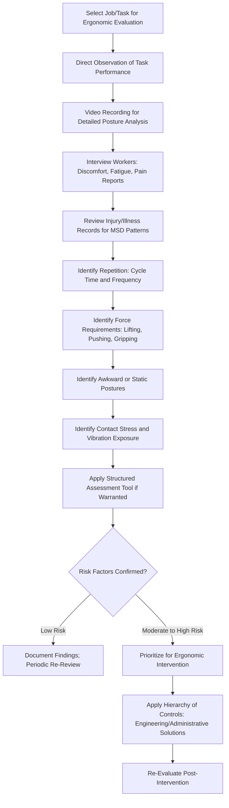

## Identifying Ergonomic Risk Factors

### Overview

Ergonomic risk factor identification is the systematic process of recognizing workplace conditions, tasks, and postures that increase the likelihood of developing musculoskeletal disorders (MSDs). Unlike acute traumatic injuries, MSDs typically develop through cumulative, repeated exposure to biomechanical stressors over extended periods, making systematic identification methodologies essential since the connection between a specific task and eventual injury is often not immediately apparent through casual observation.

Ergonomics as a discipline seeks to fit the task to the worker—adapting tools, workstations, and processes to human physical capabilities—rather than requiring workers to adapt to poorly designed tasks.

### Regulatory and Guidance Context

- **OSHA General Duty Clause**: In the absence of a specific federal ergonomics standard, OSHA has historically used the General Duty Clause (Section 5(a)(1)) to address recognized ergonomic hazards
- **NIOSH**: Publishes foundational ergonomic assessment tools and guidance (e.g., the NIOSH Lifting Equation)
- **State-specific ergonomics standards**: Some states maintain their own ergonomics regulations distinct from federal OSHA
- [Inference] The absence of a comprehensive federal ergonomics standard means much ergonomic risk identification practice is driven by voluntary consensus standards, NIOSH guidance, and industry-specific best practices rather than a single unified regulatory framework.

### Primary Categories of Ergonomic Risk Factors

**1. Repetition**

- Performing the same motion or motion pattern frequently over a work period
- Risk increases with higher frequency and shorter recovery time between repetitions

**2. Force**

- The physical effort required to perform a task (lifting, pushing, pulling, gripping, pinching)
- Higher force requirements increase stress on muscles, tendons, and joints

**3. Awkward Posture**

- Positions that deviate significantly from a neutral, natural joint position (e.g., reaching overhead, twisting the trunk, deep bending, extreme wrist flexion/extension)
- Sustained or repeated awkward postures increase mechanical stress on soft tissues

**4. Static Posture / Static Exertion**

- Maintaining a fixed position or muscle contraction for a prolonged period, even without movement
- Reduces blood flow to muscles, contributing to fatigue and discomfort even at low force levels

**5. Contact Stress**

- Pressure from hard or sharp edges against skin, tendons, nerves, or blood vessels (e.g., resting wrists on a hard desk edge, gripping tool handles with pressure points)

**6. Vibration**

- Hand-arm vibration from powered tools or whole-body vibration from vehicles/equipment
- Associated with circulatory and neurological effects in addition to musculoskeletal impact

**7. Environmental and Organizational Factors**

- Cold temperatures (can reduce dexterity and increase grip force required)
- Poor lighting (can lead to awkward postures to see tasks clearly)
- Insufficient recovery time/rest breaks between exertions
- Work pace and psychosocial demands (time pressure, low task control)

### Ergonomic Risk Factor Identification Workflow

### Identification Methods and Tools

**Key Points**

- **Direct observation**: Watching workers perform tasks in real time to note posture, repetition, and force application
- **Video analysis**: Recording tasks for detailed frame-by-frame posture and duration analysis, allowing more precise measurement than real-time observation alone
- **Worker interviews and symptom surveys**: Body discomfort surveys (e.g., Nordic Musculoskeletal Questionnaire-style instruments) capture self-reported pain, fatigue, or discomfort by body region
- **Injury and illness record review**: OSHA 300 logs and workers' compensation claims can reveal MSD patterns associated with specific jobs or tasks
- **Structured assessment tools**: Standardized checklists and scoring systems provide semi-quantitative risk ranking

### Common Structured Ergonomic Assessment Tools

| Tool | Primary Application | General Approach |
| --- | --- | --- |
| NIOSH Lifting Equation | Manual material handling/lifting tasks | Calculates a Recommended Weight Limit (RWL) based on task variables |
| Rapid Upper Limb Assessment (RULA) | Upper body postural risk (seated/desk tasks, assembly work) | Scores posture, force, and muscle use to produce a risk category |
| Rapid Entire Body Assessment (REBA) | Whole-body postural risk (dynamic, unpredictable postures) | Similar structured scoring extended to whole-body tasks |
| Strain Index | Repetitive hand/wrist-intensive tasks | Quantifies risk based on intensity, duration, frequency of exertion, posture |
| ACGIH Hand Activity Level (HAL) TLV | Repetitive hand-intensive tasks | Compares hand activity level and peak force against a threshold limit value |

[Inference] These tools vary in complexity and appropriate application context; selecting the right tool typically depends on the body region primarily stressed, task type (static vs. dynamic), and whether a quantitative or semi-quantitative output is needed for the specific evaluation purpose.

### NIOSH Lifting Equation Overview

The NIOSH Lifting Equation calculates a Recommended Weight Limit (RWL) by applying multipliers to an ideal load constant, based on task-specific variables:

$$RWL = LC \times HM \times VM \times DM \times AM \times FM \times CM$$

Where $LC$ is the load constant (a standard reference weight), and $HM$, $VM$, $DM$, $AM$, $FM$, $CM$ represent multipliers for horizontal distance, vertical location, vertical travel distance, asymmetric angle, lifting frequency, and coupling (grip) quality, respectively. Each multiplier ranges from 0 to 1, reducing the RWL as the task deviates further from ideal lifting conditions.

The **Lifting Index (LI)** is then calculated as:

$$LI = \frac{\text{Actual Load Weight}}{RWL}$$

An LI greater than 1.0 indicates the task poses increased risk of low back injury for a portion of the working population, warranting further evaluation or intervention.

[Unverified] Specific numerical values for the load constant and each multiplier's calculation formula are detailed in the NIOSH Lifting Equation technical documentation; precise application requires reference to the current NIOSH publication rather than approximation, as multiplier calculations involve specific trigonometric and distance-based formulas.

### Example: Ergonomic Risk Identification in an Order Fulfillment Warehouse

An ergonomic evaluation of a warehouse pick-and-pack operation identifies the following risk factors through direct observation and worker interviews:

1. **Repetition**: Pickers perform reaching and grasping motions several times per minute throughout an 8-hour shift.
2. **Force**: Frequent lifting of boxes from floor-level pallets to shoulder-height shelving, involving both a vertical travel distance and awkward posture combination.
3. **Awkward posture**: Workers reported frequent trunk twisting when placing items into totes positioned to the side of the picking cart, rather than directly in front.
4. **Static posture**: Packing station workers stand in a fixed position with minimal opportunity for postural variation across the shift.
5. **Worker-reported discomfort**: Survey responses indicate elevated lower back and shoulder discomfort ratings among pickers compared to other job classifications in the facility.

These findings are prioritized for NIOSH Lifting Equation analysis on the floor-to-shelf lifting task and workstation redesign consideration for the packing station to reduce static standing posture and twisting.

### Risk Factor Interaction and Cumulative Effect

**Key Points**

- Ergonomic risk factors rarely occur in isolation; combined exposure to multiple risk factors (e.g., high force plus awkward posture plus high repetition) increases injury risk more than any single factor alone
- [Inference] This multiplicative or compounding relationship between combined risk factors is a central reason structured assessment tools incorporate multiple variables simultaneously, rather than evaluating single factors independently
- Duration of exposure across a shift, and cumulative exposure across a working career, both factor into overall MSD risk beyond any single task assessment snapshot

### Common Identification Pitfalls

- Relying solely on injury record review, which only captures already-manifested injuries rather than proactively identifying risk before injury occurs
- Conducting a single brief observation rather than accounting for task variation across a full shift, different production volumes, or seasonal changes in workload
- Overlooking psychosocial and organizational factors (work pace, task control, rest break adequacy) that influence injury risk alongside pure biomechanical factors
- Applying a structured assessment tool outside its intended application context (e.g., using the NIOSH Lifting Equation for a task that is not a standard two-handed lift)
- Failing to involve workers who perform the task daily, missing practical insight into which specific task elements feel most physically demanding

### Integration with Broader Safety Management

- **Job Hazard Analysis**: Ergonomic risk factor identification is often integrated into broader JHA documentation for physically demanding tasks
- **Hierarchy of Controls**: Identified ergonomic risk factors inform engineering (workstation redesign, mechanical assist devices) and administrative (job rotation, rest breaks) control selection
- **Medical Surveillance**: MSD symptom surveillance and early reporting programs complement proactive risk factor identification
- **OSHA Recordkeeping**: Confirmed work-related MSDs meeting recordability criteria must be logged per 29 CFR 1904 requirements

**Next Steps**

- Ergonomic Controls and Workstation Design
- Manual Material Handling and Lifting Techniques
- Job Hazard Analysis Methodology
- Musculoskeletal Disorder Prevention Programs
- Vibration Hazards and Hand-Arm Vibration Syndrome
- OSHA Recordkeeping Requirements for Occupational Illnesses