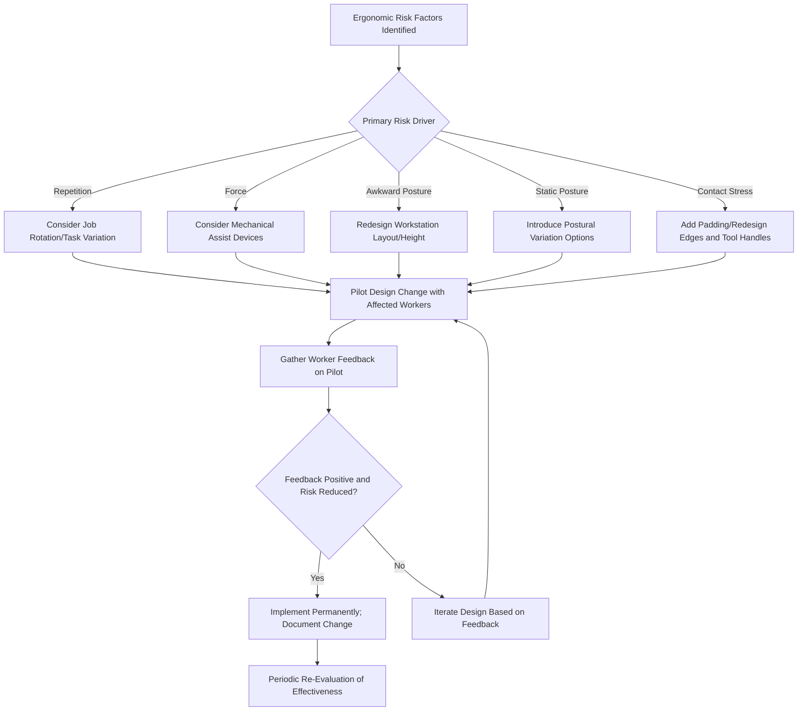

## Workstation and Task Design

### Overview

Workstation and task design applies ergonomic principles proactively to configure work environments, equipment, and processes in ways that minimize exposure to the risk factors identified through ergonomic assessment (repetition, force, awkward posture, static exertion, contact stress, and vibration). Rather than treating ergonomic hazards after injury occurs, effective workstation and task design incorporates human physical capabilities and limitations from the outset, representing the practical application of the engineering and administrative control tiers within the hierarchy of controls as applied to musculoskeletal disorder prevention.

### Design Philosophy: Fitting the Task to the Worker

The foundational ergonomic design principle inverts the traditional assumption that workers must adapt to existing equipment and processes. Instead, workstations, tools, and tasks are designed or modified to accommodate the physical characteristics and capabilities of the workforce, accounting for anthropometric variation (differences in body size, reach, and strength across the working population) rather than designing for a single "average" worker who may not represent a significant portion of actual employees.

### Core Workstation Design Principles

**Key Points**

- **Neutral posture**: Design workstations to allow joints (wrists, elbows, shoulders, neck, back) to remain in a neutral, relaxed position during typical task performance
- **Appropriate work height**: Match work surface height to the task type (precision work generally requires a higher surface; heavy force tasks generally benefit from a lower surface closer to natural arm strength position)
- **Minimized reach distances**: Position frequently used tools, materials, and controls within a comfortable reach zone, reducing extended reaching that stresses the shoulder and back
- **Adjustability**: Where a single fixed design cannot accommodate the full range of worker body sizes, adjustable workstations (height-adjustable surfaces, adjustable chairs) allow individualization
- **Adequate clearance**: Sufficient space for legs, knees, and body movement without contact stress against workstation edges

### Reach Zone Concept (svg_diagram)

<svg xmlns="http://www.w3.org/2000/svg" viewBox="0 0 600 380">
<text x="300" y="25" font-size="16" font-weight="bold" text-anchor="middle" fill="#1a1a1a">Workstation Reach Zones (svg_diagram)</text>
<circle cx="300" cy="220" r="10" fill="#333" />
<text x="300" y="245" font-size="10" text-anchor="middle" fill="#333">Worker (top view)</text>
<ellipse cx="300" cy="200" rx="180" ry="140" fill="#fdeee8" stroke="#c0654a" stroke-width="1.5" opacity="0.6" />
<text x="300" y="80" font-size="11" text-anchor="middle" fill="#c0654a">Maximum Reach Zone (occasional use)</text>
<ellipse cx="300" cy="200" rx="100" ry="80" fill="#eaf7ea" stroke="#4a9a5a" stroke-width="1.5" opacity="0.7" />
<text x="300" y="140" font-size="11" text-anchor="middle" fill="#2e7d32">Normal Reach Zone (frequent use)</text>
<ellipse cx="300" cy="200" rx="40" ry="35" fill="#e8f0fe" stroke="#4a6fa5" stroke-width="1.5" />
<text x="300" y="205" font-size="10" text-anchor="middle" fill="#1a3a6a">Primary Zone</text>

<text x="300" y="360" font-size="10" text-anchor="middle" fill="#666">Frequently used items belong in the normal reach zone; occasional items may extend to maximum reach; avoid placing frequent items beyond maximum reach.</text>

</svg>

### Seated Workstation Design Considerations

**Chair/Seating**

- Adjustable seat height, backrest angle, and lumbar support to accommodate individual anthropometry
- Armrests positioned to support the forearm without elevating the shoulder

**Monitor/Visual Display Placement**

- Top of screen approximately at or slightly below eye level to minimize neck flexion/extension
- Viewing distance sufficient to avoid excessive forward head posture

**Keyboard and Input Device Placement**

- Positioned to allow neutral wrist posture (avoiding excessive wrist extension or ulnar deviation)
- Sufficient surface area to avoid reaching for frequently used peripherals

**Foot Support**

- Feet flat on the floor or a footrest when seat height cannot be lowered sufficiently for shorter-statured workers

### Standing Workstation Design Considerations

- Anti-fatigue matting to reduce lower extremity and back fatigue from prolonged standing on hard surfaces
- Work surface height matched to task precision requirements (as noted above) and adjustable where the workstation is shared across workers of different statures
- Opportunities for postural variation (sit-stand options, footrests to shift weight) to reduce static loading

### Task Design Strategies

**1. Job Rotation**

- Systematically rotating workers between tasks with differing physical demands to distribute cumulative loading across different muscle groups and reduce repetitive strain on any single body region

**2. Task Variation/Enlargement**

- Combining multiple task elements so a worker performs a broader variety of motions rather than one highly repetitive motion continuously

**3. Rest Break Scheduling**

- Structured micro-breaks or task pauses to allow tissue recovery, particularly important for high-repetition or static-posture tasks

**4. Mechanical Assist Devices**

- Lift-assist equipment, powered conveyors, vacuum lifts, and hoists to reduce manual force requirements for material handling tasks
- Represents an engineering control application directly addressing force-related ergonomic risk factors

**5. Tool Design and Selection**

- Ergonomically designed hand tools (appropriate handle diameter, reduced vibration, appropriate weight, trigger design minimizing finger force) reduce grip force requirements and awkward wrist postures

### Task and Workstation Design Workflow

### Anthropometric Considerations in Design

Effective workstation design accounts for the range of body dimensions across the working population, typically referencing anthropometric percentile data (e.g., designing adjustability to accommodate a range from smaller-statured to larger-statured individuals, often referenced as an inclusive percentile range in ergonomic design literature) rather than designing for a single average dimension that would exclude a substantial portion of the workforce at either extreme.

[Unverified] Specific percentile ranges and anthropometric reference tables vary by population studied (e.g., regional/national anthropometric surveys) and by the specific ergonomic design standard referenced; current anthropometric design guidance should be consulted for a specific workforce population rather than relying on generalized percentile assumptions.

### Example: Redesigning an Assembly Line Workstation

An ergonomic assessment identifies that assembly line workers experience shoulder and neck discomfort due to a fixed-height work surface requiring elevated arm posture for workers below a certain stature, combined with a parts bin positioned at maximum reach distance requiring repeated forward reaching.

**Design interventions implemented:**

1. **Height-adjustable workstations**: Installed to allow each worker to set the work surface at their individually appropriate elbow height.
2. **Parts bin relocation**: Moved from maximum reach zone into the normal reach zone directly in front of the worker, reducing repetitive forward reaching.
3. **Gravity-fed parts delivery**: Introduced to reduce the need for the worker to reach into a deep bin, further reducing awkward shoulder postures.
4. **Job rotation schedule**: Implemented across three related assembly tasks with differing motion patterns, reducing continuous exposure to any single repetitive motion.
5. **Anti-fatigue matting**: Installed at each standing workstation position.

Post-implementation worker feedback and discomfort survey follow-up are used to verify the interventions reduced reported symptoms before considering the redesign complete.

### Comparison: Reactive vs. Proactive Ergonomic Design

| Approach | Timing | Typical Trigger | Relative Effectiveness |
| --- | --- | --- | --- |
| Reactive design | After injury/complaint occurs | MSD injury report, worker complaint | Addresses existing problem but injury has already occurred |
| Proactive design | During initial process/workstation design | New equipment purchase, facility design, process change | Prevents exposure before it occurs; generally more cost-effective long-term |

[Inference] Proactive ergonomic design integrated at the equipment procurement or facility design stage is generally considered more cost-effective than retrofitting existing workstations after MSD injuries occur, though specific cost comparisons depend heavily on the scale and complexity of the retrofit required.

### Common Workstation and Task Design Pitfalls

- Designing for a single "average" worker dimension rather than incorporating adjustability for the actual range of workforce body sizes
- Failing to involve the workers who will use the workstation in the design/pilot evaluation process, missing practical usability issues
- Addressing one ergonomic risk factor (e.g., work height) while overlooking others present in the same task (e.g., repetition or contact stress)
- Implementing job rotation between tasks that stress the same muscle groups, providing minimal actual recovery benefit despite superficially appearing to add task variety
- Selecting tools or equipment based on cost or availability without ergonomic evaluation of handle design, weight, and vibration characteristics

### Integration with Broader Safety Management

- **Identifying Ergonomic Risk Factors**: Design interventions directly respond to risk factors identified through prior assessment.
- **Hierarchy of Controls**: Workstation redesign and mechanical assist devices represent engineering controls; job rotation and rest breaks represent administrative controls, both preferred over reliance on worker technique training alone.
- **Management of Change**: New equipment or process introduction should trigger ergonomic design review as part of the change management process.
- **Medical Surveillance**: Early symptom reporting programs provide feedback on whether implemented design changes are effectively reducing MSD risk over time.

**Next Steps**

- Identifying Ergonomic Risk Factors
- Manual Material Handling and Lifting Techniques
- Musculoskeletal Disorder Prevention Programs
- Job Hazard Analysis Methodology
- Management of Change (MOC) Procedures
- Vibration Hazards and Hand-Arm Vibration Syndrome