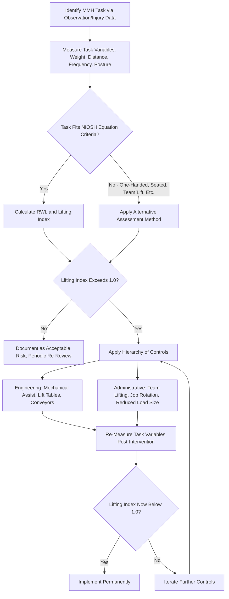

## Manual Material Handling

### Overview

Manual Material Handling (MMH) encompasses tasks involving lifting, lowering, pushing, pulling, carrying, or holding objects using human physical effort rather than mechanical assistance. MMH remains one of the leading contributors to occupational musculoskeletal disorders, particularly low back injuries, across a wide range of industries including warehousing, manufacturing, healthcare, and construction. Effective MMH hazard management combines task assessment, engineering and administrative controls, and proper technique training within the broader ergonomics and hierarchy of controls framework.

### Regulatory and Guidance Context

- **OSHA General Duty Clause**: In the absence of a specific comprehensive federal MMH standard, OSHA has historically addressed recognized MMH hazards through the General Duty Clause
- **NIOSH**: Publishes the foundational NIOSH Lifting Equation and associated guidance documents for evaluating and reducing lifting-related risk
- **Industry-specific guidance**: Certain sectors (healthcare patient handling, warehousing) have developed specialized voluntary guidelines addressing sector-specific MMH hazards

### Categories of Manual Material Handling Tasks

**1. Lifting and Lowering**

- Raising or lowering an object between two vertical locations, typically the highest-risk MMH category for low back injury due to compressive spinal loading

**2. Carrying**

- Transporting an object horizontally while supporting its weight, involving sustained static loading in addition to the initial lift

**3. Pushing and Pulling**

- Applying horizontal force to move an object (e.g., carts, pallet jacks) without lifting its full weight
- Generally imposes lower spinal compressive load than lifting for equivalent object weight, though still carries risk from posture and force requirements

**4. Holding**

- Static support of an object's weight without significant movement, creating sustained muscular loading

### Key Risk Factors in MMH Tasks

**Key Points**

- **Load weight**: Higher weight increases both compressive spinal loading and overall exertion demand
- **Horizontal distance**: Greater distance between the load and the body at the point of lift significantly increases spinal loading due to leverage effects
- **Vertical location**: Lifts originating from floor level or extending to shoulder height or above increase risk compared to lifts occurring at a mid-range height near waist level
- **Vertical travel distance**: Greater distance the load travels during the lift increases physical demand
- **Asymmetry/twisting**: Lifting or lowering while the trunk is rotated relative to the load increases spinal stress substantially compared to a symmetric, forward-facing lift
- **Lifting frequency**: More frequent lifts within a work period increase cumulative loading and reduce recovery time between exertions
- **Duration**: Total time spent performing lifting tasks across a shift
- **Coupling/grip quality**: A poor grip (e.g., no handles, slippery surface, awkward object shape) increases the force required to control the load and the risk of drops or sudden loading spikes

### The NIOSH Lifting Equation

The Revised NIOSH Lifting Equation is the most widely referenced quantitative tool for assessing two-handed, symmetric or moderately asymmetric lifting tasks under specific defined conditions (excluding one-handed lifting, seated/kneeling lifts, and certain other specialized scenarios).

$$RWL = LC \times HM \times VM \times DM \times AM \times FM \times CM$$

Where:

- $LC$ = Load Constant (a fixed reference weight representing an ideal-condition lift)
- $HM$ = Horizontal Multiplier (decreases as horizontal distance from the body increases)
- $VM$ = Vertical Multiplier (decreases as the lift origin/destination deviates from an optimal height)
- $DM$ = Distance Multiplier (decreases as vertical travel distance increases)
- $AM$ = Asymmetric Multiplier (decreases as trunk rotation/twisting angle increases)
- $FM$ = Frequency Multiplier (decreases as lifting frequency increases)
- $CM$ = Coupling Multiplier (decreases with poorer grip/coupling quality)

The **Lifting Index (LI)** compares the actual load to the calculated RWL:

$$LI = \frac{\text{Load Weight}}{RWL}$$

An LI value exceeding 1.0 indicates increased risk of low back injury for a meaningful proportion of the working population, warranting task redesign or engineering intervention. [Unverified] Precise multiplier calculation formulas, the specific load constant value, and detailed threshold interpretation guidance are provided in the official NIOSH technical publication; exact figures should be verified against that source rather than approximated for actual workplace risk determinations.

### MMH Hazard Evaluation and Control Workflow

### Hierarchy of Controls Applied to MMH

**Engineering Controls (Preferred)**

- Mechanical lifting/handling equipment: hoists, cranes, forklifts, pallet jacks, vacuum lifts, conveyor systems
- Lift-assist devices: scissor lift tables, tilt tables reducing reach distance and vertical travel
- Workstation redesign to position materials at optimal lifting height, minimizing horizontal reach distance
- Gravity-fed or powered material delivery systems reducing manual carry distance

**Administrative Controls**

- Team lifting for loads exceeding safe individual lifting capacity
- Job rotation to distribute cumulative lifting exposure across multiple workers/tasks
- Reducing individual load/container size or weight (e.g., splitting a heavy box into two smaller containers)
- Scheduling frequent lifting tasks with adequate recovery time between exertions
- Proper lifting technique training (though technique training alone, without addressing task design, has more limited effectiveness than engineering solutions)

**PPE (Limited Applicability)**

- Back belts/support devices are not generally considered effective engineering or administrative controls for preventing back injury and are not a substitute for task redesign; [Inference] the scientific evidence supporting back belt effectiveness for injury prevention has historically been considered weak, and reliance on such devices in place of proper task design or mechanical assistance would represent a common MMH management pitfall
- Gloves may address grip/coupling quality issues for certain loads

### Proper Lifting Technique Principles

While technique training alone should not be the sole control strategy, correct technique remains a relevant component of a comprehensive MMH program:

- Position feet shoulder-width apart with one foot slightly forward for stability
- Keep the load close to the body, minimizing horizontal distance
- Bend at the knees and hips rather than the waist, maintaining the natural curve of the spine
- Avoid twisting the trunk during the lift; pivot with the feet instead
- Get a secure grip before initiating the lift
- Lift smoothly, avoiding jerking or sudden movements
- Test the load's weight before committing to a full lift, and seek assistance if the load exceeds safe individual capacity

### Team Lifting Considerations

When a load exceeds safe individual lifting capacity, team lifting distributes the load between two or more workers. Effective team lifting requires:

- Clear communication and coordination (a designated leader calling lift timing)
- Similar physical capability/stature among team members where feasible
- Coordinated movement to avoid uneven loading on any single team member
- [Inference] Team lifting effectiveness depends heavily on coordination quality; poorly coordinated team lifts can, in some cases, create uneven or sudden loading on individual team members that may not proportionally reduce injury risk compared to a well-executed mechanical lift alternative

### Example: MMH Risk Reduction in a Distribution Center

A distribution center identifies that order pickers frequently lift boxes weighing up to 40 lbs from floor-level pallets to a cart at waist height, with moderate trunk rotation during placement.

**NIOSH Lifting Equation analysis** reveals a Lifting Index exceeding 1.0 due to the combination of floor-level origin height, moderate horizontal reach distance, and asymmetric placement motion.

**Interventions implemented:**

1. **Pallet elevation**: Scissor lift pallet positioners installed to raise pallets as they are depleted, maintaining product at a more optimal lift height rather than requiring floor-level lifts throughout the pallet's depletion.
2. **Cart redesign**: Repositioned to eliminate trunk rotation during placement, requiring only a forward, symmetric motion.
3. **Load size policy**: Maximum individual carton weight capped, with heavier items repackaged into two lighter containers where feasible.
4. **Job rotation**: Implemented between picking and other less physically demanding tasks across the shift.

Post-implementation re-calculation of the Lifting Index confirms risk reduction, with continued monitoring for sustained effectiveness.

### Common Manual Material Handling Pitfalls

- Relying solely on lifting technique training without addressing underlying task design factors (weight, distance, frequency) that drive actual injury risk
- Using back belts as a primary injury prevention strategy rather than pursuing engineering or administrative task redesign
- Applying the NIOSH Lifting Equation to task types outside its valid application scope (e.g., one-handed lifts, high-speed lifts, or lifts involving unstable loads)
- Failing to account for asymmetric/twisting motions in task assessment, since twisting substantially increases spinal loading beyond what a straight-line lift assessment alone would capture
- Underestimating cumulative fatigue effects across a full shift when only a single lift is evaluated in isolation

### Integration with Broader Ergonomics and Safety Program

- **Identifying Ergonomic Risk Factors**: MMH assessment is a specific application of the broader ergonomic risk factor identification process, focused on force and posture factors related to lifting.
- **Workstation and Task Design**: MMH-specific engineering controls (lift tables, conveyor positioning) are a direct application of broader workstation design principles.
- **Hierarchy of Controls**: MMH control selection should prioritize engineering and administrative solutions over technique training or PPE-based approaches alone.
- **Medical Surveillance**: Early reporting of MMH-related discomfort supports proactive identification of tasks requiring further ergonomic intervention.

**Next Steps**

- Identifying Ergonomic Risk Factors
- Workstation and Task Design
- Musculoskeletal Disorder Prevention Programs
- Hierarchy of Controls for Health Hazard Mitigation
- Job Hazard Analysis Methodology
- Vibration Hazards and Hand-Arm Vibration Syndrome