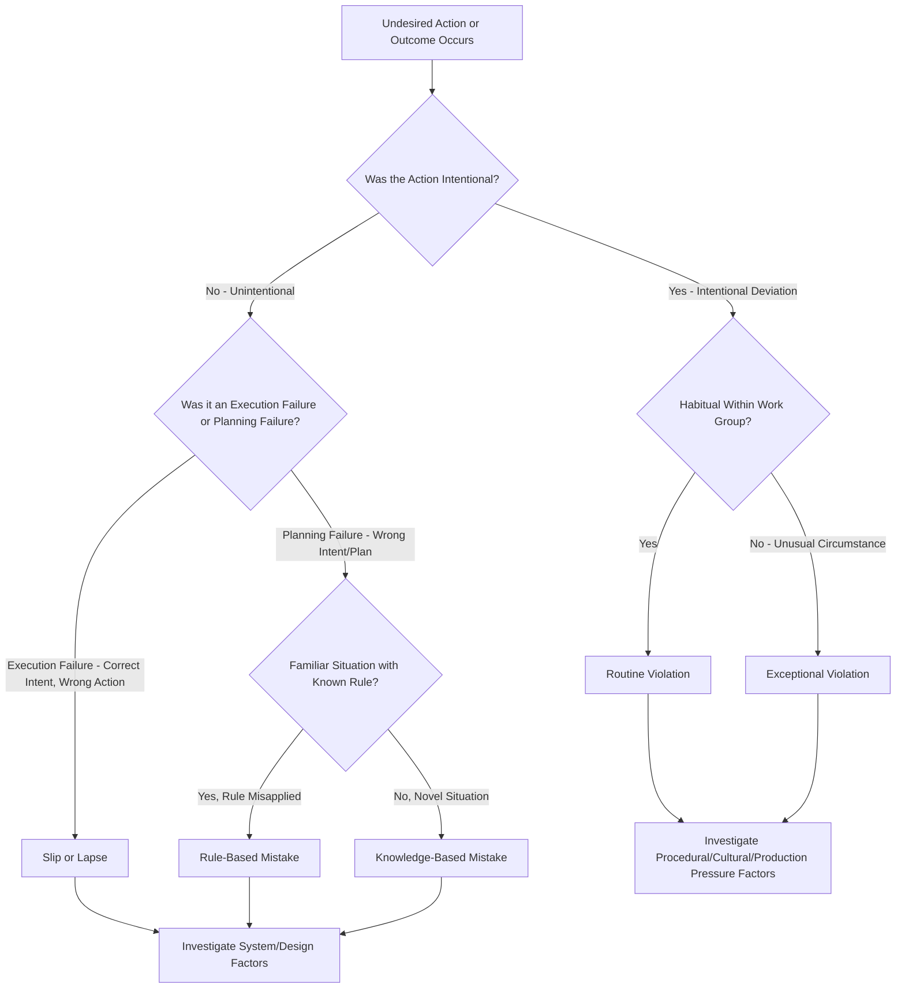

## Human Error and Human Factors Engineering in Safety Systems

### Overview

Human Factors Engineering (HFE), also referred to as ergonomics in its broader cognitive and organizational sense, is the discipline concerned with understanding how humans interact with systems, equipment, and processes, and applying that understanding to design safer, more error-tolerant work environments. Within Process Safety Management and occupational safety more broadly, human error is recognized not merely as an individual failing to be corrected through discipline or additional training, but as a predictable consequence of system design, organizational conditions, and task demands that can and should be engineered out wherever feasible.

This perspective represents a significant shift from traditional "blame the worker" approaches toward a systems-based understanding of error causation, heavily influenced by human reliability research and major industrial accident investigations.

### The Systems View of Human Error

**Key Points**

- Human error is rarely the sole or root cause of an incident; it is typically the final, visible failure point in a chain of contributing systemic conditions
- Well-designed systems anticipate that human error will occur and incorporate safeguards, redundancies, and error-tolerant design to prevent or mitigate the consequences of inevitable human mistakes
- Punitive responses to error (without addressing underlying system design flaws) tend to suppress error reporting rather than reduce actual error occurrence, undermining organizational learning
- [Inference] This systems view does not eliminate individual accountability for reckless or willful violations, but distinguishes such conduct from unintentional errors arising from system design deficiencies, task complexity, or organizational pressures

### Classification of Human Error Types

**1. Slips and Lapses (Skill-Based Errors)**

- Errors in execution of a well-known, routine task where the intention was correct but the action deviated (e.g., pressing the wrong button on a familiar control panel due to a momentary attention lapse)
- Often associated with automaticity—highly practiced tasks performed with reduced conscious attention

**2. Mistakes (Rule-Based or Knowledge-Based Errors)**

- **Rule-based mistakes**: Applying an incorrect rule or procedure to a situation, or misapplying a correct rule to the wrong context
- **Knowledge-based mistakes**: Errors occurring when a worker faces a novel situation without an established rule or procedure, requiring problem-solving under uncertainty, which is inherently more error-prone

**3. Violations**

- Deliberate deviations from known procedures or rules
- **Routine violations**: Habitual shortcuts that have become normalized within a work group, often because the "as-written" procedure is impractical or the violation has not previously resulted in negative consequences
- **Exceptional violations**: Deviations under unusual circumstances, often when a worker perceives no viable compliant option to complete an urgent task
- [Inference] Distinguishing violations from unintentional errors matters significantly for incident investigation and corrective action, since violations often point toward procedural, cultural, or production-pressure issues rather than purely cognitive or design-based error sources

### Human Error Classification Framework

### Contributing Factors to Human Error (Performance Shaping Factors)

**Environmental Factors**

- Excessive noise, poor lighting, extreme temperatures degrading cognitive performance and communication
- Cluttered or poorly organized work areas increasing distraction and error opportunity

**Task and Interface Design Factors**

- Poorly designed control panels, ambiguous labeling, or inconsistent control/display mapping (e.g., a control that moves opposite to the expected direction of the resulting action)
- Excessive task complexity or cognitive workload, particularly during time-pressured or emergency situations
- Alarm management deficiencies (alarm flooding, nuisance alarms) reducing operator ability to identify genuinely critical signals

**Organizational and Management Factors**

- Production pressure conflicting with safe procedure adherence
- Inadequate training or unclear procedures
- Fatigue from shift scheduling, extended work hours, or inadequate rest periods
- Poor communication practices, particularly during shift handovers

**Individual Factors**

- Fatigue, stress, and reduced situational awareness
- Experience level and familiarity with the specific task or equipment
- [Inference] While individual factors contribute to error likelihood, a human factors engineering approach emphasizes that system and organizational design should account for realistic ranges of human performance variation rather than assuming consistently optimal individual performance under all conditions

### Human Factors Engineering Design Principles

**1. Error Tolerance and Forgiving Design**

- Systems designed so that a human error does not automatically propagate into a serious consequence (e.g., interlocks preventing an incompatible valve sequence, software input validation preventing entry of physically impossible values)

**2. Standardization and Consistency**

- Consistent control layouts, labeling conventions, and procedural formats across similar equipment reduce the cognitive burden of recalling equipment-specific variations

**3. Clear Feedback**

- Systems should provide clear, unambiguous feedback confirming that an action has been correctly executed (e.g., confirmation of valve position, alarm acknowledgment feedback)

**4. Appropriate Alarm Management**

- Alarms prioritized by criticality, with nuisance and redundant alarms minimized to preserve operator attention for genuinely actionable signals

**5. Workload Management**

- Task and interface design accounting for realistic human cognitive capacity, particularly avoiding excessive simultaneous demands during high-stakes or emergency response scenarios

**6. Procedural Design for Usability**

- Procedures written in clear, step-based formats matching the actual sequence of physical actions required, tested with actual users rather than designed purely from an engineering or compliance perspective

### Human Factors in Process Safety Management

Within PSM-covered facilities, human factors considerations intersect with several required program elements:

- **Process Hazard Analysis (PHA)**: Modern PHA methodologies increasingly incorporate human factors considerations explicitly, examining how operator interface design, procedure clarity, and workload contribute to potential process deviations
- **Operating Procedures**: Procedure usability and clarity directly affect the likelihood of rule-based and knowledge-based errors during both routine and non-routine operations
- **Training**: Effective training addresses not only what to do, but builds mental models that support correct decision-making during novel or degraded conditions
- **Management of Change**: Changes to equipment, procedures, or staffing levels should be evaluated for human factors implications, since a change that appears purely technical may introduce new error opportunities

### Example: Human Factors Analysis of a Control Room Incident

A process upset occurs when an operator responds to an alarm by adjusting the wrong control loop, one of several visually similar controls on a densely populated control panel. Investigation using a human factors lens (rather than a purely individual-blame approach) identifies:

1. **Interface design contribution**: The control panel layout grouped visually similar, closely spaced controls for functionally unrelated process loops, increasing the likelihood of a slip-type error under time pressure.
2. **Alarm management contribution**: The alarm in question occurred during a period of elevated alarm activity (alarm flooding), reducing the operator's ability to fully process and correctly prioritize the specific alarm before responding.
3. **Procedural contribution**: The response procedure for that alarm condition required the operator to identify the correct control from memory rather than through clear on-screen guidance.
4. **Systemic corrective actions**: Rather than solely retraining the individual operator, the investigation recommends control panel relabeling/regrouping, alarm rationalization to reduce nuisance alarm burden, and procedure revision to include clearer visual reference to the correct control.

This example illustrates how a systems-based human factors investigation identifies multiple contributing design and organizational factors rather than attributing the incident solely to individual operator error.

### Common Human Factors Pitfalls in Safety Management

- Defaulting to disciplinary action or retraining as the sole corrective action following a human error incident, without examining underlying system and interface design contributions
- Designing controls, alarms, and procedures without user testing or frontline worker input, missing usability issues apparent only through actual use
- Allowing alarm systems to grow unmanaged over time, resulting in alarm flooding that degrades operator response capability during genuine emergencies
- Failing to consider fatigue, shift scheduling, and workload factors when investigating incidents involving apparent lapses in attention or judgment
- Treating routine violations purely as compliance failures without investigating why the as-written procedure may be impractical or routinely bypassed by the workforce

### Integration with Broader Safety Management Systems

- **Process Hazard Analysis**: Human factors analysis increasingly forms an explicit PHA methodology component, particularly for PSM-covered highly hazardous chemical processes.
- **Incident Investigation**: Root cause analysis methodologies increasingly incorporate human factors frameworks to move beyond surface-level "operator error" conclusions toward systemic contributing factors.
- **Workstation and Task Design**: Physical ergonomic design principles overlap significantly with cognitive human factors principles in control room and interface design.
- **Management of Change**: Human factors review should be a standard consideration when evaluating proposed equipment, procedure, or staffing changes.

**Next Steps**

- Process Hazard Analysis Methodology
- Incident Investigation and Root Cause Analysis
- Operating Procedures Development and Usability
- Alarm Management Systems
- Management of Change (MOC) Procedures
- Workstation and Task Design