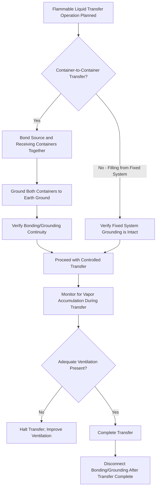

## Flammable and Combustible Liquid Storage and Handling

### Overview

Flammable and combustible liquids present significant fire and explosion hazards in industrial, commercial, and laboratory settings due to their capacity to release ignitable vapors at or near ambient temperatures. Proper classification, storage, and handling of these materials is governed primarily by OSHA's Flammable Liquids standard (29 CFR 1910.106) and the National Fire Protection Association's NFPA 30 Flammable and Combustible Liquids Code, which together establish classification criteria, storage container/cabinet requirements, quantity limits, and handling practices designed to prevent ignition and limit fire spread.

Understanding the distinction between "flammable" and "combustible" classifications—based specifically on flash point—is foundational to applying the correct storage and handling requirements for a given liquid.

### Classification System

Classification is based primarily on **flash point** (the lowest temperature at which a liquid gives off sufficient vapor to form an ignitable mixture with air) and, for flammable liquids, boiling point.

**OSHA/NFPA Classification Categories**

| Class | Flash Point | Boiling Point | Example Substances |
| --- | --- | --- | --- |
| Class IA (Flammable) | Below 73°F (22.8°C) | Below 100°F (37.8°C) | Diethyl ether, pentane |
| Class IB (Flammable) | Below 73°F (22.8°C) | At or above 100°F (37.8°C) | Gasoline, acetone |
| Class IC (Flammable) | At or above 73°F but below 100°F (22.8–37.8°C) | — | Certain xylenes, some solvents |
| Class II (Combustible) | At or above 100°F but below 140°F (37.8–60°C) | — | Diesel fuel, kerosene |
| Class IIIA (Combustible) | At or above 140°F but below 200°F (60–93.3°C) | — | Certain lubricating oils |
| Class IIIB (Combustible) | At or above 200°F (93.3°C) | — | Heavy fuel oils, certain mineral oils |

[Unverified] Exact flash point boundary values and specific classification criteria have been subject to periodic revision between OSHA and NFPA editions, particularly following alignment efforts with GHS classification criteria; current OSHA 1910.106 and the applicable NFPA 30 edition should be consulted for precise regulatory classification boundaries.

### Why Classification Matters

**Key Points**

- Lower flash point liquids (Class IA, IB) present significantly greater ignition risk at normal ambient temperatures, since they readily generate ignitable vapor concentrations without additional heating
- Classification directly determines applicable storage container size limits, cabinet requirements, quantity limits per storage area, and electrical area classification requirements
- A liquid's classification does not change based on its intended use; the same substance carries the same classification and requirements regardless of application context

### Storage Requirements

**Approved Storage Containers**

- Maximum container size limits vary by liquid class (smaller maximum container sizes for lower flash point/higher hazard classes)
- Safety cans meeting recognized design standards (e.g., self-closing lid, spring-loaded closure, flame arrestor screen) are generally required or preferred for smaller-quantity portable container storage

**Flammable Storage Cabinets**

- Purpose-built cabinets provide fire-resistance rated enclosure for flammable/combustible liquid storage within a work area, limiting fire spread and protecting contents during a room fire for a defined duration
- Self-closing doors, adequate labeling ("Flammable—Keep Fire Away"), and grounding/bonding provisions for dispensing operations are standard features
- Quantity limits per cabinet and per room are established based on liquid class, with additional cabinets required to accommodate larger stored quantities beyond a single cabinet's capacity

**Inside Storage Rooms**

- Dedicated rooms with fire-rated construction, explosion venting (where applicable), spill containment, and mechanical ventilation for larger aggregate quantities exceeding what cabinet storage alone can accommodate

**Outside Storage**

- Above-ground and underground storage tanks for bulk quantities, subject to distance/separation requirements from buildings, property lines, and ignition sources

### Flammable Storage Cabinet Diagram (svg_diagram)

<svg xmlns="http://www.w3.org/2000/svg" viewBox="0 0 500 380">
<text x="250" y="25" font-size="16" font-weight="bold" text-anchor="middle" fill="#1a1a1a">Flammable Storage Cabinet Features (svg_diagram)</text>
<rect x="120" y="50" width="260" height="290" fill="#f5d76e" stroke="#8a6a1a" stroke-width="3" />
<rect x="130" y="65" width="240" height="260" fill="#fff8e1" stroke="#8a6a1a" stroke-width="1" />
<rect x="140" y="80" width="100" height="14" fill="#c0392b" />
<text x="190" y="91" font-size="9" text-anchor="middle" fill="#fff">FLAMMABLE</text>
<rect x="260" y="80" width="100" height="14" fill="#c0392b" />
<text x="310" y="91" font-size="9" text-anchor="middle" fill="#fff">KEEP FIRE AWAY</text>
<line x1="250" y1="65" x2="250" y2="325" stroke="#8a6a1a" stroke-width="2" />
<circle cx="235" cy="200" r="4" fill="#5a4a2a" />
<circle cx="265" cy="200" r="4" fill="#5a4a2a" />
<text x="190" y="150" font-size="9" text-anchor="middle" fill="#555">Self-Closing</text>
<text x="190" y="163" font-size="9" text-anchor="middle" fill="#555">Door</text>
<rect x="140" y="290" width="220" height="8" fill="#8a6a1a" />
<text x="250" y="315" font-size="9" text-anchor="middle" fill="#555">Liquid-Tight Sill (Spill Containment)</text>
<circle cx="130" cy="100" r="5" fill="#333" />
<text x="105" y="115" font-size="8" text-anchor="middle" fill="#555">Grounding</text>
<text x="105" y="126" font-size="8" text-anchor="middle" fill="#555">Lug</text>

<text x="250" y="360" font-size="10" text-anchor="middle" fill="#666">Vents shown closed per typical NFPA 30 guidance unless connected to an approved exhaust system</text>

</svg>

### Handling and Dispensing Practices

**Key Points**

- **Bonding and grounding**: Required when transferring flammable liquids between containers to equalize electrical potential and prevent static discharge ignition, particularly critical for Class I liquids with low flash points
- **Ignition source control**: Elimination of open flames, spark-producing equipment, and static electricity sources in areas where flammable vapors may be present
- **Ventilation**: Adequate ventilation in dispensing and storage areas to prevent accumulation of vapor concentrations approaching the lower flammable limit (LFL)
- **Spill containment**: Secondary containment (dikes, curbs, sumps) to control spills and prevent uncontrolled spread of released liquid
- **Segregation from incompatible materials**: Storage separation from oxidizers, and where applicable, other reactive or incompatible chemical classes

### Static Electricity and Bonding/Grounding Workflow

### Electrical Area Classification

Areas where flammable vapors may be present under normal or abnormal operating conditions require classification per the National Electrical Code (NFPA 70), determining the type of explosion-proof or intrinsically safe electrical equipment required:

- **Class I, Division 1**: Locations where ignitable concentrations of flammable vapors exist under normal operating conditions
- **Class I, Division 2**: Locations where ignitable concentrations are not expected under normal conditions but could occur under abnormal conditions (e.g., near a properly functioning closed system that could leak)

[Inference] Proper area classification is essential because standard electrical equipment (switches, motors, lighting) can generate sparks or sufficient heat to ignite flammable vapor-air mixtures; explosion-proof or intrinsically safe equipment is specifically designed to contain or prevent such ignition sources within classified areas.

### Ventilation Considerations for Vapor Control

Adequate ventilation aims to maintain vapor concentrations well below the Lower Flammable Limit (LFL), the minimum concentration of vapor in air capable of supporting combustion. Because vapor concentrations can vary significantly by location within a room (particularly for vapors denser than air, which tend to accumulate near floor level), ventilation system design should account for the specific vapor density characteristics of the liquid handled, not assume uniform mixing throughout the space.

### Example: Storage and Handling Design for a Paint Mixing Area

A facility mixing solvent-based paints identifies the need for compliant flammable liquid storage and handling infrastructure:

1. **Classification**: Primary solvents used are classified as Class IB flammable liquids based on their flash point and boiling point characteristics.
2. **Cabinet storage**: Listed flammable storage cabinets installed for working quantities near the mixing station, with total quantity kept within regulatory limits for that storage configuration.
3. **Bulk storage**: Larger stock quantities maintained in a dedicated inside storage room with fire-rated construction and dedicated exhaust ventilation.
4. **Bonding/grounding**: Bonding cables and grounding connections installed at the transfer/dispensing station, used for every container-to-container transfer.
5. **Electrical classification**: The mixing area evaluated and equipped with appropriately rated electrical equipment based on the potential for vapor accumulation during normal operations.
6. **Ignition source control**: Hot work permit requirements established for any welding, cutting, or spark-producing maintenance activity within or near the classified area.

### Common Storage and Handling Pitfalls

- Exceeding maximum container size or aggregate quantity limits for a given liquid class within a cabinet, room, or work area.
- Failing to bond and ground containers during transfer operations, creating static discharge ignition potential, particularly for low flash point Class IA/IB liquids.
- Storing flammable liquids near incompatible materials (oxidizers) or ignition sources without adequate separation.
- Using non-rated electrical equipment in areas where vapor accumulation could occur, without proper area classification evaluation.
- Inadequate ventilation in storage or dispensing areas, allowing vapor concentrations to approach the lower flammable limit.
- Confusing "flammable" and "combustible" terminology, leading to under-application of more stringent flammable liquid requirements to a liquid that in fact falls into a more hazardous classification.

### Integration with Broader Fire Protection and PSM Programs

- **Hot Work Permit Programs**: Areas with flammable liquid storage or handling require coordination with hot work permitting to prevent ignition during welding, cutting, or spark-producing maintenance.
- **Process Safety Information**: For PSM-covered processes, flammable liquid inventory and classification data form part of required Process Safety Information documentation.
- **Emergency Response Planning**: Flammable liquid storage locations and quantities inform fire department pre-planning and facility emergency response procedures.
- **Combustible Dust and Explosion Prevention**: Shares underlying principles of ignition source control and vapor/dust concentration management with combustible dust hazard programs.

**Next Steps**

- Fire Prevention Plans and Emergency Action Plans
- Hot Work Permit Programs
- Combustible Dust Hazards and Explosion Prevention
- Electrical Area Classification and Hazardous Locations
- Process Safety Information Requirements under PSM
- Spill Prevention, Control, and Countermeasure Planning