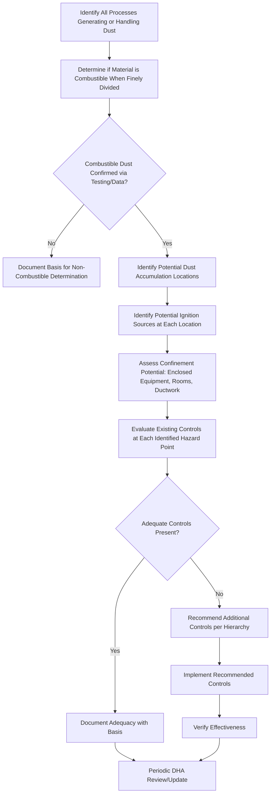

## Combustible Dust Hazard Management

### Overview

Combustible dust hazards arise when finely divided solid materials, when suspended in air at sufficient concentration, become capable of rapid combustion or explosion upon ignition. Unlike bulk solid materials, which may not be considered fire hazards in their normal form, many common materials—including metals, wood, plastics, sugar, grain, and coal—present severe explosion hazards when reduced to fine particulate form and dispersed in air. Combustible dust incidents have resulted in some of the most catastrophic industrial accidents in occupational safety history, driving significant regulatory and consensus standard attention to this hazard category.

Management of combustible dust hazards requires understanding the specific conditions necessary for a dust explosion to occur and implementing controls that interrupt one or more of these necessary conditions.

### The Dust Explosion Pentagon

Unlike the traditional fire triangle (fuel, oxygen, heat), a dust explosion requires five simultaneous conditions, commonly represented as the **Dust Explosion Pentagon**:

1. **Fuel**: Combustible dust particles of sufficient fineness
2. **Oxidant**: Typically atmospheric oxygen
3. **Ignition source**: Sufficient energy to initiate combustion (sparks, hot surfaces, friction, static discharge, open flame)
4. **Dispersion**: Dust particles suspended in air at sufficient concentration (between the lower and upper explosible limits)
5. **Confinement**: An enclosed or partially enclosed space that allows pressure to build rapidly during combustion

### Dust Explosion Pentagon Diagram (svg_diagram)

<svg xmlns="http://www.w3.org/2000/svg" viewBox="0 0 500 480">
<text x="250" y="30" font-size="16" font-weight="bold" text-anchor="middle" fill="#1a1a1a">Dust Explosion Pentagon (svg_diagram)</text>
<polygon points="250,70 385,165 335,325 165,325 115,165" fill="none" stroke="#c0392b" stroke-width="3" />
<circle cx="250" cy="70" r="8" fill="#c0392b" />
<text x="250" y="50" font-size="12" text-anchor="middle" fill="#1a1a1a">Fuel</text>
<text x="250" y="63" font-size="9" text-anchor="middle" fill="#666">(Combustible Dust)</text>
<circle cx="385" cy="165" r="8" fill="#c0392b" />
<text x="440" y="160" font-size="12" text-anchor="middle" fill="#1a1a1a">Oxidant</text>
<text x="440" y="173" font-size="9" text-anchor="middle" fill="#666">(Air)</text>
<circle cx="335" cy="325" r="8" fill="#c0392b" />
<text x="350" y="355" font-size="12" text-anchor="middle" fill="#1a1a1a">Confinement</text>
<circle cx="165" cy="325" r="8" fill="#c0392b" />
<text x="150" y="355" font-size="12" text-anchor="middle" fill="#1a1a1a">Dispersion</text>
<circle cx="115" cy="165" r="8" fill="#c0392b" />
<text x="60" y="160" font-size="12" text-anchor="middle" fill="#1a1a1a">Ignition</text>
<text x="60" y="173" font-size="9" text-anchor="middle" fill="#666">Source</text>

<text x="250" y="250" font-size="11" text-anchor="middle" fill="#333" font-weight="bold">All five conditions</text>

<text x="250" y="265" font-size="11" text-anchor="middle" fill="#333" font-weight="bold">must be present</text>

<text x="250" y="280" font-size="11" text-anchor="middle" fill="#333" font-weight="bold">for a dust explosion</text>

<text x="250" y="450" font-size="10" text-anchor="middle" fill="#666">Removing any single element prevents explosion; management strategies target multiple elements for layered protection.</text>

</svg>

### Regulatory and Consensus Standards Framework

- **OSHA General Duty Clause and Combustible Dust National Emphasis Program (NEP)**: In the absence of a single comprehensive federal combustible dust standard, OSHA has historically used the General Duty Clause and a targeted enforcement emphasis program to address recognized combustible dust hazards
- **NFPA 652**: Standard on the Fundamentals of Combustible Dust, establishing baseline requirements including the Dust Hazard Analysis (DHA)
- **NFPA 61, 484, 654, 655, 664, and others**: Industry/material-specific combustible dust standards (agricultural, combustible metals, general chemical/manufacturing, sulfur, wood processing, respectively)
- [Inference] The absence of a single unified federal combustible dust regulation has historically meant that consensus NFPA standards, often incorporated by reference through General Duty Clause enforcement, function as the primary detailed technical guidance for compliance in this hazard area.

### Combustible Dust Properties and Classification

**Key Testing Parameters**

- **Kst (Deflagration Index)**: A measure of the explosion severity of a dust cloud, used to classify dusts into St classes (St-1, St-2, St-3) representing increasing explosion severity
- **Minimum Ignition Energy (MIE)**: The smallest amount of energy required to ignite a dust cloud; lower MIE indicates greater ignition sensitivity, including potential sensitivity to static discharge
- **Minimum Explosible Concentration (MEC)**: The lowest dust concentration in air capable of propagating an explosion
- **Particle size distribution**: Finer particles generally present greater explosion severity and lower ignition energy requirements due to increased surface area-to-volume ratio

[Unverified] Specific numerical Kst, MIE, and MEC values are material-specific and must be determined through standardized laboratory testing for the actual dust generated by a specific process; generic literature values for a similar-sounding material should not be assumed applicable without verification, since particle size, moisture content, and other process-specific factors significantly affect these properties.

### Dust Hazard Analysis (DHA) Process

A Dust Hazard Analysis, required under NFPA 652 for facilities handling combustible dust, is a systematic evaluation of dust hazards throughout a facility's processes.

### Hierarchy of Combustible Dust Controls

**1. Elimination/Substitution**

- Where feasible, substituting a non-combustible material or process method that does not generate fine particulate

**2. Engineering Controls — Dust Generation and Accumulation Prevention**

- Process enclosure to minimize dust escape into the general work environment
- Local exhaust ventilation designed specifically for combustible dust (including appropriately rated ductwork and spark-resistant fan construction where required)
- Housekeeping systems (centralized vacuum systems rated for combustible dust) to prevent accumulation on horizontal surfaces, ledges, and equipment

**3. Engineering Controls — Explosion Protection**

- **Explosion venting**: Engineered panels designed to relieve pressure in a controlled direction if an explosion occurs within enclosed equipment
- **Explosion suppression systems**: Rapid detection and chemical suppressant injection systems designed to extinguish an incipient explosion before it fully propagates
- **Isolation devices**: Rotary valves, chemical isolation, or fast-acting valves designed to prevent flame/pressure propagation between interconnected process equipment

**4. Ignition Source Control**

- Bonding and grounding of equipment to control static discharge
- Hot work permit programs for welding/cutting near dust-handling areas
- Appropriately rated electrical equipment for classified (potentially dust-laden) areas
- Preventive maintenance to identify and correct mechanical friction/overheating sources (bearing failures, belt slippage)

**5. Administrative Controls**

- Housekeeping schedules and procedures to prevent dust layer accumulation exceeding established thickness thresholds
- Training on combustible dust recognition and control procedures

### Housekeeping as a Critical Control

**Key Points**

- Accumulated dust layers on horizontal surfaces (rafters, ledges, equipment tops) represent a significant secondary explosion hazard: a primary (often smaller) explosion can aerosolize accumulated dust layers throughout a facility, resulting in a much larger, more destructive secondary explosion
- [Inference] This primary-to-secondary explosion propagation mechanism is a major reason housekeeping receives such significant emphasis in combustible dust management, since even well-controlled process equipment cannot fully offset the hazard created by accumulated dust layers elsewhere in the facility
- Use of vacuum systems specifically rated for combustible dust collection (rather than compressed air blow-down, which aerosolizes dust and increases explosion risk) is a standard best practice
- Established dust layer depth thresholds (varying by material and facility-specific hazard analysis) are often used as housekeeping trigger criteria

### Example: Combustible Dust Management in a Grain Handling Facility

A grain elevator facility identifies combustible dust hazards throughout its handling and storage processes:

1. **Dust Hazard Analysis**: Conducted across all dust-generating points (receiving, conveying, storage bins, load-out), identifying grain dust as combustible with specific Kst and MEC values determined through laboratory testing.
2. **Engineering controls**: Dust collection systems installed at transfer points to capture dust at the source; explosion venting installed on bucket elevators and enclosed conveyor housings identified as having significant confinement potential.
3. **Ignition source control**: Bearing temperature monitoring systems installed to detect early signs of mechanical friction that could serve as an ignition source; bonding/grounding maintained on conveying equipment.
4. **Housekeeping program**: Scheduled cleaning using combustible-dust-rated vacuum equipment, with compressed air blow-down prohibited as a standard cleaning method; dust layer thickness inspection criteria established for all elevated surfaces.
5. **Hot work permitting**: Required for any welding/cutting activity, with the area verified free of combustible dust accumulation before work begins.

### Common Combustible Dust Management Pitfalls

- Assuming a material is not combustible in dust form simply because it is not flammable in bulk/solid form, without laboratory verification of its dust explosibility characteristics.
- Using compressed air for dust cleanup, which aerosolizes accumulated dust and increases immediate explosion risk rather than reducing it.
- Neglecting elevated and hidden surfaces (rafters, above suspended ceilings, inside enclosed equipment) during housekeeping inspections, allowing significant secondary explosion fuel to accumulate undetected.
- Failing to conduct or update a Dust Hazard Analysis after process changes that could alter dust generation rates, particle size, or accumulation patterns.
- Underestimating ignition source risks from mechanical equipment (bearing failure, belt friction) in favor of focusing primarily on electrical or hot work ignition sources.
- Inadequate explosion isolation between interconnected process equipment, allowing flame propagation from one vessel to spread throughout a connected process train.

### Integration with Broader Fire Protection and PSM Programs

- **Fire Prevention Plans**: Combustible dust controls integrate with broader facility fire prevention planning and emergency response procedures.
- **Hot Work Permit Programs**: Critical intersection point, since hot work represents a significant potential ignition source in dust-handling facilities.
- **Process Hazard Analysis**: For PSM-covered or otherwise complex processes, combustible dust hazards may be evaluated within broader PHA methodology alongside the dedicated DHA process.
- **Ventilation and Engineering Controls**: Dust collection system design must specifically account for combustible dust properties (spark-resistant construction, appropriate explosion venting), distinct from general industrial ventilation design for non-combustible contaminants.

**Next Steps**

- Fire Prevention Plans and Emergency Action Plans
- Hot Work Permit Programs
- Flammable and Combustible Liquid Storage and Handling
- Ventilation and Engineering Controls for Exposure
- Electrical Area Classification and Hazardous Locations
- Process Hazard Analysis Methodology