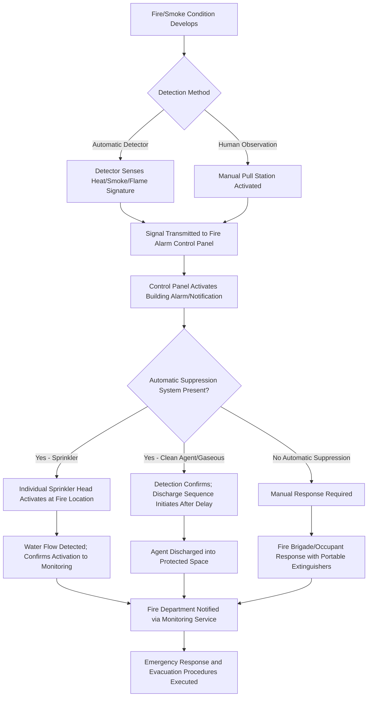

## Fire Suppression and Detection Systems

### Overview

Fire suppression and detection systems constitute the engineered infrastructure designed to identify a developing fire at its earliest stage and either automatically or manually control, suppress, or extinguish it before it reaches uncontrollable severity. These systems represent critical engineering controls within a facility's overall fire protection strategy, functioning alongside passive fire protection (fire-rated construction, compartmentalization) and active human response (fire brigades, emergency evacuation) to provide layered protection against fire-related life safety and property loss.

Design, installation, and maintenance of these systems is governed primarily by National Fire Protection Association (NFPA) consensus standards, with OSHA referencing and enforcing specific provisions applicable to workplace fire protection.

### Regulatory and Standards Framework

- **OSHA 29 CFR 1910 Subpart L**: Fire Protection standard, covering fire brigades, portable fire extinguishers, and fixed fire suppression systems in general industry
- **NFPA 13**: Standard for the Installation of Sprinkler Systems
- **NFPA 72**: National Fire Alarm and Signaling Code
- **NFPA 10**: Standard for Portable Fire Extinguishers
- **NFPA 2001**: Standard on Clean Agent Fire Extinguishing Systems
- **NFPA 12/12A**: Standards for carbon dioxide and Halon-alternative extinguishing systems (specialized applications)

### Fire Detection Systems

**Key Points**

- **Heat detectors**: Activate based on a fixed temperature threshold or a rapid rate-of-rise in temperature; generally less prone to false activation than smoke detectors but slower to detect a developing fire
- **Smoke detectors**:
  - **Ionization type**: Generally more responsive to fast-flaming fires with smaller smoke particles
  - **Photoelectric type**: Generally more responsive to smoldering fires producing larger smoke particles
- **Flame detectors**: Optical sensors (UV, IR, or combined UV/IR) detecting the specific radiant energy signature of flame, used in high-hazard areas requiring very rapid detection (e.g., flammable liquid processing)
- **Gas detectors**: Detect combustible or toxic gas concentrations that may indicate a developing fire or explosion hazard, particularly relevant in process industries
- **Manual pull stations**: Allow human-initiated alarm activation upon visual fire discovery

### Fire Detection and Suppression Activation Sequence

### Automatic Sprinkler Systems

**Wet Pipe Systems**

- Piping continuously filled with pressurized water; individual sprinkler heads activate independently based on heat exposure at that specific location (not all heads activate simultaneously)
- Most common and generally most reliable sprinkler system type due to design simplicity

**Dry Pipe Systems**

- Piping filled with pressurized air/nitrogen rather than water, with water held back by a dry pipe valve; used in unheated spaces where water-filled piping would risk freezing
- Slightly delayed water delivery compared to wet pipe systems due to the need to first release air before water flows

**Pre-Action Systems**

- Combine a detection system requirement with sprinkler head activation, requiring both an automatic detection signal and individual head activation before water is released
- Used in areas where accidental water discharge would cause significant damage (e.g., data centers, museums, sensitive electronics areas)

**Deluge Systems**

- All sprinkler/nozzle heads on the system are open at all times; water is released to all heads simultaneously upon detection system activation
- Used in high-hazard areas where rapid, complete coverage is needed (e.g., flammable liquid processing, aircraft hangars)

### Sprinkler System Type Comparison

| System Type | Piping Contents (Normal State) | Activation Mechanism | Typical Application |
| --- | --- | --- | --- |
| Wet pipe | Pressurized water | Individual head heat activation | Standard heated occupancies |
| Dry pipe | Pressurized air/nitrogen | Individual head activation releases air, then water | Unheated spaces, freezers |
| Pre-action | Air (non-pressurized or low-pressure) | Detection system AND individual head activation required | Water-sensitive areas (data centers) |
| Deluge | Empty piping, open heads | Detection system activation releases water to all heads | High-hazard, rapid-spread areas |

### Special Hazard Suppression Systems

**Clean Agent Systems**

- Use gaseous agents (e.g., various halocarbon or inert gas formulations) that extinguish fire through chemical or physical mechanisms without leaving residue, suitable for sensitive electronic equipment areas
- [Inference] Clean agent selection has evolved significantly following environmental and regulatory phase-outs of earlier halon-based agents; current agent selection should reference current NFPA 2001 guidance and applicable environmental regulations rather than assuming legacy agent availability

**Carbon Dioxide (CO2) Systems**

- Effective suppression agent but presents significant asphyxiation hazard to occupants in the protected space; requires strict evacuation and lockout procedures before discharge in occupied spaces

**Foam Systems**

- Used primarily for flammable liquid fires, forming a blanket that separates fuel from oxygen and suppresses vapor release

**Water Mist Systems**

- Fine water droplet systems providing suppression through cooling and oxygen displacement with reduced water usage compared to conventional sprinklers

### Fire Alarm and Notification Systems

**Key Points**

- **Fire Alarm Control Panel (FACP)**: The central processing unit receiving signals from detection devices and initiating notification and, where interfaced, suppression system activation
- **Notification appliances**: Audible (horns, bells) and visual (strobes) devices alerting occupants to evacuate
- **Monitoring and central station connection**: Many systems are monitored by a supervising station that automatically notifies the fire department upon alarm activation
- **Mass notification integration**: Some facilities integrate fire alarm systems with broader emergency communication systems providing voice instructions during an event

### Portable Fire Extinguishers

While not a fixed system, portable extinguishers represent a critical first-response suppression tool and are classified by the fire type they are designed to combat:

| Extinguisher Class | Fire Type | Typical Agent |
| --- | --- | --- |
| Class A | Ordinary combustibles (wood, paper, cloth) | Water, multi-purpose dry chemical |
| Class B | Flammable liquids and gases | Dry chemical, CO2, foam |
| Class C | Energized electrical equipment | Non-conductive agent (CO2, dry chemical) |
| Class D | Combustible metals | Specialized dry powder agent |
| Class K | Cooking oils/fats (commercial kitchens) | Wet chemical |

OSHA 1910.157 establishes requirements for extinguisher placement, spacing, inspection, and training for employees expected to use them.

### Inspection, Testing, and Maintenance (ITM)

**Key Points**

- Fire suppression and detection systems require regular inspection, testing, and maintenance per applicable NFPA standards (e.g., NFPA 25 for water-based systems, NFPA 72 for alarm systems) to ensure continued reliability
- Sprinkler systems require periodic main drain tests, gauge inspections, and control valve verification to confirm the system remains in a ready operational state
- Fire alarm systems require periodic testing of individual detection devices, notification appliances, and control panel functions
- Portable extinguishers require monthly visual inspection and annual maintenance per NFPA 10
- [Inference] Deferred or inadequate ITM represents a significant latent risk, since a fire suppression system that appears intact through casual observation may have developed internal deficiencies (corrosion, valve failure, depleted agent) that only become apparent during an actual fire event if not proactively tested

### Example: Fire Protection System Selection for a Server Room

A facility housing critical IT server infrastructure evaluates fire protection options for the space:

1. **Detection**: Very early smoke detection apparatus (VESDA-type aspirating smoke detection) selected for its ability to detect incipient-stage smoke well before a conventional point-type detector would activate, given the high value of early warning for sensitive electronics.
2. **Suppression system selection**: A clean agent suppression system selected over a conventional water sprinkler system, specifically to avoid water damage to electronic equipment while still providing effective fire suppression.
3. **Pre-action consideration**: If a sprinkler system is also present in the space for life safety/code compliance in addition to the clean agent system, a pre-action configuration may be specified to minimize accidental discharge risk.
4. **Notification integration**: Alarm system interfaced with facility-wide monitoring and staffed operations center for immediate response coordination.
5. **ITM program**: Scheduled testing established per NFPA 72 and the clean agent system manufacturer's requirements, including periodic room integrity (door fan) testing to confirm the space can retain agent concentration for the required suppression duration.

### Common Fire Suppression and Detection Pitfalls

- Deferred inspection, testing, and maintenance, allowing latent system deficiencies to remain undetected until an actual fire event reveals system failure.
- Selecting a detector type poorly matched to the anticipated fire signature of the specific hazard (e.g., using only heat detection in an area where early smoldering-fire smoke detection would provide significantly faster warning).
- Storing materials or obstructing sprinkler head clearance, reducing water distribution effectiveness during activation.
- Inadequate coordination between suppression system discharge and personnel evacuation/lockout procedures for asphyxiation-hazard agents (CO2 systems in particular).
- Failing to update fire protection system design following facility renovations, process changes, or hazard class changes that alter the applicable protection requirements.

### Integration with Broader Fire Protection and Safety Programs

- **Fire Prevention Plans**: Detection and suppression systems function within the broader facility fire prevention and emergency action plan framework.
- **Hot Work Permit Programs**: Areas with impaired or bypassed fire protection systems (e.g., sprinkler system out of service) require heightened hot work precautions and often fire watch assignment.
- **Combustible Dust and Flammable Liquid Hazards**: Special hazard suppression system selection (deluge, foam, clean agent) is often directly driven by the specific combustible dust or flammable liquid hazards present in a given area.
- **Emergency Action Plans**: Notification and evacuation procedures must be coordinated with the facility's fire alarm and suppression system design and activation sequence.

**Next Steps**

- Fire Prevention Plans and Emergency Action Plans
- Hot Work Permit Programs
- Flammable and Combustible Liquid Storage and Handling
- Combustible Dust Hazard Management
- Emergency Evacuation Planning and Procedures
- Fire Extinguisher Training Requirements