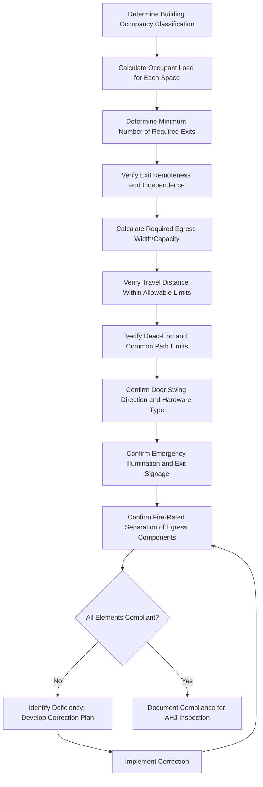

## Life Safety Code Requirements

### Overview

The Life Safety Code, formally designated **NFPA 101**, is a widely adopted consensus standard establishing minimum requirements for building design, construction, and operational features intended to protect occupants from fire and related hazards, with particular emphasis on ensuring safe means of egress during an emergency. Unlike fire suppression and detection standards that focus on controlling the fire itself, the Life Safety Code focuses primarily on occupant life safety—ensuring people can safely exit a building or reach a point of safety regardless of whether the fire is ultimately suppressed.

NFPA 101 is frequently adopted by reference into state and local building/fire codes, and compliance is also referenced within OSHA's general industry standards regarding means of egress (29 CFR 1910 Subpart E).

### Regulatory Adoption and Scope

- **OSHA 29 CFR 1910 Subpart E**: Means of Egress standard, establishing baseline federal workplace egress requirements that parallel and, in some respects, reference Life Safety Code principles
- **NFPA 101**: The comprehensive consensus code addressing occupancy classification, construction requirements, egress design, and fire protection features, adopted (often with local amendments) by many state and municipal jurisdictions
- **Authority Having Jurisdiction (AHJ)**: The specific local fire marshal, building official, or other authority responsible for code interpretation and enforcement in a given jurisdiction, whose specific adopted code edition and amendments govern actual compliance requirements

[Inference] Because code adoption and specific edition currency vary significantly by jurisdiction, actual applicable requirements for a specific facility should always be verified against the locally adopted code edition and any jurisdiction-specific amendments, rather than assuming a single uniform national requirement.

### Occupancy Classification

The Life Safety Code establishes distinct requirements based on occupancy classification, since life safety risk profiles differ substantially by building use:

| Occupancy Type | Examples | Key Life Safety Considerations |
| --- | --- | --- |
| Assembly | Theaters, restaurants, conference centers | High occupant density, potential unfamiliarity with egress routes |
| Business | Offices | Generally lower risk profile; occupants typically familiar with the space |
| Industrial | Manufacturing facilities | Process-specific hazards, potentially larger open floor areas |
| Storage | Warehouses | Lower occupant density but potential for significant fuel load |
| Institutional | Hospitals, correctional facilities | Occupants with limited self-evacuation capability requiring specialized protection strategies |
| Educational | Schools | High occupant density combined with occupants requiring supervised evacuation |
| Residential | Apartments, hotels | Occupants may be asleep or unfamiliar with the building during an emergency |

### Core Means of Egress Concepts

**Key Points**

- **Means of egress**: The complete, continuous path of travel from any point in a building to a public way, consisting of three distinct components: exit access, exit, and exit discharge
- **Exit access**: The portion of the egress path leading to an exit (e.g., corridors, aisles within a room)
- **Exit**: The portion of the egress path that is separated from other building spaces by fire-rated construction, providing a protected path (e.g., an enclosed stairwell, a fire-rated exit corridor)
- **Exit discharge**: The portion of the egress path between the termination of an exit and a public way (e.g., a sidewalk leading away from an exterior exit door)

### Means of Egress Path Diagram (svg_diagram)

<svg xmlns="http://www.w3.org/2000/svg" viewBox="0 0 700 300">
<text x="350" y="25" font-size="16" font-weight="bold" text-anchor="middle" fill="#1a1a1a">Means of Egress Components (svg_diagram)</text>
<rect x="30" y="60" width="180" height="180" fill="#e8f0fe" stroke="#4a6fa5" stroke-width="1.5" />
<text x="120" y="150" font-size="12" text-anchor="middle" fill="#1a3a6a">Occupied Space</text>
<text x="120" y="170" font-size="10" text-anchor="middle" fill="#555">(Origin Point)</text>
<rect x="230" y="120" width="150" height="60" fill="#fdeee8" stroke="#c0654a" stroke-width="1.5" />
<text x="305" y="145" font-size="11" text-anchor="middle" fill="#7a3a20">Exit Access</text>
<text x="305" y="160" font-size="9" text-anchor="middle" fill="#555">(Corridor)</text>
<rect x="400" y="90" width="90" height="120" fill="#eaf7ea" stroke="#4a9a5a" stroke-width="1.5" />
<text x="445" y="145" font-size="11" text-anchor="middle" fill="#2e7d32">Exit</text>
<text x="445" y="160" font-size="9" text-anchor="middle" fill="#555">(Fire-Rated</text>
<text x="445" y="172" font-size="9" text-anchor="middle" fill="#555">Stairwell)</text>
<rect x="510" y="120" width="160" height="60" fill="#fff3cd" stroke="#8a6a1a" stroke-width="1.5" />
<text x="590" y="145" font-size="11" text-anchor="middle" fill="#5a4a1a">Exit Discharge</text>
<text x="590" y="160" font-size="9" text-anchor="middle" fill="#555">(To Public Way)</text>
<line x1="210" y1="150" x2="230" y2="150" stroke="#333" stroke-width="2" marker-end="url(#arrow)" />
<line x1="380" y1="150" x2="400" y2="150" stroke="#333" stroke-width="2" marker-end="url(#arrow)" />
<line x1="490" y1="150" x2="510" y2="150" stroke="#333" stroke-width="2" marker-end="url(#arrow)" />
<text x="350" y="270" font-size="10" text-anchor="middle" fill="#666">Complete path: Occupied Space → Exit Access → Exit → Exit Discharge → Public Way</text>

</svg>

### Egress Design Requirements

**Number of Exits**

- Most occupancies require a minimum of two remotely located, independent means of egress from any occupied space, so that a single fire or obstruction cannot block all available egress routes
- Higher occupant loads or specific occupancy classifications may require additional exits

**Egress Capacity**

- Exit width and stairwell capacity must be sized based on calculated occupant load for the space served, using established capacity factors (e.g., width per unit of occupant load) that vary by component type (level components vs. stairs)

**Travel Distance**

- Maximum allowable travel distance from any point in a building to the nearest exit is limited based on occupancy classification and whether the building is protected by automatic sprinklers (sprinklered buildings are often permitted greater travel distances due to the additional fire control provided)

**Dead-End Corridors**

- Maximum permitted dead-end corridor length is limited, since a dead-end forces occupants to backtrack if their initial direction of travel proves blocked

**Common Path of Travel**

- The distance occupants must travel before reaching a point where two separate means of egress become available is limited, since a common path represents a single point of potential failure before egress route choice exists

[Unverified] Specific numerical values for exit width capacity factors, maximum travel distance, dead-end corridor length, and common path of travel limits vary significantly by occupancy classification and specific code edition; current locally adopted NFPA 101 edition should be consulted for precise applicable figures rather than relying on generalized values.

### Egress Component Requirements

**Doors**

- Must generally swing in the direction of egress travel for higher-occupant-load spaces
- Panic hardware (crash bars) required for certain high-occupancy assembly and educational spaces, allowing egress without requiring occupants to operate a knob, lever, or key
- Doors must remain unlocked against egress travel during periods of occupancy (locking mechanisms preventing egress from the inside are a common and serious violation)

**Stairs**

- Must be enclosed in fire-rated construction to protect the egress path from smoke and fire exposure originating in other parts of the building
- Handrail and guardrail requirements to prevent falls during evacuation

**Illumination and Signage**

- Emergency illumination of egress paths required, typically with a specified minimum duration of backup power/battery operation
- Illuminated exit signs marking the egress path, visible from any point along the route

**Fire-Rated Separation**

- Corridors and stairwells serving as protected egress components require fire-rated wall and door assemblies to maintain their protective function during a fire event

### Life Safety Compliance Workflow

### Common Life Safety Code Violations

**Key Points**

- **Blocked or locked exits**: Storage materials obstructing egress paths, or doors locked/chained against egress during occupied hours
- **Excessive travel distance**: Occupied spaces where the actual travel distance to the nearest exit exceeds the maximum allowed for that occupancy classification
- **Inadequate exit signage or illumination**: Missing, obscured, or non-illuminated exit signs; non-functional emergency lighting
- **Insufficient egress capacity**: Occupant load exceeding what the provided exit width/capacity can safely accommodate
- **Improper door swing or hardware**: Doors swinging against the direction of egress travel in spaces requiring egress-direction swing, or requiring special knowledge/key to operate during an emergency
- **Compromised fire-rated separation**: Penetrations, propped-open fire doors, or damaged fire-rated assemblies in corridors and stairwells intended to protect the egress path

### Example: Life Safety Assessment of a Manufacturing Facility Expansion

A facility undergoing an expansion evaluates life safety compliance for the newly added production area:

1. **Occupancy classification**: New space classified as Industrial occupancy under the applicable adopted code edition.
2. **Occupant load calculation**: Determined based on the specific use and floor area, following the code's occupant load factor methodology for industrial space.
3. **Exit verification**: Two remotely located exits identified from the new production floor, meeting minimum exit count and remoteness requirements.
4. **Travel distance check**: Maximum travel distance from the most remote work location to the nearest exit calculated and confirmed within the allowable limit, considering the facility's sprinkler protection status.
5. **Egress hardware**: Panic hardware specified for exit doors serving areas with occupant loads meeting the applicable threshold.
6. **Illumination and signage**: Emergency lighting and illuminated exit signage designed to cover the full egress path, including battery backup meeting the required minimum duration.
7. **Documentation**: Life safety compliance documentation prepared for submission to the local Authority Having Jurisdiction as part of the permitting and occupancy approval process.

### Common Life Safety Code Management Pitfalls

- Allowing storage or equipment to encroach on required egress width or block designated exit doors over time as facility use evolves.
- Installing supplemental locking devices (padlocks, chains) on egress doors for security purposes without evaluating life safety code compliance for emergency egress capability.
- Failing to reassess travel distance and occupant load calculations following facility layout changes, renovations, or occupancy use changes.
- Propping open fire-rated corridor or stairwell doors for convenience, defeating the smoke/fire compartmentalization the code requires for protected egress paths.
- Neglecting periodic testing of emergency lighting and exit sign illumination, resulting in non-functional systems discovered only during an actual emergency or inspection.

### Integration with Broader Fire Protection and Safety Programs

- **Fire Suppression and Detection Systems**: Sprinkler protection status directly affects allowable travel distance calculations under the Life Safety Code, illustrating the interconnection between active suppression and passive/egress life safety strategies.
- **Emergency Action Plans**: Egress route design and capacity directly inform the facility's emergency evacuation planning and employee training.
- **Fire Prevention Plans**: Housekeeping and storage practices affecting egress path clearance intersect with broader fire prevention plan requirements.
- **Combustible Dust and Flammable Liquid Storage**: High-hazard content areas may trigger more stringent occupancy classification and egress requirements under the Life Safety Code.

**Next Steps**

- Fire Suppression and Detection Systems
- Emergency Action Plans and Evacuation Procedures
- Fire Prevention Plans
- Occupancy Load Calculation Methodology
- Hot Work Permit Programs
- Combustible Dust Hazard Management