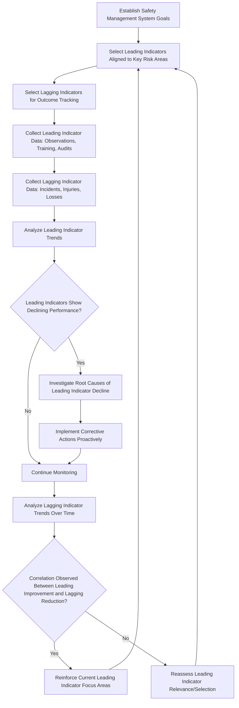

## Leading and Lagging Indicators

### Overview

Leading and lagging indicators represent two complementary categories of safety performance metrics used to measure, monitor, and drive improvement in an organization's occupational safety and health management system. Lagging indicators measure outcomes that have already occurred—typically injuries, illnesses, or losses—while leading indicators measure proactive activities and conditions believed to influence future safety performance before an incident occurs. A mature safety performance measurement system relies on both indicator types in combination, since lagging indicators alone provide only retrospective insight, often too late to prevent the events they measure.

### The Fundamental Distinction

**Lagging Indicators**

- Measure outcomes that have already happened
- Typically based on injury, illness, or loss data
- Reactive by nature—they confirm that a failure has already occurred
- Generally easier to quantify objectively, since they are based on documented events

**Leading Indicators**

- Measure proactive safety activities, conditions, or system inputs believed to reduce the likelihood of future incidents
- Predictive/preventive in intent—aimed at identifying and correcting deficiencies before they result in harm
- Often more difficult to quantify with the same objectivity as lagging indicators, since they may involve process quality judgments rather than simple event counts

[Inference] The relationship between specific leading indicators and actual future incident reduction is not always straightforward to establish causally in a given organization; leading indicators represent evidence-informed proxies for safety system health rather than guaranteed predictors, and their selection should be periodically evaluated for actual relevance to the organization's specific risk profile.

### Common Lagging Indicators

**Key Points**

- **Total Recordable Incident Rate (TRIR)**: The number of OSHA-recordable injuries and illnesses per 100 full-time employees over a specified period
- **Days Away, Restricted, or Transferred (DART) Rate**: A subset of recordable incidents involving more severe outcomes requiring time away from work, restricted duty, or job transfer
- **Lost Time Injury Frequency Rate (LTIFR)**: Frequency of injuries resulting in lost work time, often normalized per hours worked
- **Fatality rate**: The most severe outcome measure, typically tracked as an absolute count given its severity, though sometimes normalized for large organizations
- **Workers' compensation claims and costs**: Financial and claims-based outcome measures
- **Property/process loss incidents**: For process safety contexts, measures such as Process Safety Event (PSE) counts by severity tier

### TRIR Calculation

$$TRIR = \frac{\text{Number of Recordable Incidents} \times 200{,}000}{\text{Total Hours Worked}}$$

The constant 200,000 represents the approximate number of hours worked by 100 full-time employees in a year (100 employees × 40 hours/week × 50 weeks), standardizing the rate for comparison across organizations of different sizes.

**Example**: A facility with 8 recordable incidents and 400,000 total hours worked in a year:

$$TRIR = \frac{8 \times 200{,}000}{400{,}000} = \frac{1{,}600{,}000}{400{,}000} = 4.0$$

This facility would report a TRIR of 4.0 recordable incidents per 100 full-time equivalent workers per year, a figure typically benchmarked against industry-specific averages published by organizations such as the Bureau of Labor Statistics.

### Common Leading Indicators

**Key Points**

- **Near-miss/close call reporting rate**: Frequency of reported incidents that did not result in injury but had the potential to do so; a higher reporting rate is often interpreted as a positive sign of safety culture and hazard visibility rather than a negative outcome measure
- **Safety observation/behavior-based safety completion rates**: Percentage of scheduled safety observations or audits completed
- **Corrective action closure rate**: Percentage of identified hazards or audit findings closed within a target timeframe
- **Training completion rates**: Percentage of required safety training completed on schedule
- **Job Hazard Analysis (JHA) completion rates**: Percentage of tasks with current, completed hazard analyses
- **Housekeeping/inspection audit scores**: Quantified results from scheduled safety inspections
- **Management safety walk-through frequency**: Frequency of documented leadership engagement in safety observation activities
- **Employee safety perception/culture survey results**: Aggregate scores from periodic workforce surveys on safety climate

### Leading vs. Lagging Indicator Comparison

| Aspect | Lagging Indicators | Leading Indicators |
| --- | --- | --- |
| Timing | After the fact (reactive) | Before the fact (proactive) |
| Measures | Outcomes/failures | Activities/conditions/inputs |
| Data objectivity | Generally high (documented events) | Variable (some subjective/process-based) |
| Actionability | Limited—incident has already occurred | High—allows correction before an incident |
| Typical examples | TRIR, DART rate, fatality count | Near-miss reports, training completion, audit scores |
| Primary use | Historical benchmarking, regulatory reporting | Continuous improvement, predictive management focus |

### Indicator Relationship and Safety Management Workflow

### Designing an Effective Indicator Set

**Key Points**

- Indicators should be selected based on relevance to the organization's specific hazard profile and historical loss patterns, rather than adopting a generic industry-standard set without customization
- A balanced scorecard approach combining both leading and lagging indicators provides a more complete performance picture than either category alone
- Leading indicators should be actionable—tied to specific, correctable activities or conditions—rather than vague or overly aggregated metrics that do not point toward a clear corrective action
- Indicator targets should avoid creating perverse incentives (e.g., a target that discourages honest incident or near-miss reporting to preserve a favorable metric)
- [Inference] Overemphasis on lagging indicator targets alone, particularly when tied to incentive compensation, has been associated in safety management literature with potential underreporting of minor injuries or near-misses, which is a significant reason many mature safety programs shift greater emphasis toward leading indicator tracking and away from purely outcome-based incentive structures

### Example: Indicator Set for a Manufacturing Facility

A manufacturing facility develops a balanced indicator dashboard combining both types:

**Lagging Indicators Tracked:**

1. TRIR (calculated quarterly and annually)
2. DART rate
3. Total workers' compensation incurred costs

**Leading Indicators Tracked:**

1. Percentage of scheduled behavior-based safety observations completed
2. Near-miss reporting rate (reports per 100 employees per month)
3. Percentage of identified corrective actions closed within 30 days
4. Percentage of required safety training completed on schedule
5. Monthly management safety walk-through completion rate

The facility reviews both indicator categories monthly at a safety steering committee meeting, using leading indicator trends to identify emerging risk areas proactively rather than waiting for lagging indicator data to reveal a problem only after an injury has already occurred.

### Common Pitfalls in Indicator Selection and Use

- Relying exclusively on lagging indicators (particularly TRIR) as the primary or sole safety performance measure, missing the proactive insight leading indicators provide.
- Tying incentive compensation directly to lagging indicator targets (e.g., bonus contingent on zero recordable incidents), which can inadvertently discourage honest injury or near-miss reporting.
- Selecting leading indicators that are easy to measure but not meaningfully connected to the organization's actual risk profile (vanity metrics).
- Treating a high near-miss reporting rate as a negative outcome rather than recognizing it as generally indicative of a healthy reporting culture, particularly when compared to actual injury trends.
- Failing to periodically reassess whether selected leading indicators remain relevant as the organization's operations, hazards, or risk profile evolve over time.
- Comparing TRIR or DART rates across organizations without accounting for differences in industry classification, workforce composition, or reporting practices that can affect comparability.

### Integration with Broader Safety Management Systems

- **Behavior-Based Safety Programs**: Safety observation completion rates and corrective action closure rates directly feed leading indicator tracking within behavior-based safety initiatives.
- **Incident Investigation**: Lagging indicator data (incident counts, severity) drives incident investigation prioritization and root cause analysis focus areas.
- **Management of Change**: Leading indicators related to hazard analysis and training completion often intersect with MOC program effectiveness tracking.
- **OSHA Recordkeeping**: Lagging indicator calculation (TRIR, DART) relies directly on accurate OSHA 300 log recordkeeping data.

**Next Steps**

- OSHA Recordkeeping Requirements for Occupational Illnesses and Injuries
- Incident Investigation and Root Cause Analysis
- Behavior-Based Safety Programs
- Safety Culture Assessment and Improvement
- Job Hazard Analysis Methodology
- Management of Change (MOC) Procedures