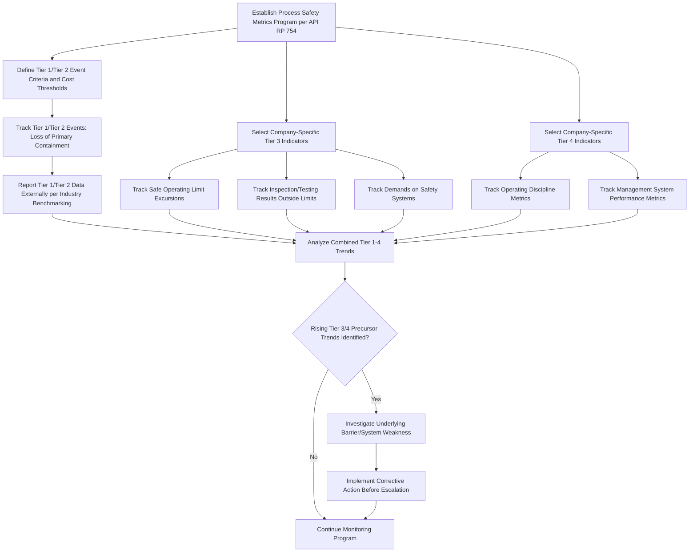

## Process Safety Performance Metrics per API RP 754

### Overview

API Recommended Practice 754 (API RP 754), *Process Safety Performance Indicators for the Refining and Petrochemical Industries*, establishes a standardized four-tier framework for measuring process safety performance, distinguishing it from occupational (personal) safety metrics such as TRIR. The standard was developed following the BP Texas City refinery explosion, which killed 15 people, injured 180, and resulted in approximately $300 million in damages, with the Baker Panel investigation concluding that the mere passing of time without a process accident does not necessarily indicate that all is well and may in fact contribute to a dangerous, growing sense of complacency. This finding drove the development of a standardized metrics framework capable of capturing process safety system deterioration before it manifests as a catastrophic event. [Dale-peterson](https://dale-peterson.com/2024/05/21/leading-indicator-metrics-inspired-by-api-rp-754/)

Originally published in 2010 in response to recommendations from the U.S. Chemical Safety Board, API RP 754 helped standardize process safety metrics across the oil and natural gas industry, serving as a foundational standard for API's Process Safety Site Assessment Program and Annual Process Safety Event Survey. The standard was revised in 2021 as its 3rd edition, and API published a fourth edition in August 2026, reflecting 15 years of industry implementation experience, including updated direct cost thresholds for Tier 1 and Tier 2 events to align with inflation, refined guidance for assessing fires, explosions, and unignited material releases, and clarified definitions. [API Publishes Fourth Edition of Process Safety Performance Indicators Standard | American Petroleum Institute | API +2](https://www.api.org/news-policy-and-issues/news/2026/08/06/api-publishes-fourth-edition-process-safety-performance-indicators-standard)

[Unverified] Given the recency of the fourth edition's publication, specific updated cost thresholds and refined assessment criteria should be verified directly against the current API RP 754 fourth edition text for precise compliance application, since this content reflects general framework structure rather than the complete revised technical detail.

### Scope and Applicability

This Recommended Practice identifies leading and lagging process safety indicators useful for driving performance improvement, developed for the refining and petrochemical industries, but potentially applicable to other industries with operating systems and processes where loss of containment has the potential to cause harm. The recommended practice includes mechanical integrity related items and provides a framework for measuring activity, status, or performance. [American Petroleum Institute](https://www.api.org/~/media/files/oil-and-natural-gas/refining/process%20safety/rp-754-fact-sheet.pdf)[Inspectioneering](https://inspectioneering.com/tag/api+rp+754)

### The Four-Tier Framework

The indicators are divided into four tiers representing a leading and lagging continuum, with Tier 1 being the most lagging and Tier 4 being the most leading. Tier 1 and Tier 2 process safety indicators are suitable for public reporting for companies and for the industry, while Tier 3 and Tier 4 indicators are intended for internal use, as they are unique at individual facilities. [American Petroleum Institute](https://www.api.org/~/media/files/oil-and-natural-gas/refining/process%20safety/rp-754-fact-sheet.pdf)[American Petroleum Institute](https://www.api.org/news-policy-and-issues/news/2026/08/06/api-publishes-fourth-edition-process-safety-performance-indicators-standard)

### API RP 754 Four-Tier Pyramid (svg_diagram)

<svg xmlns="http://www.w3.org/2000/svg" viewBox="0 0 600 460">
<text x="300" y="25" font-size="16" font-weight="bold" text-anchor="middle" fill="#1a1a1a">API RP 754 Four-Tier Pyramid (svg_diagram)</text>
<polygon points="300,50 380,150 220,150" fill="#a02020" />
<text x="300" y="100" font-size="12" text-anchor="middle" fill="#fff" font-weight="bold">Tier 1</text>
<text x="300" y="118" font-size="9" text-anchor="middle" fill="#fff">Most Lagging</text>
<text x="405" y="100" font-size="10" fill="#333">Loss of Primary Containment</text>
<text x="405" y="115" font-size="10" fill="#333">— Greatest Consequence</text>
<polygon points="220,150 380,150 430,240 170,240" fill="#c0654a" />
<text x="300" y="190" font-size="12" text-anchor="middle" fill="#fff" font-weight="bold">Tier 2</text>
<text x="300" y="208" font-size="9" text-anchor="middle" fill="#fff">Lagging</text>
<text x="450" y="195" font-size="10" fill="#333">Lesser-Consequence LOPC</text>
<text x="450" y="210" font-size="10" fill="#333">— Public/Industry Reporting</text>
<polygon points="170,240 430,240 480,330 120,330" fill="#e0a030" />
<text x="300" y="280" font-size="12" text-anchor="middle" fill="#1a1a1a" font-weight="bold">Tier 3</text>
<text x="300" y="298" font-size="9" text-anchor="middle" fill="#1a1a1a">Leading</text>
<text x="500" y="285" font-size="10" fill="#333">Challenges to Safety Systems</text>
<text x="500" y="300" font-size="10" fill="#333">— Internal Use</text>
<polygon points="120,330 480,330 530,420 70,420" fill="#4a9a5a" />
<text x="300" y="370" font-size="12" text-anchor="middle" fill="#fff" font-weight="bold">Tier 4</text>
<text x="300" y="388" font-size="9" text-anchor="middle" fill="#fff">Most Leading</text>
<text x="60" y="375" font-size="10" fill="#333" text-anchor="end">Operating Discipline &amp;</text>
<text x="60" y="390" font-size="10" fill="#333" text-anchor="end">Management System</text>

<text x="300" y="450" font-size="10" text-anchor="middle" fill="#666">Narrower peak = fewer, more severe events; wider base = frequent, low-severity precursor signals</text>

</svg>

### Tier Definitions in Detail

**Tier 1 — Most Lagging**

Tier 1 represents a major consequence event: a loss of process material containment where someone was injured or killed. It is a lagging indicator confirming that a significant adverse event has already occurred. Any Tier 1 or Tier 2 process safety incident begins with an unplanned or uncontrolled release of any material, including non-toxic and non-flammable materials, from a process. [Dale-peterson](https://dale-peterson.com/2024/05/21/leading-indicator-metrics-inspired-by-api-rp-754/)[Inspectioneering](https://inspectioneering.com/tag/api+rp+754)

**Tier 2 — Lagging**

Tier 2 represents loss of primary containment events with a lesser consequence, but events that may be predictive of future, more significant incidents — examples include an employee, contractor, or subcontractor recordable injury, or a fire or explosion causing damage above a specified direct cost threshold. [Inspectioneering](https://inspectioneering.com/tag/api+rp+754)

**Tier 3 — Leading**

Tier 3 represents challenges to the safety systems, providing an opportunity to identify and correct weaknesses. A Tier 3 process safety event typically represents a challenge to the barrier system that progressed along the path to harm but was stopped short of a Tier 1 or Tier 2 loss-of-primary-containment consequence. Tier 3 indicators are intended for internal company use, and a company may select all or some of the example indicators listed in the standard, such as safe operating limit excursions, primary containment inspection or testing results outside acceptable limits, and demands on safety systems. [API RP 754 - Process Safety Performance Indicators | Inspectioneering +2](https://inspectioneering.com/tag/api+rp+754)

**Tier 4 — Most Leading**

Tier 4 represents the performance of individual components of the operating discipline and management system, providing an opportunity to identify and improve isolated system weaknesses. Tier 4 indicators are indicative of process safety system weaknesses that may contribute to future Tier 1 or Tier 2 process safety events and may identify opportunities for both learning and systems improvement. [Inspectioneering](https://inspectioneering.com/tag/api+rp+754)[iFluids Engineering](https://ifluids.com/process-safety-kpis-api-rp-754/)

### Tier Comparison Summary

| Tier | Leading/Lagging Position | Reporting Scope | Example Content |
| --- | --- | --- | --- |
| Tier 1 | Most lagging | Public/industry (nationwide reporting) | Major loss of primary containment with injury/fatality or significant consequence |
| Tier 2 | Lagging | Public/industry (nationwide reporting) | Lesser-consequence LOPC events, potentially predictive of future Tier 1 events |
| Tier 3 | Leading | Internal company/site use | Safe operating limit excursions, inspection/testing results outside limits, safety system demands |
| Tier 4 | Most leading | Internal company/site use | Operating discipline and management system performance indicators |

Tier 1 and Tier 2 indicators are standardized by RP 754 and suitable for broad reporting, industry benchmarking, and driving industry initiatives, while Tier 3 and Tier 4 indicators are company-defined and suitable for internal company or site-level reporting and benchmarking. [Arpel](https://portal.arpel.org/hubfs/Archivos%202024%20[Eva]/2024[Cursos%20y%20Eventos]%20-%20fotos,%20gr%C3%A1ficos%20y%20archivos/Seguridad%20de%20Procesos%20I%20API%20-%20IOGP/ARPEL%20Webinar_API%20RP%20754%20Process%20Safety_Para%20Compartir.pdf)

### The Predictive Rationale Behind the Tier Structure

The framework draws on the accident pyramid concept, representing two key ideas: that safety accidents can be placed on a scale representing the level of consequence, and that many precursor incidents occur with lesser consequences for each accident that occurs with greater consequences, following a pattern resembling Heinrich's model, which represents a predictive relationship between lower- and higher-consequence events. It is believed that a similar predictive relationship exists between lower- and higher-consequence events specifically within process safety. [iFluids Engineering](https://ifluids.com/process-safety-kpis-api-rp-754/)[iFluids Engineering](https://ifluids.com/process-safety-kpis-api-rp-754/)

[Inference] This pyramid logic underlies the rationale for tracking Tier 3 and Tier 4 indicators even though they do not themselves represent significant losses: a rising trend in lower-tier precursor events is treated as a warning sign that the underlying barrier and management systems may be degrading, potentially preceding a future Tier 1 or Tier 2 event, even though the specific numerical relationship between tiers is not a fixed or guaranteed ratio.

### Process Safety Metrics Application Workflow

### Program Maturity Interpretation

**Key Points**

- Tier 1 and Tier 2 events, by definition, are only counted after a loss of primary containment has already happened; a facility tracking only these two tiers is measuring failure after the fact, with no structural way to see the deterioration that preceded it. [iFactory](https://ifactoryapp.com/industries/oil-and-gas/process-safety-leading-indicators-api-rp-754-tier)
- A dashboard consisting mostly of Tier 1 and Tier 2 counts with almost nothing beneath them reveals more about a program's maturity than the incident numbers themselves do; a site with a healthy number of Tier 3 and Tier 4 findings is not necessarily a worse-performing site — it typically means the team is actively watching for safe operating limit excursions and management system gaps rather than waiting for something to break. [iFactory](https://ifactoryapp.com/industries/oil-and-gas/process-safety-leading-indicators-api-rp-754-tier)
- The goal is not to drive Tier 3 events to zero; it is to catch enough of them that the facility never generates a Tier 1 event. [iFactory](https://ifactoryapp.com/industries/oil-and-gas/process-safety-leading-indicators-api-rp-754-tier)

[Inference] This interpretation represents an important cultural shift from traditional lagging-only safety reporting: a rising count of Tier 3/4 findings should generally be read as evidence of active monitoring and detection capability rather than assumed evidence of declining safety performance, provided those findings are followed by genuine corrective action.

### Common Implementation Deficiencies

Based on industry compliance review sources, frequently identified gaps include:

Underreporting of Tier 1 events, Tier 3 metrics not being implemented at all, inconsistent threshold application across sites or reporting periods, missing Tier 4 cultural/management-system metrics, and lack of documented action follow-up on identified indicator findings. [SmartQHSE](https://www.smartqhse.com/safety-blog/api-rp-754-process-safety-indicators-deep-dive-2026)

[Unverified] These deficiency patterns are drawn from third-party compliance review commentary rather than an official API enforcement or audit finding; actual implementation gaps should be assessed against a facility's specific documented program rather than assumed to universally apply.

### Example: Building a Tier 3/4 Indicator Set for a Refinery Unit

A refinery process unit implementing an API RP 754-aligned metrics program might select:

**Tier 3 indicators:**

1. Number of safe operating limit excursions on critical process variables (temperature, pressure, level) per month
2. Percentage of mechanical integrity inspections completed within the scheduled interval, with findings outside acceptable limits tracked separately
3. Number of relief valve or emergency shutdown system activations (demands on safety systems)

**Tier 4 indicators:**

1. Percentage of process safety-critical procedures reviewed and current
2. Percentage of management-of-change reviews completed before implementation versus after the fact
3. Training completion rate for process safety-critical roles
4. Percentage of process hazard analysis action items closed within target timeframe

These company-defined Tier 3 and Tier 4 indicators are tracked internally, with trends reviewed against Tier 1/Tier 2 historical event data to assess whether declining Tier 3/4 performance correlates with subsequent increases in more severe loss-of-containment events.

### Common Pitfalls in Applying API RP 754

- Tracking only Tier 1 and Tier 2 lagging indicators without developing meaningful company-specific Tier 3 and Tier 4 leading indicators, missing the framework's core predictive intent.
- Applying inconsistent event classification thresholds across different facilities or reporting periods, undermining trend analysis validity.
- Failing to close the loop between identified Tier 3/4 findings and actual corrective action, reducing the indicators to passive data collection rather than active risk management.
- Treating a rising Tier 3/4 count as inherently negative rather than recognizing it may reflect improved detection and reporting culture.
- Using outdated cost thresholds or definitions from a prior edition of the standard following a published revision.
- Conflating process safety metrics (API RP 754) with occupational/personal safety metrics (e.g., TRIR), which measure fundamentally different risk categories despite some overlap in Tier 2 criteria (e.g., recordable injuries associated with a loss of containment event).

### Integration with Broader Process Safety Management

- **Leading and Lagging Indicators (General)**: API RP 754 provides an industry-specific, highly structured application of the broader leading/lagging indicator concept used across safety performance measurement.
- **Process Hazard Analysis**: Tier 3 findings (safe operating limit excursions, safety system demands) often surface issues that should feed back into PHA revalidation.
- **Mechanical Integrity Programs**: The standard's inclusion of mechanical integrity related items connects Tier 3 inspection/testing indicators directly to mechanical integrity program performance. [Inspectioneering](https://inspectioneering.com/tag/api+rp+754)
- **Management of Change**: Tier 4 indicators frequently track MOC program execution quality as a proxy for overall management system health.

**Next Steps**

- Leading and Lagging Indicators (General Safety Metrics)
- Process Hazard Analysis Methodology
- Mechanical Integrity Programs
- Management of Change (MOC) Procedures
- Incident Investigation and Root Cause Analysis
- OSHA Recordkeeping Requirements for Occupational Illnesses and Injuries