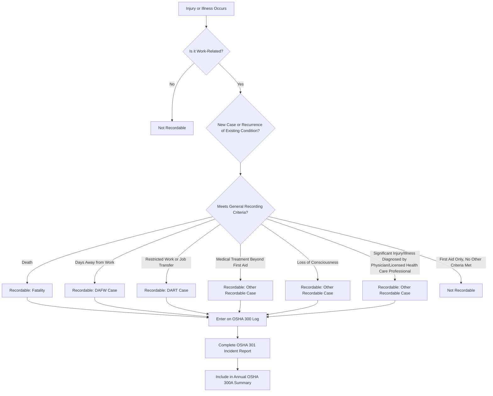

## Occupational Injury and Illness Recordkeeping

### Overview

Occupational Injury and Illness Recordkeeping refers to the systematic documentation requirements established under OSHA's Recordkeeping regulation, 29 CFR 1904, which mandates that covered employers record work-related injuries and illnesses meeting specific severity or treatment criteria. This recordkeeping system serves multiple purposes: it provides the underlying data for lagging indicator calculations (TRIR, DART rate), supports OSHA's national injury/illness surveillance efforts, and creates a documented history that safety professionals use to identify hazard patterns and prioritize corrective action.

Accurate recordkeeping is foundational to credible safety performance measurement; inaccurate or inconsistent recording undermines both internal trend analysis and external regulatory reporting integrity.

### Regulatory Basis and Applicability

- **OSHA 29 CFR 1904**: Establishes recordkeeping and reporting requirements for work-related injuries and illnesses
- **Partial exemptions**: Employers with 10 or fewer employees at all times during the prior calendar year are partially exempt from routine recordkeeping (though still subject to reporting severe events per 1904.39)
- **Industry-based exemptions**: Certain low-hazard industries (primarily in retail, service, finance sectors, as classified by North American Industry Classification System codes) are partially exempt from routine recordkeeping regardless of size, though this exemption does not apply to severe event reporting
- [Inference] These exemptions are based on historical injury/illness rate data by industry classification; specific exempt industry classifications should be verified against the current OSHA partial exemption list, as classifications can be updated based on evolving injury rate data

### Required Recordkeeping Forms

**OSHA Form 300 — Log of Work-Related Injuries and Illnesses**

- The primary running log recording each recordable injury or illness, including case classification (days away, restricted/transferred, other recordable), affected body part, and injury/illness type

**OSHA Form 301 — Injury and Illness Incident Report**

- Detailed individual case report completed for each recordable case, capturing narrative details of how the injury/illness occurred, treatment provided, and other case-specific information

**OSHA Form 300A — Summary of Work-Related Injuries and Illnesses**

- Annual summary of the Form 300 Log data, required to be posted in the workplace annually (typically February 1 through April 30 of the following year) even at establishments with zero recordable cases

### Recordability Determination Process

### General Recording Criteria

**Key Points**

A work-related injury or illness must be recorded if it results in one or more of the following outcomes:

- **Death**
- **Days away from work**
- **Restricted work activity or job transfer**
- **Medical treatment beyond first aid**
- **Loss of consciousness**
- **A significant injury or illness diagnosed by a physician or other licensed health care professional**, even if it does not otherwise meet the above criteria (e.g., certain cases of cancer, chronic irreversible disease, fractured or cracked bones, punctured eardrums)

### Work-Relatedness Determination

An injury or illness is considered work-related if an event or exposure in the work environment either caused or contributed to the condition, or significantly aggravated a pre-existing condition, unless a specific exception applies. Notable exceptions where a case is not considered work-related, even though it occurred in the work environment, include (among others specified in 1904.5(b)(2)):

- The employee was present as a member of the general public rather than as an employee
- The injury/illness resulted solely from voluntary participation in a wellness program, blood donation, or recreational activity
- The condition resulted from eating, drinking, or preparing food for personal consumption
- The condition is purely psychological, resulting solely from an employee's own perception that their job is stressful (a narrow exception distinct from work-related mental health conditions that meet other established criteria)
- Symptoms surfaced at work but resulted solely from a non-work-related event or exposure occurring away from work

### First Aid vs. Medical Treatment Distinction

This distinction is central to determining recordability for many minor injury cases:

| First Aid (Generally Not Recordable) | Medical Treatment Beyond First Aid (Generally Recordable) |
| --- | --- |
| Non-prescription medication at non-prescription strength | Prescription medication, or prescription-strength non-prescription medication |
| Cleaning, flushing, or soaking surface wounds | Wound closure with sutures, staples, or similar devices |
| Using wound coverings (bandages, gauze pads) | Removal of foreign bodies from the eye requiring more than irrigation |
| Hot/cold therapy | Application of a rigid means of support (splint, cast) |
| Non-rigid means of support (elastic bandages, wraps) | Physical therapy or chiropractic treatment |
| A single dose of an over-the-counter tetanus immunization | Any treatment requiring one or more follow-up visits for the purpose of medical treatment |

[Inference] This first aid/medical treatment distinction requires careful case-by-case evaluation, since determination depends on the specific treatment actually rendered rather than the apparent severity of the injury alone; a seemingly minor injury treated with a prescription medication would be recordable, while a more painful-appearing injury treated only with over-the-counter remedies and rest may not meet recordability criteria.

### Days Away, Restricted, or Transferred (DART) Cases

**Days Away From Work (DAFW)**

- Cases where the employee is unable to work one or more days beyond the day of injury/illness onset
- Day counts continue through calendar days, including weekends and holidays, not just scheduled workdays

**Restricted Work or Job Transfer**

- Cases where the employee is assigned to work other than their routine job duties, or is unable to perform all routine job functions, for one or more days beyond the day of injury/illness onset

### Severe Injury and Fatality Reporting Requirements (Separate from Routine Recordkeeping)

Under 29 CFR 1904.39, employers must report certain severe events directly to OSHA within specified timeframes, regardless of the size or industry exemption status that might otherwise apply to routine recordkeeping:

- **Fatalities**: Must be reported within 8 hours of the employer learning of the event
- **In-patient hospitalizations, amputations, or loss of an eye**: Must be reported within 24 hours of the employer learning of the event

[Unverified] Specific reporting mechanisms (phone, online portal) and precise definitional boundaries for what constitutes a reportable hospitalization or amputation should be verified against current OSHA guidance, as these procedural details are subject to administrative updates.

### Electronic Recordkeeping Submission Requirements

Certain establishments are required to electronically submit injury and illness data to OSHA on an annual basis, with specific form and threshold requirements varying based on establishment size and industry classification.

[Unverified] Electronic submission requirements (which forms are required, applicable establishment size thresholds, and submission deadlines) have been subject to periodic regulatory revision; current OSHA guidance on electronic recordkeeping (ITA — Injury Tracking Application) requirements should be consulted for the applicable current-year obligations, as this content should not be relied upon for precise current submission compliance.

### Recordkeeping Program Elements

**Key Points**

- **Designated recordkeeper**: A knowledgeable individual responsible for making recordability determinations and maintaining accurate logs
- **Timely case entry**: Recordable cases must be entered onto the OSHA 300 Log within a specified number of days (per 1904.29) of receiving information that a recordable case has occurred
- **Record retention**: OSHA 300 Logs, 300A Summaries, and 301 Incident Reports must be retained for a specified minimum number of years (per 1904.33) following the end of the calendar year they cover
- **Employee involvement provisions**: Employers must establish a reasonable procedure for employees to report injuries/illnesses promptly, and this procedure must not deter or discourage reporting
- **Privacy case designation**: Certain sensitive injury/illness types (e.g., involving reproductive organs, sexual assault, mental illness, HIV/AIDS status, or other conditions specified in 1904.29) require the employee's name be withheld from the log, replaced with "privacy case"

### Example: Recordability Determination for a Workplace Injury

An employee slips and falls, injuring their wrist. The evaluation for recordability proceeds as follows:

1. **Work-relatedness**: Confirmed, as the fall occurred during normal work activity in the employer's facility.
2. **Treatment rendered**: The employee is evaluated by an occupational health physician, who orders an X-ray, diagnoses a wrist sprain (not a fracture), and prescribes an over-the-counter strength anti-inflammatory but recommends the employee take one day off work to rest before returning to modified duty for the following three days.
3. **Recordability determination**: Because the case resulted in both a day away from work and subsequent restricted duty, it meets recordability criteria as a DART case (with the days-away portion recorded first, followed by the restricted-duty portion, per specific OSHA case classification hierarchy rules).
4. **Documentation**: The case is entered on the OSHA 300 Log with appropriate case classification, a Form 301 Incident Report is completed with narrative detail, and the case is reflected in the following year's Form 300A Annual Summary.

### Common Recordkeeping Pitfalls

- Misclassifying medical treatment (e.g., prescription medication, sutures) as first aid, resulting in under-recording of cases that should appear on the log.
- Failing to count calendar days (rather than only scheduled workdays) when determining days away from work or restricted duty.
- Inconsistent work-relatedness determinations across similar cases, undermining data reliability for trend analysis.
- Discouraging or creating barriers to injury reporting (whether through policy or informal supervisory pressure), which violates the requirement for a reasonable, non-deterring reporting procedure and can result in significant underreporting of the true injury/illness rate.
- Failing to timely report severe injuries (fatalities, hospitalizations, amputations) within the required OSHA notification windows.
- Neglecting the annual Form 300A posting requirement, including the requirement to post even when zero recordable cases occurred during the year.
- Failing to apply privacy case designation for injury/illness types requiring it, inadvertently disclosing sensitive employee health information on a document with broader internal visibility.

### Integration with Broader Safety Performance Measurement

- **Leading and Lagging Indicators**: OSHA 300 Log data is the direct source for calculating TRIR, DART rate, and related lagging indicator metrics.
- **Incident Investigation**: Recordable case data drives incident investigation prioritization and trend analysis to identify recurring hazard patterns.
- **Process Safety Performance Metrics**: For PSM-covered facilities, certain recordable injuries associated with a loss of containment event also factor into Tier 2 process safety event classification under frameworks such as API RP 754.
- **Hazard Identification and Job Hazard Analysis**: Recurring injury patterns identified through recordkeeping data review should feed back into hazard identification and JHA prioritization processes.

**Next Steps**

- Leading and Lagging Indicators
- Incident Investigation and Root Cause Analysis
- Process Safety Performance Metrics per API RP 754
- Job Hazard Analysis Methodology
- Employee Right to Know Training
- Medical Surveillance Program Design