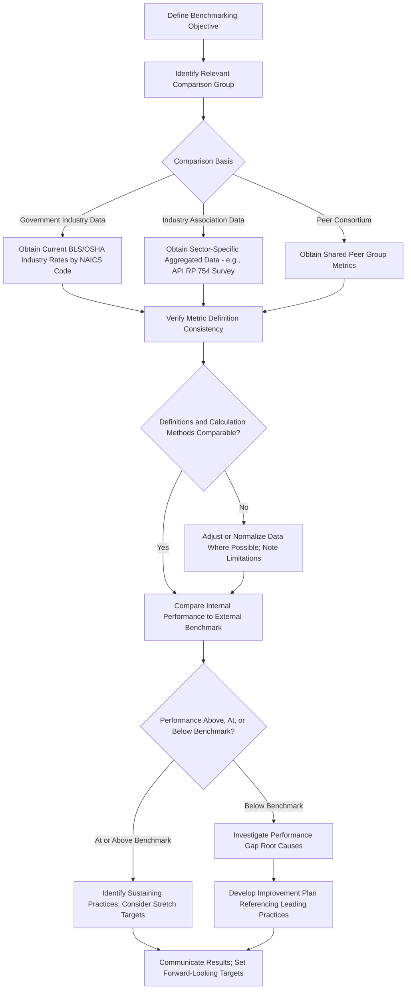

## Benchmarking and Industry Comparisons

### Overview

Benchmarking and industry comparisons involve evaluating an organization's safety performance metrics against external reference points—industry averages, peer companies, regulatory data, or recognized best-practice standards—to contextualize internal performance and identify improvement opportunities. While internal trend analysis reveals whether an organization's own safety performance is improving or declining over time, benchmarking answers a different question: how does this performance compare to what similar organizations, facing similar hazards, are achieving. Effective benchmarking requires careful attention to data comparability, since superficially similar metrics can be calculated or reported using different methodologies across organizations and industries.

### Purposes of Safety Benchmarking

**Key Points**

- Contextualizing internal performance trends against external reference points, since an internally improving trend may still lag significantly behind industry peers
- Identifying realistic improvement targets grounded in demonstrated achievable performance rather than arbitrary internal goals
- Supporting resource allocation and business case justification for safety program investment
- Satisfying external reporting expectations from regulators, insurers, customers, or investors who may request industry-comparative context
- Identifying leading practices from top-performing peer organizations or industry sectors that could be adapted internally

### Primary Sources of Benchmarking Data

**Government and Regulatory Data**

- **Bureau of Labor Statistics (BLS)**: Publishes annual industry-specific injury and illness rate data (incidence rates by North American Industry Classification System code), providing the most widely referenced external benchmark for TRIR and DART rate comparisons in the United States
- **OSHA Injury Tracking Application (ITA) data**: Establishment-specific data submitted electronically by covered employers, which OSHA has made available in varying forms for public analysis

**Industry Association Data**

- **API RP 754 Annual Process Safety Event Survey**: Aggregated Tier 1 and Tier 2 process safety event data across participating refining and petrochemical companies, providing sector-specific process safety benchmarking distinct from general BLS occupational injury data
- Trade association-specific safety performance surveys and benchmarking reports (varying significantly by industry sector)

**Insurance and Risk Management Data**

- Workers' compensation experience modification rate (EMR) data, providing a risk-adjusted comparative measure influenced by both claims frequency and severity relative to industry expectations

**Peer Networks and Consortiums**

- Voluntary industry safety consortiums and peer benchmarking groups that share standardized metrics among participating member organizations, often providing more granular or timely comparison than annually published government statistics

### Benchmarking Process Workflow

### Critical Data Comparability Considerations

**Key Points**

- **Industry classification accuracy**: Comparing performance against the correct NAICS code is essential, since injury/illness rate expectations vary substantially even within broadly similar sectors
- **Recordkeeping consistency**: Organizations with more conservative (more inclusive) recordability determination practices will show higher rates than organizations with less conservative practices, even if actual underlying safety performance is equivalent — a critical limitation when comparing across companies with potentially differing recordkeeping cultures
- **Workforce composition differences**: Differences in contractor versus employee workforce mix, shift patterns, or task composition can affect comparability even within the same industry classification
- **Reporting period alignment**: Ensuring comparison data covers equivalent time periods, since safety performance can exhibit seasonal or cyclical patterns
- **Company size and scale effects**: Smaller organizations may show more volatile rate fluctuations due to lower total exposure hours, where a single incident produces a larger statistical rate swing than the same incident would in a larger organization

[Inference] Because recordkeeping conservatism varies across organizations despite following the same underlying regulatory definitions, a lower reported TRIR does not necessarily indicate genuinely superior safety performance; it may in some cases reflect more permissive recordability interpretation, which is why sophisticated benchmarking efforts often supplement lagging indicator comparison with leading indicator or program maturity assessment.

### Types of Benchmarking Comparisons

| Comparison Type | Description | Typical Use |
| --- | --- | --- |
| Industry average | Comparison against published sector-wide averages (e.g., BLS NAICS data) | Broad performance contextualization |
| Best-in-class/top quartile | Comparison against top-performing organizations within the sector | Stretch target-setting, identifying leading practices |
| Peer group/consortium | Comparison against a curated, self-selected group of similar organizations | More granular, often more timely comparison than government data |
| Historical/internal trend | Comparison against the organization's own prior performance over time | Distinct from external benchmarking but often presented alongside it |
| Cross-facility/business unit | Comparison across multiple sites within the same organization | Internal best-practice identification and resource allocation |

### Process Safety-Specific Benchmarking

For process safety performance, benchmarking follows a somewhat different structure than general occupational injury benchmarking, given the API RP 754 tiered framework. Tier 1 and Tier 2 indicators are standardized specifically to enable nationwide public reporting and industry benchmarking, while Tier 3 and Tier 4 indicators, being company-defined, are generally not directly comparable across organizations without significant normalization, since companies select their own specific Tier 3/4 metrics tailored to their unique operations.

[Inference] This structural design—standardizing only the most lagging tiers (1 and 2) for cross-industry benchmarking while leaving leading indicators company-specific—reflects a recognition that meaningful leading indicator selection is highly context-dependent, making universal standardization for benchmarking purposes less practical than for the more objectively defined loss-of-containment event tiers.

### Example: Benchmarking Analysis for a Chemical Manufacturing Facility

A chemical manufacturing facility conducts an annual benchmarking review of its safety performance:

1. **TRIR/DART benchmarking**: The facility's TRIR of 2.1 is compared against the current published BLS industry average for its specific NAICS code within chemical manufacturing, revealing performance modestly better than the published industry average.
2. **Process safety benchmarking**: The facility participates in its industry association's annual process safety event survey, comparing its Tier 1 and Tier 2 event counts against aggregated peer company data, identifying that its Tier 2 event rate is somewhat elevated relative to peer median performance.
3. **Root cause investigation**: Given the elevated Tier 2 rate relative to peers, the facility undertakes an internal review to determine whether specific equipment classes or process areas are disproportionately contributing to the elevated event rate.
4. **Leading indicator supplementation**: Recognizing that Tier 3/4 process safety indicators are not directly benchmarkable against peers due to their company-specific nature, the facility instead focuses further internal trend analysis on its own historical Tier 3/4 performance to assess whether recent program changes have improved barrier system integrity.
5. **Target-setting**: Forward-looking targets are established referencing both the external Tier 1/2 benchmark comparison and the facility's own historical trend improvement trajectory.

### Common Benchmarking Pitfalls

- Comparing metrics across organizations without verifying underlying calculation methodology and recordability determination consistency, leading to invalid or misleading comparisons.
- Using an incorrect or overly broad industry classification code, comparing performance against a reference group with substantially different inherent hazard profiles.
- Treating a favorable comparison to industry average as confirmation that no further improvement is needed, rather than considering top-quartile or best-in-class performance as the more meaningful improvement target.
- Attempting direct cross-company comparison of company-specific Tier 3/4 process safety indicators, which are not designed for standardized cross-organizational benchmarking.
- Overlooking company size and statistical volatility effects when comparing rate-based metrics between organizations of substantially different scale.
- Relying on outdated benchmark data rather than the most current published industry statistics, particularly in sectors experiencing significant safety performance shifts.

### Integration with Broader Safety Performance Measurement

- **Leading and Lagging Indicators**: Benchmarking typically applies most directly to standardized lagging indicators (TRIR, DART, Tier 1/2 PSEs), while leading indicator benchmarking is more limited by data standardization constraints.
- **Occupational Injury and Illness Recordkeeping**: Recordkeeping data accuracy and consistency directly determine the validity of any subsequent lagging indicator benchmarking exercise.
- **Process Safety Performance Metrics per API RP 754**: Provides the specific standardized framework enabling process safety benchmarking within the refining and petrochemical sector.
- **Safety Culture Assessment**: Benchmarking results, particularly unfavorable comparisons, often prompt deeper investigation into underlying safety culture and management system factors rather than surface-level metric adjustment alone.

**Next Steps**

- Leading and Lagging Indicators
- Occupational Injury and Illness Recordkeeping
- Process Safety Performance Metrics per API RP 754
- Safety Culture Assessment and Improvement
- Incident Investigation and Root Cause Analysis
- Continuous Improvement in Safety Management Systems