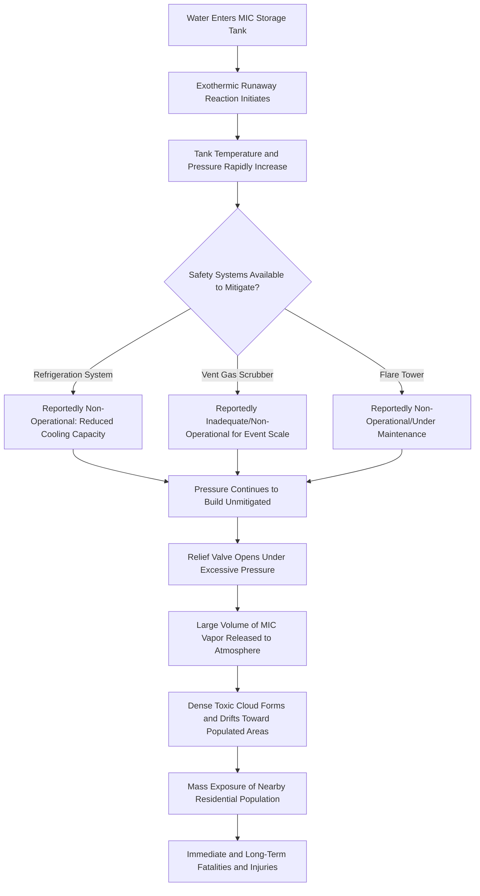

## Bhopal Gas Disaster

### Overview

The Bhopal Gas Disaster, which occurred on the night of December 2–3, 1984, at the Union Carbide India Limited (UCIL) pesticide manufacturing plant in Bhopal, Madhya Pradesh, India, stands as one of the deadliest industrial accidents in history. A massive release of methyl isocyanate (MIC) gas escaped from a storage tank, forming a dense toxic cloud that spread over densely populated areas surrounding the plant. The disaster resulted in thousands of immediate deaths and long-term health consequences affecting hundreds of thousands of people, fundamentally shaping the subsequent development of process safety management regulation and practice worldwide, most directly influencing the creation of OSHA's Process Safety Management standard (29 CFR 1910.119) in the United States.

[Unverified] Specific casualty figures for the Bhopal disaster have varied significantly across different sources and over time, with estimates for immediate deaths, subsequent deaths, and total affected population differing based on methodology and source; readers seeking precise current figures should consult authoritative historical and governmental sources, as this content focuses on the causal and safety-lesson aspects of the incident rather than presenting a single definitive casualty count.

### Background: The Process and Materials Involved

The UCIL plant manufactured the pesticide Sevin (carbaryl), using methyl isocyanate as a key intermediate chemical. MIC is an extremely toxic and reactive substance: it is highly volatile, reacts violently and exothermically with water, and even brief exposure at relatively low airborne concentrations can cause severe respiratory damage, while higher concentrations can be rapidly fatal.

The plant stored MIC in bulk quantities in underground storage tanks, a decision that, in retrospect, is widely examined in process safety literature as a significant inherent safety concern, since bulk storage of a highly toxic, reactive intermediate represented a substantially greater hazard than either producing MIC on-demand in smaller quantities or storing it in a less hazardous downstream form.

### Sequence of Events Leading to the Release

**Key Points**

- Water entered a MIC storage tank, likely through a maintenance-related connection, initiating an exothermic runaway reaction between water and MIC
- The reaction generated substantial heat and pressure, rapidly increasing tank temperature and pressure beyond safe operating limits
- Several safety systems intended to prevent or mitigate such a release were reportedly non-functional or inadequate at the time of the incident, including refrigeration systems (which would have kept the MIC at lower, safer temperature), a vent gas scrubber (intended to neutralize escaping gas), and a flare tower (intended to burn off escaping gas)
- The resulting pressure buildup caused a relief valve to open, releasing a large quantity of MIC vapor directly into the atmosphere over a period of time
- The released gas, being denser than air, settled and spread low to the ground, drifting into adjacent densely populated residential areas where many people were asleep at the time of the release

### Incident Causal Chain

### Contributing Factors Identified in Subsequent Analysis

**Design and Engineering Factors**

- Bulk storage of a highly hazardous, reactive intermediate chemical in large quantities, rather than minimizing inventory through inherently safer design principles
- Insufficient redundancy and reliability of the safety systems (refrigeration, scrubber, flare) intended to prevent or mitigate a release

**Maintenance and Operational Factors**

- Reports indicating inadequate maintenance practices and reduced operational readiness of critical safety systems in the period leading up to the incident
- [Inference] Broader organizational and economic pressures affecting the facility's operational and maintenance investment during this period have been widely discussed in subsequent analyses, though specific causal attribution for individual system failures involves complex, disputed historical and legal findings beyond the scope of a purely technical safety summary

**Community and Land-Use Planning Factors**

- Significant residential development had occurred in close proximity to the industrial facility over time, meaning a substantial population was directly exposed to the released gas cloud
- [Inference] This proximity factor highlights a broader lesson regarding the importance of land-use planning and buffer zones around facilities handling highly hazardous chemicals, a principle subsequently emphasized in various regulatory and voluntary process safety frameworks internationally

**Emergency Response and Community Awareness Factors**

- Reports indicate limited community awareness of the specific hazards present at the facility and limited pre-established emergency response coordination between the facility and surrounding community
- This gap is frequently cited as a key factor amplifying the human toll of the release, since a community with greater hazard awareness and established emergency response protocols may have been able to take some protective action more rapidly

### Immediate and Long-Term Consequences

**Key Points**

- Thousands of deaths occurred in the immediate aftermath of the gas release, with additional deaths and health effects continuing to be documented in subsequent years and decades
- Long-term health effects reported among survivors and affected populations include respiratory, ophthalmological, reproductive, and other systemic health impacts
- The disaster prompted extensive, prolonged legal proceedings regarding liability, compensation, and site remediation that continued for decades following the event
- Environmental contamination at and around the former plant site has remained a subject of ongoing concern and remediation discussion

[Unverified] Specific figures regarding total affected population, confirmed long-term health outcome statistics, and the current status of site remediation and legal proceedings should be verified against current authoritative sources, as these matters have evolved substantially over the decades since the incident and remain subject to ongoing developments.

### Direct Influence on Process Safety Regulation and Practice

The Bhopal disaster is widely credited as a primary catalyst for the development of modern process safety management regulatory frameworks:

- **OSHA Process Safety Management Standard (29 CFR 1910.119)**: Developed in the years following Bhopal, establishing comprehensive requirements for facilities handling highly hazardous chemicals, including process hazard analysis, mechanical integrity, management of change, and emergency planning
- **EPA Risk Management Program (40 CFR Part 68)**: Complementary regulatory framework addressing accidental release prevention for facilities handling regulated substances
- **Emergency Planning and Community Right-to-Know Act (EPCRA)**: Established in response to Bhopal and related concerns, requiring facilities to disclose hazardous chemical inventories to local communities and emergency responders, directly addressing the community awareness gap identified in the Bhopal investigation
- **Inherently Safer Design (ISD) principles**: The disaster significantly reinforced the process safety principle of minimizing hazardous material inventory, substituting less hazardous materials where feasible, and designing systems to be inherently safer rather than relying solely on layers of protective/mitigative safety systems

### Key Process Safety Lessons Drawn from Bhopal

| Lesson Category | Specific Lesson | Modern Regulatory/Practice Reflection |
| --- | --- | --- |
| Inherently safer design | Minimize inventory of highly hazardous intermediates where feasible | ISD principles embedded in modern PHA methodology |
| Safety system reliability | Critical safety systems (cooling, scrubbing, flaring) must be maintained in verified operational readiness | Mechanical integrity program requirements under PSM |
| Redundancy and layers of protection | Reliance on a single safety system layer is insufficient for highly hazardous processes | Layers of Protection Analysis (LOPA) methodology |
| Community right-to-know | Surrounding communities and emergency responders require hazard information and coordinated emergency planning | EPCRA and facility emergency planning requirements |
| Management of change and maintenance discipline | Operational and maintenance changes must be evaluated for safety impact before implementation | Management of Change (MOC) program requirements |
| Human factors and organizational pressure | Economic and organizational pressures can degrade safety system maintenance and operational discipline over time | Emphasis on safety culture and management commitment within modern PSM frameworks |

### Application to Modern Process Safety Practice

**Example**: A modern facility handling a highly toxic, reactive intermediate chemical would apply lessons drawn from Bhopal through several concrete measures:

1. **Inherently safer design review**: Evaluating whether the hazardous intermediate can be produced and consumed continuously in smaller quantities rather than accumulated in large bulk storage.
2. **Redundant and verified safety systems**: Ensuring that critical mitigation systems (refrigeration, scrubbing, relief/flare systems) are designed with appropriate redundancy and subject to rigorous mechanical integrity testing and verification schedules.
3. **Community emergency planning**: Coordinating with local emergency responders and providing hazard information to surrounding communities consistent with EPCRA requirements, including joint emergency response exercises.
4. **Process Hazard Analysis**: Conducting thorough PHA specifically evaluating runaway reaction scenarios, water contamination pathways, and other credible upset conditions for reactive chemical storage and handling.
5. **Management of Change discipline**: Ensuring that any operational, staffing, or maintenance schedule changes affecting safety-critical systems undergo formal safety review before implementation.

### Common Misapplications of Bhopal's Lessons

- Treating Bhopal purely as a historical case study without translating its specific technical lessons (inventory minimization, safety system reliability, community right-to-know) into concrete current facility practices.
- Focusing exclusively on the immediate technical failure (water ingress into the MIC tank) without addressing the broader systemic factors (maintenance discipline, safety system readiness, community planning) that amplified the consequence.
- Assuming modern regulatory frameworks (PSM, RMP, EPCRA) alone are sufficient without genuine organizational commitment to the underlying safety culture and inherently safer design principles those frameworks were created to encourage.

### Integration with Broader Process Safety Management

- **Process Hazard Analysis Methodology**: Bhopal-informed lessons regarding reactive chemical hazards and runaway reaction scenarios directly inform modern PHA methodology emphasis on these hazard types.
- **Inherently Safer Design**: The disaster remains a foundational case study supporting the inventory minimization and hazard substitution principles central to ISD practice.
- **Emergency Planning and Community Right-to-Know**: EPCRA's community disclosure requirements trace directly to gaps identified in the Bhopal response.
- **Mechanical Integrity Programs**: The failure of critical safety systems at Bhopal underscores the ongoing importance of rigorous mechanical integrity verification for safety-critical equipment.

**Next Steps**

- Process Hazard Analysis Methodology
- Inherently Safer Design Principles
- Emergency Planning and Community Right-to-Know Act (EPCRA)
- Mechanical Integrity Programs
- Management of Change (MOC) Procedures
- BP Texas City Refinery Explosion