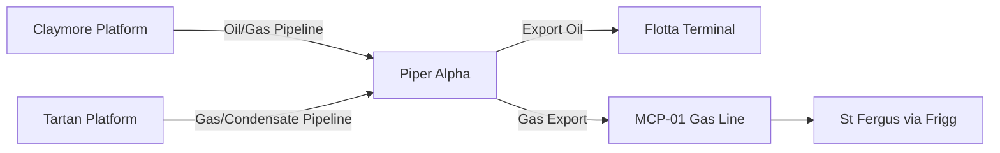
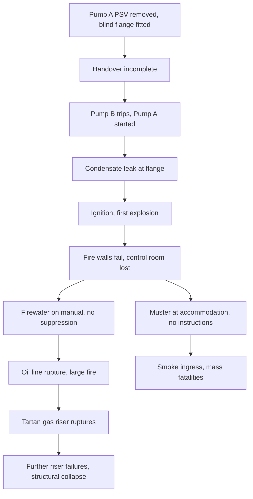

## Piper Alpha Platform Explosion

**Overview**

Piper Alpha was an oil and gas production platform in the North Sea, roughly 120 miles (about 190 km) northeast of Aberdeen, Scotland, operated by Occidental Petroleum (Caledonia) Ltd. On the night of 6 July 1988, a series of explosions and fires destroyed the platform within about two hours. Of the 226 people on board, 165 died, along with 2 crew members of a rescue vessel, giving a total of 167 fatalities. Only 61 people survived. It remains the deadliest offshore oil and gas disaster in history, and its investigation reshaped offshore safety regulation worldwide.

**Key Points**

- Piper Alpha was an integrated production, processing, and accommodation platform, later modified to export gas as well as oil.
- The initiating event was the startup of a pump that had been isolated for maintenance, with its relief valve removed and replaced by an inadequately secured blind flange.
- Failures in the permit-to-work (PTW) system, shift handover, and management of simultaneous operations were the central causes.
- The design layout allowed a condensate explosion to breach fire walls, rupture gas risers, and disable the control room, emergency power, and evacuation routes.
- The public inquiry led by Lord Cullen (1988 to 1990) produced 106 recommendations, leading to the goal-setting "safety case" regime in the UK.

---

### Platform Background

**Function and Layout**

Piper Alpha began production in 1976 as an oil-only platform. In the early 1980s it was modified to export gas condensate and to receive gas from other installations. These modifications placed gas compression equipment in an area originally designed for oil processing.

- Platform was arranged in four decks or modules (A through D), with production modules stacked in a compact layout.
- Module B held the crude oil separation equipment (the Piper and Tartan crude handling).
- Module C contained gas compression and condensate handling, including the condensate injection pumps.
- The control room, radio room, and accommodation were positioned close to the production modules.
- Fire walls between modules were rated for fire, not blast; they had been designed for an oil platform, not for the gas-handling duty added later.

**Interconnection with Other Installations**

Piper Alpha was tied by pipeline to Claymore, Tartan, and the MCP-01 gas gathering line. This meant that gas and oil from neighboring platforms continued to flow into Piper after the first explosion, feeding the fires. This was a critical factor in how long and how intensely the fires burned.

**Diagram: Simplified Platform Interconnection (text form)**

---

### Sequence of Events

**Day Shift (6 July 1988)**

Two condensate injection pumps, A and B, operated in Module C. Pump A was shut down for scheduled maintenance because it was due for overhaul.

- Maintenance work on Pump A required removal of its pressure safety valve (PSV 504) for recertification.
- The PSV was removed and its open pipework was fitted with a blind flange (a simple metal cover plate), which was tightened but not leak-tested; the flange was assembled by contract personnel.
- The maintenance job was not completed by the end of the day shift. A permit-to-work for the PSV work was suspended, and the paperwork was placed in the control room.
- The separate permit for the pump overhaul stated that the pump was not to be operated. The fact that the PSV had been removed was not communicated to the night shift, because the two permits were held in different locations and the handover communication was inadequate.

**Night Shift: Loss of Pump B and Startup of Pump A**

At about 21:45, Pump B tripped. The night shift operators needed condensate injection restored to avoid disrupting production.

- The lead operators could not find any record showing that Pump A was unavailable. The permit associated with the PSV removal was in a different place from the pump permit.
- Believing Pump A was ready, they started it at about 21:45.
- Condensate leaked from the temporarily blanked-off flange where the PSV had been removed.

**Initial Explosion and Escalation**

At approximately 22:00 a low-pressure condensate release ignited, causing a first explosion that severely damaged the module.

- The blast destroyed the fire walls (which had not been designed to withstand explosion loads) and knocked out the control room.
- Automatic fire-detection and deluge (firewater) systems were compromised. The diesel firewater pumps were set to manual mode because divers were working in the water, to avoid the pumps' suction endangering them; this was standing practice and the pumps could not be started automatically. The pump room itself was damaged, and the personnel who might have started them manually were unable to reach them.
- The first fire ruptured a crude oil line, feeding a large oil fire.

**Subsequent Explosions**

The interconnection with other platforms meant that oil and gas kept flowing into Piper for a considerable time:

- Tartan's gas pipeline ruptured at about 22:20, producing a massive fireball from the riser.
- Claymore and other platforms continued to export to Piper because their operators lacked authority or clarity to stop, and because the Piper control room, which normally coordinated this, was out of action.
- Further riser ruptures (from the MCP-01 line) intensified the fire, and the platform structure eventually weakened; the accommodation module collapsed into the sea.

**Evacuation Failure**

- The main muster point was the accommodation block; the majority of personnel gathered there, waiting for instructions that never came because the control room and public address system had failed.
- Smoke and heat prevented lifeboat and helicopter evacuation; helicopters could not land, and the lifeboats were inaccessible or unusable.
- Some personnel chose to jump from platform heights of up to about 175 feet (roughly 53 m) into the sea; many survivors escaped this way. Others died of smoke inhalation in the accommodation.

---

### Causes

**Direct (Immediate) Causes**

| Cause | Description |
| --- | --- |
| Ignition of condensate leak | Condensate escaping from the unsecured flange ignited |
| Startup of Pump A | Pump was started with its PSV removed and only a blind flange in place |
| Inadequate flange seal | The blind flange had not been leak-tested or properly secured |
| Failed containment | Fire walls could not withstand explosion pressure |

**Underlying (Root) Causes**

- **Permit-to-work failures**: Permits were not integrated; the status of Pump A and its PSV was recorded across separate documents, and personnel did not check both. Lord Cullen found that PTW was operated in a routine, unstructured way.
- **Shift handover**: Handover between the day and night lead operators did not clearly communicate that Pump A was unavailable.
- **Management of simultaneous operations (SIMOPS)**: Maintenance and production continued together without adequate hazard review.
- **Organizational culture**: Management was found to have been complacent about safety, with shortcomings in training, auditing, and follow-up of prior incidents. Senior management's safety visits were not effective.
- **Design and modifications**: Change management was weak; production changes were made without thorough re-assessment of fire and blast risk.
- **Emergency preparedness**: Firewater pumps were on manual, evacuation procedures were not practiced realistically, and no one was clearly in charge of decisions once the control room was lost.

---

### Investigation and Cullen Inquiry

**The Public Inquiry**

The UK government appointed Lord Cullen, a Scottish judge, to lead the Public Inquiry. It ran from 1988 to 1990, and the report ("The Public Inquiry into the Piper Alpha Disaster") was published in November 1990.

- The inquiry examined the technical cause, the operating company's management, and the regulatory framework.
- It found that the regulatory regime, then administered by the Department of Energy, had conflicting duties (promoting production while regulating safety) and used a prescriptive approach that was inadequate.
- It criticized Occidental for the failures in PTW, handover, and safety management, and criticized the regulator for insufficient inspection.

**Key Recommendations**

- Transfer offshore safety regulation to the Health and Safety Executive (HSE), separating it from the department responsible for promoting oil production.
- Move to a goal-setting regime in which operators must demonstrate through a **safety case** that they have identified major hazards and controlled risks to a level that is "as low as reasonably practicable" (ALARP).
- Require formal safety assessment, including quantitative risk assessment where appropriate.
- Improve emergency response: ensure the availability of a temporary safe refuge (TSR), reliable evacuation and escape routes, and command structures that continue functioning when the primary control point is lost.
- Strengthen PTW, handover, and management of change controls.

---

### Regulatory Outcomes

**UK Offshore Safety Case Regime**

The Offshore Installations (Safety Case) Regulations 1992 introduced the requirement for operators to submit a safety case to HSE before operating an installation. Subsequent regulations (for example, the Prevention of Fire and Explosion, and Emergency Response Regulations 1995 (PFEER), the Offshore Installations and Wells (Design and Construction, etc.) Regulations 1996) addressed fire, explosion, and emergency response specifically. Details of the current consolidated regime may differ by year and amendment; verify against current HSE guidance.

**Influence Beyond the UK**

- The safety case approach influenced regimes in Norway, Australia, and elsewhere.
- Lessons fed into onshore process safety management, including concepts later formalized in the OSHA PSM standard (29 CFR 1910.119) and the European Seveso regulations. [Inference: the direct causal link between Piper Alpha and specific clauses of OSHA PSM is partial, as the U.S. standard was also driven by other incidents such as Bhopal and Phillips 66 (1989), and the precise attribution varies by source.]

---

### Process Safety Lessons

**1. Permit-to-Work**

A PTW system must:

- Provide a single, clear record of the state of each piece of equipment.
- Ensure that all related permits (for example, for a pump and for its safety valve) are cross-referenced.
- Require positive isolation and physical tagging of isolated equipment.
- Require that suspended or incomplete work is clearly communicated and that equipment is not returned to service without confirmation of its status.

**2. Shift Handover**

- Handover should be structured, ideally face-to-face and documented.
- The state of all equipment under maintenance, including any safety-critical devices removed, must be explicitly communicated.

**3. Management of Change (MOC)**

- Modifications to a facility, including adding gas processing to an oil platform, require a formal hazard review of the revised risks: layout, blast loading, escalation, and emergency systems.

**4. Safety-Critical Elements and Layout**

- Fire and blast walls, escape routes, muster areas, and control rooms must be designed against credible major-accident scenarios.
- Critical safety functions (emergency shutdown, firewater, communications) should be resilient to loss of a single facility such as the control room.

**5. Emergency Response**

- Firewater pumps in manual mode can defeat automatic protection; the risk trade-off with diver safety must be resolved through alternative safeguards.
- Muster location should be safe from the most credible fire and blast scenarios; instructions should be clear when the command center is lost.
- Evacuation means (lifeboats, helicopters, escape chutes, personal survival equipment) must be diversified and usable under adverse conditions.

**6. Isolation of Hydrocarbon Inventory**

- Pipelines connecting platforms should have emergency shutdown valves capable of remote isolation independently of the main control room, and operators of connected facilities must have clear authority to shut in production during an emergency.

**7. Safety Culture and Leadership**

- Senior management should verify actual practice, not only paperwork, through effective audit, incident follow-up, and workforce engagement.

---

### Barrier Analysis

The "Swiss cheese" view of the incident shows multiple barriers failing simultaneously:

| Barrier | Intended Function | Failure |
| --- | --- | --- |
| Permit-to-work | Prevent operation of isolated equipment | Permits not integrated; status unclear |
| Shift handover | Communicate equipment state | Incomplete communication |
| Flange integrity | Contain condensate | Not leak-tested |
| Gas detection and ESD | Detect and stop releases | Overwhelmed or damaged by blast |
| Fire walls | Limit escalation | Not blast-rated |
| Firewater deluge | Suppress fire | Pumps on manual, damaged |
| Isolation of pipelines | Stop inventory feed | Delayed or not performed |
| Evacuation | Remove personnel | Routes and lifeboats unusable |

**Diagram: Escalation Timeline (text form)**

---

### Practical Application

**Example: Auditing a Permit-to-Work System Using Piper Alpha Lessons**

An auditor reviewing a facility's PTW system can use the following checklist:

1. Are permits for related equipment cross-referenced (for example, a pump and its relief valve)?
2. Is there a central register showing all active and suspended permits?
3. Is physical isolation (locks and tags) verified before work starts?
4. Is there a defined process for suspended jobs, including tagging of partially reassembled equipment?
5. Does the shift handover procedure require review of the permit register?
6. Is there a check that no equipment with a permit suspended is restarted without formal reinstatement?
7. Are contractors trained and audited to the same standard?

**Example: Risk Screening for Simultaneous Operations**

$$R = P \times C$$

where $R$ is the risk level, $P$ is the likelihood of an event, and $C$ is its consequence. For SIMOPS, teams may review combined-activity scenarios (for example, hot work near hydrocarbon handling) and rate $P$ and $C$ against a matrix before authorizing concurrent work. The values used are site-specific and should be defined by the operator's risk matrix.

---

### Facts vs. Uncertainty

- The fatality figures (167 total, 165 on the platform plus 2 rescue crew, 61 survivors) are widely cited from the Cullen report.
- The exact sequence of some sub-events (for example, which specific riser failed at which minute) is reconstructed from survivor testimony and forensic analysis; the timings vary slightly between sources.
- [Inference] The exact reason the day-shift lead did not communicate the missing PSV is not fully resolved; Cullen found that the handover was inadequate but attributions of individual fault are a matter of the inquiry's findings, which some participants disputed.

**Conclusion**

Piper Alpha demonstrated that catastrophic loss can result from ordinary procedural gaps aligned with design weaknesses and organizational complacency. Its central lessons of integrated permit-to-work, disciplined handover, robust management of change, resilient emergency systems, and effective leadership remain foundational to process safety practice.

**Related Topics**

- Permit-to-Work Systems and Lockout/Tagout
- Management of Change (MOC)
- Safety Case Regimes and ALARP
- Bhopal Gas Tragedy
- Deepwater Horizon Blowout
- Texas City Refinery Explosion
- Fire and Explosion Hazard Analysis for Offshore Facilities
- Safety Culture and Human Factors in Process Safety
- Emergency Response Planning and Evacuation Design