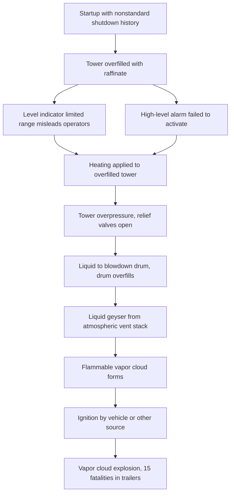

## Texas City Refinery Explosion

**Overview**

On 23 March 2005, a series of explosions and fires occurred at BP's Texas City refinery in Texas City, Texas, during the startup of the isomerization (ISOM) unit's raffinate splitter tower. The incident killed 15 contractors working in or near temporary trailers, injured more than 170 others, and caused substantial economic loss. It remains one of the worst U.S. industrial accidents in decades and a defining case study in process safety management, organizational culture, and the limits of relying on personal injury statistics to gauge process safety performance.

**Key Points**

- The immediate cause was overfilling of a raffinate splitter tower with flammable liquid hydrocarbon during startup, which overpressured the tower and sent liquid to an atmospheric blowdown drum and stack that was not designed to handle it.
- The liquid released from the blowdown stack formed a flammable vapor cloud that ignited, most probably from a nearby idling pickup truck.
- Personnel in occupied trailers located close to the ISOM unit accounted for all 15 fatalities.
- The U.S. Chemical Safety and Hazard Investigation Board (CSB), the Baker Panel, and BP's own investigation all identified failures at the organizational and cultural level, not just operator error.
- The incident led to major changes in siting practice for occupied buildings (API RP 752 and RP 753), in process safety performance indicators (API RP 754), and to record OSHA penalties.

---

### Facility Background

**The Refinery**

The Texas City refinery, located on Galveston Bay, was one of the largest refineries in the United States, with a crude processing capacity on the order of 450,000 barrels per day. BP had acquired it through its merger with Amoco in 1998. [Inference: Cost-cutting pressure following the merger is cited by the CSB and Baker Panel as a contextual factor; the degree to which it caused specific decisions is a matter of interpretation.]

**The Isomerization Unit and Raffinate Splitter**

The ISOM unit upgrades low-octane naphtha into higher-octane blending components for gasoline. Within it, the raffinate splitter tower separates raffinate (a light hydrocarbon stream, mainly pentanes and hexanes) into light and heavy fractions.

- The tower was approximately 170 feet (about 52 m) tall.
- Feed entered the tower; the light product went overhead and heavy product left from the bottom.
- The bottoms product was routed through a heat exchanger (feed/bottoms exchanger) and then to storage.
- A separate blowdown drum, open to atmosphere through a vent stack, served as the relief destination for the tower's pressure relief valves. The blowdown drum and stack were an old design that had not been upgraded with a flare or closed collection system.

**Occupied Trailers**

Several temporary trailers, used by contractors supporting a turnaround at a nearby unit, were positioned within roughly 120 feet (about 37 m) of the blowdown drum. These trailers were not designed to resist blast loads. Their placement had been approved through a siting evaluation that did not adequately consider the hazard of an atmospheric blowdown release.

---

### Sequence of Events

**Prior Startup and Shutdown Context**

The raffinate splitter had been shut down for maintenance. Startup procedures were being executed with the unit in a non-routine, transient mode of operation, which is one of the highest-risk phases of process operation.

**Overnight Startup Activities (22 to 23 March)**

The night shift began filling the tower with raffinate. The startup procedure called for the level in the tower bottoms to be raised to about 6.5 feet (roughly 2 m) and then held. Several problems developed:

- The level transmitter, a differential-pressure (DP) type, was designed to measure only within a limited range (0 to about 10 feet), which meant that above this range it would not show the true level. The indicator therefore gave the impression that the level was within a normal range even as the tower was overfilled.
- The independent high-level alarm (a separate float or other device) did not sound. It had not been tested or calibrated, and the failure was not detected before startup. [Inference: The fact that it was not functioning is documented; whether earlier inspection would have caught it depends on the maintenance regime.]
- Operators started the feed and left the tower unattended in some periods, and the level was not maintained as per procedure. The startup was interrupted, the unit was left unattended, and the shift was handed over with incomplete and inaccurate information, including the actual amount of feed introduced.

**Day Shift (23 March)**

- The day shift supervisor arrived late (or was absent for part of the critical time), and the shift crew was understaffed. Operators working long hours in extended overtime (12-hour shifts for many consecutive days) contributed to fatigue.
- Startup resumed with the tower already overfilled, but the operators were unaware, as the indicator was reading incorrectly.
- Heat was introduced through the reboiler (furnace). As the liquid heated, it expanded and the level rose further; the tower bottoms were overfilled to roughly 150 feet (about 46 m), by later estimates, filling most of the tower height.
- Simultaneously, the operators did not open the level control valve to send bottoms product to storage, because of procedural and communication issues; the hot bottoms product was not properly sent out, and a flow that would have been cooled by the feed/bottoms exchanger instead heated the incoming feed.

**Release and Ignition**

- The tower pressure increased until the three pressure relief valves opened (at about 40 psig).
- These valves discharged liquid (rather than vapor) through the relief header to the blowdown drum. The drum was not large enough to contain this liquid; it overfilled and liquid raffinate spilled from the stack.
- A geyser of flammable liquid and vapor rose from the stack and formed a vapor cloud spreading around the area.
- The cloud ignited at approximately 13:20, most probably from a running diesel pickup truck idling near the ISOM unit. The resulting vapor cloud explosion destroyed the nearby trailers and caused widespread damage.

**Diagram: Simplified Causal Chain**

---

### Technical Causes

**Equipment and Instrumentation**

| Issue | Description |
| --- | --- |
| Limited-range level transmitter | The measurement range did not cover the actual liquid level during overfill, providing a false sense of normal operation |
| Failed high-level alarm | The independent alarm did not function and had not been proof-tested |
| Blowdown drum and stack | An antiquated atmospheric vent design, not routed to a flare; it could not handle liquid carryover |
| Sight glass and instrument issues | Other level indicators and valve conditions were not reliable or were misinterpreted |
| Control valve operation | Bottoms flow control was in manual with the valve closed, without a clear indication of its status |

**Procedural Issues**

- The startup procedure was outdated, and its steps were not consistently followed. Operators frequently deviated from written procedures, and this was tolerated.
- Startup procedures did not adequately address abnormal situations, such as the one encountered on the day.
- There was no requirement for a thorough verification that all safety-critical instruments were functioning before startup.
- Shift handover documentation was incomplete, and the log did not convey key information (for example, the amount of feed introduced).

**Human Factors**

- Operators had worked many consecutive 12-hour shifts, and fatigue was a factor.
- Staffing was reduced, and the unit lacked adequate supervisory oversight during startup, a critical phase.
- Training on startup and abnormal situation management was insufficient.

---

### Organizational and Management Causes

**Findings of the CSB**

The CSB final report (issued in 2007) concluded that organizational and safety culture problems at the site were a root cause, not merely a background factor. Key findings included:

- BP's corporate management did not provide effective leadership on process safety. Attention was directed at personal injury metrics, and a low personal injury rate at Texas City masked serious process safety deficiencies.
- Cost-cutting and budget constraints reduced investment in maintenance, inspection, and upgrades, including the replacement of outdated blowdown systems.
- The company had not implemented previous recommendations following earlier incidents at the same site, including prior blowdown drum releases and near misses in the same unit. Lessons from earlier events were not adequately learned.
- The management of change (MOC) process was not used to evaluate the risks of placing trailers near the process units, and there was no rigorous evaluation of occupied building siting.

**The Baker Panel**

BP commissioned an independent panel led by former U.S. Secretary of State James A. Baker III, which reported in January 2007. It found that:

- BP had not provided effective process safety leadership at its five U.S. refineries.
- Process safety culture was weak, and there was an over-reliance on personal safety metrics.
- Process hazard analyses (PHAs) and management-of-change practices were insufficient.
- There was a lack of an integrated process safety management system across the company, and the board of directors had limited visibility into process safety performance.

The Baker Panel made 10 recommendations, including establishing process safety leadership at the executive and board level, developing a positive process safety culture, and implementing an integrated and comprehensive process safety management system.

**Personal Safety vs. Process Safety**

Texas City is a classic illustration that low lost-time injury frequency does not indicate control of major hazards. The site had recorded some of its best personal injury statistics in the period leading up to the incident.

$$\text{TRIR} = \frac{\text{Number of recordable injuries} \times 200{,}000}{\text{Total hours worked}}$$

A low TRIR (total recordable incident rate) says little about the integrity of barriers against low-frequency, high-consequence events. Process safety metrics (for example, loss of primary containment events, demands on safety systems, overdue inspections) are needed.

---

### Consequences and Response

**Human and Economic**

- 15 fatalities (all contractors), more than 170 injuries.
- Financial cost to BP exceeded $1.5 billion in settlements, repairs, and related costs by some estimates. [Unverified: total cost figures vary between sources and depend on what is counted.]

**Regulatory and Legal**

- OSHA issued a record penalty at the time (about $21 million) after its investigation, citing hundreds of alleged violations. A later follow-up inspection cited BP for failing to abate earlier findings and resulted in an additional record fine (approximately $87 million in 2009). [Verify exact penalty figures and settlement outcomes against primary OSHA documents.]
- BP pleaded guilty to a federal Clean Air Act violation related to the incident and agreed to a fine and probation.
- The CSB issued recommendations to the American Petroleum Institute (API) to develop guidance on siting of occupied buildings and process safety indicators, and to OSHA and others on rulemaking.

**Industry Standards Developed**

- **API RP 752**: Management of hazards associated with location of process plant permanent buildings.
- **API RP 753**: Management of hazards associated with location of process plant portable buildings.
- **API RP 754**: Process safety performance indicators for the refining and petrochemical industries, which defines a tiered approach (Tier 1 through Tier 4) to leading and lagging indicators.
- **API RP 521**: Guidance on pressure-relieving and depressuring systems, which addresses relief disposal, flares, and blowdown.

---

### Process Safety Lessons

**1. Startup and Shutdown Are High-Risk**

- Transient operations need robust, current, verified procedures, with defined checks, permissive conditions, and staffing.
- Startup should include a formal readiness review (pre-startup safety review, PSSR).

**2. Instrumentation Reliability and Independence**

- Critical measurements must have adequate range and reliability; operators need to know the actual state of the process.
- Independent high-level alarms and interlocks must be tested at defined intervals; an untested safeguard cannot be relied upon.
- Consider layers of protection analysis (LOPA) to evaluate whether independent protection layers are adequate.

**3. Relief and Blowdown System Design**

- Relief discharge should go to a closed system (flare or knockout drum with appropriate capacity) rather than atmospheric vents when flammable liquids may be released.
- Relief scenarios should include liquid overfill, not only vapor relief.

**4. Facility Siting**

- Occupied buildings should be located away from hazardous process units, and portable buildings especially need a documented siting analysis.
- Non-essential personnel should be kept out of hazardous areas during startup.

**5. Learning from Past Incidents**

- Prior blowdown releases at the same site were not treated as warnings. Effective incident investigation, tracking of corrective actions, and sharing of lessons are essential.

**6. Process Safety Culture and Leadership**

- Senior leaders must own process safety performance, dedicate resources, and monitor leading indicators.
- A culture in which deviating from procedures is normalized creates latent hazards.

**7. Fatigue and Staffing**

- Limits on consecutive shifts and hours, plus adequate supervision, particularly in critical operations. API RP 755 addresses fatigue risk management in the refining and petrochemical industries.

---

### Practical Application

**Example: Startup Readiness Checklist Derived from Texas City**

Before starting a distillation tower, a team could verify:

1. All level instruments are calibrated and their measurement range covers the full credible operating range, including overfill.
2. The independent high-level alarm has been function-tested within its scheduled interval, and results are recorded.
3. The startup procedure is current, has been reviewed for the specific unit configuration, and includes hold points and expected values.
4. Relief devices are in place, correct, and discharge to a system capable of handling liquid.
5. Staffing meets the requirement, with supervisory presence and no personnel beyond fatigue limits.
6. Non-essential personnel and portable buildings are outside the hazard zone.
7. Shift handover has documented the exact state of the equipment, including the quantity of material introduced.

**Example: Simple Material Balance Check for Overfill Detection**

An operator can compare the calculated inventory to the indicated level:

$$V_{\text{in}} - V_{\text{out}} = \Delta V$$

If the cumulative volume charged ($V_{\text{in}}$) minus volume withdrawn ($V_{\text{out}}$) implies a level substantially higher than what the level indicator shows, then the indication should be treated as suspect and investigated before continuing. At Texas City, a simple comparison of the total feed introduced against the tower volume would have indicated a serious overfill. [Inference: This is a reconstruction using the incident's reported facts; the practical implementation depends on flow measurement availability.]

**Diagram: Layers of Protection Missed (text form)**

---

### Facts vs. Uncertainty

- The fatality and injury counts (15 killed, more than 170 injured) are consistently reported by the CSB and other official sources.
- The precise ignition source is stated by the CSB as most likely a vehicle engine (a diesel pickup truck) idling nearby, but the investigation could not conclusively prove this. [Inference: it is the most probable of several possibilities.]
- The exact liquid level reached in the tower and specific timings differ slightly between reports; figures cited here are approximations from investigative findings.
- Penalty amounts and financial figures vary by source and by which settlements are included, so they should be verified against primary documents.
- Attribution of the incident to cost-cutting is supported by the CSB and Baker Panel findings but involves judgment about causation.

**Conclusion**

The Texas City explosion showed how a combination of technical deficiencies (inadequate instrumentation, outdated relief disposal), procedural weakness (unreliable startup practice), and organizational failure (misplaced reliance on personal injury metrics, insufficient investment, and poor learning from prior events) can produce a catastrophic outcome. Its enduring value in process safety education lies in demonstrating that major accident prevention requires sustained leadership attention, effective barriers that are tested and maintained, careful siting of people away from hazards, and honest measurement of process safety performance.

**Related Topics**

- Process Safety Performance Indicators (API RP 754)
- Facility Siting and Occupied Building Hazard Assessment (API RP 752/753)
- Relief and Blowdown System Design (API RP 521)
- Pre-Startup Safety Review (PSSR)
- Layers of Protection Analysis (LOPA)
- Management of Change (MOC)
- Fatigue Risk Management (API RP 755)
- Baker Panel Recommendations
- Process Safety Culture and Leadership
- Piper Alpha Platform Explosion
- Bhopal Gas Tragedy