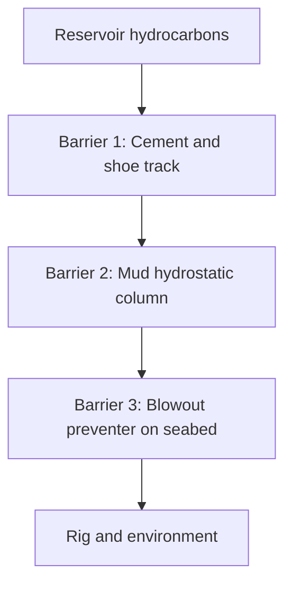
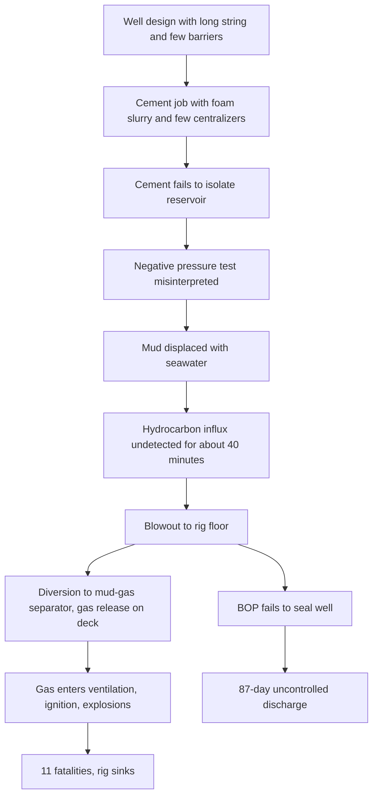

## Deepwater Horizon Blowout

**Overview**

On the night of 20 April 2010, the semi-submersible drilling rig Deepwater Horizon, operating in the Macondo Prospect in the Gulf of Mexico about 41 miles (roughly 66 km) off the Louisiana coast, suffered a well blowout, explosions, and fire. Eleven crew members died and 17 others were injured. The rig burned for about 36 hours before sinking on 22 April. The uncontrolled well discharged crude oil into the Gulf for 87 days until it was capped on 15 July 2010 and later declared permanently sealed in September 2010. The U.S. government's estimate of the discharge is approximately 4.9 million barrels (about 780,000 cubic meters), making it the largest marine oil spill in history.

**Key Points**

- The rig was owned and operated by Transocean under contract to BP, the Macondo well operator; Halliburton provided cementing services and Schlumberger (M-I SWACO for drilling fluids) supplied other services.
- The proximate technical failure was loss of well control after the cement job at the bottom of the well failed to isolate hydrocarbon-bearing formations, and the negative pressure test was misinterpreted.
- Hydrocarbons flowed undetected up the riser for tens of minutes; the blowout preventer (BOP) failed to seal the well.
- Investigations (the National Commission, the CSB, the BOEMRE/Coast Guard Joint Investigation, and BP's internal report) identified failures spanning design, cementing, testing, monitoring, emergency response, equipment maintenance, and management oversight.
- The disaster produced sweeping changes in offshore regulation, well design and control standards, and BOP requirements.

---

### Background

**The Macondo Well and the Rig**

The Macondo well (Mississippi Canyon Block 252) was drilled in about 4,993 feet (roughly 1,500 m) of water to a total depth of about 18,360 feet (about 5,600 m) below the rig floor. Deepwater Horizon was a fifth-generation dynamically positioned semi-submersible, meaning it held station using thrusters rather than anchors.

Key components of a floating deepwater drilling system:

- **Riser**: A large-diameter pipe connecting the rig to the seabed wellhead, carrying drilling fluid ("mud") back to the surface.
- **Blowout preventer (BOP)**: A stack of hydraulically actuated valves and rams on the seabed wellhead designed to seal the well in an emergency.
- **Drilling mud**: A weighted fluid that provides hydrostatic pressure to keep formation fluids from entering the well (the primary barrier).
- **Cement**: Placed in the annulus between the casing and the formation to isolate zones and provide a secondary barrier.
- **Casing and shoe track**: Steel pipe lining the well; the shoe track at the bottom contains float equipment intended to prevent backflow of cement.

**Well Barrier Concept**

Well control depends on maintaining at least two independent barriers between the reservoir and the environment. At Macondo, the intended barriers during the temporary abandonment phase were the cement and shoe track, the drilling mud column, and the BOP.

**Diagram: Simplified Well Barrier Arrangement (text form)**

---

### Sequence of Events

**Well Design and Schedule Pressure**

The well was significantly behind schedule and over budget. [Inference: The National Commission and other investigators noted that time and cost pressure may have contributed to decisions, although investigators differed about how directly this influenced specific choices.] The well used a long-string production casing design (a single string running from the wellhead to the bottom), which offers fewer barriers against hydrocarbon flow up the annulus than a liner with tieback, and had fewer centralizers than the cement modeling had recommended.

**Cementing (19 to 20 April)**

- The cement job was designed with a nitrified (foamed) cement slurry, a lightweight formulation, to avoid fracturing weak formations.
- Fewer centralizers were used than recommended, raising the risk of channeling (poor cement distribution around the casing).
- Pre-job testing of the foam cement slurry showed instability in some tests; results were not fully acted on. Investigators concluded that the cement was likely unstable and failed to seal the bottom of the well. [Inference: The exact failure mechanism is debated; multiple pathways (channeling, contamination, or shoe track failure) have been proposed.]
- Following the cement job, a full cement bond log was not run. A crew from Schlumberger who were on the rig for that purpose were sent home.
- The float collar conversion required pressure that was much higher than expected, and it was assumed to have been successful. The float valves were not confirmed as holding.

**Negative Pressure Tests (20 April)**

A negative pressure test reduces the hydrostatic pressure in the well below formation pressure to check whether the barriers hold. It is a critical integrity test.

- The first negative test showed abnormal results: pressure built up on the drill pipe while the kill line was reported as showing no flow.
- The crew identified the anomaly and discussed it, but rationalized it by attributing the drill pipe pressure to a "bladder effect" (a phenomenon that investigators later found was not a valid explanation).
- A second test conducted on the kill line was declared successful, though the drill pipe retained pressure, which was a sign of a leaking barrier. The test was accepted despite this inconsistency.
- The decision to proceed followed a misinterpretation of what were clear indications of well integrity failure.

**Displacement of Mud and the Influx**

- Crews began displacing the heavy mud in the riser with lighter seawater, reducing hydrostatic pressure on the reservoir.
- Between approximately 20:52 and 21:08, monitoring data (from the pit volume and flow-out indicators) showed signs that hydrocarbons were flowing into the well (a "kick"), including unexpected drill pipe pressure increases and flow continuing when pumps were stopped. [Inference: The National Commission concluded these signs were present in real-time data but were not recognized as a kick until about 21:40.]
- Kick detection relied on the driller and the mud logger; monitoring was complicated by simultaneous activities, including offloading mud to a supply vessel, that disturbed the pit volume readings.

**Blowout and Explosions**

- At about 21:40, mud began erupting from the rig floor. The crew activated the BOP's annular preventer and a variable bore ram, but these did not seal the well.
- The crew diverted the flow to the mud-gas separator (MGS) rather than overboard. The MGS was overwhelmed, and gas vented onto the rig deck and into the ventilation intakes, allowing flammable gas to enter engine rooms and other spaces.
- Ignition occurred at about 21:49, followed by multiple explosions. The fire and explosions killed 11 workers who were on the rig floor and mud pits area.
- The general alarm and emergency shutdown systems did not work as intended (the general alarm was inhibited from automatic activation in some modes to avoid false alarms, and gas detection did not trigger automated shutdown of ignition sources). [Inference: Some details of alarm inhibit configurations are drawn from the investigation reports and vary by report.]
- The emergency disconnect system (EDS), intended to disconnect the rig from the well, was activated late and did not work; the rig remained connected.
- The rig was abandoned by lifeboats and life rafts; survivors were rescued by a nearby supply vessel, the Damon Bankston.

**Diagram: Causal Chain (text form)**

---

### The Blowout Preventer Failure

The BOP was the last line of defense, and its failure allowed the uncontrolled discharge.

**BOP Configuration**

The stack included an annular preventer, several pipe rams, and a blind shear ram (BSR) intended to cut the drill pipe and seal the well. It also included control pods with backup systems: a deadman system (automatic function on loss of communication, power, and hydraulic pressure) and an autoshear system (activates on disconnect of the lower marine riser package).

**Why the BSR Failed**

The forensic investigation (led by Det Norske Veritas, DNV, for the Joint Investigation Team) found that:

- During the blowout, the drill pipe was forced off-center in the wellbore (buckled under well pressure), so the blind shear ram blades closed but did not cut the pipe fully; the ram could not seal around the buckled pipe.
- The BOP's control system had deficiencies: a dead battery in one control pod, a faulty solenoid valve in another, and modifications made to the BOP's configuration that were not fully documented or assessed.
- The deadman/autoshear did activate after the explosions but only partially succeeded. Neither the primary nor the backup systems achieved a full seal.
- Regular BOP maintenance and testing records showed gaps, and third-party assessments had not fully identified the problems.

[Inference: Some causal details of the BSR failure are based on forensic reconstruction and post-incident simulation; various parties have disputed elements of the analysis.]

---

### Well Control: Technical Concepts

**Hydrostatic Pressure**

The pressure exerted by the mud column keeps formation fluids in place. For a fluid column:

$$P = 0.052 \times \rho \times D$$

where $P$ is pressure in psi, $\rho$ is mud density in pounds per gallon (ppg), and $D$ is true vertical depth in feet. The constant 0.052 converts units in oilfield convention. A well is "overbalanced" when hydrostatic pressure exceeds formation pressure and "underbalanced" when it does not, permitting influx.

**Kick Detection Indicators**

| Indicator | Meaning |
| --- | --- |
| Pit gain | Increase in surface mud volume, suggesting formation fluid entering the well |
| Flow-out increase | More fluid returning than pumped in |
| Flow with pumps off | Well flowing without circulation (strong kick indicator) |
| Drill pipe pressure change | Unexpected increase while pumps are stopped or displacement is ongoing |
| Gas in returns | Hydrocarbon presence |

**Negative Pressure Test Logic**

In a valid negative test, the well is opened to lower pressure on the barrier, and the bleed-off should stop with zero flow and pressure returning to zero (or stable) with no build-up after bleeding. Persistent pressure or flow means the barrier is leaking. Both the drill pipe and kill line should show consistent results, since they communicate with the same wellbore fluid. At Macondo, inconsistent readings were explained away rather than treated as a failed test.

---

### Causes and Contributing Factors

**Technical**

- Cement failure and shoe track barrier failure to isolate the reservoir.
- Well design choices that reduced redundancy in barriers.
- Misinterpretation of the negative pressure test.
- Inadequate kick detection and monitoring during displacement.
- Diversion to the mud-gas separator instead of overboard.
- Ventilation and gas detection design that allowed gas into engine spaces and ignition sources.
- BOP unable to shear and seal.

**Human and Organizational**

- Schedule and cost pressure and decisions at odds with the more conservative engineering options. [Inference: The degree of causation is debated among parties.]
- Poor communication among BP, Transocean, and Halliburton; unclear responsibility for risk decisions at the interface.
- Failure of management of change: last-minute design and procedure changes lacked rigorous review.
- Inadequate learning from prior incidents and warnings, including previous BOP concerns.
- Weak safety culture and oversight, and the regulator's limited technical capacity (see below).
- Personal safety metrics (for example, slips, trips, and falls) emphasized while process safety indicators were less prominent. This theme parallels the Texas City refinery findings.

**Regulatory**

The Minerals Management Service (MMS), the U.S. agency overseeing offshore drilling, had conflicting roles: collecting royalty revenue and regulating safety. The National Commission found that regulatory oversight was inadequate, relying heavily on operator self-reporting and lacking technical depth. This parallels the Cullen report's finding on the UK regulator after Piper Alpha.

---

### Investigations and Reports

- **BP Internal Investigation ("Bly Report", September 2010)**: Identified eight key findings, including cement failure, misinterpreted negative test, and BOP failure, while attributing responsibility to multiple parties.
- **National Commission on the BP Deepwater Horizon Oil Spill and Offshore Drilling (January 2011)**: Concluded that the disaster was preventable and resulted from "systemic" failures in management and oversight, not just isolated errors.
- **Joint Investigation Team of BOEMRE and U.S. Coast Guard (2011)**: Examined the marine casualty, including rig equipment, crew actions, and regulatory issues.
- **U.S. Chemical Safety and Hazard Investigation Board (CSB, final report 2014, with additional volumes)**: Emphasized safety-critical barriers, regulatory regime design, and safety case principles, and recommended moving to a safety case regime for U.S. offshore drilling.
- **DNV Forensic Examination of the BOP (2011)**: Detailed the BOP mechanical failure mode.

---

### Regulatory and Industry Outcomes

**U.S. Regulatory Reform**

- MMS was reorganized into three separate agencies: the Bureau of Ocean Energy Management (BOEM), the Bureau of Safety and Environmental Enforcement (BSEE), and the Office of Natural Resources Revenue (ONRR), separating leasing, safety regulation, and revenue collection.
- The Workplace Safety Rule and Drilling Safety Rule (2010) required operators to implement Safety and Environmental Management Systems (SEMS) and strengthened requirements for well design, cementing, casing, and BOP testing.
- The Well Control Rule (2016) introduced additional requirements for BOP design, real-time monitoring, and third-party verification. [Verify current status: subsequent administrations amended some provisions, and current requirements may differ.]

**Industry Response**

- The Marine Well Containment Company and Helix Well Containment Group were formed to provide capping and containment capability.
- Enhanced BOP designs, including dual blind shear rams, and stronger standards for BOP maintenance, testing, and control system redundancy.
- API standards revisions, including API Standard 53 (blowout prevention equipment systems), and API RP 65-2 (isolating potential flow zones during well construction).

**Legal and Financial**

- BP agreed to a criminal plea including manslaughter charges (11 counts) and other charges, with a substantial fine, and the civil settlement in 2015 was reported at up to approximately $18.7 billion in Clean Water Act penalties and natural resource damages, with overall costs to BP being far higher. [Unverified: total cost figures vary by source and by what is included; verify against primary documents.]
- Transocean and Halliburton also settled with the government.

---

### Process Safety Lessons

**1. Barrier Management**

- Maintain multiple independent barriers, and verify each barrier's integrity before removing another. Never assume a barrier works without a valid test.

**2. Test Interpretation and Anomaly Response**

- An anomalous result during a critical integrity test must be treated as a failure until a rigorous, documented explanation is confirmed. Rationalization without verification (the "bladder effect") is a classic normalization-of-deviance pattern.

**3. Real-Time Monitoring and Kick Detection**

- Detection should be independent, alarmed, and not degraded by simultaneous operations. Consider dedicated personnel and automated alarms for well monitoring during critical phases.

**4. Emergency Systems Design**

- Diversion of well fluids should be to a safe location (overboard) when the process separator capacity is exceeded.
- Gas detection should automatically initiate shutdown of ignition sources and isolate ventilation.
- Emergency disconnect must be reliable and rapid.

**5. Management of Change and Risk at Interfaces**

- Late changes to well design and procedure require formal risk review. Contractor-operator interfaces need clear accountability.

**6. Equipment Integrity and Maintenance**

- Safety-critical equipment such as BOPs needs verified maintenance, modification control, and independent assessment.

**7. Safety Culture, Leadership, and Regulation**

- Time and cost pressure must not override safety decisions. Regulators need technical competence and independence from revenue-collection functions.

---

### Practical Application

**Example: Pre-Displacement Barrier Verification Checklist**

Before displacing a well to a lighter fluid, a team could confirm:

1. Cement placement has been verified (for example, by returns, pressure records, and cement evaluation logging as required by the program).
2. Float equipment integrity has been confirmed.
3. A negative pressure test has been designed with clear acceptance criteria (zero flow, zero pressure build-up), reviewed by a competent person, and independent of schedule pressure.
4. Any anomalous result is escalated and resolved before proceeding, with documented sign-off.
5. Monitoring responsibilities are assigned; simultaneous operations that mask pit volumes are suspended.
6. The BOP is verified functional, and emergency disconnect and shear capability are confirmed for current pipe in the hole.

**Example: Hydrostatic Balance Calculation**

For a vertical depth of 18,000 feet and mud density of 14.0 ppg:

$$P = 0.052 \times 14.0 \times 18000 = 13{,}104 \text{ psi}$$

If the mud in a portion of the riser is replaced with seawater (approximately 8.6 ppg), the overall hydrostatic pressure falls. Whether the well remains overbalanced depends on formation pressure, and the calculation must account for the actual fluid columns in the well and riser. The figures above are illustrative, not the Macondo data.

**Diagram: Barrier Failure Sequence (text form)**

---

### Facts vs. Uncertainty

- The fatality count (11 killed, 17 injured), the spill duration (87 days), and the government discharge estimate (about 4.9 million barrels) are widely reported by official sources.
- The exact timeline of hydrocarbon influx and the crew's actions has been reconstructed from data and testimony, with minor differences between reports.
- The precise failure mechanism of the cement is not fully resolved; investigators identified several plausible mechanisms.
- The BOP failure analysis is based on forensic reconstruction, and parties have contested details.
- Financial totals differ by source and by inclusion of settlements, penalties, and cleanup costs; verify against primary documents.
- Regulatory rule details have been revised since 2010, and current requirements should be checked against present regulations.

**Conclusion**

Deepwater Horizon demonstrates that a major accident emerges from the alignment of many weaknesses: a compromised barrier, a misread test, delayed detection, an emergency system that failed to perform, and organizational and regulatory conditions that allowed risk to accumulate unchallenged. The central takeaways for process safety are to treat barriers as things that must be proven rather than assumed, to respond to anomalies with rigor rather than rationalization, to design emergency systems for failure scenarios, and to maintain leadership and regulatory oversight focused on major hazard control.

**Related Topics**

- Well Control and Blowout Prevention Fundamentals
- Barrier Management and Bow-Tie Analysis
- Safety Case Regimes and SEMS
- Normalization of Deviance
- Management of Change (MOC)
- Process Safety Leadership and Culture
- Emergency Shutdown and Gas Detection Systems
- Piper Alpha Platform Explosion
- Texas City Refinery Explosion
- Bhopal Gas Tragedy
- Offshore Regulatory Reform