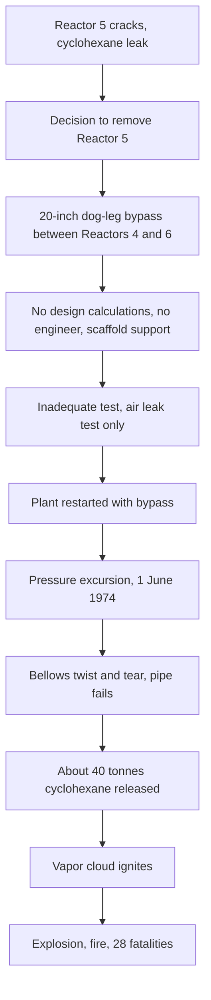

## Flixborough Explosion

**Overview**

On Saturday, 1 June 1974, at approximately 16:53, a massive vapor cloud explosion destroyed the Nypro (UK) Limited caprolactam plant at Flixborough, North Lincolnshire, England. Twenty-eight workers died, all on site; 36 others on site were injured, and hundreds of offsite injuries were recorded, along with extensive damage to about 1,821 houses and 167 shops and factories in the surrounding villages. The explosion occurred during a weekend, and the death toll would very likely have been far higher had the main office block been occupied, as it would have been on a weekday. The immediate cause was the failure of a temporary 20-inch bypass pipe that had been installed to replace a cracked reactor, releasing roughly 30 to 40 tonnes of hot cyclohexane that formed a flammable cloud and ignited. Flixborough became the foundational case study for management of change, plant modification control, and inventory-based siting and hazard assessment, and it directly influenced the UK's Control of Industrial Major Accident Hazards (CIMAH) regulations and the European Seveso Directive.

**Key Points**

- The plant oxidized cyclohexane to cyclohexanone and cyclohexanol, intermediates in caprolactam (nylon-6) production, using a series of six reactors in cascade at about 155 °C and roughly 8.8 bar gauge.
- Reactor No. 5 developed a crack; the plant was modified by removing it and connecting Reactors 4 and 6 with a temporary bypass pipe, without a rigorous engineering design review.
- The bypass was a 20-inch (500 mm) pipe with two bellows at each end and a dog-leg shape, supported on scaffolding poles, and it failed under internal pressure and twisting forces.
- The modification was made without a qualified mechanical engineer on site, without design calculations, and without pressure testing to the required standard.
- The disaster established that plant modifications, even temporary ones, require formal technical review, and that the concentration of people and buildings near large flammable inventories must be controlled.

---

### Plant Background

**Process Description**

The Flixborough works, owned by Nypro (a joint venture of Dutch State Mines and the British National Coal Board), produced caprolactam. The first stage, cyclohexane oxidation, was the hazardous step:

- Liquid cyclohexane was air-oxidized in the presence of a catalyst at about 155 °C and about 8 to 9 bar gauge, with only a small percentage conversion per pass (roughly 6 percent) to limit over-oxidation.
- Because conversion per pass was low, very large quantities of cyclohexane were recycled, and a large inventory of hot, pressurized flammable liquid was present in the oxidation section (on the order of hundreds of tonnes).
- The reactors were arranged in a cascade of six vessels, stepping down slightly in elevation so liquid flowed by gravity from one to the next through short, large-diameter connecting pipes (each with a bellows assembly to accommodate thermal expansion).

**Conditions Relevant to Hazard**

At the operating temperature and pressure, cyclohexane was held above its normal atmospheric boiling point (about 81 °C). When the containment was lost, a large fraction of the liquid flashed to vapor, and the remaining liquid formed an aerosol and spray, generating a large flammable cloud.

$$\text{Flash fraction} \approx \frac{c_p \,(T_{\text{op}} - T_{\text{b}})}{\Delta H_{\text{vap}}}$$

where $c_p$ is the liquid specific heat, $T_{\text{op}}$ the operating temperature, $T_{\text{b}}$ the atmospheric boiling point, and $\Delta H_{\text{vap}}$ the latent heat of vaporization. This simplified adiabatic flash estimate indicates that a significant fraction (often on the order of 20 percent for hydrocarbons in this regime) flashes upon depressurization, with additional entrainment as fine droplets. The figure is an estimate, not the value derived in the official inquiry.

---

### Sequence of Events

**Reactor No. 5 Leak (27 March 1974)**

- A leak of cyclohexane was discovered from a vertical crack in the stainless steel wall of Reactor 5's mild steel shell (the reactors were mild steel lined with stainless steel). The plant was shut down and the reactor inspected.
- The subsequent investigation attributed the cracking to stress corrosion cracking caused by nitrate ions in cooling water, which had come from a nearby source (a leak of process water containing nitrates) and which, combined with the tensile stress in the steel, cracked the shell. [Inference: The court of inquiry's technical work supported this explanation, but the precise mechanism has been discussed in the literature, and some alternatives were considered.]

**Decision to Bypass and Restart**

Management decided to remove Reactor 5 and connect Reactor 4 directly to Reactor 6 to restart production quickly, because of commercial pressure to resume output.

- The elevation difference between the outlets and inlets of Reactors 4 and 6 was about 14 inches (roughly 350 mm), which is the reason the bypass had a dog-leg shape.
- The available pipe size in stock was 20 inches (500 mm) diameter, whereas the reactor nozzles were 28 inches (700 mm); a temporary bypass was fabricated from 20-inch pipe with mitre joints and connected to the existing bellows units, which were designed for the 28-inch nozzles.
- The pipe run was supported on a temporary scaffolding structure. No engineering design calculations were made for the pipe, and no drawings were prepared; the arrangement was sketched in chalk on the workshop floor. [Verify: This detail is widely reported from the Court of Inquiry, and reflects the absence of formal design.]
- The plant had no full-time qualified mechanical engineer at that time, since the works engineer post was vacant. Those making the decisions were experienced chemical engineers, but they lacked mechanical engineering expertise in large-diameter pipe design and did not seek external advice.
- After installation, the line was subjected only to an air-pressure leak test at about 9 kg/cm² (well below the relief valve setting of about 11.4 bar), not a hydrotest to relief valve pressure, and no test to assess its ability to withstand the bending and squirming loads.

**Restart and Operation (April to May)**

The plant restarted in April and ran with the bypass in place. During startup in late May, pressure excursions (linked to a loss of nitrogen pressure and process upsets) occurred, and the bypass was subjected to further stresses.

**Failure (1 June 1974)**

On 1 June, a rise in pressure (probably due to a process upset in the system, later attributed to a second leak in the plant and a pressure rise from a start-up procedure) occurred. Internal pressure acted on the bellows units, producing a large axial force with an unbalanced thrust. Because the pipe was not supported to resist this force and had a dog-leg with an offset, the assembly squirmed and twisted, and the bellows tore.

- The bypass assembly ruptured, releasing an estimated 30 to 50 tonnes of cyclohexane in about 45 seconds. [Verify: figures vary, with the commonly cited estimate being about 40 tonnes.]
- The flammable cloud spread across the site and ignited about 45 seconds after release, probably from a furnace in a hydrogen production unit nearby.
- The explosion was equivalent to a substantial amount of TNT (the Court of Inquiry estimated on the order of 15 to 45 tonnes TNT equivalent, with the higher end commonly cited as around 45 tonnes; the precise value is uncertain). [Inference: TNT-equivalence for vapor cloud explosions is method-dependent and the figure should be treated as approximate.]
- Damage occurred across the site: the control room was destroyed (killing all 18 personnel there, out of the 28 total deaths), and fires burned for days.

**Diagram: Sequence Leading to Explosion (text form)**

---

### Technical Analysis of the Failure

**Bellows and Unbalanced Pressure Thrust**

The bypass connected Reactors 4 and 6 using bellows at each end. A bellows is a flexible element that accommodates movement, but under internal pressure it experiences an axial force that is not restrained by the bellows itself:

$$F = P \times A_{\text{eff}}$$

where $P$ is internal pressure and $A_{\text{eff}}$ is the effective area of the bellows. For a 28-inch bellows unit at about 9 bar gauge, this force is very large: with $A_{\text{eff}}$ roughly 0.4 m² and $P$ about 0.9 MPa, the force is on the order of 360 kN (about 36 tonnes-force). The bellows require tie rods, guides, or anchors to react this load. The illustrative calculation above uses approximate values and is not taken from the inquiry report.

**Why the Dog-Leg Made It Worse**

In a straight line, the pressure thrust from opposed bellows would be equal and opposite and could be carried by the pipe itself in compression. With the dog-leg (offset by mitre bends), the force lines were not collinear, creating a bending moment that tended to rotate or "squirm" the assembly in the horizontal plane. The scaffolding supports could not restrain this motion.

**Mismatch of Sizes**

The 20-inch pipe was connected to 28-inch bellows via transition pieces, so the bellows were being supported on an unusual geometry. Investigators (including later analysis, and notably work by the Court of Inquiry's technical assessors) concluded that the bypass failed at the bellows or adjacent connection under pressure, though there was later disagreement over whether an alternative initiating failure, a rupture of a different 8-inch line (a pipe on the plant), was the true starting point. This "alternative theory" was proposed in later analysis (notably by a Nypro-related re-investigation) and suggested a water-hammer or other event on an 8-inch pipe may have initiated the sequence. [Speculation: The alternative-cause hypothesis remains debated; the official inquiry's conclusion, that the 20-inch bypass failure was the cause, is the widely adopted account.]

**Cloud Formation and Explosion**

- Pressurized superheated cyclohexane released to atmosphere flashes and forms an aerosol, generating a large flammable cloud.
- The cloud mixed with air to a flammable concentration over a large area, and ignition produced a vapor cloud explosion (VCE), with overpressures sufficient to destroy the control room and other buildings.
- Flixborough is often cited as showing that unconfined vapor clouds can produce damaging overpressure, particularly in congested areas, a finding that transformed hazard analysis assumptions.

---

### Causes and Contributing Factors

**Technical**

| Factor | Description |
| --- | --- |
| Improvised bypass | 20-inch dog-leg pipe with mitre joints, not designed to relevant codes |
| Bellows configuration | Unrestrained bellows under pressure thrust, with no proper tie rods or guides |
| Support | Temporary scaffolding, unable to resist squirm and bending |
| Testing | Low-pressure air leak test, not an adequate hydrostatic or stress evaluation |
| Reactor cracking | Nitrate-induced stress corrosion cracking in Reactor 5 |
| Large hot inventory | Hundreds of tonnes of cyclohexane above its atmospheric boiling point |

**Organizational and Human**

- **No management of change**: The modification was treated as a routine repair rather than a design change requiring formal review, calculation, and approval.
- **Lack of competence**: No qualified mechanical engineer was in the decision loop, and no one recognized the need for specialist input.
- **Production pressure**: A strong commercial incentive to restart quickly.
- **Absence of design standards**: The pipe fabrication did not comply with British Standard pressure piping codes (as would be expected for such service).
- **Emergency and siting**: The control room and offices were located too near the hazardous process area, and were not blast-resistant.

**Siting and Layout**

Large numbers of people were in the site's buildings, including the control room in the vicinity of the reactors. The absence of blast resistance in the control room contributed to most of the fatalities. The scale of offsite damage also raised questions about land use planning around hazardous plants.

---

### The Court of Inquiry and Its Findings

The UK government appointed a Court of Inquiry chaired by Roger Parker QC, which reported in 1975 (the report is titled "The Flixborough Disaster: Report of the Court of Inquiry").

- The Court concluded that the disaster was caused by the failure of the temporary 20-inch bypass pipe, and that the modification had been made without adequate engineering competence, calculation, or testing.
- The Court criticized the absence of qualified engineering oversight and the lack of a systematic procedure for approving plant modifications.
- It noted that the plant was designed and operated with adequate care in many respects, and that the failure stemmed from the particular modification and not from the basic process design. It also recommended measures on the control of major hazards, including notification of major hazard installations, controls on the siting of hazardous plants, and standards for plant modification.
- The Court recommended the creation of a Advisory Committee on Major Hazards (ACMH), which was set up in 1975 and produced three reports that developed the framework for major hazard control in the UK.

---

### Regulatory and Industry Outcomes

**United Kingdom**

- The ACMH work led to the Notification of Installations Handling Hazardous Substances (NIHHS) Regulations 1982 and the Control of Industrial Major Accident Hazards (CIMAH) Regulations 1984, which required operators of major hazard sites to demonstrate safe operation and prepare emergency plans. These were later replaced by the Control of Major Accident Hazards (COMAH) Regulations 1999 (as amended).

**European Union**

- Flixborough, together with the 1976 Seveso release in Italy, drove the adoption of the Seveso Directive (82/501/EEC) in 1982, later revised as Seveso II (96/82/EC) and Seveso III (2012/18/EU).

**Industry Practice**

- The disaster became a standard case for teaching management of change (MOC). Modern MOC requirements, such as those in OSHA's PSM standard (29 CFR 1910.119(l)) and the CCPS Risk Based Process Safety guidelines, require that changes to process equipment, procedures, and materials undergo a hazard review and authorization before implementation, and that temporary changes be controlled with a defined duration. [Inference: The direct causal influence of Flixborough on specific regulatory text is partial, since later incidents also contributed, but Flixborough is universally cited as a landmark motivating MOC discipline.]
- The incident also influenced the development of vapor cloud explosion modeling, siting guidance (for example, blast-resistant control rooms and occupied building standards), and the inventory-based approach to hazard assessment.

---

### Process Safety Lessons

**1. Management of Change**

- All modifications, including temporary and emergency ones, must be subjected to a documented review that covers technical design, hazard analysis, and approval by competent persons.
- Temporary modifications should have a clear expiry and a plan for permanent resolution.

**2. Competence and Engineering Oversight**

- Modifications to pressure-containing equipment need input from qualified mechanical and process engineers, and organizations must recognize the limits of their in-house expertise and call on external specialists.

**3. Design to Recognized Codes and Verification**

- Piping must be designed for the actual loading conditions, including pressure thrust, thermal expansion, and dynamic effects, and to applicable standards. Testing must be appropriate: a leak test does not demonstrate structural adequacy.

**4. Bellows and Expansion Joint Design**

- Unrestrained bellows require restraints (tie rods, guides, anchors) to carry pressure thrust. Misalignment and lateral loading must be prevented by design.

**5. Inventory Reduction and Inherent Safety**

- Reducing the quantity of hazardous material held at hazardous conditions reduces the potential consequence. Flixborough is a foundational case for the principle of inherently safer design (minimize, substitute, moderate, simplify).

**6. Siting of Occupied Buildings**

- Control rooms and other occupied buildings should be located away from hazardous areas or designed to withstand credible blast loads.

**7. Managing Production Pressure**

- Commercial pressure to resume production must not bypass engineering controls. Leaders should ensure that safety review is protected against schedule pressure.

**8. Learning About Materials and Corrosion**

- Stress corrosion cracking from contaminants such as nitrates in cooling water shows the need for monitoring and controlling plant water and material compatibility.

---

### Practical Application

**Example: Management of Change Checklist Derived from Flixborough**

Before approving a change to process equipment, a team could ask:

1. Is this change formally documented as a modification, regardless of whether it is called temporary, urgent, or minor?
2. Has a qualified engineer of the relevant discipline (mechanical, process, instrument, electrical) designed and reviewed it?
3. Have design calculations been made for all loads (pressure, thrust, thermal, weight, dynamic) and checked against the applicable code?
4. Has a hazard review (for example, HAZOP or what-if analysis) been carried out, including consequences of failure?
5. Are the materials, supports, restraints, and expansion joints suitable, and are they installed as designed?
6. Will testing be to the required standard (for example, hydrotest at the required factor), and are results recorded?
7. Have operating procedures, training, and drawings been updated?
8. Is there an authorization signature from a designated approver, a defined duration if temporary, and a pre-startup review?

**Example: Estimating Pressure Thrust on a Bellows**

For a bellows with mean diameter $D$ (in meters) at pressure $P$ (in pascals), the effective area can be approximated as:

$$A_{\text{eff}} = \frac{\pi D^2}{4}$$

For $D = 0.6$ m and $P = 0.9$ MPa:

$$F = 0.9 \times 10^{6} \times \frac{\pi \times 0.6^2}{4} \approx 254 \text{ kN}$$

This illustrates that even moderate pressures on large-diameter bellows produce force on the order of tens of tonnes-force that must be restrained. The numbers above are illustrative only, not the Flixborough design data.

**Diagram: Layers That Should Have Prevented the Accident (text form)**

---

### Facts vs. Uncertainty

- The fatality figures (28 killed on site, 36 injured on site, with hundreds of offsite injuries) and the date and time are widely reported by the Court of Inquiry and secondary sources.
- The quantity of cyclohexane released is commonly cited at about 30 to 40 tonnes; estimates vary between sources, and the precise figure is uncertain.
- The TNT equivalence of the explosion is an estimate and depends on the method used.
- The official explanation is failure of the 20-inch bypass; an alternative theory involving a prior failure of an 8-inch pipe has been proposed but is not the accepted account.
- The root mechanism of Reactor 5 cracking (nitrate stress corrosion cracking) is well supported but has been discussed in the literature.
- Details of the exact regulatory chain from Flixborough to specific regulations involve interpretation, as multiple events drove reforms.

**Conclusion**

Flixborough demonstrated how a single unreviewed modification, made under production pressure by well-intentioned personnel without adequate engineering competence, can defeat a plant's containment and release a very large flammable inventory. The disaster established management of change, engineering competence, code-based design and verification, inventory minimization, and safe siting of occupied buildings as core process safety principles, and it began the modern regulatory framework for major hazard installations in the UK and Europe.

**Related Topics**

- Management of Change (MOC)
- Vapor Cloud Explosion Modeling
- Inherently Safer Design
- Expansion Joints and Bellows Design
- Facility Siting and Blast-Resistant Buildings
- Stress Corrosion Cracking
- Seveso Directive and COMAH Regulations
- Piper Alpha Platform Explosion
- Texas City Refinery Explosion
- Deepwater Horizon Blowout
- Bhopal Gas Tragedy