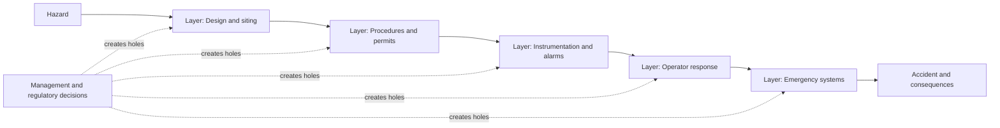
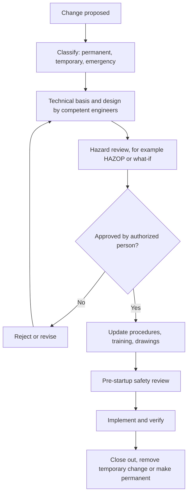
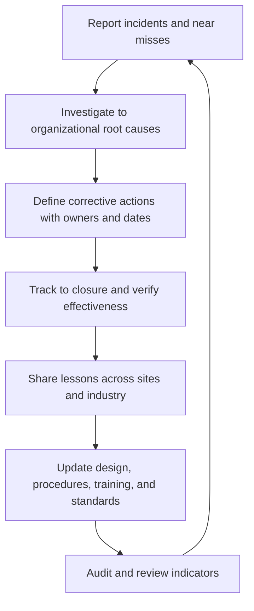

## Common Themes and Systemic Lessons Across Major Incidents

**Overview**

Major industrial disasters rarely arise from a single technical failure or a single human error. Investigations of Flixborough (1974), Seveso (1976), Bhopal (1984), Piper Alpha (1988), Texas City (2005), Buncefield (2005), and Deepwater Horizon (2010), among many others, repeatedly find the same families of weakness: barriers that were assumed rather than verified, changes made without review, warnings that went unheeded, leadership attention directed at the wrong indicators, and regulatory regimes that lagged the hazards they governed. This topic synthesizes those recurring patterns into a framework for recognizing latent conditions before they align into an accident.

**Key Points**

- Major accidents are typically organizational accidents: latent conditions created by decisions at management, design, and regulatory levels combine with active failures at the sharp end.
- The same themes recur across decades, industries, and countries: management of change, permit-to-work and isolation, barrier integrity, learning from prior events, safety culture and leadership, production pressure, siting, and emergency preparedness.
- Low personal injury rates do not indicate control of major hazards; process safety needs its own leading and lagging indicators.
- Effective prevention relies on independent, tested, and maintained barriers, competent people, and leadership that treats process safety as a core business value.
- Regulatory evolution has followed incidents: each major event produced reform, and the question for practitioners is how to learn without waiting for the next event.

---

### Incident Reference Set

The following table summarizes the incidents most often used as reference cases. Figures are commonly cited approximations; verify against primary investigation reports when precision matters.

| Incident | Year | Approximate Consequence | Immediate Trigger | Landmark Outcome |
| --- | --- | --- | --- | --- |
| Flixborough, UK | 1974 | 28 killed on site | Failure of improvised 20-inch bypass; vapor cloud explosion | Advisory Committee on Major Hazards; CIMAH; emphasis on management of change |
| Seveso, Italy | 1976 | Offsite dioxin contamination; no immediate deaths attributed | Runaway reaction in a trichlorophenol reactor; release through a bursting disc | Seveso Directive (EU) |
| Bhopal, India | 1984 | Thousands killed (estimates vary widely) | Water ingress into methyl isocyanate storage; multiple safeguards inoperable | Emergency planning and community right-to-know laws; Responsible Care; OSHA PSM |
| Piper Alpha, UK North Sea | 1988 | 167 killed | Startup of a pump with its relief valve removed; permit-to-work failure | Cullen inquiry; safety case regime |
| Texas City, USA | 2005 | 15 killed, 170+ injured | Overfilled distillation tower; atmospheric blowdown release | Baker Panel; API RP 752/753/754/755 |
| Buncefield, UK | 2005 | No deaths; major offsite damage | Overfill of a gasoline tank, with failed independent high-level switch | Revised overfill protection standards and safety culture guidance |
| Deepwater Horizon, USA | 2010 | 11 killed; major oil spill | Failed cement barrier, misinterpreted negative test, BOP failure | Regulatory restructuring; SEMS; well control rules |

---

### Theme 1: Organizational Accidents and Latent Conditions

**The Concept**

James Reason's organizational accident model describes major accidents as the alignment of weaknesses across multiple defensive layers. Active failures (unsafe acts at the sharp end) are typically visible and immediate, while latent conditions (design flaws, understaffing, deferred maintenance, poor procedures, unclear responsibilities) lie dormant in the system, sometimes for years.

**Diagram: Swiss Cheese Model (text form)**

**Illustrations from the Reference Set**

- Piper Alpha: holes in the permit-to-work system, shift handover, blast-rated fire walls, firewater pump status, and evacuation planning aligned on a single night.
- Texas City: a failed alarm, a misleading level transmitter, a startup procedure not followed, an atmospheric vent stack, and trailers too close to the unit aligned.
- Deepwater Horizon: cement design, test interpretation, kick detection, diversion choice, gas detection response, and BOP shear capability aligned.

**Practical Takeaway**

Investigation and audit should ask not only "who made the error?" but "what conditions made the error likely, and why did the defenses not catch it?"

---

### Theme 2: Management of Change

**Pattern**

Unreviewed or inadequately reviewed changes appear in many incidents.

- Flixborough: a temporary bypass pipe designed on a workshop floor, with no engineering calculations, replaced a failed reactor.
- Piper Alpha: the conversion from oil-only to gas handling introduced hazards the layout was not designed for.
- Bhopal: reduced staffing, disabled refrigeration, and lapsed safety systems had effectively changed the plant's risk profile without formal reassessment.
- Deepwater Horizon: late design and procedure changes did not receive thorough risk review.

**Change Categories to Control**

- Equipment and process modifications (temporary and permanent).
- Procedures and operating limits.
- Staffing levels, organization, and shift patterns.
- Materials, suppliers, and feedstock.
- Bypassed, deferred, or disabled protective systems.

**Diagram: MOC Workflow (text form)**

**Key Point**: Emergency and temporary changes are often the most dangerous because urgency pushes review aside, so the process should include an expedited but rigorous path rather than an exemption.

---

### Theme 3: Barrier Management and Independent Protection Layers

**Pattern**

Safeguards existed on paper but were absent, defeated, untested, or overwhelmed in practice.

- Bhopal: the refrigeration unit, vent gas scrubber, flare tower, and water curtain were each inoperable or inadequate at the time of release.
- Texas City: the independent high-level alarm had not been functioning.
- Buncefield: the independent high-level switch was not operational because a lever arm test-feature was left in an incorrect position after testing.
- Piper Alpha: firewater pumps were in manual mode.
- Deepwater Horizon: the BOP could not shear and seal the well.

**Barrier Attributes**

A reliable barrier should be:

- **Independent** of the initiating cause and of other barriers.
- **Effective**: capable of preventing or mitigating the scenario for which it is credited.
- **Auditable**: its status can be verified (tested, inspected, monitored).
- **Maintained** and proof-tested at intervals justified by its reliability requirements.

**Quantifying Layers**

In layer of protection analysis (LOPA), the frequency of a consequence is estimated by multiplying the initiating event frequency by the probability of failure on demand (PFD) of each independent protection layer:

$$f_{\text{consequence}} = f_{\text{initiating}} \times \prod_{i} \text{PFD}_i$$

For example, an initiating event at $10^{-1}$ per year with two independent layers, each at $\text{PFD} = 10^{-2}$, gives $f = 10^{-1} \times 10^{-2} \times 10^{-2} = 10^{-5}$ per year. This relies on the layers being truly independent and functioning at their claimed reliability; the incidents above show that unverified credit for barriers invalidates the calculation. The numbers are illustrative.

**Practical Takeaway**

Track barrier health as a management metric: the number of safety-critical elements impaired, overdue for testing, or bypassed at any time.

---

### Theme 4: Permit-to-Work, Isolation, and Handover

**Pattern**

Communication and control failures at the interface between maintenance and operations feature prominently, particularly in Piper Alpha, where permits for related equipment were not cross-referenced and the shift handover did not convey that a relief valve was missing.

**Requirements**

- A single, visible record of active work and equipment status.
- Positive isolation and lock-out/tag-out verified before work.
- Cross-referencing of related permits and simultaneous operations review.
- Structured, documented shift handover that includes equipment status, suspended work, and abnormal conditions.
- Controlled reinstatement, with no return to service until the permit is formally closed and the system verified.

---

### Theme 5: Learning from Prior Events and Warning Signs

**Pattern**

Most major accidents were preceded by precursors that were recognized but not acted upon.

- Texas City: earlier blowdown drum releases and near misses in the same unit.
- Bhopal: internal audit reports and prior smaller incidents identifying deficiencies.
- Deepwater Horizon: the anomalous negative test result and earlier well-control incidents.
- Piper Alpha: earlier incidents and audit findings on permit-to-work and firewater systems.

**Concept: Normalization of Deviance**

Repeated tolerance of deviations that did not immediately cause harm gradually redefines the accepted standard, so each deviation becomes the new baseline. The concept was developed by Diane Vaughan in her analysis of the Challenger accident and applies broadly to industrial settings.

**Effective Learning Systems**

- Near-miss and incident reporting with low barriers and no blame for honest reporting.
- Investigation that seeks root and organizational causes.
- Tracking of corrective actions to closure with management accountability.
- Sharing lessons across sites and industries.
- Periodic review of historical incidents against current practice.

---

### Theme 6: Safety Culture, Leadership, and Metrics

**Personal Safety vs. Process Safety**

Texas City and Deepwater Horizon are commonly cited as cases where personal injury statistics were favorable while major hazard controls deteriorated.

$$\text{TRIR} = \frac{\text{Recordable injuries} \times 200{,}000}{\text{Hours worked}}$$

A low TRIR reflects the frequency of common injuries such as slips and strains, not the integrity of barriers against low-frequency, high-consequence events.

**Process Safety Indicators**

A balanced set uses both lagging indicators (events that already happened) and leading indicators (measures of barrier health and system performance). API RP 754 organizes these into tiers:

| Tier | Type | Example |
| --- | --- | --- |
| Tier 1 | Lagging | Loss of primary containment with major consequence |
| Tier 2 | Lagging | Lower-consequence loss of primary containment |
| Tier 3 | Leading | Challenges to safety systems, such as relief valve lifts or alarm activations |
| Tier 4 | Leading | Operating discipline and management system indicators, such as overdue inspections or MOC compliance |

**Characteristics of Effective Process Safety Leadership**

- Visible, sustained attention from senior leaders and boards to process safety performance.
- Chronic unease: a healthy skepticism about whether controls are working.
- Willingness to stop work and accept cost when safety is uncertain.
- Resources and competence provided commensurate with the hazard.
- Open channels for bad news to travel upward.

---

### Theme 7: Production Pressure and Cost Trade-offs

**Pattern**

Schedule and financial pressure appear as contextual factors in many investigations.

- Flixborough: pressure to restart production quickly after the reactor failure.
- Texas City: budget constraints affecting maintenance and equipment upgrades, and fatigue among operators.
- Deepwater Horizon: a well behind schedule and over budget. [Inference: Investigators differ on how directly time pressure influenced specific decisions.]
- Bhopal: cost-reduction measures affecting staffing, maintenance, and training.

**Practical Takeaway**

Establish decision rules in advance (for example, criteria for stopping work, and who has authority to do so) so that safety-critical decisions are not made ad hoc under pressure. Ensure that cost-saving proposals undergo the same risk review as other changes.

---

### Theme 8: Siting, Layout, and Inherent Safety

**Pattern**

The consequences of incidents were magnified by where people and buildings were placed relative to hazards, and by the size of hazardous inventories.

- Flixborough: the control room was near the reactors and not blast-resistant.
- Bhopal: dense settlements grew adjacent to the plant.
- Piper Alpha: compact layout with accommodation and control room near production modules.
- Texas City: contractor trailers close to a blowdown drum.

**Inherently Safer Design Principles**

- **Minimize**: reduce the inventory of hazardous material.
- **Substitute**: use less hazardous materials or processes.
- **Moderate**: use less severe conditions (lower temperature, pressure).
- **Simplify**: reduce complexity and opportunities for error.

Inherently safer options generally eliminate or reduce a hazard rather than controlling it with added layers, and they should be considered early in design when changes are least costly.

**Facility Siting**

- Evaluate credible fire, explosion, and toxic release scenarios and their effects on occupied buildings.
- Keep non-essential personnel out of hazardous areas, especially during startup, shutdown, and abnormal operations.
- Apply land-use planning to control development near hazardous facilities.

---

### Theme 9: Emergency Preparedness and Response

**Pattern**

When prevention fails, the effectiveness of mitigation and emergency response determines the outcome.

- Piper Alpha: the muster location was in the accommodation module, with no clear command when the control room was lost; evacuation routes were blocked by smoke.
- Bhopal: alarms were ignored or silenced, the community was not informed or trained, and medical responders lacked information on the released chemical.
- Deepwater Horizon: gas diversion to the mud-gas separator, ventilation intakes drawing gas into engine spaces, and delayed emergency disconnect.

**Elements of Robust Emergency Preparedness**

- Emergency systems (shutdown, isolation, firewater, alarms) that remain functional under credible major accident conditions and fail to a safe state.
- Clear command structure and alternates if the primary control location is lost.
- Realistic drills and exercises, including involvement of external responders and the community.
- Community communication and, where appropriate, public warning systems.
- Accessible hazard information for responders and medical staff.

---

### Theme 10: Regulatory Oversight and Regime Design

**Pattern of Regulatory Evolution**

| Incident | Regulatory Response |
| --- | --- |
| Flixborough | UK Advisory Committee on Major Hazards; NIHHS and CIMAH regulations |
| Seveso | Seveso Directive (82/501/EEC), later Seveso II and III |
| Bhopal | Emergency planning and community right-to-know legislation in the US; OSHA PSM standard influenced by this and other incidents |
| Piper Alpha | Safety case regime under HSE; goal-setting regulation and ALARP demonstration |
| Texas City | Baker Panel recommendations; API recommended practices on siting, indicators, and fatigue |
| Deepwater Horizon | Division of MMS into BOEM, BSEE, and ONRR; SEMS and well control rules |

**Regulatory Approaches Compared**

| Approach | Description | Strengths | Limitations |
| --- | --- | --- | --- |
| Prescriptive | Specific rules for equipment and practices | Clear, enforceable, simple to inspect | Can lag technology; may encourage minimum compliance |
| Goal-setting / safety case | Operator demonstrates risks are controlled to ALARP | Adapts to specific hazards; places responsibility on the operator | Requires competent regulator and operator; quality of case varies |
| Process safety management standard | Management system elements (for example, PHA, MOC, PSSR) | Systematic coverage of lifecycle | Effectiveness depends on implementation, not just documentation |

**Regulator Independence and Competence**

Both Piper Alpha and Deepwater Horizon inquiries criticized regulators with conflicting mandates (promoting resource development while regulating safety) and limited technical capability, which led to organizational separation of these functions.

---

### Theme 11: Human Factors and Competence

**Pattern**

Human error is a consequence of system conditions more than an isolated cause.

- Fatigue and extended overtime (Texas City).
- Inadequate training for abnormal and transient operations (startup, shutdown).
- Poor interface design, such as instruments that mislead (Texas City level indication).
- Cognitive bias in interpreting ambiguous data, including confirmation bias (Deepwater Horizon negative test) and normalization of deviance.
- Loss of technical competence within organizations following restructuring or outsourcing.

**Practical Takeaway**

Design tasks, interfaces, staffing, and procedures to be robust against foreseeable human limitations, and treat operator deviations as signals about system design and workload, not merely as discipline issues.

---

### Cross-Incident Comparison Matrix

The matrix below indicates where each theme was prominent in investigation findings. A mark indicates the theme was a significant finding; absence does not mean it was irrelevant.

| Theme | Flixborough | Bhopal | Piper Alpha | Texas City | Deepwater Horizon |
| --- | --- | --- | --- | --- | --- |
| Management of change | X | X | X |  | X |
| Barrier failure or unverified safeguards |  | X | X | X | X |
| Permit-to-work / isolation / handover |  |  | X | X |  |
| Ignored warnings or prior events |  | X | X | X | X |
| Safety culture and leadership |  | X | X | X | X |
| Production or cost pressure | X | X |  | X | X |
| Siting / layout / inventory | X | X | X | X |  |
| Emergency response deficiencies |  | X | X |  | X |
| Regulatory weakness |  | X | X |  | X |

---

### Practical Application

**Example: Using Lessons for a Facility Gap Assessment**

A facility team can turn the themes into a structured self-assessment. For each theme, ask:

1. **Management of change**: Are all changes, including temporary and emergency ones, captured, reviewed, and approved? What proportion of recent changes had documented hazard review?
2. **Barriers**: Do we have a register of safety-critical elements, and what is their current test status and impairment count? Which barriers are credited in our risk assessments, and when were they last proven?
3. **Permit-to-work and handover**: Can we see all active and suspended permits in one place? Does handover require review of equipment status?
4. **Learning**: How many overdue corrective actions from incident investigations exist? When did we last review near misses for patterns?
5. **Leadership and metrics**: Which leading indicators do senior leaders and the board review, and how do they trigger action?
6. **Pressure**: What are the decision criteria and authority for stopping work? Have we seen cases where safety review was shortened for schedule?
7. **Siting**: Where are occupied buildings relative to hazards, and have they been assessed against credible blast, fire, and toxic scenarios?
8. **Emergency**: When were emergency systems and command arrangements last tested under realistic loss-of-control-room scenarios?

**Example: Simple Barrier Health Indicator**

A practical leading indicator is the proportion of safety-critical barriers that are healthy at a given time:

$$\text{Barrier health} = \frac{N_{\text{tested and unimpaired}}}{N_{\text{total safety-critical barriers}}} \times 100\%$$

Tracked over time and reviewed by management, this indicator makes degradation visible before an accident does. Thresholds and definitions must be set by the site and applied consistently.

**Diagram: Learning Loop (text form)**

---

### Facts vs. Uncertainty

- The reference incidents and their broad findings are documented in official investigation reports (for example, the Court of Inquiry on Flixborough, the Cullen report on Piper Alpha, the CSB and Baker Panel on Texas City, and the National Commission on Deepwater Horizon).
- The cross-incident themes presented here are a synthesis; different analysts group and weight themes differently, and the matrix reflects an interpretive judgment, not an official classification.
- Casualty figures, especially for Bhopal, vary widely by source and by counting method, and should be verified against primary references.
- The relative influence of cost and schedule pressure on specific decisions is debated in several cases and is often reported as a contributing context rather than a proven direct cause.
- Regulatory details and standards are periodically revised; confirm current versions and jurisdiction-specific requirements before relying on them.

**Conclusion**

Across seven decades of industrial disasters, the same lessons recur: treat change as a hazard, prove barriers rather than assume them, control the interfaces where communication fails, act on warnings and near misses, measure what matters for major hazards, protect safety decisions from production pressure, keep people away from hazards, and design emergency systems for the conditions in which they will actually be needed. The persistent challenge is less a lack of knowledge than the discipline to apply it consistently, which depends on sustained leadership, competent people, and a culture that values honest reporting and chronic unease over the comfort of a good injury record.

**Related Topics**

- Human and Organizational Factors in Process Safety
- Risk Based Process Safety (CCPS) Framework
- Layers of Protection Analysis (LOPA)
- Bow-Tie Analysis and Barrier Management
- Normalization of Deviance
- Process Safety Culture Assessment
- Leading and Lagging Process Safety Indicators
- Incident Investigation and Root Cause Analysis
- Safety Case Regimes and ALARP
- Buncefield Oil Storage Depot Explosion
- Bhopal Gas Tragedy
- Seveso Chemical Accident