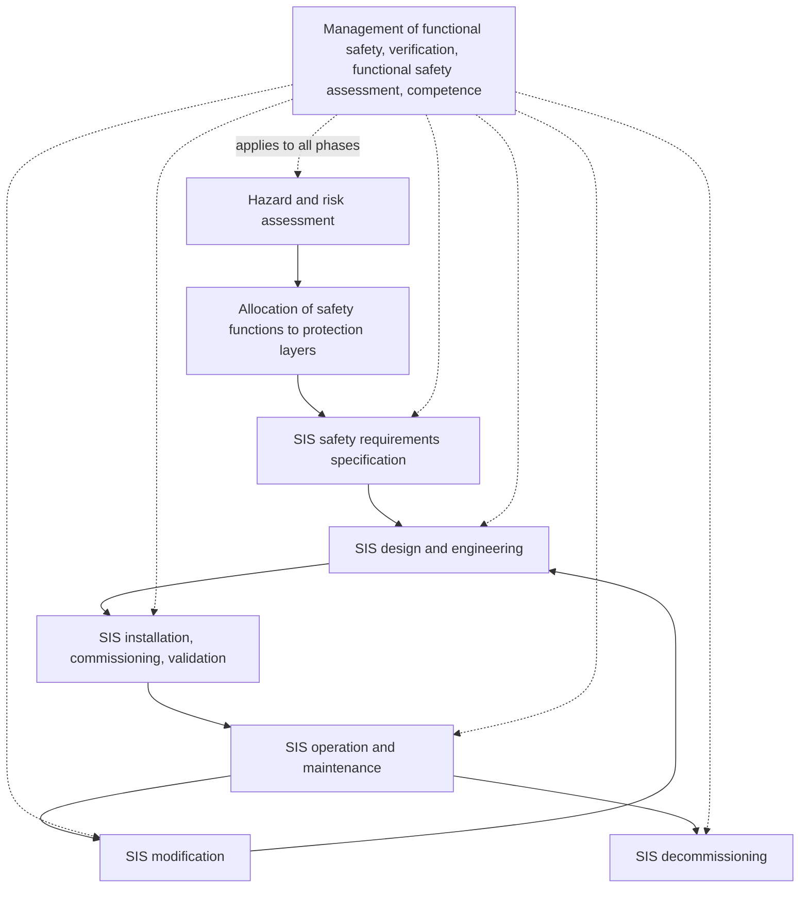
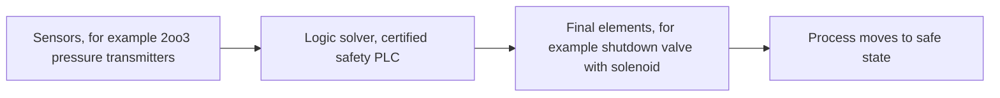
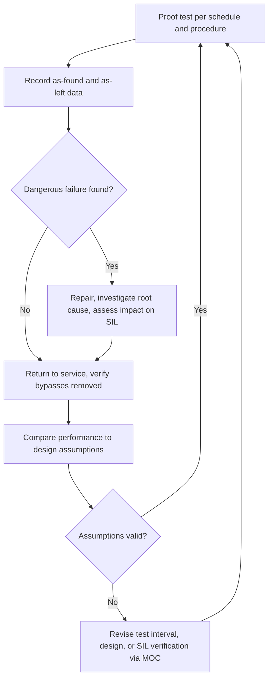

## Functional Safety and Safety Instrumented Systems Lifecycle

**Overview**

Functional safety is the part of overall safety that depends on a system or equipment operating correctly in response to its inputs, including safe handling of foreseeable operator errors, hardware failures, and environmental changes. In process industries, functional safety is most commonly implemented through **Safety Instrumented Systems (SIS)**: independent, dedicated combinations of sensors, logic solvers, and final elements that detect a hazardous process condition and drive the process to a safe state. The governing framework is the IEC 61511 standard (process sector, "user" of SIS), which is built on the generic IEC 61508 standard (equipment designers and manufacturers). In the United States, ANSI/ISA-84.00.01 is the identical adoption of IEC 61511. The SIS lifecycle defines the activities from initial hazard analysis through design, installation, operation, modification, and decommissioning, with verification, validation, and functional safety assessment throughout.

**Key Points**

- A SIS is an independent protection layer (IPL) that performs one or more **Safety Instrumented Functions (SIFs)**, each with a defined safe state, process safety time, and target risk reduction.
- Risk reduction is expressed as a **Safety Integrity Level (SIL 1 to 4)**, which corresponds to ranges of average probability of failure on demand (PFDavg) or, for continuous demand, probability of dangerous failure per hour (PFH).
- The safety lifecycle spans analysis, realization, and operation phases, with management of functional safety, competence, verification, and functional safety assessment (FSA) applying throughout.
- Achieving a target SIL requires meeting quantitative requirements (random hardware failure probability), architectural constraints (hardware fault tolerance and safe failure fraction or proven-in-use), and systematic capability requirements (freedom from systematic faults).
- Operational discipline (proof testing, bypass management, management of change, and performance monitoring) is as important as design; many SIS underperform because of operational degradation.

---

### Foundations

**Functional Safety vs. Inherent and Passive Safety**

Functional safety relies on active systems to respond to a demand. It sits among other risk reduction measures:

- Inherent design and passive protection (for example, dikes, blast walls, mechanical relief devices).
- Basic process control system (BPCS) and alarms with operator response.
- SIS (active, automated safety function).
- Physical protection and post-release mitigation.
- Emergency response.

Inherently safer design and passive measures are generally preferred where practicable, because they do not depend on active operation.

**Relationship of the Standards**

| Standard | Scope and Audience |
| --- | --- |
| IEC 61508 | Generic functional safety of electrical/electronic/programmable electronic systems; primarily for suppliers and device manufacturers |
| IEC 61511 | Functional safety for SIS in the process industry sector; for owner/operators, designers, and integrators |
| ANSI/ISA-84.00.01 | U.S. adoption of IEC 61511 |
| IEC 61508-based device certification | Third-party assessment (for example, by exida or TÜV) that a device has systematic capability and failure data suitable for SIL applications |

Edition and amendment details differ by jurisdiction and over time; confirm the currently applicable editions for a given project.

**Key Definitions**

- **SIS**: Instrumented system composed of sensors, logic solver(s), and final elements used to implement one or more SIFs.
- **SIF**: A specific safety function with a defined SIL, initiated by a specific hazardous event's process condition, and taking the process to a safe state.
- **Safe state**: A process state in which the hazardous event is prevented.
- **Demand mode**: Low demand (demand rate no more than once per year, and no more than twice the proof-test frequency), high demand (more than once per year), or continuous.
- **Process safety time (PST)**: Time between a failure in the process or BPCS (with potential to cause a hazardous event) occurring and the hazardous event, if no safety action is taken.
- **Spurious trip**: Shutdown not caused by a real hazardous demand.
- **Independent protection layer (IPL)**: A device, system, or action able to prevent a scenario from proceeding to its consequence, independent of the initiating event and other layers, and providing a specified risk reduction.

---

### Safety Integrity Levels

**SIL Targets for Low-Demand Mode**

For low-demand mode operation, the SIL is defined by the range of average probability of dangerous failure on demand:

| SIL | PFDavg | Risk Reduction Factor (RRF = 1/PFDavg) |
| --- | --- | --- |
| 1 | $\geq 10^{-2}$ to $< 10^{-1}$ | 10 to 100 |
| 2 | $\geq 10^{-3}$ to $< 10^{-2}$ | 100 to 1,000 |
| 3 | $\geq 10^{-4}$ to $< 10^{-3}$ | 1,000 to 10,000 |
| 4 | $\geq 10^{-5}$ to $< 10^{-4}$ | 10,000 to 100,000 |

**SIL Targets for High-Demand and Continuous Mode**

| SIL | PFH (dangerous failures per hour) |
| --- | --- |
| 1 | $\geq 10^{-6}$ to $< 10^{-5}$ |
| 2 | $\geq 10^{-7}$ to $< 10^{-6}$ |
| 3 | $\geq 10^{-8}$ to $< 10^{-7}$ |
| 4 | $\geq 10^{-9}$ to $< 10^{-8}$ |

SIL 4 is rare in the process industry; IEC 61511 gives limited guidance for it and recommends that alternatives be sought. Many organizations avoid designing SIFs above SIL 3, preferring additional independent layers or inherently safer design.

**Three Requirements for Achieving a SIL**

1. **Quantitative (random hardware failures)**: The calculated PFDavg (or PFH) of the complete SIF loop must fall within the target range.
2. **Architectural constraints**: Minimum hardware fault tolerance (HFT) based on SIL, device type, and safe failure fraction (SFF), or the "route 2H" and "route 1H" provisions of the standards, and, for user-approved devices, prior-use justification.
3. **Systematic integrity**: Avoidance and control of systematic failures (design errors, software faults, procedural failures) through lifecycle management, competence, and systematic capability of devices.

Meeting the quantitative target alone is not sufficient.

---

### The Safety Lifecycle

IEC 61511 organizes SIS activities into a lifecycle, illustrated below.

**Diagram: SIS Safety Lifecycle Overview (text form)**

Phases are grouped as:

- **Analysis**: Hazard and risk assessment, allocation of safety functions, and safety requirements specification.
- **Realization**: Design, engineering, installation, commissioning, and validation.
- **Operation**: Operation, maintenance, testing, modification, and decommissioning.

---

### Phase 1: Hazard and Risk Assessment

The starting point is identification of hazardous events and their risk, typically from a process hazard analysis such as HAZOP or What-If, using a defined corporate risk criterion (tolerable risk).

**Inputs and Outputs**

- Inputs: process design information, P&IDs, cause-and-effect data, and company risk tolerance criteria.
- Outputs: a list of hazardous events, initiating causes, consequences, existing safeguards, and risk gaps requiring additional risk reduction.

**Tolerable Risk**

Organizations define tolerable risk in terms of consequence categories (safety, environment, asset) and frequency. The gap between the unmitigated (or existing-safeguard) frequency and the tolerable frequency defines the risk reduction required from the SIF.

---

### Phase 2: Allocation of Safety Functions to Protection Layers and SIL Determination

The purpose is to decide which risk reduction is provided by which layer and to assign a target SIL to each SIF.

**Common SIL Determination Methods**

| Method | Description | Notes |
| --- | --- | --- |
| Layer of Protection Analysis (LOPA) | Semi-quantitative: uses initiating event frequency, consequence severity, enabling conditions, and credited IPLs with PFDs to compute mitigated frequency | Most widely used in industry |
| Risk graph | Qualitative/calibrated: consequence, exposure, avoidance, demand rate parameters | Requires careful calibration to the risk criteria |
| Risk matrix (calibrated) | Frequency and severity matrix with assigned required risk reduction | Simple, but calibration is crucial |
| Quantitative risk assessment (QRA / fault-tree) | Fully quantitative | Used for complex or high-consequence scenarios |
| Modified HAZOP-based methods | Team-based estimates | Less rigorous unless well-calibrated |

**LOPA Calculation**

The mitigated event frequency:

$$f_{\text{mitigated}} = f_{\text{init}} \times \prod_{j=1}^{n} \text{PFD}_j$$

The required PFD of the SIF is then:

$$\text{PFD}_{\text{SIF,required}} = \frac{f_{\text{tolerable}}}{f_{\text{init}} \times \prod_{j} \text{PFD}_j}$$

**Worked Example (Illustrative Values)**

Scenario: overpressure of a vessel following failure of a pressure control loop, with a potential for rupture and serious injury.

- Initiating event: BPCS pressure control loop failure, $f_{\text{init}} = 0.1$ per year.
- Tolerable frequency for this consequence category: $f_{\text{tolerable}} = 10^{-5}$ per year.
- Existing IPLs credited: operator response to a high-pressure alarm, $\text{PFD} = 0.1$; a pressure relief valve, $\text{PFD} = 0.01$. (Credit for the alarm must be independent of the BPCS loop that failed and justified with adequate response time.)

Unmitigated frequency after existing layers:

$$f = 0.1 \times 0.1 \times 0.01 = 10^{-4} \text{ per year}$$

Required risk reduction from an additional SIF:

$$\text{PFD}_{\text{SIF,required}} = \frac{10^{-5}}{10^{-4}} = 0.1$$

This corresponds to SIL 1 (PFDavg between $10^{-2}$ and $10^{-1}$). If the relief valve were not credited, the required PFD would be $10^{-5} / 10^{-2} = 10^{-3}$, corresponding to SIL 2 to 3 boundary conditions. The values used are for illustration and are not universally applicable; actual PFDs must be justified and consistent with corporate guidelines.

**Independence Requirement**

Credited IPLs must be independent of the initiating event and of each other. The BPCS can be credited as an IPL in limited cases (with a restricted RRF, and typically not more than one BPCS layer, per IEC 61511 guidance), but the same BPCS loop that caused the demand cannot also be counted as protection for it.

**Common Cause and Human Factors**

- Alarm-with-operator-response credit requires adequate time (commonly at least 20 to 30 minutes for reliable response, depending on site criteria and complexity), an independent alarm path, and trained operators.
- Considerations such as fatigue, workload, and alarm flood affect credit validity.

---

### Phase 3: Safety Requirements Specification (SRS)

The SRS is the key document defining what each SIF must do. It is the primary input to design and the reference for validation, and errors here propagate throughout the lifecycle.

**Typical SRS Content per SIF**

| Element | Content |
| --- | --- |
| Description | Hazardous event prevented and process conditions |
| Initiating conditions and setpoints | Sensor trip values, voting requirements |
| Safe state | Final position of valves, drives, etc. |
| Process safety time and response time | Maximum allowed SIF response time, including sensor, logic, and final element |
| Target SIL, demand mode | PFDavg or PFH |
| Proof test interval | Requirements and test coverage |
| Spurious trip tolerance | Acceptable spurious trip rate |
| Reset requirements | Manual reset, permitted conditions |
| Bypass and override requirements | Conditions, authorization, and compensating measures |
| Operating modes | Startup, normal, shutdown, maintenance considerations |
| Environmental and utility conditions | Power, air supply, temperature, corrosion, vibration |
| Interfaces | With the BPCS, other SIFs, and alarms |
| Failure mode of energy loss | De-energize to trip (typical) or energize to trip with justification |

---

### Phase 4: Design and Engineering

**SIF Architecture**

A SIF has three subsystems in series:

$$\text{PFD}_{\text{SIF}} = \text{PFD}_{\text{sensor}} + \text{PFD}_{\text{logic}} + \text{PFD}_{\text{final element}}$$

(the sum is an approximation valid when each PFD is small).

**Diagram: Typical SIF Structure (text form)**

**Voting Architectures**

"MooN" denotes M out of N channels required to trip.

| Architecture | Description | Effect |
| --- | --- | --- |
| 1oo1 | Single channel | Lowest cost; no fault tolerance |
| 1oo2 | Either of two trips | Higher safety (low PFD); more spurious trips |
| 2oo2 | Both must trip | Fewer spurious trips; lower safety (higher PFD) |
| 2oo3 | Any two of three | Balance of safety and availability; single-fault tolerant for both dangerous and spurious failures |

**Simplified PFDavg Equations (Low-Demand, Simplified Approximations)**

Let $\lambda_{DU}$ be the dangerous undetected failure rate (per hour) and $T_I$ the proof-test interval (hours). For a single channel:

$$\text{PFD}_{\text{avg,1oo1}} \approx \frac{\lambda_{DU} \, T_I}{2}$$

For 1oo2 (ignoring common cause and repair time):

$$\text{PFD}_{\text{avg,1oo2}} \approx \frac{(\lambda_{DU} \, T_I)^2}{3}$$

For 2oo3 (ignoring common cause):

$$\text{PFD}_{\text{avg,2oo3}} \approx (\lambda_{DU} \, T_I)^2$$

Including common cause failures with a beta factor $\beta$, a term is added, for 1oo2 approximately:

$$\text{PFD}_{\text{avg,1oo2}} \approx \frac{(\lambda_{DU} \, T_I)^2}{3} + \frac{\beta \, \lambda_{DU} \, T_I}{2}$$

The common cause term often dominates in redundant architectures, so beta factor assessment matters. These equations are simplified; full calculations per IEC 61508-6 or through validated software account for diagnostics, repair times, imperfect proof tests, and mission time.

**Worked Example (Illustrative Values)**

A transmitter has $\lambda_{DU} = 2 \times 10^{-7}$ per hour and the proof test interval is 1 year (8,760 hours):

$$\text{PFD}_{\text{avg,1oo1}} \approx \frac{2 \times 10^{-7} \times 8760}{2} = 8.76 \times 10^{-4}$$

For a valve assembly with $\lambda_{DU} = 1 \times 10^{-6}$ per hour at the same test interval:

$$\text{PFD}_{\text{avg,valve}} \approx \frac{1 \times 10^{-6} \times 8760}{2} = 4.38 \times 10^{-3}$$

If the logic solver contributes $5 \times 10^{-5}$ (from the vendor safety manual), the total for a 1oo1 sensor, logic, and 1oo1 valve is approximately:

$$8.76 \times 10^{-4} + 5 \times 10^{-5} + 4.38 \times 10^{-3} \approx 5.3 \times 10^{-3}$$

This lies in the SIL 2 range for PFD (between $10^{-3}$ and $10^{-2}$). Note that the final element typically dominates, which is common in practice. The failure rate values are illustrative only; real values come from certified data (for example, device safety manuals, exida FMEDA reports) and must be adapted for application conditions.

**Architectural Constraints**

IEC 61511 requires minimum hardware fault tolerance depending on SIL and device type, with two routes:

- **Route 1H (IEC 61508 route)**: Based on safe failure fraction and device type (Type A or Type B) to determine required HFT.
- **Route 2H (reliability data route)**: Permits reduction of HFT by one where credible field failure data with sufficient confidence is used and the device is suitable, plus other conditions.
- **Prior use** for non-certified devices, with documented evidence of satisfactory operating history in similar service.

IEC 61511 (2016 edition) specifies minimum HFT requirements, and users should confirm details in the applicable edition.

**Design Principles**

- **Independence**: SIS should be separated from BPCS in hardware, power, and, wherever practical, in software and human interface, to avoid common cause failures.
- **De-energize to trip**: Preferred because loss of power or signal takes the process to a safe state; energize-to-trip designs require additional justification and monitoring.
- **Diagnostics**: Use of diagnostics such as partial stroke testing on valves, sensor comparison, and line monitoring increases the diagnosed fraction of failures.
- **Certified equipment**: Logic solvers and field devices with IEC 61508 certification and safety manuals simplify demonstration of capability, but the user must follow the safety manual's constraints.
- **Bypass provisions**: Provide controlled means for maintenance bypass with alarms and administrative controls.
- **Human-machine interface**: Provide clear indication of SIS status, trip first-out, bypass state, and diagnostics.
- **Security**: Cybersecurity risk assessment of the SIS, in line with IEC 61511 requirements for security risk assessment and IEC 62443 practices.
- **Software**: Use application programming limited-variability languages, structured coding, version control, and independent verification per lifecycle requirements.

---

### Phase 5: Installation, Commissioning, and Validation

**Factory Acceptance Test (FAT)**

Tests of the logic solver and configured application software at the vendor or integrator's facility, verifying logic against the cause-and-effect matrix and SRS.

**Site Acceptance Test (SAT) and Commissioning**

- Verify installation against drawings, and correct wiring, tubing, and mounting.
- Verify sensor calibration, valve stroke times, and response time.
- Perform end-to-end functional testing of each SIF, from sensor stimulus through logic to final element action.

**Validation**

Validation confirms that the installed SIS meets the SRS. It requires documented procedures, defined pass/fail criteria, and independent review. Deviations must be documented and resolved before startup.

**Pre-Startup Safety Review and Functional Safety Assessment**

- A pre-startup safety review (PSSR) confirms that the SIS is ready for service.
- A **Functional Safety Assessment (FSA)** is an independent evaluation of whether the SIS meets the functional safety requirements. IEC 61511 requires at least one FSA prior to hazard exposure (before startup), with additional assessments at defined points in the lifecycle. The independence and competence of the assessor should match the risk (for example, an assessor independent of the design team and, for higher SILs, independent of the project organization).

---

### Phase 6: Operation and Maintenance

The operational phase is where SIS performance is most often lost, so the standards emphasize disciplined operation.

**Proof Testing**

Proof tests reveal dangerous undetected failures. The test interval $T_I$ and test coverage $\text{PTC}$ determine the actual PFD achieved. Imperfect proof tests leave a fraction of failures undetected until a later, more complete test or overhaul.

Approximate effect of imperfect proof test coverage (simplified):

$$\text{PFD}_{\text{avg}} \approx \frac{\lambda_{DU}}{2}\left[\text{PTC}\cdot T_I + (1 - \text{PTC}) \cdot T_M\right]$$

where $T_M$ is the mission time (interval between complete overhauls or the lifetime of the device). This illustrates why low proof test coverage on valves (for example, not testing to full closure or tight shutoff) can severely degrade performance. The formula is a simplified illustration; refer to IEC 61508-6 and ISA technical reports (for example, ISA-TR84.00.02) for rigorous methods.

**Proof Test Procedure Content**

- Test the full loop from the sensor to the final element, including the final element response under process-representative conditions where feasible.
- Verify trip setpoints, response time, valve leakage (as required by the SRS), and diagnostics.
- Record as-found and as-left conditions, so failures can be analyzed and failure rates updated.
- Restore the system to full service and verify that all bypasses are removed.

**Bypass and Override Management**

- Bypasses are authorized through a formal procedure with risk assessment, time limits, compensating measures, and alarm or indication.
- Track active bypasses and review them at shift handover and regularly by management.

**Operating and Maintenance Procedures**

- Qualified, trained personnel work on the SIS.
- Spare parts and replacements are controlled and equivalent to the assessed design.
- Maintenance is performed under permit-to-work with defined isolation and restoration steps.

**Performance Monitoring and Data Collection**

- Track demands on the SIS, spurious trips, failures found during proof tests, and diagnostics alarms.
- Compare actual performance to design assumptions (failure rates, demand rate) and investigate deviations.
- Every demand on a SIF is treated as a near miss and investigated, since the initiating event is a process upset that the design assumed to be infrequent.

**Diagram: Operational Assurance Loop (text form)**

---

### Phase 7: Modification and Management of Change

Any change to a SIS, including software, setpoints, devices, process conditions that affect the SRS, and the assumptions behind the SIL determination, must go through management of change.

- Assess the impact on the hazard and risk assessment, SIL, and SRS.
- Revisit verification and validation as needed for the scope of change.
- Update documentation, training, and proof test procedures.
- Carry out a pre-startup review before return to service.

Software changes carry particular risk; controlled access, version control, and testing regimes must be applied. Uncontrolled forcing, setpoint changes, or logic edits are a documented source of SIS impairment.

---

### Phase 8: Decommissioning

Before decommissioning a SIS or SIF, confirm through a formal review that the hazard no longer exists or that adequate alternative protection is in place. The change follows the MOC process, and documentation is updated to reflect the new status.

---

### Cross-Cutting Elements

**Management of Functional Safety**

A functional safety management plan defines organizational responsibilities, competence requirements, procedures, and documentation across the lifecycle. Roles include the SIS owner/operator, process engineers, instrument engineers, and independent assessors.

**Competence**

Persons with responsibility for lifecycle activities must have demonstrable competence appropriate to their role and the SIL. Competence includes knowledge of the process hazards, applicable standards, and relevant technologies. Certification programs (for example, Certified Functional Safety Expert or Professional programs) are one way to demonstrate competence, although not mandated by IEC 61511.

**Verification**

Verification is checking, for each lifecycle phase, that outputs meet the requirements from the previous phase (for example, that the design meets the SRS and calculations are correct). It is performed by competent persons and documented.

**Documentation and Information Management**

Maintain a complete, current, and retrievable set of records: hazard and risk assessment outputs, SRS, design documents, calculations, test records, FSA reports, maintenance and proof test records, and change records. Documentation must remain accurate throughout the plant's life.

**Cybersecurity**

IEC 61511 requires a security risk assessment addressing the SIS's exposure to malicious or unauthorized actions. Practical measures include network segmentation between the BPCS and SIS, access control, patch and vulnerability management with change control, removable media control, and monitoring. The interface between functional safety and cybersecurity is treated under IEC 63069 and IEC 62443 guidance. [Inference: Requirements and practices continue to evolve; sites should refer to current guidance and regulatory expectations.]

---

### Common Failure Modes and Pitfalls

| Pitfall | Consequence |
| --- | --- |
| Incorrect or incomplete SRS | Design meets the wrong requirements |
| Over-credited IPLs or unrealistic PFDs in LOPA | Under-designed SIF and hidden risk |
| Non-independence of BPCS and SIS (shared sensors, common power, common software) | Common cause failure defeats both layers |
| Neglecting common cause failure in redundant architectures | Overestimated SIL |
| Using generic failure data not matched to service conditions | Non-conservative PFD |
| Proof test coverage lower than assumed (for example, valves not tested to full stroke or leakage) | Actual PFD higher than design |
| Extended or skipped proof test intervals | PFD drift beyond SIL |
| Bypasses left in place, or unauthorized forcing | SIF unavailable when demanded |
| Poor management of change for software and setpoints | Unintended SIS impairment |
| Failure to investigate demands and failures | Loss of learning and optimism about reliability |
| Inadequate competence, or FSA lacking independence | Systematic errors go undetected |
| Excessive spurious trips causing operators to defeat the SIS | Loss of protection through workaround |

These pitfalls echo the themes from major incidents: barriers that exist on paper but are defeated, untested, or unmanaged in practice (for example, the non-functional high-level alarm at Texas City and the inhibited high-level switch at Buncefield).

---

### Practical Application

**Example: SIF Specification Summary (Illustrative)**

| Field | Example Entry |
| --- | --- |
| SIF ID | SIF-101 |
| Description | High-high pressure in Reactor R-101 closes feed shutoff valve XV-101 |
| Hazardous event | Reactor overpressure and rupture |
| Sensors | 3 transmitters PT-101A/B/C, 2oo3 voting |
| Logic solver | Certified safety PLC, SIL 3 capable |
| Final element | Fail-closed shutoff valve XV-101 with dedicated solenoid |
| Safe state | XV-101 closed, feed isolated |
| Trip setpoint | Per SRS, set below relief valve set pressure with margin |
| Process safety time | Defined by process dynamics (for example, 60 seconds); SIF response time must be well within this |
| Target SIL | SIL 2 |
| Proof test interval | 12 months, with full-stroke test and leakage check |
| Bypass | Maintenance bypass with key-lock, alarm, and management authorization |

**Example: SIL Verification Checklist**

1. Does the PFDavg calculation use failure data appropriate for the application (certified data or justified field data)?
2. Are the proof test interval, coverage, and mission time consistent with the actual maintenance plan?
3. Are common cause factors (beta) justified?
4. Do the architectural constraints (HFT, SFF or prior use) meet the requirements for the target SIL?
5. Is the response time (sensor, logic, valve stroke) shorter than the process safety time with margin?
6. Are systematic capability and lifecycle requirements demonstrably met (competence, verification, software practices)?
7. Are the SRS assumptions (for example, demand rate, operating modes) consistent with actual operation?

**Example: Response Time Check**

The SIF response time is the sum of its components:

$$t_{\text{SIF}} = t_{\text{sensor}} + t_{\text{logic}} + t_{\text{valve}}$$

For instance, with $t_{\text{sensor}} = 2$ s (including filtering), $t_{\text{logic}} = 0.5$ s (scan and voting), and $t_{\text{valve}} = 10$ s (stroke to closure), $t_{\text{SIF}} = 12.5$ s. If the process safety time is 60 s, the margin is adequate; a typical practice is to require the SIF response time to be no more than about half the process safety time, though the criterion should follow site standards. Values are illustrative.

---

### Facts vs. Uncertainty

- The SIL tables, lifecycle structure, and core concepts (SIF, SRS, FSA, proof testing) are established features of IEC 61508 and IEC 61511.
- The simplified PFDavg formulas are standard textbook approximations; results depend on assumptions (constant failure rates, perfect proof tests unless modified, and neglecting repair time), and rigorous calculations should follow the applicable standard or validated tools.
- Numeric failure rates, PFD credits, and time-to-respond criteria in the examples are illustrative; real values must be sourced and justified for the specific application, and vary by organization.
- Requirements for hardware fault tolerance, independence of assessors, cybersecurity, and other lifecycle details vary by edition of the standards and by jurisdiction; verify against the current editions and local regulation.
- [Inference: The typical guidance that alarm-based IPL credit needs at least 20 to 30 minutes of response time is an industry rule of thumb rather than a requirement of the standards, and practices differ among companies.]

**Conclusion**

Functional safety provides a disciplined, lifecycle-based framework for ensuring that instrumented protection performs when needed. Its central ideas are to define risk reduction requirements from a credible hazard assessment, specify each safety function precisely, design and verify against quantitative, architectural, and systematic requirements, validate the installed system, and then maintain integrity through proof testing, bypass control, change management, and performance monitoring. Experience from major incidents and from SIS audits shows that operational discipline and organizational competence, more than calculation refinement, determine whether the designed risk reduction is actually delivered in service.

**Related Topics**

- Layer of Protection Analysis (LOPA) in Depth
- Process Hazard Analysis (HAZOP) and Risk Criteria
- IEC 61508 and IEC 61511 Detailed Requirements
- Reliability Data and FMEDA
- Proof Testing Strategies and Partial Stroke Testing
- Common Cause Failure Analysis
- Alarm Management (ISA-18.2 / IEC 62682)
- Bypass and Override Management
- Cybersecurity for Industrial Control and Safety Systems (IEC 62443)
- Fire and Gas Detection Systems Design
- High Integrity Pressure Protection Systems (HIPPS)
- Management of Change (MOC)
- Common Themes and Systemic Lessons Across Major Incidents