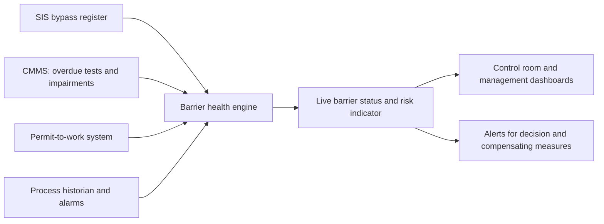
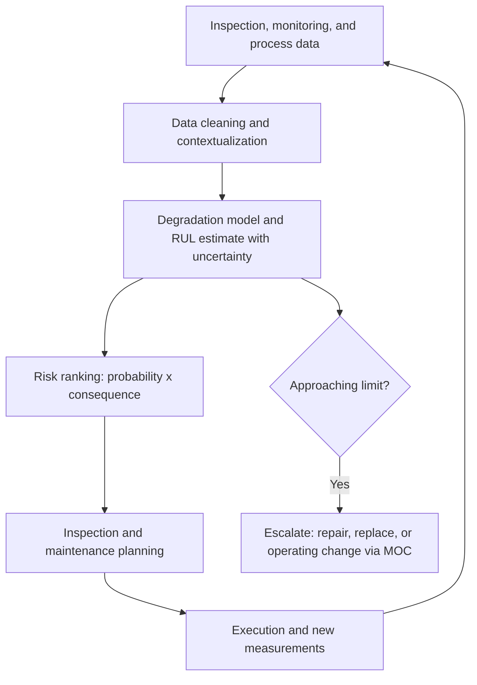
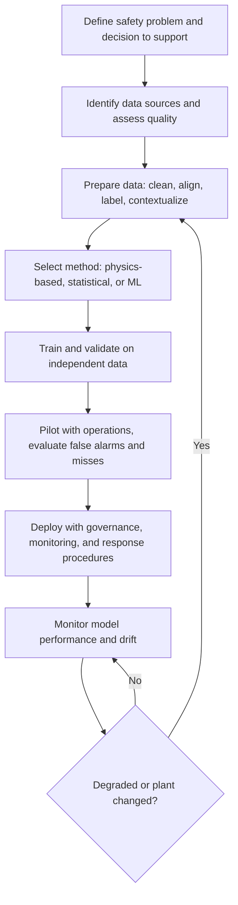

## Digitalization and Predictive Analytics in Process Safety

**Overview**

Digitalization in process safety refers to the use of sensors, connectivity, data platforms, analytics, and software tools to improve how hazards are identified, barriers are monitored, risks are quantified, and decisions are made across the asset lifecycle. Predictive analytics is the subset that uses historical and real-time data, statistical models, and machine learning (ML) to anticipate abnormal conditions, equipment degradation, and elevated risk before they escalate into loss of containment or other major incidents. Together, these capabilities shift practice from periodic, document-based, and largely retrospective safety management toward continuous, data-informed, and forward-looking barrier management. They also introduce new hazards of their own: data quality problems, model error, over-reliance on automation, and cybersecurity exposure. Digital tools support, but do not replace, engineering judgment, competent people, and sound safety management systems.

**Key Points**

- The main value areas are: real-time barrier and risk monitoring, early fault detection, predictive maintenance and integrity management, smarter alarm and operator support, digital management of change and permit-to-work, incident and near-miss analytics, and workforce safety technologies.
- Predictive models are only as good as their data, their validation, and their operational integration; a model that is not trusted, understood, or acted upon does not reduce risk.
- Analytics should target the failure modes and barrier weaknesses identified in hazard analysis, rather than being deployed as generic "AI initiatives."
- Digital systems used in safety-relevant decisions require governance: data quality management, model validation, change control, cybersecurity, and clear human accountability.
- Digital tools do not change the fundamentals: independent, tested barriers and competent, well-led organizations remain the basis of major hazard control.

---

### Foundations

**Digital Building Blocks**

| Layer | Examples | Role in Process Safety |
| --- | --- | --- |
| Sensing and acquisition | Process transmitters, vibration, acoustic, thermal cameras, gas detectors, wearables, drones, smart valves | Capture condition data from equipment, process, and environment |
| Connectivity | Industrial networks, wireless (for example, WirelessHART, ISA100), edge gateways, 5G private networks | Move data reliably and securely |
| Data infrastructure | Process historians, data lakes, time-series databases, asset registries, CMMS and EAM systems | Store, contextualize, and integrate data |
| Analytics | Statistical process control, physics-based models, ML, rule engines, digital twins | Detect, diagnose, predict |
| Applications | Dashboards, alerts, mobile tools, digital work management, decision support | Deliver insight to people |
| Governance and security | Data quality rules, model management, OT cybersecurity, access control | Keep the system trustworthy |

**Data Types Relevant to Safety**

- **Process time-series data**: temperatures, pressures, flows, levels, compositions, valve positions, and setpoints.
- **Alarm and event data**: alarm activations, operator actions, SIS trips, bypasses, and shelved alarms.
- **Equipment condition data**: vibration, thermography, corrosion probes, thickness measurements, lubricant analysis.
- **Inspection and maintenance records**: inspection findings, work orders, deferred maintenance, proof test results.
- **Safety management records**: incident and near-miss reports, audits, MOC records, permits, training records.
- **Unstructured text**: incident narratives, operator logs, and shift handover notes (accessible through natural language processing).
- **Contextual data**: weather, staffing, production schedules, and operating mode.

**Data Quality Dimensions**

Analytics quality depends on completeness, accuracy, timeliness, consistency, and traceability (lineage). Common issues in process plants include sensor drift and freezing, missing tags, inconsistent tag naming, changed instrument ranges without documentation, and time misalignment between systems.

---

### Application Areas

#### 1. Real-Time Barrier and Risk Monitoring

Barrier management asks whether safety-critical barriers are available and effective at any moment. Digital tools can aggregate barrier status from multiple sources into a live picture.

**Typical Inputs**

- Safety-critical element (SCE) impairments and overdue tests.
- Active SIS bypasses, inhibited detectors, and disabled alarms.
- Open permits and simultaneous operations.
- Activated deluge or firewater pump availability.
- Process conditions relative to operating limits (safe operating envelopes).

**Dynamic (Real-Time) Risk Indicators**

A simple dashboard concept combines the count and criticality of degraded barriers with current activities. A more quantitative approach, sometimes called dynamic risk assessment, updates a risk estimate as conditions change. For a scenario with initiating event frequency $f_{\text{init}}$ and independent layers with probabilities of failure on demand $\text{PFD}_j$, the mitigated frequency is:

$$f_{\text{mitigated}} = f_{\text{init}} \times \prod_{j=1}^{n} \text{PFD}_j$$

If a layer is bypassed or degraded, its $\text{PFD}_j$ effectively rises (up to 1 if unavailable), and the calculated frequency rises accordingly. Presenting this change makes the consequence of an impairment visible to operations and management. The values are estimates from a model; they should be treated as decision support and not as precise predictions. [Inference: The validity of dynamic quantitative risk indicators depends on the fidelity of the underlying scenario models, and practices vary widely between organizations.]

**Example (Illustrative)**

A high-pressure scenario has $f_{\text{init}} = 0.1$ per year with an alarm-plus-operator layer ($\text{PFD} = 0.1$), an SIF ($\text{PFD} = 0.01$), and a relief valve ($\text{PFD} = 0.01$), giving $f = 0.1 \times 0.1 \times 0.01 \times 0.01 = 10^{-6}$ per year. If the SIF is bypassed for maintenance (effective $\text{PFD} = 1$), the frequency becomes $10^{-4}$ per year, a hundredfold increase. A monitoring system that flags this, and prompts compensating measures or limits on simultaneous activities, converts a document-based requirement into a live control.

**Diagram: Barrier Health Data Flow (text form)**

#### 2. Early Fault Detection and Abnormal Situation Prevention

Abnormal situations develop over minutes to hours; earlier detection widens the time available to respond.

**Methods**

| Method | Description | Typical Use |
| --- | --- | --- |
| Statistical process control (SPC) | Control charts detect shifts and trends beyond expected variation | Stable, well-understood processes |
| Multivariate statistical methods | Principal component analysis (PCA), partial least squares (PLS) detect deviations in correlation structure among many variables | Fault detection in complex units |
| First-principles models | Compare measured values against physics-based predictions (mass and energy balance, thermodynamics) | Detecting sensor faults, leaks, fouling |
| Machine learning anomaly detection | Autoencoders, isolation forests, one-class classifiers learn normal behavior and flag deviations | Complex systems with abundant normal data |
| Rule-based and expert systems | Encoded logic from hazard analysis and operating experience | Known failure signatures |
| Supervised classification | Trained on labeled historical faults to classify fault types | Where sufficient labeled events exist |

**Multivariate Detection Statistics**

In PCA-based monitoring, two statistics are commonly used. Hotelling's $T^2$ measures variation within the model subspace, and the squared prediction error (SPE, or Q statistic) measures deviation from the model:

$$T^2 = \mathbf{t}^{\top} \mathbf{S}^{-1} \mathbf{t}, \qquad Q = \mathbf{e}^{\top}\mathbf{e} = \left\| \mathbf{x} - \hat{\mathbf{x}} \right\|^2$$

where $\mathbf{t}$ is the vector of principal component scores, $\mathbf{S}$ is the covariance matrix of the scores, $\mathbf{x}$ the measurement vector, and $\hat{\mathbf{x}}$ its reconstruction from the model. Thresholds are set from statistical distributions or empirical percentiles so that the false alarm rate is acceptable. A high $Q$ indicates that a new kind of deviation is occurring that the model has not seen; a high $T^2$ indicates an extreme value within the known structure.

**Practical Considerations**

- Establish the model on data representing normal operation, excluding known faults and transients that are not representative.
- Operating modes (startup, shutdown, grade changes, rate changes) may require separate models or mode detection.
- False alarms erode trust; tuning thresholds and using persistence rules (requiring several consecutive violations) helps.
- Early warnings must map to an actionable response; otherwise they simply add to alarm load.

**Example: Simple Leak Detection by Mass Balance**

For a liquid pipeline segment with measured inflow $\dot{m}_{\text{in}}$ and outflow $\dot{m}_{\text{out}}$, and inventory change $\dot{m}_{\text{acc}}$ (from line pack estimates), an imbalance suggests a leak:

$$\Delta \dot{m} = \dot{m}_{\text{in}} - \dot{m}_{\text{out}} - \dot{m}_{\text{acc}}$$

A persistent $\Delta \dot{m}$ beyond measurement uncertainty triggers investigation. Modern computational pipeline monitoring uses more advanced transient models, but the principle is the same. Sensitivity depends on instrument accuracy, and the method cannot detect leaks smaller than the noise band.

#### 3. Predictive Maintenance and Mechanical Integrity

Predictive maintenance uses condition data to estimate remaining useful life (RUL) or the probability of failure within a time horizon, guiding inspection and repair timing.

**Approaches**

- **Condition-based maintenance**: act when a condition indicator crosses a threshold (for example, vibration amplitude).
- **Prognostics**: model degradation trajectory and estimate time to threshold.
- **Risk-based inspection (RBI)**: prioritizes inspection by probability and consequence of failure, guided by standards such as API RP 580 and 581. Digital RBI tools update risk as inspection data and operating conditions change.
- **Corrosion modeling**: combine thickness measurements, process conditions (temperature, composition, flow), and corrosion mechanisms to predict corrosion rates.

**Corrosion Rate and Remaining Life**

Given two thickness measurements $t_1$ and $t_2$ taken $\Delta T$ apart, a short-term corrosion rate is:

$$CR = \frac{t_1 - t_2}{\Delta T}$$

and the remaining life to the minimum required thickness $t_{\min}$ is estimated as:

$$RL = \frac{t_2 - t_{\min}}{CR}$$

Standards such as API 570 (piping) and API 510 (pressure vessels) use this framework, typically applying a fraction of the calculated remaining life as the maximum inspection interval (for example, half the remaining life, subject to the applicable code's caps). Digital analytics can refine this using many measurement points, process history, and statistical treatment of uncertainty; the applicable code governs the inspection interval that is accepted for compliance.

**Diagram: Predictive Integrity Workflow (text form)**

**Key Caution**

Predictive maintenance reduces risk only when the failure mechanism is observable in the data with enough lead time. Sudden failure modes (for example, some brittle fractures or overpressure events) may not give warning, so predictive analytics complements, but does not replace, design margins, relief systems, and inspection regimes.

#### 4. Alarm Management and Operator Decision Support

Poor alarm performance (floods, chattering, stale alarms) has contributed to several incidents. Digital analytics support the alarm lifecycle described in ISA-18.2 and IEC 62682.

**Analytics Applications**

- Alarm rate statistics: average alarms per operator per hour, peak rates, percentage of time in flood, and top-bad-actor alarms.
- Chattering and stale alarm detection.
- Alarm rationalization support: linking alarms to consequences, response times, and operator actions.
- Dynamic or state-based alarming: adjusting alarm limits and suppression based on operating mode.
- Root cause and first-out analysis: identifying the initiating event in a cascade.
- Advanced operator displays and guidance: high-performance HMI concepts, procedural automation, and decision support that recommends actions.

**Illustrative Benchmarks**

ISA-18.2 and the EEMUA 191 guidance offer reference figures for manageable alarm rates (commonly cited: on the order of one alarm per operator per 10 minutes during steady state as a manageable level, with alarm floods defined as more than 10 alarms in 10 minutes). Site targets should follow the applicable standard and local rationalization. [Inference: Benchmarks are guidance and vary in interpretation across organizations.]

#### 5. Digital Twins and Simulation

A digital twin is a virtual representation of a physical asset or process that is kept synchronized with real data and can be used for monitoring, analysis, and what-if evaluation.

**Safety-Relevant Uses**

- Operator training simulators for abnormal situations and emergency response.
- Dynamic simulation to evaluate transient scenarios (relief loads, depressurization, emergency shutdown behavior).
- What-if evaluation of proposed changes before implementation (supporting MOC).
- Real-time consequence modeling (dispersion, fire, explosion) linked to current weather and inventory for emergency response.
- Structural or fatigue tracking for offshore and other structures.

**Fidelity and Validation**

The value of a twin depends on model fidelity and calibration. A twin that has drifted from the plant's actual state (because of unrecorded changes or aging) can give misleading guidance. Model validation against plant data, and model change control aligned with plant MOC, are essential.

#### 6. Digital Work Management: Permit-to-Work, MOC, and Handover

Digital tools can address several failure patterns seen in major incidents, such as unclear equipment status, poor communication at shift change, and unreviewed changes.

**Capabilities**

- **Electronic permit-to-work (ePTW)**: a single, real-time record of active permits, integration with isolation management, automatic detection of conflicting or simultaneous operations, and visibility of suspended work.
- **Digital isolation management**: verification of isolation points, lock and tag tracking, and integration with P&IDs.
- **Digital MOC**: workflow enforcement so that changes cannot be implemented without required reviews and approvals, with links to affected documents, hazard studies, and training.
- **Structured electronic handover**: standardized handover templates with mandatory fields for abnormal conditions, bypasses, and open permits.
- **Mobile inspection and operator rounds**: guided checklists, geotagged and time-stamped readings, and photo capture.

These tools reduce reliance on memory and scattered paper records, but they introduce the risk of "checkbox" behavior; effectiveness depends on process discipline and user acceptance.

#### 7. Incident, Near-Miss, and Audit Analytics

- **Text analytics and natural language processing (NLP)**: classify and cluster large volumes of incident and near-miss narratives to find recurring causes, precursors, and latent conditions that are difficult to spot manually.
- **Leading indicator dashboards**: track process safety indicators (for example, API RP 754 tiers) and trends, including overdue actions and test compliance.
- **Precursor analysis**: examine sequences of minor events preceding major ones, to identify signals worth intervening on.
- **Cross-site learning**: search and compare events across facilities, and link corrective actions to the sites that could be affected.

**Caution**

Reporting culture drives data quality. If workers fear blame, reported data undercount events, and analytics will reflect reporting behavior more than actual risk. Analytics of incident data should be interpreted with awareness of this bias.

#### 8. Workforce and Field Safety Technologies

- **Wearables**: gas detectors, location tracking, fall detection, and fatigue or heat stress monitoring.
- **Personnel tracking for muster and emergency response**: real-time knowledge of who is where.
- **Drones and robots**: inspection of confined spaces, elevated structures, flare stacks, tank interiors, and hazardous zones, reducing human exposure.
- **Computer vision**: detection of unsafe conditions or behaviors, such as missing PPE, intrusions into exclusion zones, leaks visible by optical gas imaging, and smoke or flame.
- **Augmented reality (AR)**: remote expert support and guided procedures.

Use of personal monitoring raises privacy, ethics, and labor relations considerations that require transparent policy and worker consultation. Devices used in hazardous (classified) areas must be certified for the area classification (for example, intrinsically safe equipment).

---

### Predictive Modeling Methodology

**Typical Workflow**

**Diagram: Analytics Lifecycle (text form)**

**Data Preparation Issues Specific to Process Data**

- Time alignment of signals with different sampling rates and delays (for example, analyzer lags).
- Handling of instrument outages, flatlined values, and outliers.
- Labeling of events: historical failure and fault labels are often incomplete or inaccurate.
- Rare events: major hazards are by design rare, so there are few or no examples of the failures of greatest interest; supervised learning on such events is limited.

**Model Selection**

| Situation | Suitable Approach |
| --- | --- |
| Well-understood physics, limited data | First-principles or hybrid (physics plus data-driven correction) |
| Abundant normal data, few faults | Anomaly detection (unsupervised or semi-supervised) |
| Adequate labeled failure history | Supervised classification or regression |
| Sequential degradation | Prognostic models (for example, survival analysis, state-space models, recurrent networks) |
| Text data | NLP methods |

**Performance Metrics**

For classification and detection, the confusion matrix defines true positives (TP), false positives (FP), true negatives (TN), and false negatives (FN). Common metrics are:

$$\text{Precision} = \frac{TP}{TP + FP}, \qquad \text{Recall} = \frac{TP}{TP + FN}, \qquad F_1 = \frac{2 \cdot \text{Precision} \cdot \text{Recall}}{\text{Precision} + \text{Recall}}$$

In safety applications, the costs of false negatives (missed real faults) and false positives (nuisance alerts that erode trust and consume attention) must be weighed explicitly. For rare events, accuracy is a poor metric because a model that always predicts "no fault" can appear highly accurate; precision, recall, and lead time to event are more meaningful. Lead time, meaning how far ahead of the failure a useful warning is issued, is often the deciding measure of practical value.

**Worked Example (Illustrative)**

A detection model is evaluated on one year of historical data containing 20 genuine early-fault events. It flags 16 of them in advance (TP = 16, FN = 4) and raises 40 alerts that were not associated with real faults (FP = 40):

$$\text{Precision} = \frac{16}{16+40} \approx 0.29, \qquad \text{Recall} = \frac{16}{16+4} = 0.80$$

An 80 percent detection rate looks good, but a precision of about 29 percent means that roughly seven out of ten alerts are false, which can lead to alert fatigue. The team may tune thresholds, add persistence logic, or route low-confidence alerts to an engineer instead of the operator. The values are hypothetical.

**Uncertainty Quantification**

Predictions should be accompanied by an estimate of uncertainty (for example, confidence or prediction intervals for RUL, or calibrated probabilities), so decision-makers can weigh how much to rely on them.

**Explainability**

Operators and engineers are more likely to trust and correctly use a model whose output can be explained (for example, contributing variables to an anomaly flag, feature importance, or a comparison against similar past events). Explainability also supports investigation and validation.

---

### Governance, Risk, and Limitations

**Model Risk**

- **Data drift and concept drift**: the process, feedstock, or equipment changes, so the relationship the model learned no longer holds.
- **Extrapolation**: models can perform poorly outside the range of training data, precisely in abnormal conditions where they are needed most.
- **Spurious correlations**: models may latch onto incidental patterns unrelated to causation.
- **Adversarial or corrupted inputs**: manipulated or faulty sensor data can mislead models.
- **Automation bias and complacency**: operators may over-trust recommendations, or conversely ignore them after false alarms.

**Governance Elements**

| Element | Practice |
| --- | --- |
| Ownership | Named owner accountable for each model and dashboard, including business and technical roles |
| Validation | Independent review of data, method, and performance before use in safety-relevant decisions |
| Change control | Model updates, retraining, and threshold changes follow a documented MOC process |
| Monitoring | Ongoing tracking of model performance, drift, and alert outcomes |
| Documentation | Purpose, assumptions, limitations, training data, and version history |
| Human oversight | Defined decision authority: analytics inform and humans decide, unless a function has been designed and verified as an automated safety function |
| Competence | Training for users on what the tool can and cannot do |

**Relationship to Functional Safety**

Analytics and ML-based tools are generally **not** substitutes for SIS, relief systems, or other independent protection layers. A safety instrumented function relies on deterministic, verifiable behavior and meets the requirements of IEC 61511. If a digital or ML-based function were to be credited as a protection layer, it would have to meet the requirements applicable to that layer, including independence, integrity, and verifiability, which is typically difficult for opaque ML models. The prevailing practice is to use predictive analytics in advisory roles (monitoring, prediction, decision support) and keep protective actions in deterministic, certified safety systems. [Inference: Standards and regulatory positions on ML in safety-critical functions are still evolving, and organizations should follow current guidance from standards bodies and regulators.]

**Cybersecurity**

Connecting operational technology (OT) to analytics platforms, cloud services, and remote access increases the attack surface. Good practice includes:

- Network segmentation with defined zones and conduits, following IEC 62443 concepts, and a demilitarized zone between OT and IT.
- Unidirectional gateways or data diodes where data flows one way from OT to analytics.
- Strict control of remote access, multi-factor authentication, and monitoring.
- Patch and vulnerability management with change control.
- Special protection of safety systems: analytics should not have write access to the SIS.
- Cyber risk assessment integrated with process hazard analysis, including consideration of malicious manipulation of process and safety systems. Incidents such as the 2017 TRITON/TRISIS malware attack on a safety system illustrate that safety systems can be targeted.

**Data Governance and Privacy**

- Define data ownership, retention, and access policies.
- Address privacy for worker monitoring data (location, physiological data), with clear purpose limitation and consultation.
- Ensure integrity and traceability of records used in regulatory compliance and investigations.

**Organizational and Human Factors**

- **Adoption**: tools that do not fit workflows, or produce excessive alerts, are ignored.
- **Skills**: organizations need people who understand both the process and the analytics, and effective collaboration between process safety engineers, operators, data scientists, and IT/OT specialists.
- **Change management**: introduction of new tools is a change requiring training, procedures, and evaluation of effects on roles and workload.
- **Complacency risk**: dashboards showing "green" can mask what is not measured; digital indicators must be periodically challenged against reality (for example, through field verification and audits), consistent with the lesson from major incidents that reported indicators may not reflect true barrier condition.

---

### Connection to Lessons from Major Incidents

| Recurrent Weakness | Digital Opportunity | Caution |
| --- | --- | --- |
| Barriers assumed healthy but impaired (for example, untested alarms) | Live barrier health monitoring, automated tracking of overdue tests and bypasses | Data must reflect actual field condition, not just administrative status |
| Permit and handover failures | Integrated ePTW, structured digital handover | Process discipline still required; avoid box-ticking |
| Unreviewed changes | Digital MOC workflow enforcement | Emergency and temporary changes still need real engineering review |
| Ignored warnings and near misses | NLP and trend analytics on reports, precursor detection | Reporting culture determines data completeness |
| Misleading instrumentation | Sensor validation and data reconciliation to detect faulty measurements | Analytics can also be misled by bad data |
| Alarm floods | Alarm analytics and dynamic alarming | Rationalization must be done by competent teams |
| Weak inspection prioritization | Digital RBI and predictive integrity | Uncertain models need conservative decisions and adequate margins |

---

### Practical Application

**Example: Selecting and Scoping a First Use Case**

A facility considers a predictive analytics pilot. A structured approach:

1. **Choose a scenario from the hazard register** with meaningful risk and where early warning is physically plausible (for example, fouling or plugging that leads to overpressure, or rotating equipment degradation leading to seal failure and release).
2. **Define the decision**: who will do what differently when the model alerts, and what lead time is needed to act?
3. **Assess data availability**: sensor coverage, history length, labeled events, and quality.
4. **Establish a baseline**: how are these events detected today, with what lead time and false alarm rate?
5. **Pilot in shadow mode**: run alongside existing practice and record alerts without operational action to measure performance.
6. **Set acceptance criteria**: for example, minimum lead time, maximum false alerts per month, and engineering review of every alert.
7. **Deploy with governance**: owner, documented limitations, response procedure, monitoring plan, and MOC for changes.
8. **Review benefits and issues** after a defined period, including operator feedback.

**Example: Barrier Health Indicator**

An organization may compute a simple, transparent indicator of safety-critical barrier health at unit level:

$$H = \frac{N_{\text{available and in-date}}}{N_{\text{total safety-critical barriers}}} \times 100\%$$

with a weighted version that gives higher weight to barriers protecting higher-consequence scenarios. Trends in $H$, the number of active bypasses, and the age of open impairments are reviewed by management, with defined thresholds that trigger actions such as limiting hot work or reducing throughput. The value of the indicator lies in the response process it triggers, not the number itself.

**Example: Alarm Performance Snapshot**

For a control room, an analytics report might show, per operator position: average alarm rate per hour, peak 10-minute alarm count, percentage of time in flood, top 10 most frequent alarms, and stale alarms (active longer than a defined period). A program targets the top 10 alarms first, since a small number of alarms typically account for a large fraction of activations, consistent with the 80/20 pattern often observed in alarm data. The figures vary widely by site.

---

### Facts vs. Uncertainty

- The technical concepts described (SPC, PCA-based monitoring, RBI, corrosion-rate and remaining-life calculation, LOPA-based frequency calculation, and precision/recall metrics) are well established.
- Effectiveness of predictive analytics is highly application- and data-dependent; claims of specific accuracy, cost reduction, or incident prevention should be verified with evidence from the specific deployment and are not guaranteed by the technology.
- Numeric examples, thresholds, and benchmarks are illustrative; real values must be derived from site data and applicable standards.
- The role of machine learning within credited safety functions is an evolving area; standards, regulatory expectations, and best practice may change, and current guidance should be consulted.
- Alarm benchmarks and inspection interval rules are quoted at a general level; the applicable edition of the standard or regulation governs compliance.
- Cybersecurity threats and mitigation practice evolve quickly; the measures listed are general and should be updated against current guidance.

**Conclusion**

Digitalization and predictive analytics offer meaningful opportunities to make process safety more proactive: seeing barrier health in real time, detecting abnormal conditions and degradation earlier, focusing inspection and maintenance where risk is highest, and learning from data across incidents and sites. Realizing these benefits depends on sound data, validated and governed models, integration into decisions and procedures, careful attention to cybersecurity, and a culture that continues to verify what dashboards report. The most reliable path is to anchor digital initiatives in the hazards and barrier weaknesses already identified through hazard analysis, keep protective functions in deterministic, verified systems, and treat analytics as a way of strengthening human judgment and organizational learning rather than replacing them.

**Related Topics**

- Functional Safety and Safety Instrumented Systems Lifecycle
- Barrier Management and Bow-Tie Analysis
- Alarm Management (ISA-18.2 / IEC 62682)
- Risk-Based Inspection (API RP 580/581)
- Dynamic Risk Assessment and Real-Time Risk Monitoring
- Digital Twins and Dynamic Process Simulation
- Electronic Permit-to-Work and Digital MOC
- Cybersecurity for Industrial Control and Safety Systems (IEC 62443)
- Machine Learning for Anomaly Detection and Prognostics
- Leading and Lagging Process Safety Indicators
- Human Factors and Human-Automation Interaction
- Common Themes and Systemic Lessons Across Major Incidents