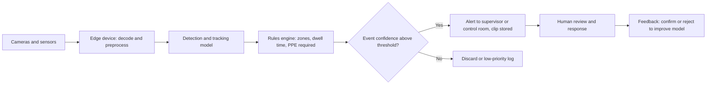
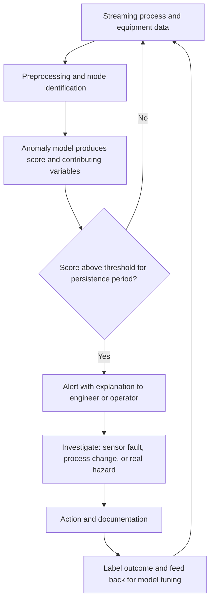
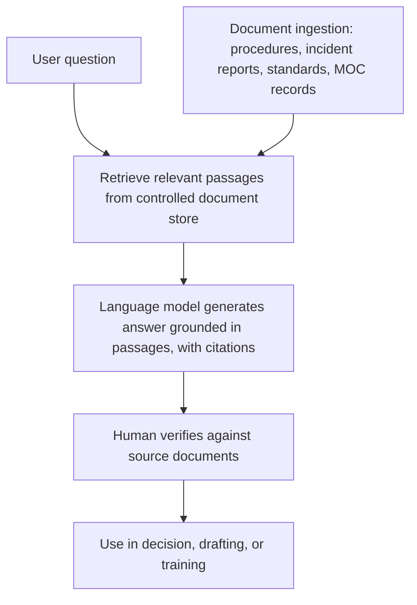
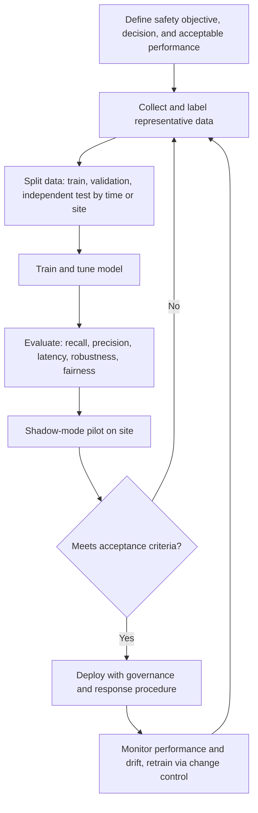

## Artificial Intelligence Applications in Safety Monitoring

**Overview**

Artificial intelligence (AI) in safety monitoring refers to the use of machine learning (ML), deep learning, computer vision, natural language processing (NLP), and related techniques to observe workplaces, processes, equipment, and people, and to detect hazardous conditions, unsafe behaviors, and early signs of failure with less delay and greater coverage than manual observation alone. In Process Safety Management (PSM) and occupational safety, typical applications include computer vision for personal protective equipment (PPE) compliance and exclusion-zone intrusion, optical detection of fires, smoke, and leaks, anomaly detection on process and equipment data, acoustic and vibration monitoring, text analytics of incident reports, worker wellness and fatigue monitoring, and intelligent decision support for operators and emergency responders. AI systems extend human vigilance but introduce their own failure modes, including false alarms, missed detections, bias, drift, privacy intrusion, cybersecurity exposure, and over-reliance. They are best treated as monitoring and decision-support layers that complement, and do not replace, engineered safeguards, competent people, and sound management systems.

**Key Points**

- The main application families are: visual monitoring (computer vision), process and equipment anomaly detection, acoustic and vibration analytics, text and knowledge analytics (NLP and large language models), wearables and worker-state monitoring, autonomous inspection (drones and robots), and emergency response support.
- Performance must be judged in operational terms: detection rate, false alarm burden, lead time, and reliability under real site conditions (lighting, weather, occlusion, dust, vibration), not laboratory accuracy alone.
- AI monitoring functions are generally advisory. Protective actions that must be reliable and verifiable belong in deterministic, independently verified safety systems (for example, IEC 61511 safety instrumented functions).
- Governance is essential: data quality, model validation, change control, performance monitoring, cybersecurity, privacy and ethics, and clear human accountability.
- Rare, high-consequence events offer few training examples, so AI is often strongest on frequent, observable precursors (such as PPE non-compliance, small leaks, and equipment degradation) and weakest at predicting unprecedented major accidents.

---

### Foundations

**AI Technique Families Relevant to Safety**

| Technique | Description | Typical Safety Use |
| --- | --- | --- |
| Supervised learning | Learns a mapping from labeled examples to outputs | Classifying PPE presence, fire versus non-fire images, fault types |
| Unsupervised and semi-supervised learning | Learns structure of normal data without extensive labels | Process and equipment anomaly detection |
| Deep learning (convolutional and transformer networks) | Multi-layer networks learning hierarchical features from images, audio, and sequences | Object detection, video analytics, acoustic classification |
| Time-series and sequence models | Recurrent, temporal convolutional, and transformer models | Prognostics, forecasting, sequential anomaly detection |
| Reinforcement learning | Learns actions by trial and reward, usually in simulation | Research and limited applications in control and optimization; rarely used in safety-critical functions |
| Natural language processing | Processes text; includes classification, entity extraction, and generative language models | Incident report analysis, procedure search, regulatory review |
| Generative AI and large language models (LLMs) | Generate text or other content from prompts | Drafting and summarizing safety documents, knowledge retrieval, hazard analysis assistance (with human verification) |
| Edge AI | Running models on local devices near the sensor | Low-latency video analytics, operation without cloud connectivity |

**Detection Versus Prediction Versus Prescription**

- **Detection**: recognizes a condition that is present or emerging (for example, a person without a hard hat, a flame in the field of view).
- **Prediction**: estimates the likelihood or timing of a future event (for example, remaining useful life of a bearing).
- **Prescription**: recommends actions (for example, suggested operator response), which requires greater validation because errors have direct operational consequences.

**Data Modalities**

Images and video, audio and acoustic emissions, vibration and other high-frequency signals, thermal imagery, gas concentration and process time series, location and motion data from wearables, text (reports, logs, procedures), and structured records (work orders, permits, audit findings).

---

### Application Areas

#### 1. Computer Vision for Workplace and Site Monitoring

Cameras (fixed CCTV, pan-tilt-zoom units, vehicle-mounted, drone-mounted, or wearable) combined with object detection and pose estimation models can monitor large areas continuously.

**Typical Use Cases**

| Use Case | What the Model Detects | Consideration |
| --- | --- | --- |
| PPE compliance | Hard hats, high-visibility vests, gloves, eye protection, harnesses | Occlusion, camera angle, and small objects reduce accuracy |
| Exclusion zone and geofence intrusion | Person or vehicle entering restricted areas (for example, near crane loads or energized equipment) | Requires accurate camera calibration and zone definition |
| Vehicle and pedestrian interaction | Proximity of forklifts and people | Often combined with proximity sensors for robustness |
| Unsafe acts and postures | Working at height without fall protection, lifting posture, missing barricades | Behavioral inference is error-prone and sensitive |
| Housekeeping and hazard conditions | Spills, obstructions, open manholes, missing guards | Depends on the diversity of training data |
| Fire, smoke, and flame detection | Visible flames and smoke in video | Must be validated against false triggers (sunlight, hot work, steam) |
| Optical gas imaging (OGI) analytics | Infrared imaging of hydrocarbon leaks with automated plume detection | Environmental conditions (wind, background temperature) affect sensitivity |
| Steam, liquid leak, and corrosion visual cues | Visual indicators of leaks, staining, and deterioration | Better as an inspection aid than a sole detector |
| Access control and permit verification | Confirming that only authorized, trained persons enter a zone | Privacy and identification concerns |

**Object Detection Metrics**

Detection models are commonly evaluated with intersection over union (IoU) and mean average precision (mAP). For a predicted bounding box $B_p$ and ground-truth box $B_g$:

$$\text{IoU} = \frac{|B_p \cap B_g|}{|B_p \cup B_g|}$$

A detection is usually counted as correct if IoU exceeds a threshold (for example, 0.5). Average precision summarizes the precision-recall trade-off across confidence thresholds. Operational safety use also needs event-level metrics: the fraction of real incidents alerted (recall), the number of false alerts per camera per day, and the alert latency.

**Diagram: Video Analytics Pipeline (text form)**

**Practical Considerations**

- Site-specific conditions strongly affect performance: lighting changes, night operation, rain, fog, glare, camera vibration, and heat shimmer.
- Models trained on generic datasets often need fine-tuning on site imagery.
- The false alert burden matters: a system producing many false alerts is likely to be ignored or switched off.
- Equipment installed in hazardous (classified) areas must be certified for the area classification (for example, explosion-proof or intrinsically safe housings).
- Human review of alerts before disciplinary or enforcement use is advisable, given model error and fairness concerns.

#### 2. Fire, Smoke, and Gas Leak Detection Enhancements

AI can augment, but generally not replace, certified fire and gas detection systems.

- **Vision-based flame and smoke detection**: can cover open areas where point detectors are impractical, and can provide early visual confirmation to operators.
- **Ultrasonic gas leak detection with ML**: gas leaks from pressurized systems emit ultrasound; ML classifiers help distinguish leak signatures from background industrial noise.
- **Thermal and OGI analytics**: automated identification of leak plumes and hot spots.
- **Sensor fusion**: combining multiple detectors (point gas, open-path, flame, camera) and process data to reduce false alarms and to verify events.

**Sensor Fusion and Confidence**

Where detectors provide independent evidence, a simple probabilistic fusion can be illustrated with Bayes' rule. For hypothesis $H$ (real event) and observations $E_1$ and $E_2$ assumed conditionally independent:

$$P(H \mid E_1, E_2) = \frac{P(E_1 \mid H)\, P(E_2 \mid H)\, P(H)}{P(E_1 \mid H)\, P(E_2 \mid H)\, P(H) + P(E_1 \mid \neg H)\, P(E_2 \mid \neg H)\, P(\neg H)}$$

The conditional independence assumption is often only approximately true; correlated failures or shared environmental interference reduce the benefit. Fusion improves confidence only if the underlying detectors have genuinely independent error behavior.

**Important Boundary**

Statutory and standards-based fire and gas systems are designed, verified, and tested against defined performance criteria (for example, using IEC 61511 and applicable detection standards). An AI system that is not validated to those criteria should not be credited as a protection layer, and it should not be used to inhibit or delay certified alarms. [Inference: Practice and regulatory acceptance for AI-based detection in safety-rated roles are still developing and vary by jurisdiction.]

#### 3. Process and Equipment Anomaly Detection

Building on the methods in digital process safety (statistical monitoring, multivariate analysis, first-principles models), machine learning extends detection to complex, nonlinear, high-dimensional data.

**Common Approaches**

| Method | Idea | Notes |
| --- | --- | --- |
| Autoencoders | Neural network trained to reconstruct normal data; large reconstruction error signals anomaly | Sensitive to training data selection; can reconstruct anomalies if too flexible |
| Isolation forest | Randomly partitions data; anomalies are isolated in fewer splits | Fast, works with tabular features |
| One-class support vector machines | Learns a boundary around normal data | Sensitive to kernel and parameter choices |
| Long short-term memory (LSTM) and temporal models | Predict next values; large prediction error flags anomalies | Captures temporal dependencies |
| Hybrid physics-informed models | Combine first-principles constraints with learned components | Better extrapolation and interpretability |

**Reconstruction Error Score**

For an autoencoder with input vector $\mathbf{x}$ and reconstruction $\hat{\mathbf{x}}$, an anomaly score is often:

$$s = \left\| \mathbf{x} - \hat{\mathbf{x}} \right\|^2$$

with an alert threshold chosen from the distribution of scores on validation data representing normal operation (for example, a high percentile), balancing false alarms against sensitivity.

**Operating Context**

Operating mode, grade changes, startup, and shutdown create legitimate departures from steady-state behavior. Models should be aware of mode (through mode classifiers or separate models), or they will misinterpret normal transients as faults.

**Diagram: Anomaly Response Loop (text form)**

#### 4. Acoustic and Vibration Analytics

- **Rotating equipment health**: ML classifiers on vibration spectra and time-domain features detect imbalance, misalignment, bearing wear, and gear faults earlier than simple overall-level alarms.
- **Acoustic emission and ultrasonic monitoring**: detect crack growth, leaks, and valve passing.
- **Audio-based detection**: gunshot, alarm, and abnormal sound recognition for security and safety contexts.

**Bearing Fault Frequencies**

Characteristic bearing defect frequencies, used as features or to interpret model outputs, depend on geometry. For example, the ball pass frequency of the outer race for a bearing with $N_b$ balls, shaft speed $f_r$, ball diameter $d$, pitch diameter $D$, and contact angle $\theta$ is:

$$\text{BPFO} = \frac{N_b}{2} f_r \left(1 - \frac{d}{D}\cos\theta\right)$$

Spectral peaks at such frequencies (and their harmonics and sidebands) indicate specific faults. Combining physics-based feature engineering with ML often outperforms purely black-box approaches, particularly when labeled failures are scarce.

#### 5. Natural Language Processing and Large Language Models

Safety management generates large volumes of text: incident and near-miss reports, investigation reports, audit findings, hazard study records, permits, operator logs, procedures, regulations, and standards.

**Applications**

| Application | Description | Cautions |
| --- | --- | --- |
| Classification and coding of incident reports | Assign categories, causes, and contributing factors consistently | Taxonomy quality and labeling consistency limit accuracy |
| Trend and cluster analysis | Find recurring themes and weak signals across many narratives | Reporting culture biases what appears in the data |
| Information extraction | Pull equipment tags, locations, and consequences from free text | Requires domain-tuned models |
| Semantic search and retrieval | Find relevant past incidents, lessons, procedures, and standards by meaning | Retrieval quality determines answer quality |
| Drafting and summarization | Draft procedures, summaries of investigations, or hazard study records | Requires human verification for accuracy |
| Hazard study assistance | Suggest deviations, causes, or safeguards during HAZOP preparation | Must not replace team-based multidisciplinary review |
| Regulatory and standards Q&A | Answer questions grounded in specified documents | Risk of fabricated or outdated citations |

**Retrieval-Augmented Generation (RAG)**

Instead of relying on a language model's internal knowledge alone, RAG retrieves relevant passages from a controlled document collection and instructs the model to answer using those passages, citing them. This improves traceability and reduces, but does not eliminate, fabrication.

**Diagram: RAG for Safety Knowledge (text form)**

**Specific Risks of Generative Models**

- **Hallucination**: fluent but incorrect or invented statements, including nonexistent references or values.
- **Outdated or mismatched content**: models may cite superseded standards or provide guidance not applicable to the specific site.
- **Overconfidence**: answers may sound authoritative regardless of correctness.
- **Confidentiality**: sending sensitive design or incident data to external services may breach confidentiality or export control obligations.
- **Prompt injection and data poisoning**: malicious or erroneous content in retrieved documents can steer outputs.

Outputs used in safety-relevant work should be verified by competent people against authoritative sources, and generative AI should not be the sole basis for hazard identification, risk decisions, or procedure content.

#### 6. Wearables and Worker-State Monitoring

- **Wearable sensors**: multi-gas detectors, heat stress, heart rate, motion, fall detection, and lone-worker devices.
- **Fatigue and alertness monitoring**: models based on physiological signals, eye tracking, or performance measures estimate fatigue risk. Validation is challenging, and accuracy varies between individuals.
- **Location intelligence**: real-time tracking for muster, proximity warnings, and safe access management.
- **Ergonomic risk assessment**: motion capture and pose estimation to assess lifting and posture risk.

**Ethics and Privacy**

Worker monitoring raises significant concerns:

- Purpose limitation: data collected for safety should not be repurposed for performance management or discipline without clear policy and consent.
- Transparency and worker consultation on what is monitored, how it is used, and who has access.
- Data protection: compliance with applicable privacy law (for example, GDPR in the European Union, or the Data Privacy Act in the Philippines, depending on jurisdiction), including data minimization, retention limits, and security.
- Trust: monitoring perceived as surveillance can undermine reporting culture and safety climate.
- Accuracy and fairness: models may perform differently across body types, skin tones, and working styles, and errors have real consequences for individuals.

#### 7. Autonomous Inspection: Drones and Robots

- **Aerial drones**: inspect flares, stacks, tanks, roofs, and elevated structures without scaffolding or rope access, reducing exposure to fall and confined-space hazards.
- **Ground and crawler robots**: patrol facilities, read gauges, detect gas and thermal anomalies, and enter hazardous or confined spaces.
- **Underwater and in-line inspection**: remotely operated and autonomous vehicles for tank and pipeline inspection.
- **AI analysis of inspection imagery**: automated defect detection (cracks, corrosion, coating damage) and change detection over repeated inspections.

Equipment for hazardous areas must be appropriately certified and its use covered by the permit-to-work and area classification requirements. Autonomy introduces failure modes (loss of communication, navigation errors, collision), which require their own risk assessment.

#### 8. Emergency Response and Decision Support

- **Consequence modeling with live data**: automated dispersion, fire, and explosion modeling driven by current weather and release data to support evacuation and response decisions.
- **Situational awareness platforms**: integrate detector alarms, camera feeds, personnel locations, and plant status into a common operating picture.
- **Automated notification and workflow**: routing alerts to the right responders.
- **Training and simulation**: AI-driven scenarios for operators and responders.

In emergencies, decision support must be robust, fast, and understandable; unverified model outputs should not override established emergency procedures and the judgment of the incident commander.

---

### Model Development and Validation

**Lifecycle**

**Key Methodological Points**

- **Representative data**: training data should cover the range of conditions the system will meet, including different shifts, seasons, lighting, and equipment states.
- **Avoid leakage**: random splitting of time-series or video data can place near-identical samples in both training and test sets, inflating apparent performance. Split by time period, camera, or site.
- **Labeling quality**: inconsistent or noisy labels limit performance. Use clear labeling guidelines and review, and quantify inter-annotator agreement.
- **Class imbalance**: real hazards are rare relative to normal data; use appropriate metrics and sampling strategies.
- **Robustness testing**: evaluate under degraded conditions (low light, occlusion, sensor noise) and with adversarial or out-of-distribution inputs.
- **Calibration**: predicted probabilities should reflect actual frequencies (reliability), so thresholds are meaningful. A calibration measure such as expected calibration error can be tracked.
- **Shadow-mode evaluation**: run the system alongside current practice without acting on its alerts, and compare against ground truth from human observation.

**Performance Metrics for Detection Systems**

$$\text{Precision} = \frac{TP}{TP+FP}, \quad \text{Recall} = \frac{TP}{TP+FN}, \quad \text{False alarm rate} = \frac{FP}{\text{monitored time}}$$

Where TP, FP, and FN are true positives, false positives, and false negatives. Safety applications emphasize both high recall for serious events and low false alarm rates for sustained use.

**Worked Example (Illustrative)**

A PPE detection system monitors an entry gate. Over a 30-day shadow trial, human auditors identify 120 genuine PPE non-compliance events. The system alerts on 102 of them (TP = 102, FN = 18) and raises 60 alerts that were not genuine (FP = 60):

$$\text{Recall} = \frac{102}{120} = 0.85, \qquad \text{Precision} = \frac{102}{102+60} \approx 0.63$$

With 60 false alerts over 30 days, the gate averages two false alerts per day. The site decides that this is tolerable for a supervisor-review workflow but not for automatic access denial. They add a confidence threshold and a two-frame confirmation rule, re-run the trial, and record the result. The numbers are hypothetical.

**Explainability**

Explanations (for example, highlighting the image region that triggered a detection, or listing the process variables contributing most to an anomaly score) help users judge whether an alert is credible and support investigation. Post-hoc explanation methods provide approximate insight, not guaranteed accurate causal accounts of model behavior.

---

### Risks, Limitations, and Governance

**Technical Limitations**

| Limitation | Consequence |
| --- | --- |
| Distribution shift and drift | Performance degrades as equipment, processes, cameras, or seasons change |
| Rare-event scarcity | Little or no data for the most severe scenarios |
| Correlation versus causation | Models may exploit spurious cues (for example, a background feature correlated with the label) |
| Sensitivity to input quality | Dirty lenses, sensor faults, or network loss degrade or disable monitoring |
| Opacity | Difficulty verifying behavior across all conditions |
| Adversarial vulnerability | Inputs can be manipulated to evade or trigger detection |
| Bias | Uneven performance across populations or conditions |

**Human Factors**

- **Automation bias**: tendency to accept the system's output uncritically.
- **Alert fatigue and complacency**: too many false alerts lead to ignored warnings; too few alerts breed reliance that the system will catch everything.
- **Skill degradation**: over-reliance may erode operator and inspector skills.
- **Role clarity**: users must know what the system does and does not cover.
- **Workload and interface design**: alerts should be prioritized, concise, and actionable.

**Governance Framework**

| Element | Practice |
| --- | --- |
| Purpose and scope | Documented safety objective, boundaries, and intended use |
| Risk assessment | Assess hazards of using the AI system, including failure modes and consequences of errors, integrated with hazard analysis |
| Ownership and accountability | Named owner responsible for performance, updates, and incident response |
| Validation and acceptance | Independent review and acceptance criteria before operational use |
| Change management | Retraining, threshold changes, and software updates handled through MOC |
| Monitoring | Ongoing performance tracking, drift detection, and audit of alert outcomes |
| Documentation | Model cards or equivalent: data sources, limitations, performance, and version |
| Human oversight | Clear human decision authority; escalation paths |
| Incident learning | Review cases where the system failed or misled, and feed back |
| Training | Users trained on capabilities, limitations, and appropriate response |

**Relevant Frameworks and Standards**

- ISO/IEC 42001 (AI management systems), and the NIST AI Risk Management Framework, offer general structures for managing AI risk.
- ISO/IEC 23894 provides guidance on AI risk management.
- Domain-specific safety standards (IEC 61508 and IEC 61511) constrain the use of ML in safety functions; IEC 61508 provides limited guidance for complex, non-deterministic software, and machine learning components are difficult to verify against its requirements. Emerging work (for example, ISO/IEC TR 5469 on functional safety and AI systems) addresses this gap. [Inference: This landscape is evolving, and guidance should be checked for current status.]
- Regulatory approaches to AI are emerging (for example, the EU AI Act, which classifies certain AI uses, including those in safety components and worker management, as high risk with associated obligations). Applicability depends on jurisdiction and use; consult current legal requirements.

**Relationship to Functional Safety**

An AI-based function that is not designed and verified to the applicable integrity requirements should not be credited as an independent protection layer or used in place of a safety instrumented function. A reasonable arrangement is:

1. Deterministic, certified systems provide the protective actions (trip, isolate, depressurize, alarm).
2. AI provides supplementary monitoring, early warning, prioritization, and decision support.
3. AI must not degrade the safety system: no write access to the SIS, no ability to bypass or inhibit protection, and clear separation of networks and privileges.

**Cybersecurity**

- Protect data pipelines, models, and platforms with segmentation, authentication, encryption, and logging, following IEC 62443 principles.
- Secure the model supply chain (third-party models, libraries, and data) against tampering.
- Consider attacks specific to AI, such as data poisoning, model extraction, and adversarial examples.
- Treat cloud and remote access carefully; consider edge deployment and one-way data flows from operational technology to analytics.

**Privacy and Ethics**

Video analytics and worker monitoring require policies on lawful basis, notice, retention, access, and prohibited uses, alongside consultation with workers and, where applicable, their representatives. Aim for the least intrusive means that achieve the safety objective (for example, detecting zone intrusion without identifying individuals, or blurring faces).

---

### Connection to Lessons from Major Incidents

| Recurrent Weakness | AI Opportunity | Caution |
| --- | --- | --- |
| Ignored precursors and weak signals | Anomaly detection and text analytics to surface patterns | Data completeness depends on reporting culture; alerts require a response process |
| Misleading instrumentation | Cross-checking measurements with models and other sensors | Models trained on faulty data may inherit its faults |
| Deteriorating barriers unnoticed | Condition monitoring and computer vision inspection | Monitoring must reflect actual physical condition, not proxies |
| Delayed emergency detection and response | Faster detection of fire, gas, and intrusions; live consequence modeling | Certified systems must remain primary; false alarms erode trust |
| Alarm overload | Intelligent alarm prioritization and suppression | Suppression logic must be validated, and must never hide safety-critical alarms |
| Knowledge loss and repeated mistakes | Semantic search across past incidents and lessons | Retrieved lessons must be verified and applied through management systems |

---

### Practical Application

**Example: Scoping a Computer Vision Pilot**

1. **Select a well-bounded problem** with clear visual definition and meaningful risk, such as unauthorized entry into a crane exclusion zone or PPE at a defined entry point.
2. **Define the response**: who receives the alert, how quickly they must act, and what they do.
3. **Assess the site**: camera placement, lighting, network, area classification, and privacy obligations.
4. **Consult workers and legal or privacy advisors** before deployment; set out data retention and access rules.
5. **Collect and label site data**, and fine-tune or select a model.
6. **Run a shadow trial** and measure recall, precision, false alerts per day, and latency against pre-defined acceptance criteria.
7. **Deploy with a human-in-the-loop workflow**, an owner, a fault-handling plan (what happens if cameras or the model fail), and periodic performance review.
8. **Manage change**: treat model updates and camera moves as changes requiring review.

**Example: Acceptance Criteria Sheet (Illustrative)**

| Criterion | Target | Measured |
| --- | --- | --- |
| Recall for zone intrusion events (daytime) | At least 95% | Determined in shadow trial |
| Recall (night, rain) | At least 85% | Determined in shadow trial |
| False alerts per camera per day | No more than 2 | Determined in shadow trial |
| Alert latency | Under 5 seconds from event | Determined in shadow trial |
| System availability | At least 99% during operating hours | Monitored |
| Fail-safe behavior | System fault raises a visible alarm to the operator | Verified by test |
| Privacy | No storage of identifiable images beyond defined retention | Audited |

The thresholds are examples; each site sets targets based on risk and operational context.

**Example: Human-AI Workflow for an Anomaly Alert**

1. The model raises an alert with a score and the top contributing variables.
2. The control room operator or process engineer reviews the alert, checks related instruments and field conditions, and rules out sensor faults.
3. If the hazard is real, established operating and emergency procedures apply; if it is a false alarm, the outcome is labeled and recorded.
4. Periodic review of alert outcomes adjusts thresholds and identifies model weaknesses, under change control.

---

### Facts vs. Uncertainty

- The technique families, evaluation metrics, and general governance practices described here are well established in the machine learning and safety literature.
- Reported accuracy, cost savings, and incident reduction from AI deployments vary widely and depend heavily on data, site conditions, and implementation; such claims should be verified with site-specific evidence and not assumed.
- Numeric values in examples (detection rates, false alarm counts, thresholds, and acceptance criteria) are illustrative and hypothetical.
- Standards and regulations for AI in safety-related roles (including functional safety treatment of ML and legislation such as the EU AI Act) are evolving; current versions and jurisdictional applicability should be confirmed.
- The effectiveness of generative AI in hazard analysis and safety documentation is an active area; outputs require verification, and best practices are still developing.
- [Inference: Applicability of certain techniques (for example, fatigue estimation from wearable signals, or behavior recognition from video) is less mature than object detection and equipment condition monitoring, and validation evidence for specific products may be limited.]

**Conclusion**

AI can strengthen safety monitoring by extending coverage, speeding detection, surfacing patterns in large data sets, and reducing human exposure to hazardous inspection tasks. Its benefits are realized when applications are chosen against identified hazards, validated under real conditions, integrated into clear response procedures, and governed for data quality, drift, cybersecurity, privacy, and human oversight. It carries corresponding risks, including false confidence, opaque failure modes, and erosion of trust if used as surveillance. The sound approach is to keep protective functions in deterministic, verified systems, use AI to inform and prioritize human decisions, and continue to test whether the digital picture matches physical reality, consistent with the persistent lesson from major incidents that barriers and indicators must be proven, not assumed.

**Related Topics**

- Digitalization and Predictive Analytics in Process Safety
- Functional Safety and Safety Instrumented Systems Lifecycle
- Computer Vision Techniques for Object Detection
- Machine Learning for Anomaly Detection and Prognostics
- Fire and Gas Detection Systems Design
- Alarm Management (ISA-18.2 / IEC 62682)
- Human Factors and Human-Automation Interaction
- AI Governance and Risk Management (ISO/IEC 42001, NIST AI RMF)
- Cybersecurity for Industrial Control and Safety Systems (IEC 62443)
- Privacy and Ethics in Workplace Monitoring
- Drone and Robotic Inspection in Hazardous Environments
- Large Language Models and Retrieval-Augmented Generation for Safety Knowledge
- Common Themes and Systemic Lessons Across Major Incidents