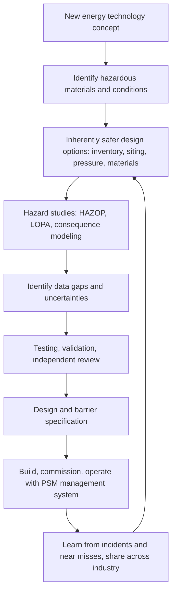
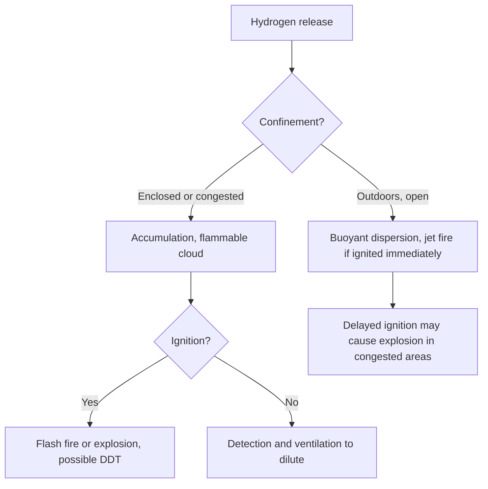

## Process Safety Considerations in Energy Transition Industries

**Overview**

The energy transition introduces or scales up industries whose hazards differ from, or are less mature than, those of conventional oil, gas, and chemical operations: hydrogen production and storage, ammonia as an energy carrier, carbon capture, utilization, and storage (CCUS), lithium-ion battery energy storage systems (BESS) and battery manufacturing, biofuels and renewable fuels, liquefied natural gas (LNG) and other cryogenic services, offshore wind, and emerging fuels such as methanol and synthetic fuels. Many of these industries involve familiar hazard mechanisms (flammability, toxicity, high pressure, low temperature, reactivity), but they do so with new materials, novel technologies, new operators with limited process safety experience, rapid scale-up, compressed schedules, and regulatory frameworks that lag deployment. The central process safety message is continuity: the fundamentals proven across decades of incidents (hazard identification, barrier management, management of change, mechanical integrity, competence, learning from events) apply fully, and the risk of repeating known failures is highest where new entrants and new technology meet incomplete standards.

**Key Points**

- Hazards must be understood from first principles for each technology: hydrogen (wide flammability range, very low ignition energy, embrittlement, invisible flame), ammonia (toxicity and, at scale, flammability), CO2 (dense-phase behavior, asphyxiation, running ductile fracture, and cold release effects), lithium-ion batteries (thermal runaway, toxic and flammable off-gas, re-ignition), and cryogens (rapid phase transition, brittle fracture, cold burns).
- Incident learning from analogous industries (refining, chemicals, LNG, pipelines) applies directly, but the data for new technologies is thinner, so uncertainty must be acknowledged and managed with conservatism and validation.
- Safety by design matters most at the concept stage, where inherently safer choices (inventory, siting, pressure, and materials) are cheapest to make.
- Novel technologies need testing, verification, and often independent review before scale-up; failure data, consequence models, and codes may not be validated for the specific conditions.
- Competence, safety culture, and management systems must be built deliberately in new organizations and supply chains; enabling process safety management (PSM) elements such as MOC, PHA, mechanical integrity, and emergency planning apply regardless of industry label.

---

### Foundations

**Why the Transition Changes the Risk Picture**

| Factor | Implication for Process Safety |
| --- | --- |
| New materials and conditions | Consequence models, materials selection, and codes may be immature or extrapolated |
| Rapid scale-up | Lessons from pilot plants may not carry over to commercial scale (for example, heat and mass transfer, inventory, and dispersion behavior) |
| New entrants | Operators from power, technology, or startup backgrounds may lack major hazard experience |
| Compressed schedules and cost pressure | Elevated risk that safety studies are shortened or deferred |
| Novel siting | Facilities near populations, in urban or industrial-park settings, or co-located with other hazards |
| Evolving regulation | Gaps and inconsistencies in codes, permits, and inspection regimes between jurisdictions |
| Supply chain complexity | Components with variable quality, immature certification, and limited operating history |
| Interfaces | Integration of process, electrical, control, and digital systems (for example, power-to-X plants tied to variable renewable supply) |

**Applying the Established Framework**

The Risk Based Process Safety (RBPS) elements of the Center for Chemical Process Safety (CCPS), the OSHA PSM elements (29 CFR 1910.119), and Seveso and COMAH-type frameworks remain applicable. Whether a facility falls under formal major hazard regulation depends on inventories and jurisdiction; some novel facilities fall below regulatory thresholds and yet present serious hazards, which makes voluntary adoption of PSM principles important. [Inference: Regulatory thresholds and applicability differ by jurisdiction and change over time; verify locally.]

**Diagram: Transferring Established Practice to New Technology (text form)**

---

### Hydrogen

**Role**

Hydrogen is produced by steam methane reforming (with or without carbon capture), electrolysis (alkaline, PEM, solid oxide), and other routes, and used as an industrial feedstock, fuel, energy carrier, and storage medium. It may be handled as compressed gas, cryogenic liquid, or bound in carriers (for example, ammonia or liquid organic hydrogen carriers).

**Key Hazard Properties (Approximate Values)**

| Property | Hydrogen | Comparison (Methane) |
| --- | --- | --- |
| Flammable range in air | About 4 to 75 vol% | About 5 to 15 vol% |
| Minimum ignition energy | About 0.02 mJ | About 0.29 mJ |
| Laminar burning velocity | Very high (roughly 2 to 3 m/s stoichiometric) | About 0.4 m/s |
| Density relative to air | About 0.07 | About 0.55 |
| Flame visibility | Nearly invisible in daylight | Visible |
| Detonability | Wide detonation limits, high detonation tendency in confinement | Lower |

Values are approximate and depend on temperature, pressure, and source; verify against authoritative data.

**Principal Hazards**

- **Leak and ignition**: Small leaks can ignite readily, including possible spontaneous ignition mechanisms for high-pressure releases (the diffusion ignition hypothesis is not fully resolved). [Speculation: The mechanism of spontaneous ignition of sudden high-pressure hydrogen releases remains debated.]
- **Buoyant dispersion**: Hydrogen rises rapidly outdoors, which favors ventilation, but it accumulates under ceilings and in enclosed or poorly ventilated spaces, forming flammable pockets.
- **Deflagration to detonation transition (DDT)**: Confinement and congestion promote flame acceleration; vapor cloud explosion overpressure can be severe.
- **Jet fires**: High-pressure releases produce jet fires that may be difficult to see; thermal imaging or flame detectors sensitive to hydrogen are needed.
- **Hydrogen embrittlement and material degradation**: Hydrogen can degrade some steels (especially high-strength steels and welds) and reduce fracture toughness and fatigue life. Material selection, weld quality, hardness limits, and standards such as ASME B31.12 (hydrogen piping and pipelines) apply.
- **Electrolyzer-specific hazards**: Oxygen-in-hydrogen and hydrogen-in-oxygen crossover producing flammable mixtures inside equipment, especially at low load; electrical hazards from high DC currents; caustic electrolyte (alkaline systems); and hydrogen and oxygen gas separator management.
- **Cryogenic liquid hydrogen**: Very low temperature (about 20 K), leading to condensation of oxygen (an enriched-oxygen hazard), cold burns, rapid pressure rise from boil-off, and brittle fracture; ortho-para conversion heat effects.
- **High-pressure storage**: Compressed gas storage at 350 to 700 bar (mobility) or higher, with composite pressure vessels, requires attention to fatigue, impact, and fire exposure; thermally activated pressure relief devices are used on vehicle tanks but may not address all fire scenarios.

**Illustrative Leak Consideration: Choked Release Mass Flow**

For a gas release through a small hole at high pressure, choked (sonic) flow applies when the upstream absolute pressure exceeds a critical value. The mass flow rate is:

$$\dot{m} = C_d A P_0 \sqrt{\frac{\gamma M}{R T_0}\left(\frac{2}{\gamma+1}\right)^{\frac{\gamma+1}{\gamma-1}}}$$

where $C_d$ is the discharge coefficient, $A$ the hole area, $P_0$ and $T_0$ the upstream absolute pressure and temperature, $\gamma$ the heat capacity ratio, $M$ the molar mass, and $R$ the universal gas constant. This standard expression gives the source term for dispersion and jet fire modeling. Even though hydrogen has low density, its high sound speed yields a high volumetric release rate, so a small hole at high pressure can release a significant volume of flammable gas quickly. Real assessments use validated consequence modeling tools and site-specific conditions.

**Safeguards and Design Practices**

- Inherently safer choices: minimize inventory, use outdoor or well-ventilated siting, and provide adequate separation distances (set from codes such as NFPA 2, and from consequence and risk analysis).
- Leak minimization: welded connections over flanged and threaded joints where practicable, appropriate seals, and leak testing.
- Detection: hydrogen-specific gas detectors at ceiling and high points; flame detection suitable for hydrogen (ultraviolet or ultraviolet/infrared with attention to hydrogen's spectral characteristics); thermal imaging.
- Ventilation and hazardous area classification (for example, using IEC 60079-10-1 and relevant hydrogen guidance), with electrical equipment suitable for hydrogen (gas group IIC).
- Pressure relief and venting to a safe location, with attention to static electricity and ignition on release.
- Purging and inerting procedures for startup and shutdown to avoid flammable mixtures inside equipment.
- Materials and welding suited to hydrogen service, and monitoring for degradation.
- Electrolyzer safety functions: gas purity monitoring (oxygen-in-hydrogen), pressure and differential pressure control, shutdown on abnormal conditions, and management of variable load operation.
- Ignition source control, including static and hot surfaces.

**Diagram: Hydrogen Release Scenarios (text form)**

---

### Ammonia as Fuel and Hydrogen Carrier

**Role**

Ammonia is a well-established industrial chemical with decades of operating experience in fertilizers and refrigeration. Its role is expanding as a hydrogen carrier, a marine fuel, a fuel for power generation (co-firing), and a storage medium for renewable energy. Larger volumes and new use contexts (ports, ships, bunkering, power plants) change exposure patterns.

**Key Hazards**

| Hazard | Description |
| --- | --- |
| Toxicity | Inhalation of ammonia causes respiratory tract injury; immediately dangerous to life or health (IDLH) is commonly cited at 300 ppm; toxic effects are the dominant hazard for large releases |
| Flammability | Narrow flammable range (about 15 to 28 vol% in air) and high minimum ignition energy make ignition difficult, but confined releases and oil-contaminated situations have burned or exploded |
| Cryogenic and pressurized storage | Refrigerated storage at about -33 °C at atmospheric pressure, or pressurized storage at ambient temperature |
| Corrosivity | Stress corrosion cracking of carbon steel in the presence of oxygen or air contamination, and attack on copper alloys, zinc, and some elastomers |
| Environmental toxicity | Highly toxic to aquatic life |
| Dense gas behavior | Cold releases with aerosol formation can behave as denser-than-air clouds, spreading at ground level |

Values are approximate; verify from safety data sheets and current references.

**Considerations for New Applications**

- **Marine fuel**: ammonia bunkering, fuel preparation, and engine room hazards; leak detection, ventilation, and toxic gas exposure in enclosed spaces; regulatory frameworks from the International Maritime Organization (IMO) and classification societies are still developing. [Inference: Rules and interim guidelines are evolving, so current versions should be checked.]
- **Power generation and co-firing**: nitrogen oxide formation, unburned ammonia slip, and handling infrastructure near populated areas.
- **Cracking to hydrogen**: high-temperature ammonia cracking reactors with hydrogen, nitrogen, and residual ammonia in the process streams.
- **Siting**: toxic dispersion distances often govern siting and emergency planning, with community warning and shelter-in-place strategies.

**Safeguards**

- Robust containment design, emergency isolation, and leak detection (fixed detectors, area monitors).
- Water spray or scrubbing systems for absorption of releases.
- Personal protective equipment and emergency response training specific to ammonia.
- Stress corrosion cracking prevention through oxygen exclusion, water content control (typically a small percentage of water as inhibitor in liquid ammonia), and material selection and stress relief.
- Emergency planning with community and port authorities.

---

### Carbon Capture, Utilization, and Storage

**Role**

CCUS captures CO2 from point sources or the air, conditions it (compression, dehydration, and sometimes liquefaction), transports it (pipeline, ship, truck, or rail), and injects it for geological storage or uses it in products.

**Key Hazards**

| Hazard | Description |
| --- | --- |
| Asphyxiation and toxicity | CO2 is denser than air and accumulates in low areas; concentrations of a few percent cause physiological effects and higher levels cause rapid incapacitation; unlike some hazardous gases, it is not flammable, so hazards depend on dispersion and terrain |
| Dense-phase and supercritical behavior | Operating at high pressure (often above the critical pressure of about 73.8 bar and near ambient temperature), where properties change strongly with temperature and pressure |
| Rapid decompression and cold effects | Release from dense phase leads to very low temperatures (down to the sublimation temperature of about -78.5 °C at atmospheric pressure), dry ice formation, and cold embrittlement of materials |
| Running ductile fracture | Pipelines carrying dense-phase CO2 have a distinctive decompression behavior in which the pressure can remain high near the crack tip, potentially sustaining crack propagation; standard fracture arrest methods calibrated for natural gas may not apply directly |
| Impurities | Water, hydrogen sulfide, SOx, NOx, oxygen, and amines can cause corrosion (carbonic acid in the presence of free water), toxicity issues, and altered phase behavior |
| Capture solvent hazards | Amine solvents can be corrosive, toxic, and prone to degradation, with potential for nitrosamine formation and emissions |
| Well integrity | Leakage through wells, especially legacy wells, and induced seismicity concerns |
| Dispersion in terrain | Dense CO2 can pool in depressions, which was a factor in the 1986 Lake Nyos natural disaster and in the 2020 Satartia, Mississippi pipeline release, where a CO2 pipeline rupture led to the hospitalization of dozens of people. [Verify: Details of the Satartia incident are documented in the U.S. PHMSA failure investigation report; consult it for accurate figures and causes.] |

**Considerations**

- Pipeline design must consider fracture control, corrosion (strict water content control), material selection, and appropriate shutdown valve spacing. Standards include DNV-RP-F104 (design and operation of CO2 pipelines) and ISO 27913 (CO2 pipeline transportation systems).
- Dispersion modeling must capture dense gas effects, terrain, and low wind conditions, and emergency planning must address asphyxiant exposure, engine stalling (combustion engines can stall in CO2-rich air), and evacuation guidance.
- Fixed and portable CO2 detection with alarms is appropriate in enclosed and low-lying areas.
- Storage site characterization and monitoring, well construction, and integrity management are part of the overall safety case.

**Illustrative Consideration: Pipeline Depressurization**

Because dense-phase CO2 decompresses through a phase boundary during rupture, the "plateau" pressure at saturation can influence crack propagation. A simplified conceptual criterion compares the crack propagation driving pressure with the pipe's arrest capability:

$$P_{\text{arrest}} > P_{\text{decompression plateau}}$$

The full assessment uses coupled decompression and fracture models (for example, the Battelle two-curve method adapted for CO2) and full-scale testing. The relation above is conceptual and illustrative only.

---

### Lithium-Ion Batteries and Battery Energy Storage Systems

**Role**

BESS are deployed for grid balancing, renewable integration, and backup power, and battery manufacturing and recycling are growing industries. Lithium-ion chemistries (for example, lithium iron phosphate (LFP), nickel manganese cobalt (NMC), and nickel cobalt aluminum (NCA)) differ in energy density, thermal stability, and off-gas composition.

**Thermal Runaway**

Thermal runaway is a self-accelerating, exothermic chain of reactions triggered when a cell is abused (overheating, overcharge, short circuit, mechanical damage) or has an internal defect. Heat generation exceeds heat removal, temperature climbs rapidly, and the cell can vent flammable, toxic gases and, in some cases, ignite. Propagation to neighboring cells and modules can convert a single-cell failure into a large fire.

**Heat Balance Concept**

$$m c_p \frac{dT}{dt} = \dot{Q}_{\text{gen}}(T) - \dot{Q}_{\text{loss}}(T)$$

where $m c_p$ is the thermal mass of the cell, $\dot{Q}_{\text{gen}}$ the heat generation rate (which increases sharply with temperature once decomposition reactions begin), and $\dot{Q}_{\text{loss}}$ the heat loss to surroundings. Runaway occurs when generation exceeds loss and the gap widens as temperature rises. This is the classical thermal explosion (Semenov) framing, applied conceptually here; actual battery behavior involves multiple staged reactions (for example, solid electrolyte interphase decomposition, separator collapse, cathode decomposition, and electrolyte combustion).

**Hazards**

| Hazard | Description |
| --- | --- |
| Fire | Electrolyte and cell materials are combustible; fires can reignite after apparent extinguishment |
| Vent gas explosion | Off-gas contains hydrogen, carbon monoxide, hydrocarbons, and electrolyte vapors; accumulation in enclosed containers can produce explosions (deflagrations), as has occurred in BESS incidents |
| Toxic emissions | Hydrogen fluoride (from fluorinated electrolytes and binders), carbon monoxide, and other toxic gases |
| Electrical hazards | High DC voltages, arc flash, and stored energy that persists even when isolated |
| Stranded energy and re-ignition | Damaged cells can retain charge and reignite hours or days later |
| Water and runoff | Contaminated firewater runoff; water use debate depending on chemistry and configuration |
| Manufacturing hazards | Flammable solvents (for example, N-methyl-2-pyrrolidone), dust from active materials, electrolyte handling, and moisture-sensitive materials in dry rooms |
| Recycling hazards | Handling damaged or unknown-state cells, shredding hazards, and fires |

**Notable Learning**

The Moss Landing (California, 2025) and other BESS fires, and the 2019 McMicken (Arizona) BESS explosion that injured firefighters, are widely discussed. The McMicken investigation highlighted the hazard of accumulated flammable off-gas in an enclosed container and inadequate emergency response planning and system design for propagation and gas explosion. [Verify: Details and conclusions of these incident investigations are documented in official and technical reports; consult primary sources for accuracy.]

**Safeguards and Design Practices**

- Cell-level safety: quality control, chemistry choice (LFP generally has higher thermal stability than NMC), and certified cells and modules (for example, UL 1973 for stationary batteries, UL 9540 for energy storage systems, and UL 9540A test method for thermal runaway fire propagation).
- Battery management system (BMS): monitors voltage, current, and temperature; balances cells; and disconnects on abnormal conditions. The BMS is itself a safety-relevant system needing rigorous design and independence considerations.
- Fire and explosion protection standards such as NFPA 855 (installation of stationary energy storage systems), including spacing, fire detection, suppression, explosion control (deflagration venting or prevention through ventilation and gas detection), and large-scale fire testing.
- Off-gas detection (for example, hydrogen, carbon monoxide, and volatile organic compounds) and ventilation or explosion venting design to prevent accumulation.
- Thermal management: cooling, and design to limit propagation between cells and modules.
- Siting and separation distances from occupied buildings, other equipment, and vegetation; access for emergency response.
- Emergency response planning with local fire services, including specific guidance on strategy (for example, defensive operations, cooling of adjacent containers, and management of runoff).
- Commissioning and change management, including verification that installed configurations match tested and certified configurations, since deviations can invalidate fire test results.
- End-of-life and damaged battery handling procedures.

---

### LNG and Cryogenic Systems

**Context**

LNG is a transition fuel and an export commodity, and cryogenic technology also underpins hydrogen liquefaction and industrial gases. LNG has a long operating history, but new facilities, small-scale LNG, and LNG bunkering introduce new operators and settings.

**Key Hazards**

- Cryogenic liquid spills causing brittle fracture of unsuitable steels and cold burns.
- Rapid phase transition (RPT) when LNG contacts water, which can cause physical explosions without combustion.
- Vapor cloud formation, flash fire, pool fire, and, in congested or confined areas, vapor cloud explosion.
- Boil-off and rollover in storage tanks (stratification followed by rapid vapor release).
- BLEVE-type events are less common for refrigerated storage, but pressurized vessels exposed to fire can fail.

**Practices**

- Codes and standards such as EN 1473, NFPA 59A, and API standards for LNG facilities.
- Spill containment (impounding basins), cryogenic-rated materials, spill detection, and vapor dispersion modeling to define exclusion zones.
- Rollover management through tank monitoring and mixing.
- Marine operations safety: ship-to-shore interface, emergency release systems, and bunkering procedures.

---

### Biofuels, Renewable Fuels, and Other Emerging Fuels

**Examples**

- **Biodiesel, renewable diesel, and sustainable aviation fuel (SAF)**: processing using hydroprocessing (hydrogen at high pressure and temperature), esterification (methanol and catalysts), and feedstock handling.
- **Ethanol and bioethanol**: flammable liquids with fire and explosion risks at storage and production, fermentation hazards (CO2 asphyxiation), and dust from grain handling.
- **Methanol**: toxic and flammable, with a nearly invisible flame in daylight; expanding as a marine fuel and e-fuel.
- **Renewable feedstock variability**: contaminants and variable composition affecting corrosion, fouling, and reactivity.
- **Anaerobic digestion and biogas**: methane and hydrogen sulfide hazards, confined spaces, and explosion risks.
- **Biomass and dust handling**: combustible dust explosions (for example, wood pellets, torrefied biomass), self-heating, and off-gassing from stored biomass leading to toxic atmospheres in enclosed spaces. Standards such as NFPA 652, 654, and 61 address combustible dust management.

**Repurposing Existing Assets**

Converting refineries to renewable fuels or reusing existing pipelines and tanks for hydrogen, ammonia, or CO2 requires careful assessment of material compatibility, remaining life, design conditions, and the change in hazards. This is a major management of change exercise, not a routine modification, and it must include hazard studies, integrity reassessment, and updated emergency planning.

---

### Other Transition Contexts

**Power-to-X and Integrated Systems**

Facilities that convert renewable electricity to hydrogen, ammonia, methanol, or synthetic fuels experience variable feed rates and frequent start-ups and shutdowns, stressing equipment (thermal cycling, fatigue) and control systems, and increasing the frequency of transient, higher-risk operating modes.

**Offshore Wind and Marine Renewable Energy**

- Hazards include work at height, marine operations, lifting, confined spaces, electrical hazards (high voltage subsea cables, switchgear), and helicopter and vessel transfers.
- Process safety principles apply to hydraulic and lubrication systems, and to offshore substations and convertor platforms (fire, SF6 handling in gas-insulated switchgear, battery rooms). Integration of hydrogen production offshore adds hydrogen hazards in a remote, congested setting.

**Solar Manufacturing and Critical Minerals**

- Polysilicon production involves chlorosilanes, which are flammable, corrosive, and react violently with water.
- Battery materials and mineral processing involve toxic, corrosive, and reactive substances, with tailings and dust hazards.
- Other components involve silane (pyrophoric), arsine and phosphine (highly toxic gases in semiconductor and thin-film manufacture).

**Geothermal and Hydropower Contexts**

Geothermal operations have hydrogen sulfide, high-temperature, and high-pressure hazards; hydropower has structural, confined space, and electrical hazards. Traditional process safety tools apply where hazardous fluids and pressure systems are present.

**Nuclear**

Nuclear power and small modular reactors have their own safety regimes (nuclear safety regulation, defense in depth), which are outside the scope of conventional process safety management, though shared principles exist.

---

### Cross-Cutting Themes

**1. Novelty and Uncertainty**

- **Data gaps**: failure rates, consequence model validation, material behavior, and incident histories are limited. Use conservative assumptions, sensitivity analysis, and experimental validation.
- **Extrapolation risk**: models validated at one scale or condition may not hold at another (for example, hydrogen dispersion in confined geometries or CO2 fracture behavior).
- **Pilot-to-commercial scale-up**: safety studies should be repeated at each scale, and lessons from pilot incidents and near misses collected.
- **Independent review**: third-party review of novel designs and safety cases adds challenge to internal assumptions.

**2. Management of Change in Transitioning Assets**

Retrofitting existing facilities for new services (for example, hydrogen blending in gas networks, repurposing pipelines, or co-firing ammonia) alters hazards and must be handled with rigorous MOC and mechanical integrity assessment. The Flixborough lesson on unreviewed modifications remains directly relevant.

**3. Competence and Culture in New Entrants**

- Organizations from technology, utilities, or startup backgrounds may not have inherited process safety culture, leadership expectations, or the discipline of PSM.
- Fast-growth environments risk understaffing safety functions and relying on contractors with uneven experience.
- Leaders should set expectations, resource process safety competence early, use recognized frameworks (for example, RBPS), and track leading indicators.

**4. Siting, Land Use, and Public Interface**

- New facilities may be closer to communities, and public acceptance is influenced by early incidents; high-profile accidents can slow deployment of a whole technology.
- Consequence-based and risk-based siting, buffer zones, and emergency planning with authorities are essential, including community communication.

**5. Standards, Codes, and Regulation**

- Standards are developing rapidly; conflicting or incomplete requirements may exist. Where no specific standard applies, adopt best available guidance from analogous industries and conservative engineering practice.
- Examples of relevant standards and guidance include ISO 19880 (gaseous hydrogen fueling stations), ISO 22734 (water electrolysis hydrogen generators), NFPA 2 (Hydrogen Technologies Code), ASME B31.12, NFPA 855, UL 9540 and 9540A, DNV recommended practices for CO2 and hydrogen, and IEC 60079 series for hazardous areas. Editions and adoption status vary; verify current versions and local regulatory adoption.

**6. Digital and Cyber Interfaces**

- Grid-connected, remotely operated, and highly automated facilities have large cyber-attack surfaces. Cybersecurity for safety and control systems (IEC 62443) needs to be integrated with hazard analysis.
- BESS and electrolyzers rely on software (BMS, controls) whose failures can be safety-critical, so lifecycle software assurance and change control are needed.

**7. Emergency Response Readiness**

- Local fire services may have limited experience with hydrogen, ammonia at scale, CO2 pipelines, or BESS fires. Provide site-specific pre-incident plans, training, and joint exercises, and share hazard information.

**8. Lessons from Major Incidents Still Apply**

| Established Lesson | Energy Transition Relevance |
| --- | --- |
| Management of change (Flixborough) | Repurposing assets; design changes during rapid scale-up |
| Barrier integrity and verification (Bhopal, Texas City, Buncefield) | BESS protection systems, hydrogen detection, electrolyzer safeguards, and overfill protection on new storage |
| Learning from near misses and warnings (Piper Alpha, Texas City) | Sparse but critical early incident data should be shared and acted upon |
| Siting of people (Texas City, Flixborough) | Placement of control rooms, containers, and workers near novel hazards |
| Leadership and culture (Deepwater Horizon, Texas City) | Startup and growth-phase organizations under schedule and cost pressure |
| Functional safety discipline | Safety instrumented systems in electrolyzers, ammonia and hydrogen systems |

---

### Practical Application

**Example: Early-Stage Hazard Screening Checklist for a New Energy Technology**

1. **Materials**: What hazardous materials are present (flammable, toxic, reactive, cryogenic, asphyxiant), in what quantities and conditions? Are there hazardous intermediates, by-products, or degradation products?
2. **Hazard properties**: Are authoritative data available for flammability, toxicity, reactivity, and phase behavior across the operating envelope, including upset and abnormal conditions?
3. **Inherent safety**: Can inventory, pressure, temperature, or hazardous material be reduced, substituted, or moderated? Can the design be simplified?
4. **Scenarios**: What are the credible worst-case and representative release, fire, explosion, toxic, thermal runaway, and asphyxiation scenarios, and are the consequence models validated for these conditions?
5. **Siting**: Where are people, buildings, and other hazards relative to the facility, and what are the impact zones?
6. **Barriers**: Which independent, testable barriers prevent or mitigate each scenario, and how will their health be verified during operation?
7. **Data gaps**: What is unknown or extrapolated? What tests, pilots, or expert reviews will address the gaps?
8. **Organization**: Who has the competence to operate and maintain the facility safely, and how will the management system be resourced?
9. **Emergency**: What are the emergency response arrangements, and have responders been engaged?
10. **Standards**: Which codes and standards apply, and where they are absent, what analogous guidance is used?

**Example: Screening Distance Concept for Toxic or Flammable Release**

An initial screening might estimate the distance to a defined concentration threshold $C_{\text{th}}$ (for example, a toxic endpoint such as an emergency response planning guideline concentration or a fraction of the lower flammable limit) from a continuous release of rate $Q$ using a simple Gaussian plume relation at ground level along the centerline:

$$C(x) = \frac{Q}{\pi \, u \, \sigma_y(x)\, \sigma_z(x)}$$

where $u$ is wind speed and $\sigma_y$ and $\sigma_z$ are dispersion coefficients depending on downwind distance $x$ and atmospheric stability. The distance at which $C(x) = C_{\text{th}}$ gives an approximate hazard distance. This simple model applies to neutrally buoyant gas releases and is inappropriate for dense gases (for example, cold ammonia or CO2 clouds) or buoyant releases with significant momentum, for which dense-gas or integral models and computational fluid dynamics are used. The relation is included to illustrate the concept; real assessments require validated tools and expert judgment.

**Example: BESS Site Safety Review Elements**

| Element | Questions |
| --- | --- |
| Design certification | Does the installed configuration match the tested and certified configuration (for example, UL 9540A test data)? |
| Propagation control | What prevents a single-cell failure from cascading, and what does large-scale fire testing show? |
| Gas management | How are flammable off-gases detected, ventilated, or vented to prevent explosive atmospheres in enclosures? |
| Detection and alarm | What early warning (for example, off-gas, voltage, temperature) is available, and what are the automatic responses? |
| Suppression | Is the suppression strategy consistent with chemistry and test evidence? |
| Emergency response | Does the pre-incident plan address access, water supply, runoff, toxic smoke, and reignition, and have responders been trained? |
| Siting | Are separation distances to buildings, boundaries, and vegetation adequate for the scenarios? |
| Operations | How are BMS alarms managed, and what limits the operation of degraded systems? |

---

### Facts vs. Uncertainty

- The general hazard characteristics of hydrogen, ammonia, CO2, lithium-ion batteries, and cryogens are well documented; specific numerical properties in this text are approximate and should be verified from authoritative sources.
- Consequence modeling and failure data for novel or scaled-up configurations (for example, large-scale liquid hydrogen spills, high-pressure hydrogen jets in congested layouts, dense-phase CO2 pipeline fracture, and BESS large-scale fire and explosion behavior) carry significant uncertainty, and models should be validated and used conservatively.
- Standards and regulations for many transition technologies are evolving, and applicability differs by jurisdiction; details such as ammonia as a marine fuel, hydrogen codes, and BESS requirements change frequently.
- Descriptions of specific incidents (for example, Satartia, McMicken, Moss Landing) are summarized at a high level; consult primary investigation reports for accurate facts and conclusions.
- Quantitative examples (release equations, plume model, and heat balance) are simplified illustrations, not design methods.
- [Speculation: The future incident record for emerging technologies is uncertain, and lessons will continue to develop as operating experience accumulates.]

**Conclusion**

The energy transition expands the range of facilities that handle hydrogen, ammonia, CO2, large battery inventories, cryogens, and novel fuels, often with new operators, compressed schedules, and immature standards. The hazards are frequently variations on familiar themes (fire, explosion, toxicity, asphyxiation, brittle fracture, and thermal runaway), but the specific behaviors, data gaps, and scale-up uncertainties require deliberate analysis and conservatism. The most reliable path is to apply proven process safety fundamentals from the outset: inherently safer design and siting, rigorous hazard studies, verified barriers, disciplined management of change (especially when repurposing assets), competence and leadership in new organizations, engagement with emergency responders and communities, and systematic learning from incidents and near misses across the industry. Treating safety as an enabler of deployment, and not a constraint on it, supports both public trust and the durability of the transition itself.

**Related Topics**

- Hydrogen Safety: Production, Storage, and Distribution
- Ammonia Safety and Toxic Release Management
- Carbon Capture and Storage Safety, and CO2 Pipeline Integrity
- Battery Energy Storage System Fire and Explosion Safety (NFPA 855, UL 9540A)
- LNG and Cryogenic Facility Safety
- Combustible Dust Hazards in Biomass Processing
- Management of Change for Repurposed Assets
- Hazardous Area Classification (IEC 60079)
- Consequence Modeling: Dispersion, Fire, and Explosion
- Inherently Safer Design
- Emergency Response Planning with Community and Responders
- Digitalization and Predictive Analytics in Process Safety
- Artificial Intelligence Applications in Safety Monitoring
- Common Themes and Systemic Lessons Across Major Incidents