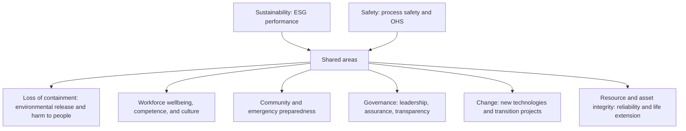
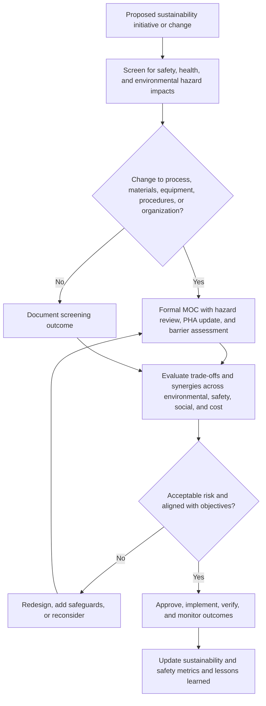

## Integrating Sustainability and Safety Management

**Overview**

Sustainability management addresses an organization's environmental, social, and governance (ESG) performance: emissions, energy and resource use, waste, water, biodiversity, human rights, community relations, workforce wellbeing, ethics, and long-term resilience. Safety management, including Process Safety Management (PSM) and occupational health and safety (OHS), addresses the prevention of harm to people, assets, and the environment from operational hazards. The two fields overlap heavily: a major process safety event is also an environmental, social, and financial sustainability failure, and many sustainability initiatives (decarbonization, electrification, circularity, new fuels, remote operations, workforce transitions) create or change safety hazards. Yet in many organizations they are governed by separate teams, metrics, and reporting lines, which creates gaps, duplicated effort, and conflicting priorities. Integration means aligning objectives, risk assessment, management systems, performance indicators, reporting, and decision-making so that sustainability commitments are pursued without eroding safety, and safety performance is recognized as a core component of sustainable operation.

**Key Points**

- Safety is a foundational element of sustainability. Worker safety, health, and process safety appear in the social ("S") pillar and, through loss of containment and environmental release, in the environmental ("E") pillar, and both depend on governance ("G") quality.
- Sustainability initiatives can introduce hazards through new technologies, altered processes, retrofits, energy-efficiency measures, and changes to feedstocks and operating modes, so they must pass through the same hazard identification and management of change (MOC) as any other change.
- Trade-offs and synergies must be examined openly. Examples include energy recovery that increases process complexity, flare reduction that affects relief system reliability, and waste minimization that concentrates hazardous materials.
- Integrated management systems built on shared structures (for example, ISO high-level structure) reduce duplication and support consistent leadership, risk-based thinking, and continuous improvement.
- Credible reporting requires accurate, consistent, and auditable safety data, and it should include process safety metrics alongside personal injury rates so that reporting does not reward low injury rates that mask major hazard risk.

---

### Foundations

**Terminology**

| Term | Meaning |
| --- | --- |
| Sustainability | Meeting present needs without compromising the ability of future generations to meet theirs; in corporate practice, managing environmental, social, and economic impacts and dependencies |
| ESG | Environmental, social, and governance factors used to assess and report organizational performance and risk |
| HSE / EHS / HSSE | Health, safety, and environment (with variations adding security) management functions |
| Process safety | Management of hazards from loss of containment of hazardous materials or energy |
| Occupational safety and health | Prevention of work-related injury and ill health |
| Double materiality | Considering both how sustainability issues affect the organization (financial materiality) and how the organization affects people and the environment (impact materiality) |
| Just transition | Managing the shift to a low-carbon economy in ways that are fair to workers and communities |
| Triple bottom line | People, planet, and profit as three dimensions of performance |

**Why Integration Matters**

1. **Shared consequences**: A major incident causes fatalities and injuries (social), releases and emissions (environmental), and financial loss, license-to-operate damage, and governance scrutiny (economic and governance).
2. **Shared drivers**: Leadership commitment, culture, competence, and resource allocation influence both safety and sustainability outcomes.
3. **Interacting changes**: Decarbonization and circular economy strategies create new process configurations and new hazards, as discussed under emerging fuels and technologies in the energy transition.
4. **Stakeholder expectations**: Investors, regulators, customers, insurers, and communities increasingly ask for integrated, verifiable disclosure of both safety and sustainability performance.
5. **Efficiency**: Common tools (risk assessment, audits, incident and non-conformance management, MOC, contractor management, and training) can serve multiple objectives when the systems are coordinated.

**Diagram: Overlap of Safety and Sustainability Domains (text form)**

---

### Relationship Between Safety and Each ESG Pillar

#### Environmental

| Environmental Topic | Safety Connection |
| --- | --- |
| Greenhouse gas emissions and methane | Fugitive emissions and leaks are both environmental losses and process safety precursors (loss of primary containment); leak detection supports both |
| Flaring | Flares are safety devices; reducing routine flaring should not compromise the capacity or reliability of the flare and relief system |
| Spills and releases | Loss of primary containment events are environmental incidents and process safety incidents; tracking and classification should align |
| Energy efficiency and heat integration | Additional heat exchange and integration can create new hazards (thermal runaway pathways, fouling, tube leaks between process streams) |
| Water and wastewater | Firewater management, contaminated runoff (for example, after a fire), and chemical handling in treatment |
| Waste management | Storage and handling of hazardous wastes, reactive wastes, and incompatibilities |
| Biodiversity and land | Siting and land-use decisions affect community and environmental exposure to hazards |
| Circular economy and recycling | Handling of unknown or mixed feedstocks (for example, end-of-life batteries, plastics, and chemical recycling) introduces reactivity and fire hazards |
| Climate adaptation | Physical climate risks (flooding, extreme heat, storms, sea-level rise) can trigger natech events (natural hazard triggered technological accidents) at hazardous facilities |

#### Social

| Social Topic | Safety Connection |
| --- | --- |
| Worker health and safety | Core social metric; includes injury, occupational illness, and psychosocial risk |
| Contractors and supply chain | Contractor fatalities and injuries, and labor conditions in suppliers |
| Community health and safety | Offsite consequences, emergency planning, and community communication |
| Human rights and fair labor | Working hours, fatigue, and the right to stop unsafe work |
| Diversity, equity, and inclusion | PPE fit and equipment design for diverse workers, and inclusive participation in safety processes |
| Training and skills | Competence for new technologies and just transition reskilling |
| Wellbeing and mental health | Stress, fatigue, and workload influence human error risk |

#### Governance

| Governance Topic | Safety Connection |
| --- | --- |
| Board oversight | Boards should receive process safety information, not just injury rates; the Baker Panel and inquiry findings emphasize board-level visibility |
| Executive incentives | Remuneration linked to production or cost without balancing safety measures can distort priorities; linking incentives to process safety indicators requires care to avoid under-reporting |
| Ethics and transparency | Honest reporting of incidents and near misses; whistleblower protection |
| Risk management | Enterprise risk management should include major accident hazards with consistent risk criteria |
| Compliance and assurance | Independent audit and verification of both sustainability data and safety controls |
| Data integrity | Consistent definitions, controls, and traceability of reported figures |

---

### Managing Trade-Offs and Synergies

Decisions often involve competing objectives. Making these explicit prevents unexamined safety compromises in the name of sustainability, and conversely avoids treating safety as a blanket veto against improvement.

**Examples of Potential Conflicts**

| Sustainability Objective | Potential Safety Concern | Integration Approach |
| --- | --- | --- |
| Reduce flaring | Reduced flare capacity or reliability, or introduction of flare gas recovery that alters relief header behavior | Evaluate relief and flare system adequacy under credible scenarios; maintain independent safety-rated protection |
| Increase heat integration | Greater equipment interdependence, additional failure modes and leak paths | Hazard study of integrated system; consider inherently safer configurations |
| Switch to alternative fuels or feedstocks | New hazardous properties, incompatible materials, unfamiliar failure modes | Full hazard identification, MOC, materials review, and competence development |
| Downsizing inventory (inherent safety) versus continuity of supply | Just-in-time reduces inventory (safer) but increases supply risk and may lead to more transport movements | Consider whole-system risk, including transport hazards |
| Cost and energy reduction through reduced maintenance | Deferred maintenance can degrade barriers | Risk-based maintenance and explicit assessment of barrier effects |
| Water conservation and reuse | Concentrated contaminants, corrosion, and fouling; reduced firewater capacity | Verify firewater availability; assess corrosion and integrity |
| Remote operations and automation to reduce emissions and travel | Reduced human presence but different failure modes, cyber exposure, and response delays | Assess human-automation interaction, emergency response, and cybersecurity |
| Building efficiency and insulation, electrification | Changes to ventilation, fire loads, ignition sources, and electrical hazard profiles | Include in hazard review and hazardous area classification |
| Lightweighting and material substitution | Changes in mechanical properties, fire performance, and corrosion behavior | Verify against design codes and fire and explosion scenarios |

**Examples of Synergies**

- **Inherently safer design**: minimizing hazardous inventory and using milder conditions reduces both major accident potential and environmental risk, and may reduce energy use and waste.
- **Leak detection and repair**: cuts fugitive emissions and identifies process safety precursors.
- **Asset integrity and reliability**: fewer leaks, fewer unplanned shutdowns and flaring events, less waste, and greater safety.
- **Operational excellence and process control**: stable operation reduces upsets, flaring, off-spec product, and hazard demands on safety systems.
- **Electrification and remote monitoring**: reduce exposure to some hazards (for example, fewer people in hazardous zones) while introducing others that must be managed.
- **Workforce wellbeing programs**: support both social sustainability and reductions in human error and incidents.

**Diagram: Integrated Decision Screen (text form)**

---

### Integrated Management Systems

**Common Frameworks**

| Framework | Focus |
| --- | --- |
| ISO 45001 | Occupational health and safety management systems |
| ISO 14001 | Environmental management systems |
| ISO 9001 | Quality management systems |
| ISO 50001 | Energy management systems |
| ISO 26000 | Guidance on social responsibility (not certifiable) |
| ISO 31000 | Risk management guidelines |
| CCPS Risk Based Process Safety | Process safety management framework |
| OSHA PSM (29 CFR 1910.119) and similar regulations | Regulatory process safety elements |
| Global Reporting Initiative (GRI), ISSB standards (IFRS S1 and S2), and the EU Corporate Sustainability Reporting Directive (CSRD) with European Sustainability Reporting Standards (ESRS) | Sustainability reporting and disclosure |
| UN Sustainable Development Goals (SDGs) | Global goals, including SDG 3 (health), SDG 8 (decent work), SDG 9 (infrastructure), SDG 12 (responsible production), and SDG 13 (climate action) |

Requirements and adoption status of reporting regimes vary by jurisdiction and change over time. [Inference: The EU CSRD scope and timing have been subject to revision proposals, so current status should be verified.]

**High-Level Structure**

ISO management system standards share a common structure (context, leadership, planning, support, operation, performance evaluation, and improvement), which facilitates integrated implementation: a single set of policies, risk and opportunity processes, document control, internal audit, and management review, with topic-specific operational controls.

**Integration Levels**

| Level | Description | Typical Characteristics |
| --- | --- | --- |
| Separate | Independent systems and teams | Duplication, inconsistent priorities, gaps |
| Coordinated | Separate systems with defined interfaces and shared data | Improved communication; still separate governance |
| Integrated | Common management system architecture with shared processes and unified reporting | Efficient, consistent, but requires careful preservation of process safety rigor |

**Caution: Preserve Process Safety Rigor**

Integrating into a broad HSE or ESG framework can dilute focus on low-frequency, high-consequence hazards, which need dedicated technical depth (PHA, LOPA, barrier management, mechanical integrity, safety instrumented systems, and facility siting). Integration should coordinate, not merge away, specialized process safety expertise and controls. The lesson from Texas City and other incidents is that generic occupational safety measures do not manage major hazard risk.

---

### Risk Assessment Integration

**Unified Risk Register**

An integrated risk view considers safety, environmental, social, financial, and reputational consequences with consistent likelihood and severity scales, so decision-makers can compare and prioritize across categories.

**Consequence Categories in a Risk Matrix**

| Category | Example Severity Descriptors |
| --- | --- |
| People (safety and health) | First aid, lost time injury, permanent disability, single fatality, multiple fatalities |
| Environment | Minor onsite release, reportable release, offsite impact with remediation, long-term ecosystem damage |
| Community and social | Complaints, temporary disruption, evacuation, sustained loss of license to operate |
| Asset and financial | Cost thresholds by loss size |
| Reputation and regulatory | Local awareness, national media, regulatory sanctions, loss of permits |

The severity of a scenario is judged in each category, and the highest category consequence typically governs risk ranking. Likelihood is estimated using consistent criteria.

$$R = \max_{k}\left( L \times S_k \right)$$

where $L$ is likelihood and $S_k$ is severity in category $k$. Alternatively, organizations record separate risk ratings per category. The formula illustrates a common approach in which the most severe category drives prioritization; methods differ among organizations.

**Climate-Related Physical Risk and Natech**

Extreme weather can trigger simultaneous failures across barriers (loss of power, flooding of equipment, and wind damage). Climate scenario analysis should feed into design bases and hazard studies, as design conditions (for example, flood level, wind speed, and temperature extremes) can shift over asset life. Hurricane and flood-related chemical releases in past events illustrate the potential for natech incidents. Lessons on design basis adequacy and emergency preparedness apply.

**Transition Risk**

Strategic shifts (portfolio changes, plant closures, rapid start-ups of new technologies, and workforce restructuring) create organizational risk: loss of experienced staff, deferral of maintenance in assets slated for closure, or rushed commissioning. These are "change" hazards that warrant explicit management, akin to organizational MOC.

---

### Performance Measurement and Reporting

**Integrated Indicators**

A balanced dashboard includes leading and lagging indicators for personal safety, process safety, environment, and social performance, and clarifies how they relate.

| Domain | Lagging Examples | Leading Examples |
| --- | --- | --- |
| Occupational safety | Total recordable incident rate, lost time injury frequency, fatalities | Safety observations closed, high-potential near misses reported, safety critical task audits |
| Process safety | Tier 1 and Tier 2 loss of primary containment events (API RP 754; CCPS metrics) | Overdue inspections and tests of safety-critical equipment, safety system demand rate, MOC and PHA action closure, bypass counts |
| Environmental | Reportable releases, emissions, waste generated, energy intensity | Leak detection and repair completion, flare events per period, energy management initiatives progress |
| Social | Community complaints, workforce turnover, engagement survey results | Training completion, participation in safety committees, community engagement activities |
| Governance | Regulatory violations and penalties, audit findings | Board review of process safety performance, action tracking, independent assurance coverage |

**Total Recordable Incident Rate**

$$\text{TRIR} = \frac{\text{Number of recordable injuries} \times 200{,}000}{\text{Total hours worked}}$$

where 200,000 hours represents 100 full-time employees working for a year (OSHA convention; some organizations use 1,000,000 hours). TRIR captures common injuries and should never serve as the sole safety indicator in sustainability reporting.

**Process Safety Event Rate**

Some organizations normalize Tier 1 process safety events by hours worked:

$$\text{PSER} = \frac{\text{Number of Tier 1 process safety events} \times 200{,}000}{\text{Total hours worked}}$$

as described conceptually in API RP 754 and CCPS metrics guidance. Because such events are rare, trends need long periods and should be complemented by leading indicators. Definitions and normalization vary; verify against the applicable guidance.

**Emissions Intensity Example**

$$I_{\text{GHG}} = \frac{E_{\text{CO}_2\text{e}}}{P}$$

where $E_{\text{CO}_2\text{e}}$ is total greenhouse gas emissions in CO2-equivalent and $P$ is production output. Fugitive emissions reduction (through leak management) improves this indicator while also supporting containment integrity.

**Avoiding Perverse Incentives**

- Rewarding low injury rates alone may suppress reporting. Use balanced measures and verify data through audits and confidential reporting channels.
- Emissions or cost targets should not create pressure to defer safety-critical maintenance or bypass protective systems.
- Linking executive remuneration to safety requires careful metric design, emphasizing leading indicators and management system health, and avoiding incentives that reward absence of reported events.

**Reporting Frameworks and Assurance**

Sustainability reports increasingly require disclosure of occupational safety (for example, GRI 403), process safety (for example, sector standards such as those for oil and gas from IPIECA, API, and IOGP, and the Sustainability Accounting Standards Board (SASB) industry standards), and environmental incidents. Data should be governed with defined methodologies, boundaries, internal controls, and, where appropriate, external assurance. Consistency between internal safety records and external disclosure is essential; discrepancies undermine credibility and may create legal exposure. Verify the applicable framework versions and any mandatory requirements by jurisdiction.

---

### Culture, Leadership, and Workforce

**Common Foundations**

Safety culture and sustainability culture share features: leadership visibility, openness, learning, respect, and commitment to long-term outcomes over short-term gain. Traits associated with strong process safety culture include chronic unease, reporting culture, respect for expertise, and empowerment to stop work.

**Just Transition and Workforce Change**

- Transition projects require reskilling workers for new technologies (hydrogen, battery systems, carbon capture), with competence assurance before operation.
- Organizational restructuring, plant closures, and voluntary or involuntary redundancy affect morale and retention of critical process knowledge, and if unmanaged can degrade safety performance.
- Contractor and new-entrant workforces need induction into site hazards and safety expectations.
- Worker participation and representation in safety and sustainability decisions improves both the quality of decisions and acceptance.

**Psychosocial and Wellbeing Factors**

Fatigue, stress, and workload affect human reliability. Integrated wellbeing programs address mental health, fatigue risk management (for example, API RP 755 in refining and petrochemicals), and work design. Wellbeing initiatives complement, and do not replace, engineering and procedural safeguards.

**Communication**

Consistent messages matter. If sustainability announcements emphasize efficiency and rapid deployment while safety messages emphasize caution, workers may perceive conflicting priorities. Leaders should articulate how the organization balances them and reinforce that safety is not traded for other objectives.

---

### Supply Chain, Contractors, and Life Cycle

- **Supplier and contractor management**: Safety performance and process safety competence of suppliers and contractors influence both safety outcomes and social sustainability (fair labor and safe working conditions). Prequalification, contractual requirements, monitoring, and joint improvement programs apply.
- **Product stewardship**: Safe design, use, transport, and end-of-life management of products (for example, Responsible Care principles) connect product safety with sustainability.
- **Life cycle thinking**: Assessments should consider hazards and impacts across the life cycle from raw materials to decommissioning, including hazards during construction, commissioning, and decommissioning of transition projects.
- **Decommissioning and legacy assets**: Closure of facilities and management of legacy hazards (contaminated land, residual chemicals, and aging structures) requires planning, resources, and retention of competence.

---

### Case Perspectives (Illustrative)

The cases below indicate how integration issues appear in practice, at a general level.

| Situation | Integration Insight |
| --- | --- |
| Major incident with fatalities and a large release | Simultaneous safety, environmental, social, and governance failures; investors and regulators scrutinize both operational control and disclosure quality |
| Facility with excellent injury rates but weak process safety | Sustainability reports that emphasize injury rates alone give an incomplete, potentially misleading picture of risk |
| Rapid deployment of battery storage to meet renewable targets | Sustainability goals advance while fire and explosion hazards need dedicated hazard management, siting, and emergency response readiness |
| Repurposing a refinery for renewable fuels | Decarbonization benefits accompanied by changes in process conditions, materials, and hazards requiring comprehensive MOC and mechanical integrity assessment |
| Flare reduction program | Environmental benefit if relief and flare system reliability is maintained; risk if capacity or availability is compromised |
| Extreme weather causing chemical release | Climate adaptation and process safety converge in design basis and emergency planning |

These illustrate principles; consult specific investigation reports and sources for the facts of any real event.

---

### Practical Application

**Example: Implementation Roadmap for Integration**

1. **Assess the current state**: Map existing safety, environmental, and sustainability processes, responsibilities, data, and reporting; identify overlaps, gaps, and conflicts.
2. **Secure leadership commitment**: Establish executive and board ownership; define how process safety and sustainability will be governed together.
3. **Define a common framework**: Align policy, objectives, risk criteria, and management system structure (for example, ISO high-level structure), while preserving specialized technical controls for process safety.
4. **Integrate risk assessment**: Use a common risk matrix with multiple consequence categories; ensure hazard studies consider sustainability-driven changes and environmental consequences.
5. **Embed screening in change processes**: Add sustainability-related triggers to MOC and project gate reviews (for example, new fuels, energy integration, emissions reduction projects).
6. **Build integrated performance indicators**: Combine personal safety, process safety, environmental, and social leading and lagging indicators; define data ownership and controls.
7. **Align audit and assurance**: Coordinate internal audit programs, share findings, and use independent verification for key disclosures.
8. **Develop competence and culture**: Train leaders and staff on the links between safety and sustainability; involve workers and contractors.
9. **Engage stakeholders**: Communicate openly with communities, regulators, investors, and employees about performance and challenges.
10. **Review and improve**: Periodic management review, learning from incidents and near misses across both domains, and updating of targets and controls.

**Example: Change Screening Questions for Sustainability Projects**

Before approving a sustainability-driven project, a team could ask:

1. Does the project change materials, operating conditions, equipment, controls, procedures, staffing, or site layout? If yes, has it entered formal MOC?
2. What new or altered hazards (fire, explosion, toxic release, thermal runaway, asphyxiation, electrical, mechanical, ergonomic, and psychosocial) result?
3. Are the safety-critical barriers affected (relief, flare, safety instrumented functions, detection, firewater, and emergency shutdown), and is their integrity maintained?
4. Are consequence models and design standards validated for the new conditions, and are there data gaps?
5. Are the people who will operate and maintain the modified or new system competent, and is training complete before start-up?
6. Have emergency response plans and community communications been updated?
7. What is the effect on environmental performance overall, including emissions, waste, and resource use, and do any trade-offs exist that need explicit decisions?
8. How will the safety and sustainability performance of the project be monitored after implementation?

**Example: Integrated Scorecard Snippet (Illustrative)**

| Indicator | Type | Owner | Frequency | Trigger for Escalation |
| --- | --- | --- | --- | --- |
| Tier 1 and 2 process safety events | Lagging | Operations and process safety | Monthly | Any Tier 1 event |
| Overdue safety-critical equipment tests | Leading | Maintenance and integrity | Weekly | Any overdue beyond defined limit |
| Active safety system bypasses | Leading | Operations | Daily | Beyond authorized duration |
| Fugitive emissions leaks repaired within target time | Leading | Environment and maintenance | Monthly | Below target percentage |
| Flaring volume and event count | Lagging | Operations and environment | Monthly | Above threshold or repeated events |
| TRIR (employees and contractors) | Lagging | HSE | Monthly | Above target or upward trend |
| Training completion for new-technology operators | Leading | HR and operations | Monthly | Below required level before start-up |
| Community complaints and emergency exercise findings | Leading and lagging | Community relations and emergency management | Quarterly | Repeat complaints, unresolved exercise actions |

Targets and thresholds should be set by each organization from its risk profile and legal requirements.

**Example: Simple Trade-Off Scoring (Conceptual)**

For comparing design options $j$ across criteria $k$ (safety, environmental, cost, and social) with weights $w_k$ and scores $s_{jk}$:

$$U_j = \sum_{k} w_k \, s_{jk}$$

Such multi-criteria scoring can structure discussion, but it can hide unacceptable outcomes by allowing a very poor safety score to be offset by strong scores elsewhere. Good practice sets minimum thresholds for safety and legal compliance as non-negotiable constraints before applying weighted scoring.

---

### Common Pitfalls

| Pitfall | Consequence |
| --- | --- |
| Treating sustainability and safety as competing agendas | Unexamined trade-offs and mixed messages to the workforce |
| Relying on injury rates as the safety measure in ESG reports | Overstated assurance and blind spots for major hazards |
| Launching transition projects without full hazard identification and MOC | New hazards emerge unmanaged, echoing lessons from incidents caused by unreviewed changes |
| Diluting process safety expertise within a generalized HSE or ESG function | Loss of technical depth in barrier management, PHA, and integrity |
| Data inconsistencies between operational records and public disclosure | Credibility, legal, and governance risk |
| Incentives that encourage under-reporting | Loss of learning and hidden risk |
| Ignoring workforce impacts of transition (reskilling and loss of experience) | Competence gaps and morale problems |
| Deferring maintenance on assets planned for closure | Barrier degradation during the wind-down period |
| Overlooking climate-related design basis changes | Increased exposure to natech events |

---

### Facts vs. Uncertainty

- The conceptual relationships between safety and ESG, the management system standards, and the general approach to integrated risk assessment are well established.
- Specific reporting requirements, taxonomy, and timelines (for example, CSRD and ESRS, ISSB standards, and national disclosure rules) are evolving and vary by jurisdiction; verify current requirements.
- Formulas for TRIR and similar rates follow common conventions, but definitions and normalization bases differ among regulators and organizations.
- Quantitative examples, scorecards, and scoring methods are illustrative and should be adapted to organizational context.
- Evidence on the effect of integrated management systems on safety and sustainability outcomes is mixed and context-dependent. [Inference: Benefits depend on implementation quality, leadership commitment, and preservation of specialized process safety controls; integration alone does not guarantee improved performance.]
- Statements about climate change effects on specific facilities depend on local conditions and scenario assumptions; site-specific assessment is needed.

**Conclusion**

Safety and sustainability are interdependent: major accidents undermine every dimension of sustainability, and sustainability-driven changes can create or shift hazards. Effective integration aligns governance, risk assessment, management systems, indicators, and culture, while preserving the technical rigor of process safety and the specific controls for occupational safety. In practice this means screening every sustainability initiative through hazard identification and management of change, examining trade-offs explicitly with safety and legal compliance as constraints, reporting both personal and process safety performance transparently, and investing in the competence and wellbeing of the workforce through transition. Organizations that treat safety as a foundational condition for sustainable operation, and not as a competing priority, are better placed to deliver both.

**Related Topics**

- Process Safety Considerations in Energy Transition Industries
- Digitalization and Predictive Analytics in Process Safety
- Artificial Intelligence Applications in Safety Monitoring
- Functional Safety and Safety Instrumented Systems Lifecycle
- Integrated Management Systems (ISO 45001, ISO 14001, ISO 50001)
- ESG Reporting Frameworks (GRI, ISSB, CSRD)
- Leading and Lagging Process Safety Indicators
- Natech Risk and Climate Adaptation for Hazardous Facilities
- Just Transition and Workforce Competence
- Fatigue Risk Management and Psychosocial Risk
- Inherently Safer Design
- Management of Change (MOC)
- Common Themes and Systemic Lessons Across Major Incidents