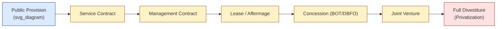

## Defining Public-Private Partnerships and the Spectrum of Private Participation

### Overview

A Public-Private Partnership (PPP) is a long-term contractual arrangement between a public sector entity (government, municipality, or state-owned enterprise) and a private sector entity, in which the private party takes on significant project risks and management responsibility in exchange for a stream of payments tied to performance, or the right to collect revenues from users, or both. PPPs sit within a broader continuum of infrastructure and service delivery models, ranging from fully public provision at one end to full privatization at the other.

The defining feature that separates a PPP from traditional procurement is **risk transfer combined with long-term performance-based contracting** — not merely private sector involvement or private financing.

### Core Defining Elements

**Key Points**

- **Long-term contract**: Typically 15–30+ years, spanning design, construction, and operation phases
- **Risk allocation**: Risks are assigned to the party best able to manage them (construction risk, demand risk, operational risk, financial risk)
- **Private financing**: The private partner typically arranges upfront capital, often via project finance structures (non-recourse or limited-recourse debt)
- **Performance-based payment**: Compensation is linked to service availability, quality standards, or usage levels rather than input costs
- **Asset/service bundling**: Design, build, finance, operate, and sometimes maintain (DBFOM) functions are bundled into a single contract, unlike traditional procurement where these are separately tendered
- **Public sector retains oversight**: The public authority retains regulatory oversight, sets output specifications, and often retains ultimate ownership of the underlying asset

### Distinguishing PPPs from Traditional Procurement and Privatization

| Dimension | Traditional Procurement | PPP | Full Privatization |
| --- | --- | --- | --- |
| Asset ownership | Public | Often reverts to public at contract end | Private, permanent |
| Financing source | Public budget/debt | Private capital (often project finance) | Private capital |
| Risk bearer | Public sector | Shared/transferred per contract | Private sector |
| Contract duration | Short (construction only) | Long (design through operation) | Indefinite |
| Payment basis | Fixed price for inputs | Performance/availability/usage | Market pricing |
| Regulatory role of state | Owner-operator | Regulator/purchaser | Regulator only |

### The Spectrum of Private Participation

Private sector involvement in infrastructure and public services exists on a continuum, commonly illustrated as follows.

Increasing rightward movement along this spectrum corresponds to increasing transfer of **risk, financing responsibility, and asset control** from the public to the private sector.

#### 1. Service Contracts

- Shortest duration (1–3 years)
- Government retains full responsibility for capital investment, financing, and operational risk
- Private firm performs a narrow, specific task (e.g., meter reading, billing, vehicle maintenance)
- **Example**: A municipality contracts a private firm solely to read water meters and issue bills, while the utility itself remains publicly operated

#### 2. Management Contracts

- Medium duration (3–5 years)
- Private operator manages day-to-day operations and is typically paid a fixed fee plus a performance-based bonus
- Capital investment and commercial/financial risk remain with the public sector
- **Example**: A private operator manages a public hospital's clinical and administrative operations under a management fee structure, while the government owns the facility and funds capital upgrades

#### 3. Lease Contracts (Affermage)

- Duration typically 8–15 years
- Private operator leases existing public infrastructure, collects revenue directly from users, and bears commercial risk
- Public sector typically remains responsible for major capital investment (new infrastructure)
- Distinguished from a concession in that the operator does not usually fund large new capital works
- **Example**: A private water utility operator leases an existing distribution network, collects tariffs from households, and is responsible for operations and minor maintenance, while the government funds major network expansion

#### 4. Concessions (including BOT, DBFO, DBFOM)

- Long duration (15–30+ years)
- Private party finances, builds or rehabilitates, and operates the asset, recovering investment through user charges (tolls, tariffs) or availability payments from government
- Substantial risk transfer: construction risk, and often demand/revenue risk
- Sub-variants:
  - **BOT (Build-Operate-Transfer)**: private entity builds, operates for the concession period, then transfers the asset to government
  - **BOOT (Build-Own-Operate-Transfer)**: adds a private ownership phase during the concession
  - **DBFO (Design-Build-Finance-Operate)**: emphasizes design responsibility bundled with financing and operations; asset may remain publicly owned throughout
  - **DBFOM (Design-Build-Finance-Operate-Maintain)**: adds explicit maintenance obligations, common in road and social infrastructure PPPs
- **Example**: A toll road concession where a private consortium designs, finances, and builds a highway, operates and maintains it for 30 years while collecting tolls, then transfers it back to the government

#### 5. Joint Ventures

- Public and private sectors co-invest in a special purpose vehicle (SPV), sharing ownership, risk, and returns proportionally
- Governance typically reflects equity stakes; can blur lines of accountability if not carefully structured
- **Example**: A government transit agency and a private developer jointly own an SPV that develops and operates a transit-oriented real estate project above a subway station

#### 6. Full Divestiture / Privatization

- Complete transfer of asset ownership and operational control to the private sector
- Government's role shifts entirely to that of an external regulator (e.g., setting tariff caps, safety standards)
- No longer considered a "partnership" in the PPP sense since there is no ongoing public-private risk-sharing contract — this is included on the spectrum as the theoretical endpoint, not as a PPP modality itself
- **Example**: Full sale of a state-owned telecommunications company to private shareholders, with the state retaining only sector regulatory authority

### Risk Transfer as the Organizing Principle

The position of an arrangement on the spectrum can be understood formally as a function of the share of project risk $R$ assumed by the private party relative to total identifiable project risk $R_{total}$:

$$\rho = \frac{R_{private}}{R_{total}}$$

Where $\rho \to 0$ corresponds to public provision and $\rho \to 1$ approaches full privatization. Most instruments formally classified as "PPPs" (concessions, DBFOM) occupy the mid-to-upper range of this spectrum, where $\rho$ is substantial but the public sector retains defined residual risks (e.g., regulatory risk, force majeure, sometimes demand risk under availability-payment structures) — [Inference] this stylized formalization is a pedagogical simplification used in economics teaching materials rather than a single standardized industry metric, since real-world risk allocation is multidimensional and contract-specific rather than reducible to one scalar.

### Categorization by Payment Mechanism

PPPs are also frequently classified by how the private partner is compensated, which cuts across the spectrum above:

- **User-pays (demand-risk) model**: Private partner's revenue depends on usage/demand (e.g., toll roads, airports). Private partner bears demand risk.
- **Government-pays (availability-payment) model**: Public authority pays the private partner a periodic fee conditional on the asset being available and meeting performance standards, regardless of usage (e.g., many DBFOM social infrastructure projects — schools, hospitals, prisons). Demand risk stays largely with government; performance/availability risk transfers to the private party.
- **Hybrid/shadow toll model**: Government pays the private operator based on measured usage (e.g., per-vehicle shadow tolls), transferring some demand risk without direct user charges.

### Institutional and Legal Definitional Variance

[Unverified] Definitions of "PPP" vary meaningfully across institutions and jurisdictions, and there is no single universally binding legal definition:

- The World Bank's PPP Reference Guide frames PPPs broadly around long-term contracts involving private risk-bearing and performance-linked payment
- The IMF and Eurostat, for fiscal accounting purposes (via the ESA/GFS statistical frameworks), apply narrower tests focused on which party bears the majority of construction, availability, and demand risk, since this determines whether PPP-related debt is recorded on or off the government's balance sheet
- National PPP units (e.g., in the UK, South Africa, Philippines, India) often codify their own statutory thresholds and approval procedures

This definitional variance has direct economic consequences: whether a project is classified as a PPP under a given accounting standard can determine whether its liabilities appear on-balance-sheet or off-balance-sheet for public debt reporting purposes.

### Diagrammatic Summary of Structure

<svg xmlns="http://www.w3.org/2000/svg" viewBox="0 0 760 300" font-family="sans-serif">
<text x="380" y="24" text-anchor="middle" font-size="16" font-weight="bold" fill="#1f2937">PPP Structural Relationships (svg_diagram)</text>
<rect x="30" y="60" width="160" height="70" rx="8" fill="#dbeafe" stroke="#1e3a8a" stroke-width="1.5" />
<text x="110" y="90" text-anchor="middle" font-size="13" fill="#1e3a8a">Public Authority</text>
<text x="110" y="108" text-anchor="middle" font-size="10" fill="#1e3a8a">(Grantor/Regulator)</text>
<rect x="300" y="60" width="160" height="70" rx="8" fill="#fef3c7" stroke="#92400e" stroke-width="1.5" />
<text x="380" y="90" text-anchor="middle" font-size="13" fill="#92400e">Special Purpose</text>
<text x="380" y="108" text-anchor="middle" font-size="13" fill="#92400e">Vehicle (SPV)</text>
<rect x="570" y="10" width="160" height="55" rx="8" fill="#fee2e2" stroke="#991b1b" stroke-width="1.5" />
<text x="650" y="35" text-anchor="middle" font-size="12" fill="#991b1b">Equity Sponsors</text>
<text x="650" y="50" text-anchor="middle" font-size="10" fill="#991b1b">(Private Partner)</text>
<rect x="570" y="80" width="160" height="55" rx="8" fill="#fee2e2" stroke="#991b1b" stroke-width="1.5" />
<text x="650" y="105" text-anchor="middle" font-size="12" fill="#991b1b">Lenders</text>
<text x="650" y="120" text-anchor="middle" font-size="10" fill="#991b1b">(Project Finance Debt)</text>
<rect x="300" y="180" width="160" height="55" rx="8" fill="#dcfce7" stroke="#166534" stroke-width="1.5" />
<text x="380" y="203" text-anchor="middle" font-size="12" fill="#166534">EPC Contractor</text>
<text x="380" y="218" text-anchor="middle" font-size="10" fill="#166534">(Construction)</text>
<rect x="300" y="245" width="160" height="45" rx="8" fill="#f3e8ff" stroke="#6b21a8" stroke-width="1.5" />
<text x="380" y="272" text-anchor="middle" font-size="12" fill="#6b21a8">O&amp;M Operator</text>
<line x1="190" y1="95" x2="300" y2="95" stroke="#374151" stroke-width="1.5" marker-end="url(#arrow)" />
<text x="245" y="88" text-anchor="middle" font-size="9" fill="#374151">Concession Agreement</text>
<line x1="460" y1="80" x2="570" y2="40" stroke="#374151" stroke-width="1.5" marker-end="url(#arrow)" />
<text x="530" y="55" text-anchor="middle" font-size="9" fill="#374151">Equity</text>
<line x1="460" y1="105" x2="570" y2="105" stroke="#374151" stroke-width="1.5" marker-end="url(#arrow)" />
<text x="515" y="98" text-anchor="middle" font-size="9" fill="#374151">Debt</text>
<line x1="380" y1="130" x2="380" y2="180" stroke="#374151" stroke-width="1.5" marker-end="url(#arrow)" />
<text x="410" y="158" text-anchor="middle" font-size="9" fill="#374151">EPC Contract</text>
<line x1="380" y1="235" x2="380" y2="245" stroke="#374151" stroke-width="1.5" marker-end="url(#arrow)" />
</svg>

### Common Misconceptions

- **Misconception**: "PPP" simply means private companies are involved in building public infrastructure.

  **Correction**: Private contractors have always built public infrastructure under traditional procurement; the defining feature of a PPP is long-term risk transfer and performance-linked payment, not mere construction involvement.
- **Misconception**: PPPs eliminate cost to the public sector.

  **Correction**: PPPs shift the *timing and form* of public expenditure (from upfront capital outlay to periodic payments or foregone asset ownership) and shift *risk*, but the public sector typically still bears fiscal exposure, contingent liabilities, and, under government-pays models, direct long-term payment obligations.
- **Misconception**: Private financing is inherently cheaper than public financing.

  **Correction**: [Inference] Private capital generally carries a higher cost of capital than sovereign borrowing; the economic case for PPPs rests on whether efficiency gains from risk transfer and private sector management outweigh this financing cost premium, not on financing cost alone — this is a standard proposition in PPP economics literature (e.g., Value for Money analysis) rather than a universal empirical constant across all projects.

### Related Topics

- Value for Money (VfM) Analysis and the Public Sector Comparator
- Risk Identification, Allocation, and Optimal Risk Transfer Theory
- Project Finance Structures and Special Purpose Vehicles (SPVs)
- Concession Agreement Design and Contractual Incompleteness
- Availability Payments vs. Demand-Risk (User-Pays) Models
- Fiscal Accounting Treatment of PPPs (IMF/Eurostat/GFS Frameworks)
- PPP Enabling Legislation and National PPP Units
- Renegotiation Dynamics in Long-Term Infrastructure Contracts