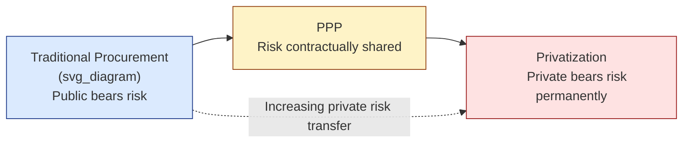

## PPPs versus Traditional Public Procurement and Privatization

### Overview

Traditional public procurement, Public-Private Partnerships (PPPs), and privatization represent three distinct institutional arrangements for delivering infrastructure and public services, differentiated primarily by **risk allocation, financing structure, contract duration, and the locus of residual control rights** over the asset. Understanding PPPs requires positioning them precisely between these two alternatives rather than treating "private sector involvement" as a single undifferentiated category.

### Defining the Three Models

#### Traditional Public Procurement

- Government retains full ownership, financing responsibility, and operational control
- Public sector borrows (via sovereign or municipal debt) to fund capital works
- Private contractors are engaged competitively for discrete, short-duration tasks (design, construction) under fixed-price or cost-plus contracts
- Public sector bears essentially all long-term risk: construction overruns, operational cost escalation, demand fluctuation, and asset performance

#### Public-Private Partnership

- Long-term contractual arrangement (typically 15–30+ years) bundling design, build, finance, operate, and sometimes maintain (DBFOM) functions
- Private partner arranges upfront financing, typically through project finance structures
- Risk is contractually allocated to whichever party can manage it most efficiently
- Public sector retains asset ownership (in most concession/DBFOM structures) or regulatory oversight, and often the asset reverts fully to public control at contract expiry

#### Privatization (Full Divestiture)

- Complete and permanent transfer of asset ownership to the private sector
- Government exits the ownership/operator role entirely and becomes solely an external regulator
- No contractual reversion of the asset to the public sector
- Private owner bears all commercial, operational, and residual risk indefinitely

### Comparative Framework

| Dimension | Traditional Procurement | PPP | Privatization |
| --- | --- | --- | --- |
| Asset ownership | Public, throughout | Public (usually), reverts at contract end | Private, permanent |
| Contract scope | Single phase (e.g., construction only) | Bundled: design–build–finance–operate(–maintain) | N/A (ownership transfer, not a service contract) |
| Contract duration | Short (months to a few years) | Long (15–30+ years) | Indefinite |
| Financing source | Public budget or sovereign/municipal debt | Private capital (equity + project finance debt) | Private capital |
| Risk bearer | Public sector | Contractually allocated/shared | Private sector |
| Payment basis | Fixed price or cost-reimbursement for inputs delivered | Performance-, availability-, or usage-linked | Market-based revenue, no public payment |
| Government's post-contract role | Owner-operator | Regulator + counterparty + (eventual) owner | Regulator only |
| Fiscal treatment | On-balance-sheet, upfront capital expenditure | May be on- or off-balance-sheet depending on risk transfer test | Off-balance-sheet; one-time sale proceeds |
| Termination/reversion | N/A — public owns throughout | Asset transfer clauses at contract end | None — no reversion |

### The Risk-Transfer Continuum

This can be expressed formally using the private risk share $\rho$ introduced in PPP risk theory:

$$\rho = \frac{R_{private}}{R_{total}}$$

- Traditional procurement: $\rho \approx 0$ (public sector retains nearly all identifiable project risk)
- PPP: $0 < \rho < 1$, with the specific value depending on contract structure (e.g., availability-payment PPPs transfer construction and performance risk but not demand risk, while toll concessions also transfer demand risk)
- Privatization: $\rho \to 1$ (private owner bears essentially all risk, subject only to regulatory constraints)

[Inference] This formalization is a pedagogical simplification for teaching purposes; in practice, risk allocation is multidimensional (separate treatment of construction risk, demand risk, regulatory risk, force majeure, etc.) and cannot be fully captured by a single scalar.

### Key Structural Differences Explained

#### 1. Bundling versus Unbundling

Traditional procurement typically **unbundles** the project lifecycle — separate tenders for design, then construction, then operation — often awarded to different firms. This can create incentive misalignment: a contractor paid only for construction has limited incentive to minimize whole-life operating and maintenance costs.

PPPs **bundle** these phases into a single, long-term contract with one private party (or consortium) responsible end-to-end. This is intended to internalize the tradeoff between upfront construction quality/cost and downstream operating/maintenance costs.

**Example**: In a traditionally procured school building, the construction contractor has no ongoing exposure to maintenance costs after handover, and may under-invest in durable materials. In a DBFOM school PPP, the same private party is responsible for the building's condition for 25 years, creating a direct incentive to build to a standard that minimizes lifecycle maintenance expense.

#### 2. Financing Structure and Off-Balance-Sheet Treatment

Traditional procurement is financed through direct public borrowing or budget allocation, appearing immediately on government balance sheets as capital expenditure and debt.

PPPs are financed through private capital — typically a mix of sponsor equity and non-recourse or limited-recourse project finance debt raised by a Special Purpose Vehicle (SPV). [Unverified] Depending on the applicable government accounting standard (e.g., Eurostat's ESA 2010 rules, IMF Government Finance Statistics, or national equivalents), a PPP may or may not be recorded on the government's balance sheet — this depends on formal tests of which party bears the majority of construction risk, availability risk, and demand risk, and the exact threshold rules vary by framework and have been revised over time.

Privatization involves a one-time transfer: government receives sale proceeds and exits future capital responsibility for that asset entirely.

#### 3. Duration and Contractual Completeness

Traditional procurement contracts are short and relatively complete — deliverables, specifications, and price are defined with reasonable precision because the scope (e.g., "build this bridge to this specification") is narrow and near-term.

PPP contracts, spanning decades, are necessarily **incomplete contracts** in the economic sense: it is not possible to specify contractually every future contingency (technology change, demand shifts, force majeure events) over a 25–30 year horizon. This drives the extensive use of:

- Output-based specifications rather than input-based specifications
- Performance/availability payment mechanisms with deduction regimes for substandard performance
- Renegotiation and dispute resolution clauses
- Step-in rights for lenders and government

Privatization involves no ongoing service contract at all (beyond regulatory rules), so contractual incompleteness is not a comparable concern — the relevant control mechanism shifts entirely to sector regulation (price caps, quality-of-service standards, competition law).

#### 4. Accountability and Political Control

- **Traditional procurement**: Highest direct political accountability; government controls specifications, budget, and timeline
- **PPP**: Political accountability is intermediated through contract terms negotiated at the outset; government's ability to alter service specifications mid-contract is constrained without triggering compensation clauses
- **Privatization**: Lowest direct accountability; government influence limited to ex-post regulatory intervention, generally slower and more legally constrained than direct contract management

### Why Governments Choose One Model Over Another

**Key Points**

- **Traditional procurement** is generally preferred when:
  - The service is a core state function with strong political/social sensitivity (e.g., primary legislation-dependent services, national security infrastructure)
  - Project scope is well-defined and short-term
  - Government has strong in-house technical/project management capacity
  - Private sector cost of capital premium would outweigh efficiency gains from risk transfer
- **PPPs** are generally favored when:
  - Whole-life cost efficiency from bundling design/build/operate is significant
  - Government wants to transfer construction and performance risk while retaining long-term policy control and eventual asset ownership
  - Off-balance-sheet fiscal treatment is a policy consideration (though this should not be the primary justification under sound public financial management)
  - A Value for Money (VfM) analysis, typically comparing the PPP's risk-adjusted cost to a Public Sector Comparator (PSC), favors the PPP route
- **Privatization** is generally favored when:
  - The service can be effectively delivered through competitive markets rather than requiring close ongoing public specification
  - Government seeks to permanently exit a sector and reduce fiscal exposure
  - Adequate independent regulatory capacity exists to protect public interest (pricing, quality, universal service) without direct ownership

### Common Misconceptions

- **Misconception**: A PPP is just "privatization with extra steps."

  **Correction**: Privatization is a permanent, unconditional transfer of ownership; a PPP is a time-limited contract with defined reversion and extensive government-retained rights (step-in rights, performance monitoring, output specification), making the two legally and economically distinct.
- **Misconception**: Traditional procurement is always cheaper because it avoids the private cost-of-capital premium.

  **Correction**: [Inference] While private financing does typically carry a higher nominal cost of capital than sovereign debt, the PPP economic case rests on whether efficiency gains — from risk transfer, whole-life cost optimization, and stronger performance incentives — offset that premium; this is an empirical question assessed case-by-case via VfM analysis, not something resolved by the financing cost comparison alone.
- **Misconception**: PPPs remove the asset and its risks from public sector concern once signed.

  **Correction**: Governments retain contingent liabilities (e.g., termination compensation, minimum revenue guarantees, refinancing gain-share clauses) and ultimate responsibility for continuity of essential services if the private operator fails, meaning fiscal and political exposure persists throughout the contract term.

### Diagrammatic Summary

<svg xmlns="http://www.w3.org/2000/svg" viewBox="0 0 760 260" font-family="sans-serif">
<text x="380" y="24" text-anchor="middle" font-size="16" font-weight="bold" fill="#1f2937">Ownership, Risk, and Duration Compared (svg_diagram)</text>
<line x1="60" y1="140" x2="700" y2="140" stroke="#374151" stroke-width="2" />
<polygon points="700,140 690,134 690,146" fill="#374151" />
<text x="380" y="160" text-anchor="middle" font-size="11" fill="#374151">Increasing private risk &amp; control transfer</text>
<circle cx="120" cy="140" r="10" fill="#1e3a8a" />
<text x="120" y="110" text-anchor="middle" font-size="12" font-weight="bold" fill="#1e3a8a">Traditional</text>
<text x="120" y="125" text-anchor="middle" font-size="12" font-weight="bold" fill="#1e3a8a">Procurement</text>
<text x="120" y="185" text-anchor="middle" font-size="10" fill="#374151">Public owns,</text>
<text x="120" y="198" text-anchor="middle" font-size="10" fill="#374151">finances, operates</text>
<circle cx="380" cy="140" r="10" fill="#92400e" />
<text x="380" y="110" text-anchor="middle" font-size="12" font-weight="bold" fill="#92400e">PPP</text>
<text x="380" y="185" text-anchor="middle" font-size="10" fill="#374151">Public owns (usually),</text>
<text x="380" y="198" text-anchor="middle" font-size="10" fill="#374151">private finances &amp; operates,</text>
<text x="380" y="211" text-anchor="middle" font-size="10" fill="#374151">reverts at term end</text>
<circle cx="650" cy="140" r="10" fill="#991b1b" />
<text x="650" y="110" text-anchor="middle" font-size="12" font-weight="bold" fill="#991b1b">Privatization</text>
<text x="650" y="185" text-anchor="middle" font-size="10" fill="#374151">Private owns, finances,</text>
<text x="650" y="198" text-anchor="middle" font-size="10" fill="#374151">operates permanently</text>
</svg>

### Related Topics

- Value for Money (VfM) Analysis and the Public Sector Comparator
- Contractual Incompleteness Theory Applied to Long-Term Infrastructure Contracts
- Off-Balance-Sheet Accounting Treatment of PPPs (Eurostat, IMF GFS)
- Contingent Liabilities and Fiscal Risk from PPP Guarantees
- Regulatory Frameworks for Privatized Utilities
- Output-Based Specification versus Input-Based Specification in Procurement
- Project Finance and Special Purpose Vehicle (SPV) Structuring