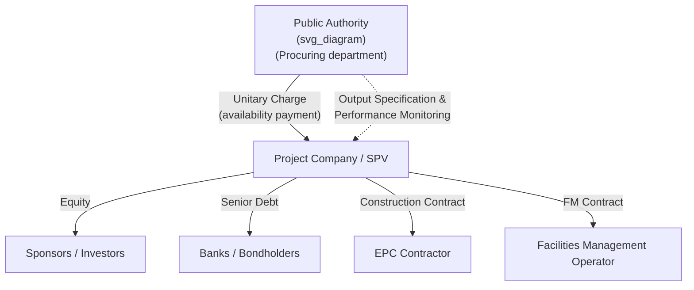

## Historical Evolution of PPPs and the UK Private Finance Initiative

### Overview

Public-Private Partnerships as a distinct, codified policy instrument emerged in their modern form in the late 20th century, though private involvement in public infrastructure has antecedents stretching back centuries. The United Kingdom's Private Finance Initiative (PFI), launched in 1992, is widely regarded as the first systematized, government-branded PPP program and became the template that many other countries subsequently adapted. Its three-decade lifecycle — from launch, through peak adoption, to formal wind-down in 2018 — provides the central case study for understanding both the economic rationale for PPPs and the recurring critiques leveled against them.

### Pre-Modern Antecedents

Long before the "PPP" terminology existed, private capital was used to finance public infrastructure under concession-like arrangements:

- **19th-century canal and railway concessions** (UK, France, USA): Private companies were granted rights to build and operate infrastructure, often with land grants or revenue guarantees
- **French *concession* tradition**: France has used long-term concession contracts for water and infrastructure since the 19th century (e.g., the Perier brothers' Paris water concession, 1782), forming the conceptual root of the modern "concession" PPP variant
- **Suez Canal (1869)**: Built and operated by a private concessionaire (Compagnie Universelle du Canal Maritime de Suez) under a concession granted by Egypt, a frequently cited historical precursor to BOT-style project structuring

[Inference] These historical examples are commonly cited in PPP economics literature as conceptual antecedents rather than as instances of "PPP" in the modern regulatory/contractual sense, since the surrounding legal, risk-transfer, and accounting frameworks that define contemporary PPPs did not yet exist.

### The UK Private Finance Initiative (PFI): Origins

- Launched in **1992** by the Conservative government under Chancellor Norman Lamont, as part of a broader push to involve private capital in public infrastructure without directly increasing headline public sector borrowing
- Emerged against a backdrop of:
  - Constrained public capital budgets and pressure to control the Public Sector Borrowing Requirement (PSBR)
  - Broader UK privatization momentum from the 1980s (utilities, British Telecom, British Gas) that normalized private delivery of traditionally public functions
  - International interest in New Public Management (NPM) theory, which favored contracting-out, competition, and performance-based management within government
- Initial uptake was slow; the program gained significant momentum after **1997** under the incoming Labour government, which rebranded and expanded it as part of the wider "Public Private Partnerships" (PPP) policy umbrella

### PFI Structural Model

PFI projects were structured predominantly as **DBFO (Design-Build-Finance-Operate)** arrangements, typically involving:

- **Unitary charge**: A single periodic payment from the public authority to the SPV, covering capital recovery, financing costs, and ongoing service provision, subject to deductions for substandard performance or unavailability
- **Output-based specifications**: Contracts specified required service outcomes (e.g., "a clean, safe, temperature-controlled school building available for teaching") rather than input methods, leaving delivery method to the private contractor
- **Risk transfer**: Construction cost/time overrun risk and life-cycle maintenance risk were substantially transferred to the private sector; demand risk was typically retained by government in social infrastructure PFI (schools, hospitals, prisons) since usage was not the payment basis
- **Off-balance-sheet treatment**: A major early driver of adoption was that, under prevailing UK national accounting rules, sufficiently risk-transferred PFI deals could be kept off the government's balance sheet, though this treatment was progressively tightened and later became less favorable under updated European System of Accounts (ESA) rules

### Sectoral Application in the UK

PFI was applied extensively across:

- **Health**: NHS hospital construction and facilities management
- **Education**: School building programs (e.g., Building Schools for the Future)
- **Transport**: Roads, and elements of rail infrastructure
- **Justice**: Prison construction and management
- **Defense**: Military housing and support infrastructure

**Example**: A typical NHS PFI hospital scheme involved a private consortium financing, designing, and constructing a new hospital building, then providing "hard" facilities management (building maintenance, cleaning, catering) for a 25–30 year concession period, while clinical services remained delivered by NHS staff — illustrating how PFI in health typically separated clinical risk (retained by the public sector) from asset/estates risk (transferred to the private sector).

### Peak, Critique, and Reform (2000s–2010s)

By the mid-2000s, PFI had financed several hundred projects representing tens of billions of pounds of capital value. Sustained criticism accumulated over the following two decades around several recurring themes:

**Key Points — Major Criticisms**

- **Cost of capital**: Private finance under PFI carried materially higher borrowing costs than direct government gilts, raising questions about whether efficiency gains justified the premium over the contract life
- **Off-balance-sheet incentive distortion**: Critics, including the UK National Audit Office (NAO) and Public Accounts Committee, argued some projects were structured to achieve favorable accounting treatment rather than genuine value-for-money risk transfer
- **Contractual inflexibility**: Long-term, tightly specified contracts proved difficult and costly to vary as service needs changed (e.g., hospital reconfiguration, school capacity changes)
- **Transparency and accountability concerns**: Complex SPV and subcontracting structures, alongside commercial confidentiality provisions, limited public and parliamentary scrutiny of value for money
- **Facilities management cost premiums**: Ancillary services (e.g., minor maintenance call-outs) were sometimes reported at costs significantly above market rates due to inflexible contract schedules

In response, the UK government introduced **PF2** in 2012, an attempted reform of the PFI model featuring:

- Government taking a minority equity co-investment stake in projects for greater transparency
- Removal of "soft" facilities management services (cleaning, catering) from the bundled contract, retaining only "hard" FM
- Standardized contract terms to reduce negotiation time and cost
- Enhanced transparency requirements and mandatory competitive tension throughout procurement

### Termination of PFI/PF2 (2018)

[Unverified — check current UK government publications for the precise announcement text and figures] In its October 2018 Budget, the UK government announced it would no longer use PFI/PF2 for new projects, citing concerns about their impact on cost transparency and value for money, and acknowledging that no new deals had been signed under PF2 for several years. Existing PFI/PF2 contracts continued to run to their contracted expiry dates. This is broadly consistent with widely reported UK fiscal policy history but the precise figures and rationale should be verified against primary Treasury/NAO sources for citation-grade accuracy.

### International Diffusion of the PFI Model

The UK PFI model was highly influential internationally, with variants adapted in:

- **Australia**: State-level PPP policies (e.g., Partnerships Victoria) drawing directly on UK output-specification and unitary-charge concepts
- **Canada**: Provincial "P3" programs (e.g., Infrastructure Ontario) adopting similar availability-payment DBFOM structures
- **Continental Europe**: Various countries developed national PPP units and legal frameworks partly informed by UK experience, while also drawing on their own concession traditions (particularly France and Spain)
- **Developing economies**: The World Bank, IFC, and regional development banks promoted PPP frameworks influenced by both the UK model and the concession tradition, particularly for user-pays infrastructure (toll roads, ports, water)

### Timeline Summary

| Period | Development |
| --- | --- |
| Pre-1990s | Concession-based private infrastructure finance (canals, railways, Suez Canal); no unified "PPP" doctrine |
| 1992 | UK PFI launched under Conservative government |
| 1997 onward | PFI expanded and rebranded within broader "PPP" policy under Labour government |
| Early–mid 2000s | Rapid expansion across health, education, transport, justice sectors; international diffusion begins |
| Mid-2000s–2010s | Mounting NAO/PAC criticism on cost of capital, flexibility, transparency |
| 2012 | PF2 reform launched to address structural criticisms |
| 2018 | UK government announces discontinuation of PFI/PF2 for new projects |

### Common Misconceptions

- **Misconception**: PFI and "PPP" are entirely different things.

  **Correction**: PFI was the UK government's specific brand name and structural model for what is generically termed a PPP; PFI is best understood as one influential national implementation of the broader PPP concept, not a separate category.
- **Misconception**: The UK abandoned PPPs entirely in 2018.

  **Correction**: The UK discontinued the specific PFI/PF2 procurement model for *new* projects; other forms of private sector partnership in public service delivery continued, and existing PFI contracts remained in force until their contracted expiry.
- **Misconception**: PFI failed because private finance is inherently unsuitable for public infrastructure.

  **Correction**: [Inference] The dominant critique in UK official reports centered on specific implementation issues — contract inflexibility, accounting-driven structuring, and transparency gaps — rather than a wholesale conclusion that private financing of infrastructure cannot work; other jurisdictions' PPP programs and other UK infrastructure financing approaches continued after 2018.

### Related Topics

- Value for Money (VfM) Analysis and the Public Sector Comparator
- Unitary Charge Mechanisms and Availability Payment Deduction Regimes
- National Audit Office (NAO) Reviews of PFI Value for Money
- PF2 Reform Structure and Its Divergence from Classic PFI
- Off-Balance-Sheet Accounting Rules (ESA 2010, Eurostat PPP Guidance)
- Comparative National PPP Frameworks (Australia's Partnerships Victoria, Canada's P3 model)
- Contract Renegotiation and Refinancing Gain-Share Provisions in Long-Term PPPs