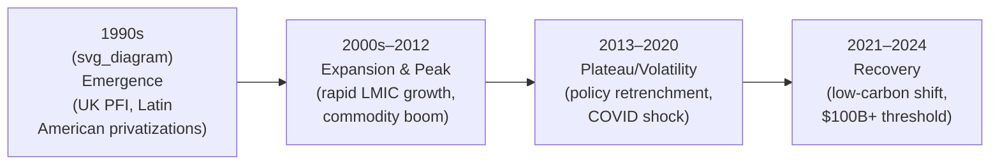
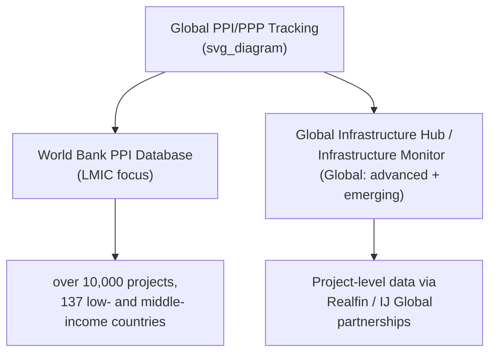

## Global Growth and Geographic Distribution of PPP Markets

### Overview

PPP and broader Private Participation in Infrastructure (PPI) markets have grown unevenly since their modern emergence in the 1990s, shaped by macroeconomic cycles, commodity prices, interest rate regimes, and country-specific enabling environments. Global tracking primarily relies on two major data sources: the **World Bank's Private Participation in Infrastructure (PPI) Database**, which focuses on low- and middle-income countries (LMICs), and the **Global Infrastructure Hub / Infrastructure Monitor** series, which covers both advanced and emerging markets using project-level transaction data.

### Global Investment Trends

Private Participation in Infrastructure (PPI) investment reached $100.7 billion in 2024, an increase of 16 percent from $87.1 billion in 2023 and 20 percent above the past five-year average of $83.7 billion, marking the first time PPI investment exceeded the $100 billion threshold since the onset of the COVID-19 pandemic. This followed a period of relative softness: PPI investment in 2023 amounted to US$86.0 billion, representing 0.2 percent of the GDP of all low- and middle-income countries, a slight decrease from US$91.3 billion in 2022, though total commitments in 2023 still marginally exceeded the previous five-year average (2018–2022) of $85.5 billion. [Worldbank](https://ppi.worldbank.org/en/ppi)[Worldbank](https://ppi.worldbank.org/en/resources/ppi-resources)

The PPI database, which dates back to 1984, continuously tracks investments across roughly 10,000 infrastructure projects in low- and middle-income countries. In 2023, 68 countries received private infrastructure investment across 322 projects, compared to 54 countries and 260 projects in 2022, with several countries — including Guinea-Bissau, Libya, Papua New Guinea, São Tomé and Príncipe, and Suriname — recording their first PPI transactions in over a decade. [aln](https://aln.africa/news/stories-that-matter-may-2024/?output=pdf)[aln](https://aln.africa/news/stories-that-matter-may-2024/?output=pdf)

At the broader global level (including high-income countries), global private investment in infrastructure projects in primary markets rose by 10 percent in nominal terms in 2023, with the majority of this growth occurring in developed markets while low- and middle-income countries experienced a slight decline. [fntp](https://www.fntp.fr/ppp-americas-2023-partnerships-with-purpose/)

### Growth Trajectory Since the 1990s

[Inference — general historical pattern synthesized from PPP economics literature and the search results above; precise inflection dates vary by source methodology] The global PPP/PPI market has followed roughly four phases:

Investment in infrastructure via public-private partnerships traced a steady increase since the start of the privatization and liberalization process that took place in most OECD countries in the 1990s, peaking in 2012. [uniba](https://ricerca.uniba.it/handle/11586/381799)

### Sectoral Composition Shift: The Low-Carbon Transition

A major structural change in global PPI markets has been the shift toward low-carbon energy projects: prior to 2010, the distribution of new project investments between conventional and low-carbon projects was roughly even (852 conventional versus 899 low-carbon), but after 2010, the number of new low-carbon PPI projects (1,915) was more than double that of conventional ones (815). This shift was driven substantially by favorable government policies, with the percentage of low-carbon projects receiving government support growing from 3% before 2010 to 51% afterward. [Worldbank](https://ppi.worldbank.org/en/resources/ppi-resources)[Worldbank](https://ppi.worldbank.org/en/resources/ppi-resources)

### Geographic Distribution: Regional Patterns

#### Sub-Saharan Africa

Sub-Saharan Africa investments fell by 15% relative to the average over the previous five years, despite an overall recovery trend, with investment unevenly distributed and concentrated in certain areas. Nonetheless, the region has had the highest number of PPI transactions per country and project over the previous ten years. Kenya alone has approximately 45 PPP projects currently being implemented or running, including road annuity/tolling programs covering 639 km, and 39 additional energy projects totaling 3,034 megawatts of installed capacity. Africa's energy sector saw a considerable increase, up around 21% to a total of $25.9 billion in PPI investment, with about 85% of new energy projects using renewable energy, compared to an average of 63% over the previous five years. [africas infrastructure investment rebounds amidst challenges 2024073109131130346 +3](https://www.pulse.ug/story/africas-infrastructure-investment-rebounds-amidst-challenges-2024073109131130346)

#### Latin America and the Caribbean

This region shows some of the strongest structural growth in PPP penetration: investment in infrastructure PPPs increased by almost 14% across Latin America and the Caribbean, with total project investment over 2014–2023 reaching US$160 billion across the region. Over the most recent decade, PPPs accounted for 11% of total infrastructure spending on average, up from 9% during 2011–2020, and the number of PPP projects grew by more than 25% since the 2021/22 Infrascope edition, with about 640 total PPPs financed in Latin America and the Caribbean during 2014–2023, up from roughly 500 during 2011–2020. [fntp](https://www.fntp.fr/emerging-trends-in-infrastructure/)[fntp](https://www.fntp.fr/emerging-trends-in-infrastructure/)

#### Middle East and North Africa (MENA)

PPI investment declined in most regions in 2023 except for the Middle East, North Africa (MENA), and East Asia and the Pacific, with MENA continuing its growth trajectory as investment levels almost doubled from USD 1.4 billion in 2022 to USD 2.9 billion in 2023. More broadly, while North America and Europe are the leading markets for global private investment in infrastructure in absolute terms, it is the Middle East and Latin America that attract the most investment as a share of their respective economies. [aln](https://aln.africa/news/stories-that-matter-may-2024/?output=pdf)[Gtac](https://www.gtac.gov.za/wp-content/uploads/2025/07/Infrastructure-Monitor-2024-South-Africa-GTAC-webinar-July-2025-Shared.pdf)

#### East Asia and the Pacific

Latin America and the Caribbean, and East Asia and the Pacific, saw increases in PPI commitments of 16% and 17% respectively in the period covered by the 2024 report, reflecting continued strong regional momentum outside of China-dominated figures. [Unverified] Specific China-inclusive versus China-excluded breakdowns vary meaningfully by source and should be checked against the primary Infrastructure Monitor 2024 report for project-level detail. [pulse](https://www.pulse.ug/story/africas-infrastructure-investment-rebounds-amidst-challenges-2024073109131130346)

#### Europe

In 2024, 39 public-private partnership transactions reached financial close in Europe for an aggregate value of €11.47 billion, with the value of the market decreasing by 17% compared to 2023, even though the number of projects reaching financial close increased by 2.6% (39 projects in 2024 versus 38 in 2023). Greece was the largest market by value, while Belgium led in the number of projects; 11 countries closed at least one PPP project in 2024, compared to 13 in 2023. Transport was the largest sector by value, education was the largest sector by number of projects, and over 61% of the transactions closed were government-pay PPPs. [Infrastructure Monitor 2024 : Global trends in private investment in infrastructure +2](https://www.fntp.fr/infodoc/international/financements/infrastructure-monitor-2023-global-trends-private-investment)

#### MENA Energy Sector — A Lagging Sub-Case

[Inference — drawn from academic literature rather than the most recent market reports, so may not reflect the latest year's figures] Within the energy sector specifically, private participation in infrastructure for MENA countries has lagged behind other regions in both relative and absolute terms, illustrating that regional aggregates can mask significant sector-level divergence within the same geography. [uniba](https://ricerca.uniba.it/handle/11586/381799)

### Comparative Regional Summary

| Region | Recent Trend | Notable Feature |
| --- | --- | --- |
| Sub-Saharan Africa | Investment value down ~15% vs. 5-yr average, but highest deal density per country | Kenya road/energy PPP concentration; strong renewable energy share (~85% of new projects) |
| Latin America & Caribbean | ~14% investment growth; $160B over 2014–2023 | PPPs now ~11% of total infrastructure spend, up from 9% |
| MENA | PPI nearly doubled 2022→2023 ($1.4B → $2.9B) | Attracts high investment share relative to GDP; energy sub-sector historically lagging |
| East Asia & Pacific | 17% commitment growth | One of few regions with 2023 growth alongside MENA |
| Europe | €11.47B in 2024, value down 17% YoY despite more deals | Government-pay model dominant (61%+ of transactions); transport leads by value |
| North America | Leading market in absolute terms | Attracts less as a share of GDP than Middle East/Latin America |

### Distribution by Country Coverage and Development Status

The Private Participation in Infrastructure (PPI) Project Database has data on over 10,000 infrastructure projects in 137 low- and middle-income countries, making it the principal reference source for tracking PPI trends specifically in the developing world, while the Global Infrastructure Hub's Infrastructure Monitor series draws on project-by-project transaction data to cover both advanced and emerging markets together. [Worldbank](https://ppi.worldbank.org/en/ppi)

### Interpreting Regional Divergence: Analytical Framework

Geographic distribution of PPP activity is generally explained in the literature by a combination of factors:

- **Enabling environment maturity**: Legal/regulatory PPP frameworks, dispute resolution mechanisms, and government PPP unit capacity (measured by indices such as the **Infrascope**)
- **Sovereign and currency risk**: Affects both the availability and cost of private capital, particularly for LMICs
- **Fiscal space and public debt levels**: Governments facing constrained fiscal space may lean more heavily on private financing structures
- **Commodity price cycles**: Resource-exporting regions' PPP activity often correlates with commodity price trends (affecting both fiscal capacity and investor appetite)
- **Global interest rate environment**: Higher global rates raise the cost of project finance debt, dampening PPP deal volume industry-wide, as reflected in the post-2022 slowdown before the 2024 recovery

### Common Misconceptions

- **Misconception**: PPP activity is concentrated primarily in developing countries.

  **Correction**: North America and Europe remain the leading markets for global private investment in infrastructure in absolute terms, even though the Middle East and Latin America attract more investment relative to the size of their economies. [Gtac](https://www.gtac.gov.za/wp-content/uploads/2025/07/Infrastructure-Monitor-2024-South-Africa-GTAC-webinar-July-2025-Shared.pdf)
- **Misconception**: PPP market growth has been steady and linear since the 1990s.

  **Correction**: Growth peaked around 2012 and the market subsequently experienced volatility, including a COVID-19-related shock and a slow recovery, only surpassing the $100 billion PPI threshold again in 2024. [uniba](https://ricerca.uniba.it/handle/11586/381799)
- **Misconception**: All regions recovered infrastructure investment at the same pace post-pandemic.

  **Correction**: Sub-Saharan Africa investment remained below its five-year average even amid overall global recovery, while MENA and East Asia/Pacific were among the few regions posting growth in 2023 — recovery has been distinctly uneven. [pulse](https://www.pulse.ug/story/africas-infrastructure-investment-rebounds-amidst-challenges-2024073109131130346)[aln](https://aln.africa/news/stories-that-matter-may-2024/?output=pdf)

### Related Topics

- The Infrascope Index and Measuring PPP Enabling Environments
- Low-Carbon Energy PPPs and Renewable Project Finance Structures
- World Bank PPIAF and PPI Database Methodology
- Sovereign and Currency Risk in Cross-Border PPP Financing
- Government-Pay versus User-Pay PPP Models by Region
- Latin American Infrastructure PPP Frameworks (Infrascope LAC Findings)
- Interest Rate Cycles and Project Finance Debt Costs