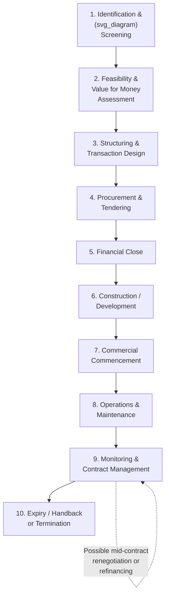

## Core Terminology and the PPP Project Lifecycle

### Overview

A shared, precise vocabulary is essential to PPP economics because the field draws terminology from public finance, project finance, contract law, and infrastructure engineering simultaneously. This section defines the core terms used throughout PPP analysis and maps them onto the sequential phases of a typical PPP project, from initial policy conception through contract expiry and asset handback.

### Core Terminology

#### Parties and Entities

- **Grantor / Contracting Authority**: The public sector entity that grants the PPP contract and retains ultimate policy responsibility for the service (e.g., a ministry, municipal government, or state-owned enterprise)
- **Private Partner / Concessionaire / Project Sponsor**: The private entity awarded the contract; often a consortium of construction firms, equity investors, and operators bidding jointly
- **Special Purpose Vehicle (SPV) / Project Company**: A legally distinct entity created solely to own, finance, build, and operate the specific project, ring-fencing project risks and liabilities from the sponsors' other business activities
- **Lenders / Senior Debt Providers**: Banks, bondholders, or institutional investors providing debt finance to the SPV, typically on a non-recourse or limited-recourse basis (i.e., secured against project assets/cash flows rather than sponsor balance sheets)
- **EPC Contractor**: Engineering, Procurement, and Construction contractor, typically engaged by the SPV under a fixed-price, date-certain construction contract
- **O&M Operator**: The entity responsible for Operations and Maintenance once the asset is operational, which may be the SPV itself, a sponsor-affiliated operator, or a third party

#### Contractual and Financial Terms

- **Concession Agreement**: The primary contract between grantor and private partner defining scope, duration, performance standards, payment mechanism, and risk allocation
- **Unitary Charge / Availability Payment**: A periodic payment from the grantor to the SPV, conditional on the asset being available and meeting performance standards, used in government-pays PPP structures
- **User Charges / Tariffs / Tolls**: Revenue collected directly from end users in user-pays PPP structures
- **Financial Close**: The point at which all financing agreements (equity commitments, loan agreements, EPC and O&M contracts) become legally binding and funds become available for drawdown — commonly used as the reference date for measuring PPP market activity (as in World Bank PPI statistics)
- **Commercial/Service Commencement Date**: The date on which the asset becomes operational and available for public use or service delivery, triggering the start of the operations phase and (in availability-payment models) the start of unitary charge payments
- **Step-In Rights**: Contractual rights allowing lenders (or occasionally the grantor) to intervene and take temporary control of the SPV's management if the project company defaults on its obligations, protecting the underlying asset and service continuity
- **Termination Payment / Compensation on Termination (CoT)**: Pre-agreed formulas determining the compensation payable if the contract is terminated early, varying by the cause of termination (grantor default, private partner default, force majeure, voluntary termination)
- **Handback / Reversion**: The transfer of the asset back to the grantor at contract expiry, typically subject to pre-agreed condition/handback standards
- **Refinancing Gain-Share**: A mechanism, common in mature PPP markets, under which the grantor shares in financial gains realized if the SPV refinances its debt on improved terms after construction risk has passed

#### Risk and Value-for-Money Terms

- **Risk Allocation Matrix**: A structured document mapping each identifiable project risk (construction, demand, operating, financial, regulatory, force majeure) to the party bearing it
- **Value for Money (VfM)**: An assessment of whether the PPP route delivers a better risk-adjusted outcome than conventional procurement
- **Public Sector Comparator (PSC)**: A hypothetical, risk-adjusted cost estimate of delivering the same project via traditional public procurement, used as the benchmark in VfM analysis
- **Contingent Liability**: A potential future government financial obligation (e.g., termination payments, minimum revenue guarantees) that is not a current, certain expenditure but represents fiscal risk exposure

### The PPP Project Lifecycle

#### Phase 1: Identification and Screening

- Government identifies an infrastructure or service need and assesses whether it is a candidate for PPP delivery based on scale, complexity, revenue potential, and policy priority
- Preliminary screening criteria typically include project size (PPPs generally carry high transaction costs, making them unsuitable for small projects), the ability to define clear output specifications, and the potential for meaningful risk transfer

#### Phase 2: Feasibility and Value for Money Assessment

- Detailed technical, economic, financial, environmental, and social feasibility studies are conducted
- **Value for Money (VfM)** analysis compares the risk-adjusted whole-life cost of the PPP option against the Public Sector Comparator
- Fiscal affordability assessment determines whether projected payments (unitary charge or contingent liabilities) are sustainable within medium-term budget constraints
- **Example**: A government evaluating a toll road determines demand projections, models the risk-adjusted PSC cost of traditional procurement plus lifecycle maintenance, and compares this to the projected total cost of a concession structure including private financing costs

#### Phase 3: Structuring and Transaction Design

- Legal, financial, and technical advisors design the contract structure: payment mechanism (availability payment, user-pays, hybrid), risk allocation matrix, performance/output specifications, and termination provisions
- Draft concession agreement and supporting documents (e.g., direct agreements with lenders) are prepared

#### Phase 4: Procurement and Tendering

- Competitive tender process, typically structured as prequalification followed by a request for proposals (RFP), with negotiations or a "best and final offer" (BAFO) stage
- Bidders form consortia (sponsors, EPC contractors, O&M operators, sometimes with committed lenders) and submit technical and financial proposals
- Evaluation criteria typically weight technical compliance, price/unitary charge bid, and financing plan credibility

#### Phase 5: Financial Close

- The preferred bidder finalizes all financing documentation: equity subscription agreements, loan agreements, EPC contract, O&M contract, and the concession agreement itself become binding
- Financial close is the standard reference point used in market databases (e.g., World Bank PPI Database, Global Infrastructure Hub) for recording when a PPP transaction is considered to have occurred

#### Phase 6: Construction / Development

- The SPV, through the EPC contractor, undertakes design finalization and construction
- Construction risk (cost overrun, delay) is typically borne substantially by the private partner under a fixed-price, date-certain EPC contract, itself often backed by liquidated damages provisions and performance bonds

#### Phase 7: Commercial Commencement

- Following completion, testing, and commissioning, the asset achieves commercial/service commencement
- In availability-payment PPPs, unitary charge payments typically begin at or shortly after this milestone
- In user-pays concessions, toll/tariff collection begins, and demand risk exposure for the private partner starts in earnest

#### Phase 8: Operations and Maintenance

- The longest phase of the lifecycle (often 20–30 years), during which the O&M operator delivers the contracted service level
- Performance is measured against output specifications; underperformance typically triggers payment deductions (in availability-payment models) or lost revenue (in user-pays models)

#### Phase 9: Monitoring and Contract Management

- Runs concurrently with the operations phase; the grantor (often via a dedicated contract management unit or national PPP unit) monitors compliance, processes payment deductions, and manages any contract variations
- Periodic events during this phase can include refinancing (potentially triggering gain-share obligations), lender step-in events, or formal contract renegotiation

#### Phase 10: Expiry, Handback, or Early Termination

- At the end of the contracted term, the asset is typically handed back to the grantor, often subject to contractually specified condition standards (e.g., residual asset life, required condition surveys, rectification of deficiencies before transfer)
- Early termination can occur due to grantor default, private partner default, prolonged force majeure, or (rarely) voluntary termination by mutual agreement, each typically triggering a different compensation formula under the concession agreement

### Lifecycle Summary Table

| Phase | Primary Risk Focus | Key Output/Milestone |
| --- | --- | --- |
| Identification & Screening | Suitability assessment | Project pipeline inclusion decision |
| Feasibility & VfM | Economic/financial viability | VfM report, PSC comparison |
| Structuring | Risk allocation design | Draft concession agreement, risk matrix |
| Procurement | Competitive tension | Preferred bidder selection |
| Financial Close | Financing certainty | Binding financing & construction contracts |
| Construction | Cost/time overrun | Commercial commencement |
| Operations | Performance/availability | Ongoing service delivery |
| Monitoring | Compliance & payment accuracy | Deduction regime enforcement, refinancing events |
| Expiry/Termination | Asset condition, compensation | Handback or termination payment |

### Common Misconceptions

- **Misconception**: "Financial close" and "contract signing" are the same event.

  **Correction**: Contract signing (award of the concession agreement) can occur before financial close; financial close specifically refers to the point when all financing arrangements become legally binding and funds are available for drawdown, which is why market databases use it as the standard measurement point rather than signing date.
- **Misconception**: Risk transfer is fixed once the concession agreement is signed and does not change over the project lifecycle.

  **Correction**: While the risk allocation matrix is set at signing, actual risk exposure evolves — for example, construction risk is most acute pre-commercial-commencement, while demand risk in user-pays models persists and fluctuates throughout the operations phase, and mechanisms like refinancing gain-share only become relevant once construction risk has passed.
- **Misconception**: The PPP lifecycle ends at commercial commencement.

  **Correction**: Commercial commencement typically marks only the transition from roughly one-tenth to nine-tenths of the total contract duration — the operations and monitoring phases, spanning 20–30 years, represent the majority of the contract's economic life and risk exposure.

### Related Topics

- Value for Money (VfM) Methodology and the Public Sector Comparator
- Risk Allocation Matrices and Optimal Risk Transfer Theory
- Project Finance Structuring and Non-Recourse Debt
- Performance-Based Payment Mechanisms and Deduction Regimes
- Refinancing Gain-Share Provisions in Mature PPP Markets
- Termination Compensation Formulas by Default Type
- National PPP Units and Contract Management Institutions