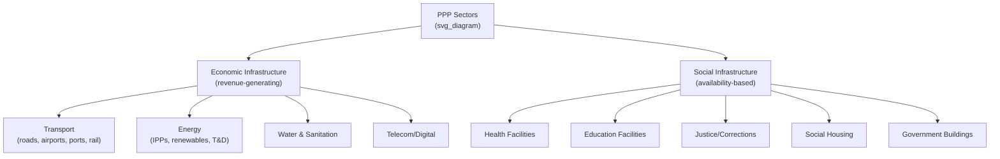

## Sectors and Services Commonly Delivered Through PPPs

### Overview

PPPs have been applied across a wide range of infrastructure and public service sectors, though the suitability of the PPP model, the typical payment mechanism, and the dominant risk allocation pattern vary substantially by sector. Sectors are generally distinguished by whether the underlying service is naturally revenue-generating from end users (favoring user-pays concessions) or is a public good/quasi-public good typically funded through the budget (favoring availability-payment structures).

### Transport

The largest and most mature PPP sector globally by both project count and capital value.

- **Toll roads and highways**: Classic user-pays concessions; private partner designs, builds, finances, and operates the road, collecting tolls directly. Demand risk is often substantially transferred, though shadow toll and availability-payment variants are also used to mitigate demand risk for the private partner
- **Airports**: Often structured as long-term concessions or lease arrangements; revenue combines aeronautical charges (landing fees) and non-aeronautical revenue (retail, parking, real estate)
- **Ports**: Typically landlord-port models where the public authority owns port land/basic infrastructure and leases terminal operations to private concessionaires under BOT-type structures
- **Rail**: More heterogeneous; can include DBFOM structures for rolling stock and stations, or infrastructure-only concessions, though full demand-risk transfer is less common due to high political sensitivity of fares
- **Urban transit (metro, light rail)**: Frequently structured with availability payments or hybrid mechanisms, since fare revenue alone rarely covers full lifecycle costs

**Example**: A toll road concession in which a private consortium designs, finances, and builds a new expressway, then operates and collects tolls for 30 years, bearing both construction risk and demand risk, before transferring the asset back to the government.

### Energy

- **Independent Power Producers (IPPs)**: Not always classified as classic PPPs in the concession sense, but structurally similar — private developers build and operate generation assets under long-term Power Purchase Agreements (PPAs) with a public or quasi-public offtaker
- **Renewable energy PPPs**: A rapidly growing sub-sector; solar, wind, and hydro projects structured under long-term PPAs, often supported by government feed-in tariffs or auction-based pricing mechanisms
- **Transmission and distribution concessions**: Private operators granted concessions to build/upgrade and operate transmission networks or distribution utilities, sometimes with performance-based tariff regulation
- **Off-grid/mini-grid electrification**: Emerging PPP application in developing markets, combining private capital with public subsidy to extend electrification to underserved areas

[Inference] Discussed earlier in this syllabus's market-growth content, the shift toward low-carbon energy projects has been one of the most significant sectoral trends in global PPI markets since 2010, driven substantially by supportive government policy rather than by market forces alone.

### Water and Sanitation

- **Water treatment and distribution concessions**: Private operator manages treatment, distribution, and billing under a concession or lease (affermage) arrangement, collecting tariffs from users
- **Wastewater treatment**: Often structured as availability-payment DBFOM contracts, since wastewater treatment does not generate direct user revenue in the same way water supply does
- **Desalination**: Capital-intensive Build-Own-Operate (BOO) or Build-Own-Operate-Transfer (BOOT) structures, typically with government or utility offtake agreements for treated water volumes
- [Unverified] Water sector PPPs have historically faced higher rates of contract renegotiation and public opposition than most other sectors, reportedly linked to tariff affordability and political sensitivity around water as a basic need — this is a widely cited pattern in PPP literature but exact renegotiation-rate figures vary by study and dataset

### Social Infrastructure

- **Health facilities**: Hospitals and clinics, typically structured as DBFOM with a clear separation between clinical services (retained by the public sector) and "hard" facilities management — building, equipment maintenance, and sometimes "soft" FM (catering, cleaning), delivered by the private partner
- **Education facilities**: School construction and facilities management under availability-payment DBFOM contracts; teaching remains a public sector function
- **Justice and corrections**: Prison construction and, in some jurisdictions, prison management services, under long-term availability or hybrid payment contracts — one of the more contested PPP applications due to the sensitivity of privatizing custodial functions
- **Social/affordable housing**: PPP structures used for construction and long-term management of public housing stock, sometimes combined with mixed-income development models
- **Government office buildings**: DBFOM structures for administrative buildings, courts, or other public facilities with straightforward availability-based payment logic

**Example**: A DBFOM hospital PPP in which a private consortium finances and constructs the building, then provides estates maintenance, catering, and cleaning for 25 years in exchange for a unitary charge, while the health ministry retains full responsibility for hiring clinicians and delivering medical care.

### Telecommunications and Digital Infrastructure

- **Broadband/fiber network rollout**: PPPs used to extend connectivity to underserved or commercially unviable areas, often combining private investment with public subsidy ("viability gap funding") for last-mile infrastructure
- **Data centers and government IT infrastructure**: Emerging application, structured similarly to social infrastructure DBFOM models
- **Smart city infrastructure**: Sensor networks, traffic management systems, and public Wi-Fi, often bundled into broader urban infrastructure concessions

### Municipal and Urban Services

- **Solid waste management**: Collection, transfer, and waste-to-energy facilities, often structured as concessions with tipping-fee revenue models
- **Street lighting**: Increasingly common as an "energy performance contracting"-adjacent PPP application, where private partners finance LED conversion and are paid from realized energy savings
- **Urban regeneration and mixed-use development**: Joint venture structures combining public land contribution with private development capital

### Sector Comparison by Typical Payment Mechanism and Risk Profile

| Sector | Typical Payment Mechanism | Dominant Risk Transferred | Demand Risk Location |
| --- | --- | --- | --- |
| Toll roads | User-pays | Construction, demand | Often private |
| Airports | User-pays (mixed revenue) | Construction, commercial | Largely private |
| Ports | Concession/lease fees | Construction, operational | Largely private |
| Urban transit | Availability/hybrid | Construction, performance | Often retained by public |
| Energy (IPP/renewables) | PPA-based offtake | Construction, operating | Typically offtaker (public) |
| Water/wastewater | User tariff or availability | Construction, operational | Mixed (tariff-sensitive) |
| Hospitals (DBFOM) | Availability payment | Construction, lifecycle maintenance | Retained by public |
| Schools (DBFOM) | Availability payment | Construction, lifecycle maintenance | Retained by public |
| Prisons | Availability/hybrid | Construction, operational performance | Retained by public |
| Broadband/digital | Subsidy + user revenue hybrid | Construction, take-up | Shared |

### Sectoral Distribution Diagram

### Why Sector Matters for PPP Suitability

**Key Points**

- **Revenue-generating (economic) infrastructure** sectors — transport, energy, water — more naturally support user-pays concessions because willingness-to-pay can be directly monetized, enabling substantial demand-risk transfer to the private partner
- **Non-revenue-generating (social) infrastructure** sectors — health, education, justice — cannot typically charge end users directly for core services, so payment is almost always structured as a government-funded availability payment, meaning demand risk stays with the public sector while construction and performance risk transfer to the private partner
- **Political sensitivity** varies significantly by sector: core public safety and welfare functions (prisons, hospitals, schools) generate more public and political scrutiny over private sector involvement than economic infrastructure, often constraining the degree of risk transfer or service scope that is politically feasible
- **Asset specificity and technical complexity** also shape sector suitability: highly specialized or rapidly evolving technical domains (e.g., digital infrastructure) may favor shorter contract terms or more flexible mechanisms than the 25–30 year contracts typical of civil infrastructure

### Common Misconceptions

- **Misconception**: PPPs are primarily a transport-sector tool.

  **Correction**: While transport remains the largest sector by cumulative capital value in most global databases, PPPs are applied across energy, water, social infrastructure, telecommunications, and municipal services, each with materially different risk allocation and payment norms.
- **Misconception**: Hospitals and schools built under PPP are privately run in the same way private hospitals or schools are.

  **Correction**: In the standard DBFOM social infrastructure model, only the estate/facilities function is privately delivered; core service delivery (clinical care, teaching) remains a public sector responsibility, and this separation is a defining feature distinguishing PPP social infrastructure from outright privatization of the service itself.
- **Misconception**: Renewable energy projects with PPAs are structurally identical to classic PPP concessions.

  **Correction**: [Inference] IPP/PPA structures share strong structural similarities with PPPs (long-term contracts, project finance, risk allocation via contract), but they are sometimes categorized separately in market databases and academic literature because the "public" counterparty is typically a state utility acting as an offtaker rather than a grantor of a concession over public infrastructure — classification conventions vary across institutions.

### Related Topics

- User-Pays versus Government-Pays Payment Mechanism Design
- Viability Gap Funding for Commercially Marginal Projects
- Power Purchase Agreement (PPA) Structuring for IPPs
- Facilities Management Contract Scope in Social Infrastructure PPPs
- Political Economy and Public Acceptance of PPPs in Sensitive Sectors
- Landlord-Port Model and Terminal Concession Structuring
- Energy Performance Contracting and Municipal Efficiency PPPs