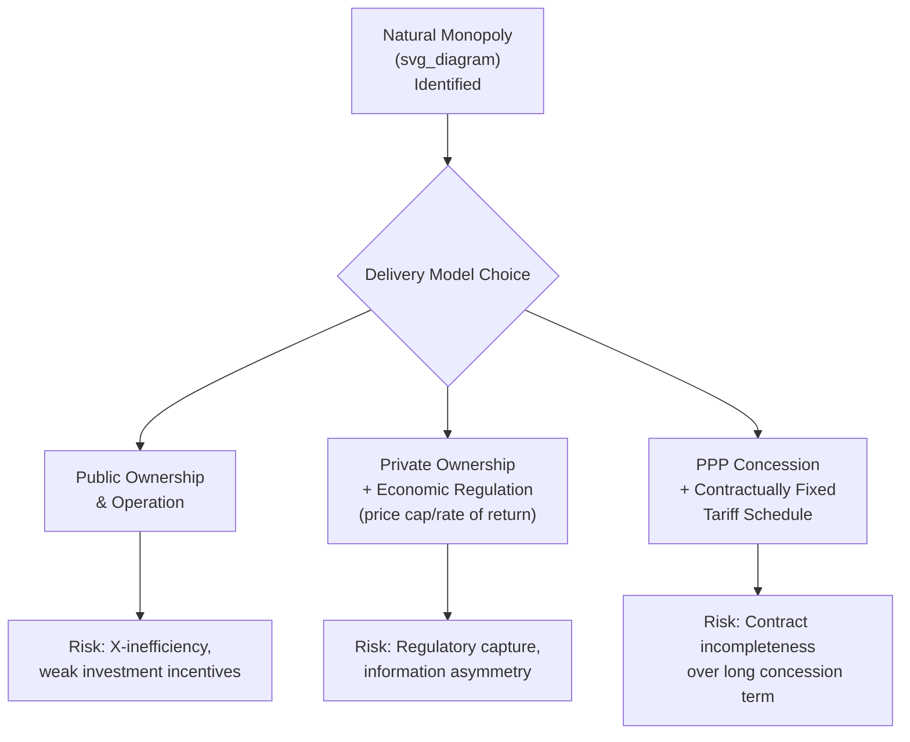

## Public Goods, Externalities, and Natural Monopoly Rationale

### Overview

The economic justification for public sector involvement in infrastructure and services — and, by extension, the theoretical frame within which PPPs must be evaluated — rests on three classical market failure concepts: **public goods**, **externalities**, and **natural monopoly**. Each identifies a distinct reason why unregulated private markets would under-provide, over-price, or otherwise misallocate resources relative to the socially efficient outcome, and each has different implications for how a PPP contract should be designed to correct for the underlying failure rather than simply relocating it.

### Public Goods

#### Definition and Core Properties

A pure public good is characterized by two properties:

- **Non-excludability**: It is impossible, or prohibitively costly, to prevent individuals from consuming the good once it is provided, even if they have not paid for it
- **Non-rivalry**: One person's consumption of the good does not diminish its availability to others

$$MC_{additional\ user} \approx 0$$

Because non-excludability prevents a private provider from charging non-payers, and non-rivalry means the efficient price for an additional user is at or near zero, purely private markets systematically under-provide public goods relative to the socially optimal quantity — this is the classic **free-rider problem**.

#### Classification Matrix

|  | Excludable | Non-Excludable |
| --- | --- | --- |
| **Rivalrous** | Private good (e.g., food, most manufactured goods) | Common-pool resource (e.g., open-access fisheries, congested unpriced roads) |
| **Non-Rivalrous** | Club good (e.g., toll roads at low congestion, cable TV) | Pure public good (e.g., national defense, street lighting, flood control) |

#### Relevance to PPPs

**Key Points**

- Most infrastructure assets suitable for PPPs are not pure public goods but **club goods** or **impure public goods**: they can be made excludable through technology (tolls, meters, ticketing) even though congestion effects introduce partial rivalry
- This excludability is precisely what makes user-pays PPP structures feasible: a toll road, water connection, or airport can charge users directly, converting what would otherwise be under-provided into a commercially viable concession
- True pure public goods (street lighting as illumination itself, flood defense, national defense) generally cannot support user-pays PPPs because non-payers cannot be excluded from benefiting; these are typically delivered via availability-payment PPPs where government, not end users, pays for output based on collective societal benefit
- **Example**: A flood defense system delivered via PPP is necessarily structured as a government-pays contract (e.g., an availability payment tied to flood protection standards being maintained) because it is not possible to exclude any resident of the protected area from the benefit, ruling out a user-charge revenue model

### Externalities

#### Definition

An externality exists when the production or consumption of a good imposes costs or benefits on third parties not reflected in the market price paid by the producer or consumer.

$$MSC = MPC + MEC$$

$$MSB = MPB + MEB$$

Where $MSC$ is marginal social cost, $MPC$ is marginal private cost, $MEC$ is marginal external cost, $MSB$ is marginal social benefit, $MPB$ is marginal private benefit, and $MEB$ is marginal external benefit.

- **Negative externality**: $MSC > MPC$; unregulated private provision leads to over-production relative to the social optimum (e.g., a private toll road operator ignoring pollution or congestion imposed on non-users)
- **Positive externality**: $MSB > MPB$; unregulated private provision leads to under-production relative to the social optimum (e.g., private under-investment in public transit, which generates benefits — reduced congestion, emissions — captured by non-riders as well as riders)

#### Graphical Illustration

<svg xmlns="http://www.w3.org/2000/svg" viewBox="0 0 700 380" font-family="sans-serif">
<text x="350" y="24" text-anchor="middle" font-size="16" font-weight="bold" fill="#1f2937">Positive Externality: Under-Provision (svg_diagram)</text>
<line x1="80" y1="330" x2="650" y2="330" stroke="#374151" stroke-width="1.5" />
<line x1="80" y1="330" x2="80" y2="50" stroke="#374151" stroke-width="1.5" />
<text x="660" y="335" font-size="12" fill="#374151">Quantity</text>
<text x="45" y="50" font-size="12" fill="#374151">Price</text>
<line x1="80" y1="290" x2="600" y2="90" stroke="#1e3a8a" stroke-width="2" />
<text x="605" y="88" font-size="11" fill="#1e3a8a">MSB (social benefit)</text>
<line x1="80" y1="290" x2="600" y2="150" stroke="#92400e" stroke-width="2" />
<text x="605" y="153" font-size="11" fill="#92400e">MPB (private benefit)</text>
<line x1="80" y1="90" x2="600" y2="290" stroke="#166534" stroke-width="2" />
<text x="605" y="290" font-size="11" fill="#166534">MC (marginal cost)</text>
<line x1="330" y1="330" x2="330" y2="170" stroke="#991b1b" stroke-dasharray="4" stroke-width="1.5" />
<text x="300" y="345" font-size="10" fill="#991b1b">Q_private</text>
<line x1="420" y1="330" x2="420" y2="130" stroke="#166534" stroke-dasharray="4" stroke-width="1.5" />
<text x="405" y="345" font-size="10" fill="#166534">Q_social (efficient)</text>
</svg>

The private market equilibrium ($Q_{private}$) occurs where $MPB = MC$, which is below the socially efficient quantity ($Q_{social}$) where $MSB = MC$ — illustrating the under-provision problem for goods with positive externalities.

#### Relevance to PPPs

- Infrastructure frequently generates significant positive externalities: transit reduces congestion and emissions for non-users; sanitation infrastructure reduces disease transmission community-wide beyond the connected households; education facilities generate broader social and economic development benefits
- Because a purely private, unsubsidized operator would price based on private benefit captured (fares, tariffs) rather than full social benefit, PPP structures for such assets often incorporate government subsidy, viability gap funding, or availability payments to correct for the wedge between private and social returns, effectively internalizing the externality into the private partner's revenue stream
- **Example**: An urban metro PPP where fare revenue alone would not cover the private partner's costs at socially optimal service frequency; the government supplements fare revenue with an availability payment calibrated partly to reflect broader congestion-reduction and emissions benefits captured by non-riders

### Natural Monopoly

#### Definition

A natural monopoly exists in industries characterized by high fixed costs and low or declining marginal costs, such that average total cost continues to fall as output increases across the relevant range of demand — meaning a single firm can supply the entire market at lower cost than two or more competing firms each operating at smaller scale.

$$AC(Q) = \frac{FC}{Q} + MC$$

Where fixed cost $FC$ is very large relative to demand and marginal cost $MC$ is relatively low and flat, $AC(Q)$ declines continuously over the relevant output range, meaning duplicating the network (e.g., building parallel water pipe networks, parallel electricity transmission grids) would be economically wasteful.

#### Characteristics of Natural Monopoly Infrastructure

- Very high sunk capital costs relative to the size of the addressable market (network infrastructure: water pipes, electricity transmission, rail tracks)
- Low marginal cost of serving an additional user once the network exists
- Economies of scale and scope over the relevant range of demand
- Often also characterized by **economies of density**, where cost per user falls as user density in a given geographic area increases

#### The Regulatory Problem

An unregulated private natural monopolist, facing no competitive constraint, would set price above marginal cost to maximize profit, resulting in:

$$P_{monopoly} > MC$$

This generates allocative inefficiency (deadweight loss) and potentially excessive profit extraction from a captive user base with no substitute supplier.

#### Relevance to PPPs

**Key Points**

- Water distribution networks, electricity transmission/distribution, and some transport networks (rail track, certain toll roads with no viable alternative route) exhibit natural monopoly characteristics
- Where a PPP concession is granted over a natural monopoly asset, the *contract itself* substitutes for ongoing competitive market discipline — since the private operator faces no competitors during the concession, the concession agreement must specify tariff-setting rules, service standards, and often a price-cap or rate-of-return regulatory mechanism directly within the contract
- This is why natural monopoly PPPs (e.g., water concessions) require significantly more detailed and rigid tariff regulation clauses than PPPs in genuinely competitive-adjacent contexts (e.g., a second toll road route where users have an alternative)
- Failure to anticipate this can lead to well-documented water concession disputes internationally, where tariff-setting mechanisms proved contentious once the private operator held effective monopoly pricing power over an essential service — [Inference] this is a widely discussed pattern in PPP economics case-study literature; specific case outcomes and their causes are contested and should be researched individually rather than treated as a uniform template

### Integrating the Three Rationales in PPP Design

| Market Failure | Core Problem | Typical PPP Design Response |
| --- | --- | --- |
| Public good | Free-riding, non-excludability | Availability payments; government as sole "customer" |
| Positive externality | Private under-provision | Subsidy, viability gap funding, or blended payment mechanisms |
| Negative externality | Private over-provision / uncompensated harm | Regulatory standards embedded in contract (environmental, safety) |
| Natural monopoly | Monopoly pricing power | Contractually fixed tariff schedules, price-cap regulation, competitive tendering for the right to be the sole operator ("competition for the market" rather than "in the market") |

The concept of **"competition for the market"** (a term associated with the theory of contestable markets and Demsetz-style franchise bidding) is central here: where ongoing competition *within* the market is impossible due to natural monopoly characteristics, PPP procurement substitutes competitive tension at the bidding stage — multiple bidders compete for the exclusive right to operate the monopoly asset — as the mechanism disciplining price and quality, in place of continuous market competition.

### Common Misconceptions

- **Misconception**: Any infrastructure asset delivered via PPP must be a public good.

  **Correction**: Most PPP assets are private, club, or natural-monopoly goods rather than pure public goods; pure public goods (in the strict economic sense) are relatively rare and almost always require availability-payment rather than user-pays structures, since non-payers cannot be excluded.
- **Misconception**: Natural monopoly justifies public ownership over PPP or privatization.

  **Correction**: Natural monopoly is a rationale for *some form* of ongoing economic regulation or contractual price control, not necessarily for public ownership specifically — the "competition for the market" concept underlying franchise bidding demonstrates how natural monopoly assets can be privately operated under a PPP or concession while still avoiding unconstrained monopoly pricing, provided contract design is sound.
- **Misconception**: Externalities are always negative and require restricting private activity.

  **Correction**: Positive externalities are equally significant in PPP economics — the policy response to positive externalities (e.g., public transit, education) is typically *subsidy or blended payment* to correct under-provision, not restriction.

### Related Topics

- Contestable Markets Theory and Franchise Bidding (Demsetz Auction)
- Price-Cap versus Rate-of-Return Regulation in Concession Design
- Viability Gap Funding Mechanisms for Externality-Generating Projects
- Club Goods and Congestion Pricing in Toll Road Economics
- Regulatory Capture Risk in Long-Term Monopoly Concessions
- Merit Goods and the Case for Government-Pays PPP Structures
- Deadweight Loss Analysis in Unregulated Monopoly Infrastructure