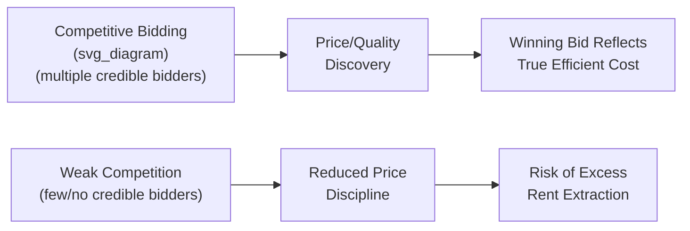

## Welfare Economics and the Efficiency Case for Private Participation

### Overview

Welfare economics provides the formal analytical toolkit for evaluating whether shifting infrastructure delivery from the public to the private sector — whether through a PPP or full privatization — improves or worsens overall societal well-being. The efficiency case for private participation rests on the argument that competitive and quasi-competitive market mechanisms, properly structured, tend to generate incentives for cost minimization, innovation, and risk-appropriate investment that traditional public provision may lack — but this case is conditional, not absolute, and depends heavily on whether the underlying market failures relevant to infrastructure (addressed separately under public goods, externalities, and natural monopoly) are adequately corrected for in contract design.

### First and Second Welfare Theorems as a Baseline

The **First Fundamental Theorem of Welfare Economics** states that a competitive equilibrium, under certain conditions (no externalities, no public goods, no market power, complete information, complete markets), is Pareto efficient — no reallocation can make one party better off without making another worse off.

$$MRS_{xy}^{i} = MRS_{xy}^{j} = \frac{P_x}{P_y} \quad \forall i,j$$

The **Second Fundamental Theorem** states that any Pareto-efficient allocation can, in principle, be achieved as a competitive equilibrium given an appropriate initial redistribution of endowments, separating the efficiency question from the distributional (equity) question.

[Inference] These theorems are foundational to welfare economics generally and are typically invoked in PPP literature as the theoretical baseline that infrastructure markets systematically violate — precisely because infrastructure markets exhibit the market failures (public goods, externalities, natural monopoly, information asymmetry) that the theorems assume away, which is why unregulated private provision cannot be presumed efficient without corrective contract design.

### The Efficiency Case for Private Participation

#### 1. X-Efficiency and Managerial Incentives

**X-efficiency** (a concept associated with Harvey Leibenstein) refers to the degree to which a firm operates at its true minimum-cost production frontier, as distinct from allocative efficiency (producing the right quantity at the right price).

- Public sector entities, insulated from bankruptcy risk, takeover threat, and profit-driven ownership, are theorized to be more prone to **X-inefficiency**: slack, overstaffing, weak cost discipline
- Private ownership, particularly when combined with debt-financed project structures that impose hard budget constraints (non-recourse project finance requires debt service from project cash flows, with no implicit government bailout), is argued to impose stronger cost discipline
- $$AC_{actual} > AC_{efficient\ frontier}$$ represents the X-inefficiency gap; the efficiency case for PPPs argues private management narrows this gap

#### 2. Property Rights Theory

Property rights theory (associated with Alchian, Demsetz, and later Hart) argues that clearly defined, transferable, residual claimant rights create stronger incentives for efficient asset use and investment than diffuse public ownership, where no single party captures the full residual gain from efficiency improvements.

- In a PPP, the private partner as residual claimant on project cash flows (after covering debt service and operating costs) has a direct financial stake in minimizing costs and maximizing asset performance over the contract term
- This is contrasted with traditional public procurement, where the constructing contractor has no ongoing residual claim once the build phase is complete, weakening the incentive to optimize for lifecycle cost

#### 3. Incomplete Contracts and the Theory of the Firm (Hart-Moore-Shleifer Framework)

[Inference] The theoretical PPP literature draws significantly on the incomplete contracts framework developed by Oliver Hart, John Moore, and Andrei Shleifer, applied specifically to public-private contracting by Hart in later work — this attribution reflects standard academic literature but the precise formulations and their direct applicability to any specific PPP contract are matters of ongoing scholarly debate rather than settled empirical fact.

The core insight: because long-term infrastructure contracts cannot specify every future contingency, **ownership determines residual control rights** — the right to make decisions not explicitly covered by the contract.

- **Bundling logic**: Combining construction and operation responsibilities in a single private party creates an incentive to consider whole-life costs at the design/construction stage (since the same party bears operating costs later) — this is the theoretical basis for DBFOM bundling discussed in earlier syllabus modules
- **Quality-cost tradeoff risk**: The same incomplete-contracts framework also identifies a potential downside — if quality dimensions are difficult to specify and monitor contractually (e.g., subtle service quality in a prison or hospital), a profit-maximizing private operator with residual control rights may under-invest in unspecified quality dimensions to reduce cost, a concern Hart's own work raised specifically regarding prison PPPs

$$\text{Bundling efficiency gain} = \Delta(\text{lifecycle cost savings}) - \Delta(\text{unmonitorable quality degradation})$$

[Inference] This expression is a conceptual simplification for illustrating the tradeoff, not a standard formula found in a single canonical source; the actual sign and magnitude of this tradeoff is project- and sector-specific and is the subject of ongoing empirical research rather than a fixed parameter.

#### 4. Risk Transfer and Optimal Risk Allocation

Standard risk allocation theory holds that efficiency is maximized when each risk is borne by the party best able to manage, mitigate, or absorb it at lowest cost — not by whichever party can be made to bear the most risk.

$$\text{Efficient allocation}: \arg\min_{i \in \{public, private\}} C_i(R)$$

Where $C_i(R)$ is the cost to party $i$ of bearing risk $R$. Transferring construction risk to a private EPC contractor is typically efficient because that party controls the inputs determining construction outcomes; transferring uncontrollable macroeconomic or regulatory risk to the private party is typically *inefficient*, since the private party cannot influence the outcome and will price the retained risk into its bid at a premium, raising costs without generating any offsetting behavioral improvement.

**Key Points**

- The efficiency case for PPPs is NOT "transfer as much risk as possible to the private sector"
- It is "transfer each risk to whichever party can manage it at lowest expected cost," with residual, unmanageable risks (e.g., political/regulatory risk, force majeure) generally remaining more efficiently held by government
- Over-transfer of risk the private party cannot control leads to inflated bid prices (a risk premium with no corresponding efficiency benefit), which can make the PPP *less* efficient than traditional procurement despite superficially appearing to "transfer more risk"

### Competitive Tension as an Efficiency Mechanism

Since most PPP concessions grant effective monopoly rights over the contract term (see natural monopoly rationale), the efficiency case for private participation depends heavily on competition *for* the contract (at the bidding stage) substituting for the absence of ongoing competition *within* the market.

[Unverified] The empirical strength of this mechanism is contingent on genuine competitive tension existing at tender — PPP economics literature widely notes that markets with only a small number of capable bidders (common in specialized, high-value infrastructure sectors) can undermine the theoretical efficiency gains from "competition for the market," though the extent of this effect is context-dependent and contested in the empirical literature rather than settled with a single benchmark figure.

### Weighing Efficiency Gains Against the Private Cost of Capital

A central empirical and theoretical question in PPP welfare analysis is whether efficiency gains from the mechanisms above are large enough to offset the higher cost of private capital relative to sovereign borrowing.

$$NPV_{PPP} = \sum_{t=0}^{T} \frac{(\text{Efficiency Gains}_t - \text{Risk Premium Cost}_t)}{(1+r)^t}$$

Where the discount rate $r$ and the magnitude of efficiency gains versus risk premium cost are project-specific empirical questions rather than fixed constants. This is formalized in practice through **Value for Money (VfM)** analysis comparing the PPP option to the Public Sector Comparator, introduced in earlier syllabus content.

**Key Points — Conditions Favoring a Positive Efficiency Case**

- Project scope allows genuine, meaningful risk transfer (construction and performance risk are manageable by the private party)
- Output specifications can be written with reasonable completeness, limiting the quality-degradation risk from incomplete contracting
- Genuine competitive tension exists among multiple credible bidders
- The efficiency/innovation gains achievable are large relative to the private cost-of-capital premium
- Contract monitoring and enforcement capacity exists on the public side to prevent opportunistic underperformance

**Key Points — Conditions Undermining the Efficiency Case**

- Quality dimensions are difficult to specify or monitor (elevated risk of underinvestment in unmonitorable quality per Hart-Moore-Shleifer logic)
- Limited bidder competition at tender
- Substantial uncontrollable risk (regulatory, political, demand volatility) is contractually pushed onto the private party, inflating risk premiums without efficiency benefit
- Weak public sector contract management capacity, undermining enforcement of performance standards

### Distributional (Equity) Considerations Alongside Efficiency

Consistent with the Second Welfare Theorem's separation of efficiency from distribution, an efficient PPP arrangement is not automatically equitable:

- User-pays models can raise affordability concerns for lower-income users, particularly for essential services (water, transit)
- Availability-payment models shift long-term fiscal obligations onto future taxpayers, raising intergenerational equity questions
- [Inference] PPP economics literature generally treats efficiency (VfM) and equity (distributional impact, affordability) as distinct evaluation criteria that should both be assessed, since a project can be efficient in the aggregate welfare sense while still producing distributionally undesirable outcomes requiring separate policy correction (e.g., targeted subsidies, lifeline tariffs).

### Common Misconceptions

- **Misconception**: The welfare economics literature shows private provision is always more efficient than public provision.

  **Correction**: The efficiency case is conditional on specific enabling conditions (effective risk transfer, contractible quality, competitive tendering, strong contract management); where these conditions are absent, theory itself (particularly incomplete contracts literature) predicts private provision may be *less* efficient, especially where quality is difficult to monitor.
- **Misconception**: Maximizing risk transfer to the private sector always maximizes efficiency.

  **Correction**: Efficient risk allocation theory specifically argues risk should go to whichever party can manage it at lowest cost — transferring uncontrollable risk to the private party generates a risk premium without a corresponding efficiency gain, which can reduce, not increase, overall value for money.
- **Misconception**: The First Welfare Theorem implies infrastructure markets are efficient if left private and unregulated.

  **Correction**: The First Welfare Theorem's conditions (no externalities, no public goods, no market power) are precisely the conditions infrastructure markets typically violate, which is why the theorem is invoked in this literature as a baseline that requires active correction through contract design and regulation, not as a justification for unregulated private provision.

### Related Topics

- Value for Money (VfM) Analysis and the Public Sector Comparator
- Incomplete Contracts Theory (Hart-Moore-Shleifer) Applied to PPPs
- Optimal Risk Allocation Theory and Risk Pricing in Bid Costs
- X-Efficiency and Comparative Public/Private Management Studies
- Competitive Tendering Design and Bidder Market Structure
- Distributional and Affordability Impacts of User-Pays Infrastructure
- Property Rights Theory and Residual Claimancy in Long-Term Contracts