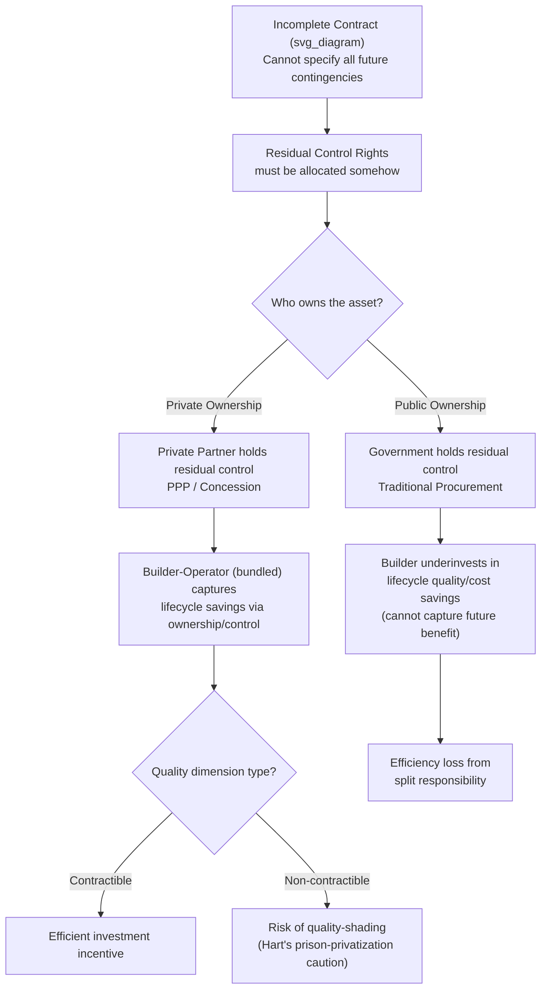

## Incomplete Contract Theory and the Property Rights Approach

### Overview

Incomplete Contract Theory (ICT) and the Property Rights Approach (PRA) form the dominant theoretical lens for explaining why Public-Private Partnerships (PPPs) are structured as bundled, long-term contracts rather than as short-term procurement or full privatization. The framework, developed primarily by Sanford Grossman, Oliver Hart, and John Moore (the "GHM framework"), explains contractual incompleteness, the allocation of residual control rights, and the resulting incentive effects on investment — all central to understanding why a government would bundle design, build, finance, operate, and maintain (DBFOM) into a single concession rather than contracting each stage separately.

### Foundational Premise: Why Contracts Are Incomplete

Classical (complete) contract theory assumes parties can write a contract specifying every possible future contingency and the corresponding obligations of each party, enforceable by a court. ICT rejects this assumption on three grounds:

- **Bounded rationality**: parties cannot foresee or enumerate every future state of the world, especially over PPP contract horizons of 20–30+ years.
- **Costly contracting**: even foreseeable contingencies are too costly to specify and negotiate in advance.
- **Non-verifiability**: even when parties privately observe relevant information (e.g., true asset condition, effort exerted, quality delivered), courts and third parties often cannot verify it, so it cannot be written into an enforceable clause.

Because of these frictions, real-world contracts — including PPP concession agreements — are necessarily incomplete: they leave gaps, or "holes," corresponding to contingencies not explicitly addressed.

### Residual Control Rights and Residual Rights of Control

The central construct of the Property Rights Approach is the distinction between **specific rights** (those explicitly allocated by contract) and **residual control rights** (the right to decide on any use or action not explicitly covered by the contract).

Grossman and Hart's (1986) key insight: since a contract cannot specify decision rights for every contingency, **ownership of an asset** becomes the mechanism for allocating residual control. The owner of a physical asset (e.g., a toll road, a hospital building, a water treatment plant) holds the right to make all decisions about that asset not otherwise specified in the contract, including the right to exclude others from using it.

$$\text{Residual Control Rights} = \text{Total Decision Rights} - \text{Contractually Specified Rights}$$

This matters for PPPs because the entire policy question of "should this asset be publicly or privately owned/controlled during the concession?" reduces, in this framework, to a question of optimal allocation of residual control rights.

### The Hold-Up Problem and Relationship-Specific Investment

Incomplete contracts create the **hold-up problem**: when a party makes a relationship-specific investment (an investment whose value is largely tied to a particular counterparty or asset and has little value elsewhere), the investing party becomes vulnerable to *ex post* renegotiation once the investment is sunk.

**Key Points**

- A relationship-specific investment lowers the investor's outside option (bargaining power) after the investment is made.
- The counterparty can threaten to withhold cooperation, renegotiate terms, or expropriate part of the surplus — this is "hold-up."
- Anticipating hold-up, the investing party under-invests relative to the socially efficient level *ex ante*.
- This under-investment is a form of contractual inefficiency arising purely from the *incompleteness* of the contract, not from any deliberate opportunism observed yet — it is anticipated opportunism that distorts investment incentives.

**Example**

A private operator in a water PPP is asked to install a proprietary, non-transferable treatment technology optimized only for that specific municipal network. If the government owns the asset and can terminate or fail to renew the concession, the operator may under-invest in this technology because it cannot be easily redeployed or resold if the relationship ends — the investment is "specific" and creates hold-up exposure.

### Formal GHM Model Structure

The canonical Grossman-Hart-Moore setup involves two parties, $B$ (buyer/user of an asset's services, often the public sector/government in PPP contexts) and $S$ (seller/manager of the asset, the private partner), where:

1. At $t=0$, ownership of the asset is allocated to either $B$ or $S$ (or shared).
2. At $t=1$, each party makes a **non-contractible, relationship-specific investment** ($i_B$ or $i_S$) that increases the joint surplus but cannot be verified or written into a contract.
3. At $t=2$, a contingency is realized, and the parties **bargain** (typically modeled via Nash bargaining, splitting surplus 50/50) over the use of the asset, since the contract is incomplete and cannot specify this contingency in advance.
4. The party who does **not** own the asset has a **weaker outside option** in bargaining (they can walk away, but without the asset, their outside option value is lower), so they capture a smaller share of the incremental surplus generated by their own investment.
5. **Underinvestment Result**: Because each party can only capture part (via bargaining) rather than all of the marginal return on their investment, both parties underinvest relative to the first-best (fully verifiable-contract) benchmark. Ownership determines *which* party underinvests less.

$$i_j^* = \arg\max_{i_j} \left[ \alpha_j \cdot S(i_B, i_S) - c(i_j) \right]$$

where $\alpha_j$ is party $j$'s share of the marginal surplus determined by their bargaining position (itself a function of asset ownership), $S(\cdot)$ is total surplus, and $c(i_j)$ is the private cost of investment.

**Optimal Ownership Rule (Hart-Moore, 1990)**: Assign ownership to the party whose investment is more important to total surplus creation (i.e., has the larger effect on the marginal product of joint surplus), because ownership strengthens that party's bargaining position and investment incentives at the cost of weakening the other's.

### Application to PPP Structuring: Why Bundling Occurs

The Property Rights Approach directly motivates the standard rationale (associated with Hart, 2003, "Incomplete Contracts and Public Ownership: Remarks, and an Application to Public-Private Partnerships") for why PPPs bundle construction and operations phases:

**Key Points**

- In traditional procurement, the builder (constructor) and the operator (service provider) are **separate parties** with **separate, sequential contracts**.
- Because the construction contract is incomplete, the builder cannot be fully compensated for quality improvements that only manifest during the operations phase (e.g., using higher-grade materials that reduce future maintenance costs) — those benefits accrue to a *different, unrelated party* (the operator or the government), not to the builder.
- The builder, anticipating this, under-invests in quality/cost-reducing innovations that primarily benefit the *operating* phase, since it cannot contractually capture that value.
- **Bundling** (DBFOM) internalizes this externality: if the same private entity that builds the asset also operates it long-term, it fully captures the lifecycle cost savings of higher-quality construction. This is the theoretical basis for the "whole-life costing" incentive frequently cited as a PPP benefit.

**Trade-off in Hart's Model**: Bundling is not unambiguously optimal. It also gives the private partner residual control over **service quality decisions** during operations, which the contract cannot fully specify (e.g., cost-cutting on non-contractible dimensions of quality, like staff friendliness in a prison-management PPP, versus contractible dimensions like cell count). Hart's (1997/2003) analysis of prison privatization is the classic illustrative case:

- If quality-reducing cost cuts primarily affect **non-contractible** dimensions (patient/prisoner welfare, service intangibles) more than contractible ones (unit costs), private ownership (bundling into a PPP with a profit-maximizing operator) can lead to excessive quality shading, because the operator captures 100% of cost savings but only partially internalizes the (non-contractible, non-litigable) welfare cost.
- This is Hart's key theoretical caution against blanket PPP bundling in sectors like prisons and, by extension, other services with hard-to-specify quality dimensions (basic healthcare, some educational services).

### Diagram: Ownership and Investment Incentives (svg_diagram)

### The Property Rights Approach vs. Transaction Cost Economics (TCE)

Incomplete Contract Theory/PRA is frequently compared with Oliver Williamson's Transaction Cost Economics, since both address why ownership/organizational boundaries matter under contractual incompleteness. Key distinctions relevant to PPP economics:

| Dimension | Property Rights Approach (GHM/Hart) | Transaction Cost Economics (Williamson) |
| --- | --- | --- |
| Source of inefficiency | Ex ante underinvestment due to anticipated bargaining/hold-up | Ex post bargaining costs and opportunism ("maladaptation") during contract execution |
| Ownership's role | Allocates residual control rights, shaping bargaining power and investment incentives | Governance structure choice minimizing transaction costs given asset specificity, uncertainty, frequency |
| Formalization | Highly formalized (Nash bargaining, mathematical optimization over ownership structures) | Largely qualitative, heuristic ("discriminating alignment" hypothesis) |
| Prediction mechanism | Ownership = highest-powered incentive; assign to the more important investor | Vertical integration reduces opportunism when asset specificity is high |

[Inference] Both frameworks arrive at broadly similar practical PPP design recommendations (bundle when investments are complementary and hard to contract; keep public control when non-contractible quality risk is high), but they justify these recommendations through different causal mechanisms — this convergence is often noted in the PPP literature as reinforcing the robustness of the underlying policy conclusions.

### Risk Allocation Corollary

ICT provides the theoretical foundation for the standard PPP risk-allocation principle: **"risk should be allocated to the party best able to manage/control it,"** because:

- Residual control rights determine which party can actually influence the probability/magnitude of a given risk materializing.
- Since the contract cannot specify every risk-contingent action, the party holding residual control over the relevant decision margin (e.g., construction method, maintenance scheduling, demand-generating marketing decisions) is the party whose effort/investment decisions actually determine outcomes.
- Misallocating a risk to a party without corresponding control rights breaks the incentive-alignment logic and reintroduces the underinvestment/moral hazard problems the bundled structure was meant to solve.

### Contract Renegotiation as Evidence of Incompleteness

PPP contracts exhibit high empirical renegotiation rates (frequently cited in infrastructure economics literature, e.g., Guasch's World Bank studies on Latin American concessions), which is treated in the literature as direct empirical evidence consistent with ICT's core premise: real contracts cannot be complete, so *ex post* renegotiation is a structurally expected feature of long-duration PPPs, not an anomaly or a sign of contractual failure per se.

**Key Points**

- High renegotiation frequency is consistent with (though not unique proof of) contractual incompleteness.
- [Unverified] Whether observed renegotiations reflect genuine unforeseen contingencies versus opportunistic bidding (deliberately underbidding, expecting to renegotiate later) is empirically contested and cannot be resolved by the theory alone — this is a persistent identification problem in the applied PPP renegotiation literature.
- Renegotiation design clauses (e.g., predefined arbitration mechanisms, Material Adverse Government Action clauses) are a *second-best* contractual response to irreducible incompleteness rather than a solution to it.

### Formal Notation Summary

| Symbol | Meaning |
| --- | --- |
| $i_B, i_S$ | Non-contractible relationship-specific investments of buyer and seller |
| $S(i_B, i_S)$ | Total surplus function, increasing in both investments |
| $\alpha_j$ | Party $j$'s bargaining share of marginal surplus, determined by ownership/outside options |
| $c(i_j)$ | Private cost of investment for party $j$ |
| $i_j^*$ | Privately optimal (equilibrium) investment level under a given ownership structure |
| $i_j^{FB}$ | First-best investment level under complete contracting (benchmark, generally unattainable) |

The core underinvestment result can be summarized as:

$$i_j^* < i_j^{FB} \quad \text{whenever} \quad \alpha_j < 1$$

i.e., unless a party captures the *full* marginal surplus of their investment (which ownership alone typically cannot guarantee under bargaining), underinvestment relative to the first-best persists regardless of how ownership is assigned — ownership only shifts *which* party underinvests more.

### Limitations and Critiques

- [Speculation] Some scholars argue GHM-style models are too stylized (two parties, single asset, one-shot bargaining) to capture the multi-party, multi-asset, phased-financing complexity of real PPP consortia (SPVs, lenders, subcontractors, government counterparties), though the qualitative logic is widely regarded as still informative for policy design.
- The theory is largely silent on **financing structure** (a central real-world PPP feature — project finance, non-recourse debt, step-in rights for lenders), since GHM's core models abstract away from capital structure entirely.
- Empirical testing of the property rights approach in infrastructure contexts is difficult because "residual control rights" are not directly observable variables; researchers typically proxy them via contract type or ownership category, which introduces measurement error.

**Related Topics**

- Transaction Cost Economics and Williamson's Governance Structures
- Principal-Agent Theory and Moral Hazard in PPP Contracts
- Risk Allocation Principles and Optimal Risk Transfer
- Contract Renegotiation Theory and Adverse Selection in Concession Bidding
- Hart's Prison Privatization Model and Non-Contractible Quality
- Whole-Life Costing and Bundling Efficiency in DBFOM Structures
- Nash Bargaining Solutions in Bilateral Contracting
- Project Finance Structures and Lender Step-In Rights (as an extension beyond GHM's abstraction)