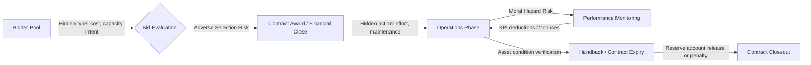

## Principal-Agent Theory, Moral Hazard, and Adverse Selection

### Overview

Principal-agent theory analyzes contractual relationships where one party (the principal) delegates decision-making authority or task execution to another party (the agent), whose interests are not perfectly aligned with the principal's, and whose actions or information cannot be perfectly observed. In Public-Private Partnerships (PPPs), the government (principal) contracts a private operator (agent) to design, build, finance, and/or operate infrastructure. Because the operator possesses superior information about costs, effort, and risk, and because the government cannot costlessly monitor every decision, PPP contracts must be structured to mitigate two canonical information problems: **adverse selection** (hidden information before contract signing) and **moral hazard** (hidden action after contract signing).

### The Core Agency Problem

**Key Points**

- Agency relationships arise whenever a principal delegates authority to an agent under conditions of **information asymmetry** and **divergent objectives**.
- The government cannot directly observe the private partner's true cost structure, effort level, risk mitigation diligence, or (sometimes) actual service quality.
- Agency costs are the sum of: monitoring expenditures by the principal, bonding expenditures by the agent (costly signals of good faith), and the residual loss from imperfect alignment even after monitoring and bonding.
- In PPPs, agency problems compound across multiple layers: government–SPV (Special Purpose Vehicle), SPV–subcontractors, SPV–lenders, and even within government (bureaucrat–minister–citizen).

The canonical formalization treats the principal as choosing a contract $w(x)$ — a payment schedule contingent on observable outcome $x$ — to maximize their own expected payoff subject to two constraints on the agent:

$$\max_{w(\cdot)} \; \mathbb{E}[B(x) - w(x)]$$

subject to:

$$\text{(IR)} \quad \mathbb{E}[U(w(x), e)] \geq \bar{U}$$

$$\text{(IC)} \quad e \in \arg\max_{e'} \; \mathbb{E}[U(w(x), e')]$$

Where $B(x)$ is the principal's benefit from outcome $x$, $U(w,e)$ is the agent's utility from wage $w$ and effort $e$, $\bar{U}$ is the agent's reservation utility, IR is the **individual rationality (participation) constraint**, and IC is the **incentive compatibility constraint**.

### Adverse Selection in PPPs

**Definition**

Adverse selection is a *pre-contractual* information problem: the private bidder possesses private information (true cost efficiency, technical capability, risk appetite, or intent) that the government cannot verify at the bidding stage, and this hidden information affects the desirability of contracting with that particular bidder.

**Mechanism**

If the government offers a single uniform contract to all bidders, low-cost/high-quality operators may find the terms unattractive relative to their true efficiency (since the contract must price in average risk), while low-quality or opportunistic bidders — who plan to under-invest or renegotiate later — find the same terms comparatively more attractive. Over successive bidding rounds, this can produce a "lemons market" dynamic (Akerlof, 1970) where high-quality bidders exit and average bidder quality deteriorates.

**Manifestations in PPP Procurement**

- **Winner's curse in competitive bidding**: the winning bid is often the most optimistic (or opportunistic) forecast of costs/revenues, not necessarily the most efficient one, especially in demand-risk-heavy contracts like toll roads.
- **Strategic misrepresentation**: bidders may deliberately underestimate costs or overestimate traffic/demand forecasts to win the concession, anticipating later renegotiation (this is sometimes called "low-balling" or "strategic underbidding").
- **Hidden financial fragility**: a bidder's true balance-sheet strength or access to committed financing is not fully verifiable at bid submission.
- **Hidden technical competence**: construction/O&M capability claimed in technical proposals may not match actual delivery capacity.

**Mitigation Mechanisms**

- **Screening** (principal-initiated): the government designs a menu of contracts or qualification thresholds so that only genuinely capable bidders self-select in. Examples: pre-qualification (technical and financial capacity checks), performance bonds, minimum equity commitment requirements, track-record requirements.
- **Signaling** (agent-initiated): capable bidders take costly actions to credibly reveal quality. Examples: posting larger performance bonds voluntarily, accepting more demand risk (signaling confidence in their own forecasts), submitting third-party technical audits, offering longer warranty periods.
- **Competitive tendering design**: multi-criteria bid evaluation (not price-only) that scores technical quality, reduces the incentive to win purely via unrealistic pricing.
- **Due diligence and disclosure requirements**: mandatory financial model submission, sensitivity analysis disclosure, and independent technical advisor review during bid evaluation.
- **Reputation and market repetition**: sequential PPP programs allow governments to build blacklists/track records, penalizing opportunistic bidders in future rounds.

### Moral Hazard in PPPs

**Definition**

Moral hazard is a *post-contractual* information problem: after the contract is signed, the agent (private operator) can take hidden actions — regarding effort, maintenance, risk management, or reporting — that the principal cannot fully observe or verify, and the agent's incentives diverge from the principal's.

**Mechanism**

Once risk is transferred (or once payment is decoupled from effort), the operator's incentive to exert costly effort (maintenance, safety investment, quality control) weakens, because the operator captures the cost savings from reduced effort while the principal (or end-users) bears part of the consequence (degraded asset condition, safety incidents, service failures) — particularly acute near contract handback when the operator has weak incentives to invest in long-lived asset quality.

**Two Sub-Types**

1. **Hidden action (moral hazard proper)**: the agent's effort level itself is unobservable. E.g., a road operator secretly deferring pavement maintenance.
2. **Hidden information post-contract**: the agent observes a state of the world (e.g., true maintenance need, true cost shock) that the principal does not, and reports it strategically. E.g., an operator claiming a "change in law" event to trigger compensation when the actual cost increase is smaller than claimed.

**Manifestations in PPP Operations**

- **Under-maintenance / asset stripping**: minimizing lifecycle capital expenditure, especially in the years before handback, degrading the asset's condition below contractual standards.
- **Quality shading**: reducing service quality on non-monitored or hard-to-verify dimensions (e.g., subtle degradation in cleaning frequency, staff training) while maintaining performance on metered/penalized KPIs.
- **Gold-plating**: in cost-plus or availability-based contracts, over-specifying inputs to inflate the cost base on which payments or profit margins are calculated.
- **Opportunistic renegotiation**: strategically triggering contract renegotiation clauses (claiming force majeure, change in law, or unforeseen circumstances) to extract better terms once the government is "locked in" (this is the **hold-up problem**, related to but distinct from moral hazard — it arises from relationship-specific investment and contract incompleteness).
- **Risk-shifting in financing structures**: excessive leverage in the SPV shifts downside risk to lenders/government while equity holders retain upside (a classic debt-agency moral hazard).
- **Subcontractor moral hazard**: the SPV itself becomes a principal vis-à-vis construction and O&M subcontractors, replicating the same problem one layer down.

**Mitigation Mechanisms**

- **Output/performance-based payment mechanisms**: linking payment to measurable, verifiable outputs (availability, condQuality Indicators, key performance indicators) rather than inputs, so payment automatically falls when service degrades — the core logic of **availability payments** and **performance-based contracts**.
- **Performance monitoring and independent certification**: independent engineers, technical advisors, or regulators periodically inspect and certify asset condition and service quality, reducing information asymmetry.
- **Handback / reversion standards**: contractually specified minimum asset condition standards at contract expiry, often verified via a **handback inspection regime** with escrowed reserve accounts (sinking funds) that penalize under-maintenance detected before transfer.
- **Penalty and bonus (incentive) schemes**: deductions for KPI breaches, bonuses for exceeding targets — calibrated so the agent's expected payoff is maximized only when true effort matches the principal's desired effort level.
- **Retained risk / co-investment**: requiring meaningful private equity at risk (skin in the game) so the operator internalizes a share of failure costs.
- **Step-in rights and lender oversight**: lenders (via project finance covenants) independently monitor the SPV to protect their own claims, functioning as a secondary monitoring layer that partially substitutes for costly government monitoring (this is why highly-leveraged project finance can, paradoxically, *discipline* moral hazard — a phenomenon sometimes called "delegated monitoring").
- **Reputational bonding across a portfolio**: operators managing multiple concessions from the same government have long-run reputational incentives not to shirk.
- **Regulatory audits and transparency mandates**: open-book accounting clauses, mandatory disclosure of maintenance logs, and third-party audits reduce the feasibility of quality shading.

### Comparative Table: Adverse Selection vs. Moral Hazard

| Dimension | Adverse Selection | Moral Hazard |
| --- | --- | --- |
| Timing | Pre-contract (ex ante) | Post-contract (ex post) |
| Hidden variable | Type/characteristic (cost efficiency, capability) | Action/effort or post-contract information |
| PPP example | Bidder overstates capability or underprices bid | Operator defers maintenance post-financial close |
| Primary mitigation | Screening, signaling, competitive bid design | Performance-based payment, monitoring, handback standards |
| Contractual tool | Pre-qualification, performance bonds at bid stage | KPI-linked deductions, independent certifiers, reserve accounts |

### Diagram: Information Asymmetry Timeline in a PPP Contract Lifecycle

### Worked Example: Availability Payment Design Under Moral Hazard

Consider a hospital PFI (Private Finance Initiative) contract where the private operator maintains the building and the government pays a monthly **availability payment** $P$ contingent on functional space availability and service quality.

A simplified deduction-based payment mechanism:

$$P = P_{max} - \sum_{i=1}^{n} d_i \cdot k_i$$

Where $P_{max}$ is the maximum monthly payment, $d_i$ is the duration (or severity-weighted count) of failure event type $i$ (e.g., ward unavailability, failed fire system test), and $k_i$ is the deduction rate per unit for that failure type.

**Design logic**: because $d_i$ is directly observable and verifiable (via facilities management logs and independent audits), the operator's expected payoff is:

$$\mathbb{E}[\pi] = P_{max} - \sum_i k_i \cdot \mathbb{E}[d_i(e)] - C(e)$$

where $C(e)$ is the operator's cost of effort $e$, and $\mathbb{E}[d_i(e)]$ decreases with effort. The government calibrates $k_i$ so that the marginal reduction in expected deductions from additional maintenance effort equals the marginal cost of that effort — i.e., the incentive-compatibility condition:

$$-\sum_i k_i \cdot \frac{\partial \mathbb{E}[d_i(e)]}{\partial e} = \frac{\partial C(e)}{\partial e}$$

If $k_i$ is set too low, the operator rationally under-maintains (moral hazard persists); if set too high without a corresponding risk premium in the base payment, risk-averse operators demand higher $P_{max}$ or refuse to bid (feeding back into adverse selection at the next tender round). [Inference] The precise calibration of $k_i$ in practice varies significantly by jurisdiction and sector-specific technical standards, and published deduction schedules should be consulted for exact benchmarks in any given contract.

### Diagram: Agency Cost Structure (svg_diagram)

<svg xmlns="http://www.w3.org/2000/svg" viewBox="0 0 720 320">
<text x="360" y="28" font-size="18" font-weight="bold" text-anchor="middle" fill="#1a1a1a">Agency Cost Structure (svg_diagram)</text>
<rect x="30" y="60" width="190" height="90" rx="8" fill="#dbeafe" stroke="#2563eb" stroke-width="1.5" />
<text x="125" y="95" font-size="14" font-weight="bold" text-anchor="middle" fill="#1e3a8a">Monitoring Costs</text>
<text x="125" y="118" font-size="11" text-anchor="middle" fill="#1e3a8a">Independent engineers,</text>
<text x="125" y="134" font-size="11" text-anchor="middle" fill="#1e3a8a">audits, KPI systems</text>
<rect x="265" y="60" width="190" height="90" rx="8" fill="#dcfce7" stroke="#16a34a" stroke-width="1.5" />
<text x="360" y="95" font-size="14" font-weight="bold" text-anchor="middle" fill="#14532d">Bonding Costs</text>
<text x="360" y="118" font-size="11" text-anchor="middle" fill="#14532d">Performance bonds,</text>
<text x="360" y="134" font-size="11" text-anchor="middle" fill="#14532d">equity at risk</text>
<rect x="500" y="60" width="190" height="90" rx="8" fill="#fee2e2" stroke="#dc2626" stroke-width="1.5" />
<text x="595" y="95" font-size="14" font-weight="bold" text-anchor="middle" fill="#7f1d1d">Residual Loss</text>
<text x="595" y="118" font-size="11" text-anchor="middle" fill="#7f1d1d">Remaining misalignment</text>
<text x="595" y="134" font-size="11" text-anchor="middle" fill="#7f1d1d">after mitigation</text>
<line x1="125" y1="150" x2="360" y2="200" stroke="#6b7280" stroke-width="1.5" />
<line x1="360" y1="150" x2="360" y2="200" stroke="#6b7280" stroke-width="1.5" />
<line x1="595" y1="150" x2="360" y2="200" stroke="#6b7280" stroke-width="1.5" />
<rect x="230" y="200" width="260" height="60" rx="8" fill="#fef9c3" stroke="#ca8a04" stroke-width="1.5" />
<text x="360" y="225" font-size="14" font-weight="bold" text-anchor="middle" fill="#713f12">Total Agency Cost</text>
<text x="360" y="245" font-size="11" text-anchor="middle" fill="#713f12">= Monitoring + Bonding + Residual Loss</text>

<text x="360" y="295" font-size="11" text-anchor="middle" fill="`#4b5563`">Optimal contract design minimizes the sum, not any single term in isolation</text>

</svg>

### Broader Theoretical Connections

- **Incomplete Contract Theory** (Hart, Grossman): PPP contracts cannot specify every contingency, so residual control rights and renegotiation design matter alongside pure incentive-payment schemes.
- **Transaction Cost Economics** (Williamson): asset specificity in PPPs (e.g., a purpose-built toll road) creates hold-up risk that compounds moral hazard, since the government cannot credibly threaten to switch operators mid-contract.
- **Multi-tasking Agency Problems** (Holmström & Milgrom): when operators perform multiple tasks with unequal observability (e.g., visible construction quality vs. invisible long-term durability choices), high-powered incentives on the observable task can crowd out effort on unobservable tasks — a key argument for balanced scorecards in PPP KPI design rather than single-metric incentive schemes.
- **Common Agency**: in PPPs with multiple government principals (national ministry, local authority, regulator), the operator faces potentially conflicting incentive signals, which can dilute overall incentive intensity.

**Related Topics**

- Risk allocation matrices and the "risk should be borne by the party best able to manage it" principle
- Incomplete contracts and renegotiation design in PPPs
- Transaction cost economics and asset specificity
- Performance-based contracting and Key Performance Indicator (KPI) design
- Project finance, leverage, and lender due diligence as a monitoring substitute
- Winner's curse and optimal auction design in infrastructure procurement
- Regulatory capture and information asymmetry between regulators and utilities
- Contract renegotiation triggers and hold-up problem mitigation clauses