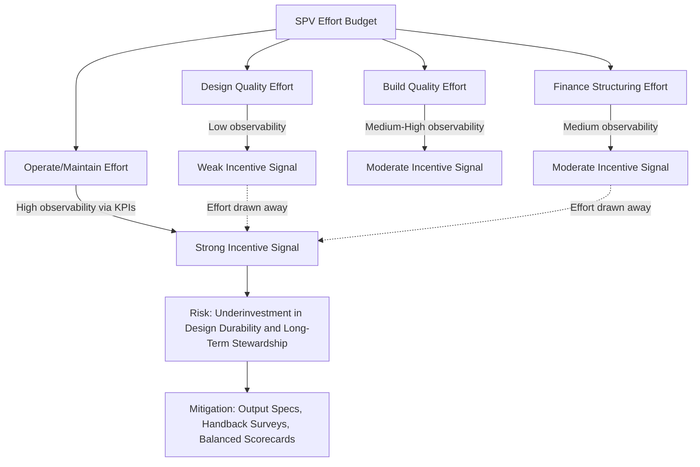

## Bundling of Design, Build, Finance, and Operate as a Multitask Agency Problem

### Overview

Bundling refers to the practice of contracting a single private entity (typically a Special Purpose Vehicle, SPV) to perform multiple interdependent project functions — Design, Build, Finance, and Operate (DBFO), sometimes extended to Design-Build-Finance-Operate-Maintain (DBFOM) — under one integrated long-term contract, rather than procuring each function separately through short-term contracts with different parties. The economic rationale for bundling, and its principal risk, are both explained by **multitasking agency theory** (Holmström & Milgrom, 1991): when a single agent performs several tasks whose outputs have unequal observability and contractibility, the *allocation of incentive intensity* across tasks — not just its overall level — determines the agent's behavior, and this allocation can produce severe distortions if designed carelessly.

### Why Bundle? The Lifecycle Externality Argument

**Key Points**

- Under traditional procurement (design-bid-build), the entity that designs and builds an asset does not bear the cost of operating and maintaining it — creating a **temporal externality**: the builder can minimize upfront construction cost by using cheaper materials or designs that raise long-run maintenance costs, and bears none of that downstream burden.
- Bundling internalizes this externality by making a single agent (the SPV) responsible for both the capital expenditure (CAPEX) decision and the operating expenditure (OPEX) consequence over the full asset lifecycle, incentivizing **whole-life costing**.
- This is the central efficiency argument for DBFO/DBFOM structures: it aligns the time horizon of the agent's decision-making with the time horizon over which costs and benefits actually materialize.

Formally, under unbundled procurement the builder minimizes only $C_{build}$ subject to meeting a design specification, ignoring $C_{operate}$. Under bundling, the SPV internalizes the full lifecycle cost:

$$\min_{q} \; C_{build}(q) + \sum_{t=1}^{T} \frac{C_{operate,t}(q)}{(1+r)^t}$$

where $q$ represents design/construction quality choices affecting both build cost and the discounted stream of future operating costs, and $r$ is the discount rate. Bundling is efficiency-improving precisely when $\partial C_{operate}/\partial q$ is large relative to $\partial C_{build}/\partial q$ — i.e., when higher upfront quality meaningfully reduces long-run operating costs.

### The Multitasking Problem: Why Bundling Creates New Agency Risk

**Mechanism**

Holmström and Milgrom's core insight is that when an agent allocates effort across multiple tasks, and the principal can only design incentive contracts based on *measurable* outcomes, incentives calibrated for the measurable task will draw effort away from unmeasured (but still valuable) tasks — even when both matter equally to the principal's true objective. This is the **multitasking distortion**, and it directly threatens the bundling logic:

- **Construction quality** (build phase) is relatively observable soon after completion (defects, commissioning tests, handover inspections).
- **Long-term durability and maintainability** (design choices that affect asset condition 15–25 years later) is far harder to observe or verify at the point of construction — the consequences of a poor design decision may not manifest until long after the original design/build subcontractors have been paid and dissolved.
- **Operational service quality** (availability, responsiveness, safety) is more observable via ongoing KPI monitoring than **asset stewardship** (whether maintenance is truly preserving long-run asset value versus just meeting minimum thresholds at each inspection point).

If a DBFO contract's payment mechanism is weighted heavily toward easily verified milestones (e.g., "practical completion" certificates, short-term availability metrics), the SPV's dominant strategy is to **satisfy the measured proxy** while under-investing in the unmeasured dimension — reproducing the very problem bundling was meant to solve, just shifted to a different unobserved margin.

**The Holmström-Milgrom Multi-task Formalization (Simplified)**

For an agent choosing effort vector $e = (e_1, e_2, \ldots, e_n)$ across $n$ tasks with cost of effort $C(e)$, and where the principal can only write contracts on a subset of noisy performance measures $x_i = e_i + \varepsilon_i$ for observable tasks, the optimal linear incentive contract:

$$w = \alpha + \sum_{i \in \text{observable}} \beta_i x_i$$

The key multitasking result: even if all $n$ tasks are equally valuable to the principal, the optimal $\beta_i$ for observable tasks should be **lower** than in a single-task setting whenever tasks are substitutes in the agent's effort allocation (i.e., $\partial^2 C / \partial e_i \partial e_j > 0$) — because high-powered incentives on the observable task will cannibalize effort from the unobservable one. [Inference] The precise optimal weighting depends on the covariance structure between task effort costs and the noise variance of each performance measure, which is generally not directly estimable in real PPP settings and is used here as a conceptual rather than calibratable result.

### Task Observability Map in DBFOM Contracts

| Phase | Task | Observability | Typical Contractibility |
| --- | --- | --- | --- |
| Design | Structural/technical specification choices | Low (consequences delayed) | Low — often only enforced via output specs, not input specs |
| Build | Construction defects, workmanship | Medium-High (inspections, commissioning tests) | High — liquidated damages, defect liability periods |
| Finance | Capital structure, leverage, refinancing gains | Medium (disclosed in financial model) | Medium — refinancing gain-share clauses |
| Operate | Availability, response times, safety incidents | High (real-time KPI monitoring) | High — deduction/bonus regimes |
| Maintain | True asset condition, deferred maintenance | Low until handback inspection | Low during term; High at handback via condition surveys |

This table illustrates the core multitasking risk: **Operate** is the most contractible dimension and therefore attracts the most incentive intensity, while **Design** quality and ongoing **Maintain** stewardship (the very dimensions bundling was meant to improve) remain the hardest to verify in real time.

### Mitigation Mechanisms

**Key Points**

- **Output specifications over input specifications**: rather than prescribing how design/construction should be done, contracts specify required *outcomes* (e.g., minimum 25-year design life for a given component class) so the SPV cannot game a narrow input metric.
- **Whole-life KPI weighting**: incorporating condition-based and asset-integrity indicators (not just service-availability indicators) into the ongoing payment mechanism, so long-term stewardship is partially observable and incentivized throughout the term, not just at handback.
- **Independent Certifiers / Technical Advisors**: third-party engineers assess design and construction quality against output specifications at defined gateways, converting an otherwise unobservable dimension into a contractible one.
- **Handback (reversion) condition surveys with financial consequences**: requiring the SPV to fund an escrowed **sinking fund** or **lifecycle reserve account**, released only upon independent verification that the asset meets handback condition standards — this re-attaches consequences to the previously unobservable long-term stewardship task.
- **Defects liability periods and latent defect insurance**: extending liability for design/construction faults beyond project completion, reducing the incentive to under-invest in durability-affecting design choices.
- **Balanced scorecards**: combining multiple weighted KPIs spanning availability, quality, safety, and asset condition, explicitly to avoid single-metric gaming — the direct practical response to Holmström-Milgrom's finding that unequal incentive weighting across tasks distorts effort allocation.
- **Bundling scope calibration**: deliberately choosing *not* to bundle certain tasks (e.g., excluding highly specialized clinical services from a hospital DBFOM, retaining them under separate public management) when a task's outputs are too difficult to specify or monitor, since forcing an ill-suited task into the bundle can worsen rather than improve overall incentive alignment — this is the core lesson from UK PFI experience regarding "soft FM" (facilities management) versus clinical service exclusions in hospital PFIs.

### Diagram: Multitask Incentive Allocation

### Worked Example: Payment Weighting and Effort Diversion

Consider a DBFOM road contract where the SPV allocates effort between **pavement design durability** (unobservable for ~10 years) and **monthly availability performance** (observable immediately via lane-closure sensors).

Suppose the SPV's cost of effort is quadratic and separable:

$$C(e_D, e_A) = \frac{1}{2}e_D^2 + \frac{1}{2}e_A^2$$

and the contract pays:

$$w = \alpha + \beta_A \cdot e_A + \underbrace{0}_{\text{no contractible signal for } e_D}$$

The SPV's optimization is:

$$\max_{e_D, e_A} \; \alpha + \beta_A e_A - \frac{1}{2}e_D^2 - \frac{1}{2}e_A^2$$

First-order conditions yield $e_A^* = \beta_A$ and $e_D^* = 0$ — the SPV rationally exerts **zero** durability effort because it is entirely uncompensated, regardless of how much the government privately values pavement durability. This starkly illustrates why a purely availability-based payment mechanism, absent any handback condition mechanism, systematically starves the "Design" and "Maintain" dimensions of the bundle — even though internalizing exactly those dimensions was bundling's original efficiency rationale. Introducing a handback-linked reserve account effectively adds a term $\beta_D \cdot \hat{e}_D$ (where $\hat{e}_D$ is the noisy, delayed-but-eventually-observable durability proxy captured at the condition survey), restoring some incentive for $e_D > 0$.

### Diagram: Bundled vs. Unbundled Lifecycle Cost Incentive (svg_diagram)

<svg xmlns="http://www.w3.org/2000/svg" viewBox="0 0 720 340">
<text x="360" y="26" font-size="17" font-weight="bold" text-anchor="middle" fill="#1a1a1a">Bundled vs. Unbundled Lifecycle Incentive (svg_diagram)</text>

<text x="180" y="55" font-size="13" font-weight="bold" text-anchor="middle" fill="`#374151`">Unbundled Procurement</text>

<rect x="60" y="70" width="120" height="50" rx="6" fill="`#fee2e2`" stroke="`#dc2626`" />

<text x="120" y="99" font-size="11" text-anchor="middle" fill="`#7f1d1d`">Design/Build Firm</text>

<line x1="180" y1="120" x2="180" y2="150" stroke="`#6b7280`" stroke-dasharray="4,3" />

<text x="180" y="145" font-size="10" text-anchor="middle" fill="`#6b7280`">no cost link</text>

<rect x="120" y="150" width="120" height="50" rx="6" fill="`#fef9c3`" stroke="`#ca8a04`" />

<text x="180" y="179" font-size="11" text-anchor="middle" fill="`#713f12`">Separate Operator</text>

<text x="180" y="220" font-size="10" text-anchor="middle" fill="`#6b7280`">Builder ignores OPEX impact of design choices</text>

<line x1="360" y1="60" x2="360" y2="330" stroke="#d1d5db" stroke-width="1" />

<text x="540" y="55" font-size="13" font-weight="bold" text-anchor="middle" fill="`#374151`">Bundled DBFOM</text>

<rect x="480" y="70" width="120" height="130" rx="8" fill="`#dbeafe`" stroke="`#2563eb`" />

<text x="540" y="100" font-size="11" font-weight="bold" text-anchor="middle" fill="`#1e3a8a`">Single SPV</text>

<text x="540" y="120" font-size="10" text-anchor="middle" fill="`#1e3a8a`">Design</text>

<text x="540" y="138" font-size="10" text-anchor="middle" fill="`#1e3a8a`">Build</text>

<text x="540" y="156" font-size="10" text-anchor="middle" fill="`#1e3a8a`">Finance</text>

<text x="540" y="174" font-size="10" text-anchor="middle" fill="`#1e3a8a`">Operate</text>

<text x="540" y="220" font-size="10" text-anchor="middle" fill="`#6b7280`">Whole-life cost internalized</text>

<text x="540" y="240" font-size="10" text-anchor="middle" fill="`#6b7280`">— but multitasking risk emerges</text>

<text x="540" y="258" font-size="10" text-anchor="middle" fill="`#6b7280`">across the bundled tasks</text>

<text x="360" y="300" font-size="11" text-anchor="middle" fill="`#4b5563`">Bundling solves the cross-firm externality but introduces an intra-firm</text>

<text x="360" y="318" font-size="11" text-anchor="middle" fill="`#4b5563`">multitask incentive-allocation problem requiring careful KPI design</text>

</svg>

### Empirical and Policy Notes

- The UK PFI program's evolution reflected practical multitasking lessons: later-generation contracts progressively separated "hard FM" (structural/building fabric — long-lived, harder to observe) from "soft FM" (cleaning, catering — short-cycle, easily observed and re-tenderable), partly to avoid conflating tasks with very different observability profiles under one incentive scheme.
- [Inference] The degree to which bundling improves outcomes versus introduces new multitasking distortions is highly context- and sector-dependent, and empirical evaluations across different PPP programs have reported mixed efficiency results; this should not be read as a settled universal finding.
- Bundling decisions are therefore not binary (bundle everything vs. bundle nothing) but a **scope design problem**: the optimal contract bundles tasks whose outputs are complementary and jointly observable, while unbundling tasks whose observability profiles diverge sharply.

**Related Topics**

- Principal-Agent Theory, Moral Hazard, and Adverse Selection
- Output specifications versus input specifications in contract design
- Handback/reversion standards and lifecycle reserve accounts
- Holmström-Milgrom multitasking model and optimal incentive intensity
- Balanced scorecard KPI design in infrastructure contracts
- Hard FM vs. Soft FM unbundling in social infrastructure PPPs
- Incomplete contract theory and residual control rights
- Risk allocation matrices across DBFOM phases