## Game Theory Applications in PPP Negotiation and Bidding

### Overview

Game theory provides the formal apparatus for analyzing strategic interaction among rational actors whose payoffs depend on each other's choices — precisely the structure of PPP procurement (competing bidders, each choosing a bid without observing rivals' bids) and PPP contract negotiation/renegotiation (a government and a private operator, each anticipating the other's response). This item surveys the primary game-theoretic tools applied across the PPP lifecycle: auction theory for competitive bidding, bargaining theory for renegotiation, repeated games for reputation effects, and signaling/screening games that formalize the adverse selection dynamics introduced earlier in this chapter.

### Auction Theory and Competitive PPP Bidding

**Key Points**

- Most PPP concessions are awarded via competitive tender, structurally equivalent to a **sealed-bid auction**, where bidders submit proposals (price, subsidy request, concession length, or a composite technical-financial score) without observing competitors' bids.
- The choice of **auction format** shapes bidder strategy and expected government revenue/cost outcomes; the main formats used or referenced in PPP procurement are:

| Auction Format | Mechanism | PPP Application |
| --- | --- | --- |
| First-price sealed-bid | Highest (or lowest, for cost-minimizing tenders) bid wins and pays/receives its own bid | Standard competitive PPP tenders scored on price or subsidy requested |
| Second-price (Vickrey) sealed-bid | Highest bidder wins but pays the second-highest bid | Rare in practice for PPPs but theoretically relevant for truthful bidding properties |
| Least-Present-Value-of-Revenue (LPVR) auction | Concession awarded to the bidder requesting the lowest present value of toll revenue, with contract duration endogenously adjusted | Toll road concessions (originated in Chile), directly addressing demand-risk allocation |
| Multi-criteria / scoring auction | Bids scored on a weighted combination of price, technical quality, and risk allocation proposals | Most modern DBFOM social infrastructure tenders (hospitals, schools) |
| Swiss Challenge | An unsolicited proposal is publicly disclosed and competing bidders may submit superior offers, with the original proponent given right of first refusal | Unsolicited PPP proposals in several developing-country programs |

**The Winner's Curse**

In auctions with **common-value** or **affiliated-value** elements (e.g., true long-run demand for a toll road is uncertain but similar across bidders' private estimates), the winning bidder is systematically the one with the most optimistic (upward-biased) estimate of value. Rational bidders should "shade" their bids below their private estimate to correct for this — the **winner's curse correction**:

$$b_i^*(v_i) = \mathbb{E}[V \mid v_i, \text{bidder } i \text{ wins}]$$

where the winning bid must be conditioned not just on the bidder's own signal $v_i$ but on the *information contained in winning itself* (namely, that all other bidders had lower signals). Bidders who naively bid their unconditional expected value $\mathbb{E}[V \mid v_i]$ systematically overpay, which is empirically linked to the high renegotiation rates observed in demand-risk PPP concessions (e.g., toll roads with over-optimistic traffic forecasts).

**Revenue Equivalence and Its Limits**

The **Revenue Equivalence Theorem** (Vickrey, Myerson, Riley) establishes that, under standard assumptions (risk-neutral bidders, independent private values, symmetric bidders, and the object going to the highest-value bidder), first-price, second-price, and other standard auction formats yield the same expected revenue to the seller. This theorem's assumptions frequently fail in PPP settings — bidders are typically **risk-averse** (favoring first-price formats, which induce more aggressive bidding under risk aversion) and values are **affiliated** rather than independent (favoring formats with more information revelation, like open ascending auctions or transparent scoring) — meaning format choice has real, non-neutral consequences for PPP procurement outcomes. [Inference] The magnitude of these deviations in specific PPP markets is an empirical question and varies by sector and bidder pool characteristics; the theorem's failure conditions are well established, but their quantitative impact is context-dependent.

### Bargaining Theory and Contract Renegotiation

**Mechanism**

Once a PPP contract is signed, disputes and renegotiations are modeled as **bilateral bargaining games** between the government and the operator, most commonly through the **Nash Bargaining Solution** framework. Given a bargaining surplus $S$ available if agreement is reached, and disagreement (threat) payoffs $d_G$ (government) and $d_O$ (operator), the Nash bargaining solution allocates:

$$\max_{(u_G, u_O)} \; (u_G - d_G)(u_O - d_O)$$

subject to $(u_G, u_O)$ being feasible, yielding a split where each party's share of the surplus increases with its own bargaining power and its disagreement payoff, and decreases with the counterparty's disagreement payoff. This directly formalizes the hold-up dynamic discussed under Transaction Cost Economics: as the operator's sunk investment grows, its outside option (disagreement payoff, $d_O$) shrinks toward the scrap value of a stranded asset, mechanically increasing the government's negotiated share — and vice versa once the government becomes operationally dependent on the asset's continued service.

**Rubinstein Alternating-Offers Bargaining**

A richer, non-cooperative foundation for the Nash solution is Rubinstein's (1982) alternating-offers model, where parties take turns proposing splits of a shrinking pie (discounted by delay cost or discount factor $\delta$). The unique subgame-perfect equilibrium split gives the party with more **patience** (higher $\delta$, e.g., lower cost of delay) a *larger* share — explaining why parties with deeper financial reserves, or fewer political/time pressures (e.g., an upcoming election forcing the government to resolve a dispute quickly), tend to extract more favorable renegotiated terms.

### Diagram: Bargaining Power Shift Over Contract Life

```mermaid
flowchart LR
    A[Pre-Contract: Competitive Bidding] -->|Multiple bidders, government has leverage| B[Contract Signed]
    B -->|Sunk investment accumulates| C[Mid-Construction]
    C -->|Operator's outside option shrinks| D[Post-Financial-Close Bargaining Game]
    D -->|Nash Bargaining Solution applied| E[Renegotiated Terms]
    E -->|Government becomes service-dependent| F[Late-Term Bargaining Game]
    F -->|Operator's leverage rises| G[Further Renegotiation Risk]
```

### Signaling and Screening Games

**Key Points**

- These games formalize the adverse-selection mitigation mechanisms discussed earlier: a **signaling game** has the informed party (bidder) move first by taking a costly, quality-correlated action; a **screening game** has the uninformed party (government) move first by offering a menu of contracts designed to separate types.
- **Spence signaling equilibrium logic**: a costly action (e.g., posting a large performance bond) is only worth taking for a high-quality bidder if the cost of the signal is sufficiently lower for high types than low types — the **single-crossing property**. If $C_H(\text{signal})< C_L(\text{signal})$ for any given signal level, a **separating equilibrium** can exist where only high-quality bidders post large bonds, credibly revealing their type.
- **Screening via menu design**: the government can offer a menu of contracts — e.g., {lower price cap with government-guaranteed minimum revenue} vs. {higher price cap with full demand risk retained by operator} — such that efficient/confident operators self-select into the higher-risk-retention option (revealing their private confidence in low costs or strong demand), a direct application of the **revelation principle** in mechanism design.

### Repeated Games and Reputation

**Mechanism**

Governments that run sequential PPP programs (multiple concessions awarded over time) transform each individual project from a **one-shot game** — where opportunistic renegotiation or expropriation might appear individually rational — into a **repeated game**, where the **Folk Theorem** logic applies: a sufficiently patient government can sustain cooperative (non-opportunistic) behavior because deviating in one project (e.g., expropriating an operator) triggers a credible punishment in future rounds (bidders demand higher risk premia or refuse to bid), and the discounted value of that future punishment can outweigh the short-run gain from expropriation, provided:

$$\pi_{deviate} < \frac{\delta}{1-\delta} \cdot (\pi_{cooperate} - \pi_{punishment})$$

where $\delta$ is the government's discount factor (reflecting political time horizon and the length/frequency of its PPP pipeline). This is the formal basis for the "reputation as collateral" argument in TCE-based PPP governance discussions, and explains why jurisdictions with short political horizons or infrequent, one-off PPP programs are theoretically more prone to opportunistic renegotiation than those with established, continuous PPP pipelines.

### Diagram: Signaling Game Structure (svg_diagram)

<svg xmlns="http://www.w3.org/2000/svg" viewBox="0 0 720 320">
<text x="360" y="26" font-size="17" font-weight="bold" text-anchor="middle" fill="#1a1a1a">Signaling Game in PPP Bidding (svg_diagram)</text>
<circle cx="120" cy="80" r="8" fill="#1f2937" />
<text x="120" y="60" font-size="11" text-anchor="middle" fill="#1f2937">Nature draws type</text>
<line x1="120" y1="80" x2="260" y2="140" stroke="#374151" />
<line x1="120" y1="80" x2="260" y2="220" stroke="#374151" />
<text x="180" y="100" font-size="10" fill="#374151">High type</text>
<text x="180" y="190" font-size="10" fill="#374151">Low type</text>
<rect x="260" y="120" width="150" height="40" rx="6" fill="#dcfce7" stroke="#16a34a" />
<text x="335" y="145" font-size="10" text-anchor="middle" fill="#14532d">Posts large bond (low cost)</text>
<rect x="260" y="200" width="150" height="40" rx="6" fill="#fee2e2" stroke="#dc2626" />
<text x="335" y="225" font-size="10" text-anchor="middle" fill="#7f1d1d">Avoids large bond (high cost)</text>
<line x1="410" y1="140" x2="540" y2="140" stroke="#374151" />
<line x1="410" y1="220" x2="540" y2="220" stroke="#374151" />
<rect x="540" y="120" width="150" height="40" rx="6" fill="#dbeafe" stroke="#2563eb" />
<text x="615" y="145" font-size="10" text-anchor="middle" fill="#1e3a8a">Govt infers: High quality</text>
<rect x="540" y="200" width="150" height="40" rx="6" fill="#dbeafe" stroke="#2563eb" />
<text x="615" y="225" font-size="10" text-anchor="middle" fill="#1e3a8a">Govt infers: Low quality</text>

<text x="360" y="280" font-size="11" text-anchor="middle" fill="`#4b5563`">Separating equilibrium exists only if signal cost satisfies</text>

<text x="360" y="298" font-size="11" text-anchor="middle" fill="`#4b5563`">the single-crossing property between high and low types</text>

</svg>

### Worked Example: LPVR Auction Mechanics

In a Least-Present-Value-of-Revenue auction (Chile-style), bidders submit the present value of toll revenue $R$ they are willing to accept as sufficient compensation, and the concession automatically ends once cumulative discounted revenue reaches the winning bid:

$$R_i = \sum_{t=1}^{T_i} \frac{r_t}{(1+k)^t}$$

where $r_t$ is realized toll revenue in year $t$, $k$ is the discount rate specified in the tender, and $T_i$ (contract duration) is endogenous — the concession ends whenever accumulated discounted revenue reaches the winning bidder's $R_i$. The lowest $R_i$ bid wins. This mechanism has a key game-theoretic property: it **shifts demand risk back toward the government/users** (since contract length automatically adjusts to actual demand realization) while still using competitive bidding to reveal the minimum revenue guarantee needed to attract private capital — directly addressing the winner's-curse/demand-forecast-optimism problem inherent in fixed-term concessions, since bidders no longer need to forecast a fixed-horizon revenue stream to price their bid correctly.

### Empirical and Policy Notes

- [Inference] Game-theoretic models provide the structural logic for PPP bidding and renegotiation design, but real-world bidder behavior involves bounded rationality, behavioral biases (optimism bias in demand forecasting is well documented empirically), and political-economy factors not captured in the pure rational-actor equilibrium models presented here.
- Auction format choice in practice also reflects administrative feasibility, transparency/anti-corruption requirements, and legal procurement frameworks, not game-theoretic optimality alone.
- Mechanism design (a related but distinct field building on game theory, covered in Microeconomics) extends these auction/screening tools toward optimal contract design under both adverse selection and moral hazard simultaneously, and is the natural next-level formalization beyond the games surveyed here.

**Related Topics**

- Principal-Agent Theory, Moral Hazard, and Adverse Selection
- Transaction Cost Economics and Asset Specificity
- Auction Theory and Mechanism Design (Microeconomics)
- Nash Bargaining Solution and Rubinstein Alternating-Offers Bargaining
- Winner's Curse and Optimism Bias in Demand Forecasting
- Least-Present-Value-of-Revenue (LPVR) Auctions and Endogenous Concession Length
- Repeated Games, Folk Theorem, and Reputation in Sequential PPP Programs
- Revelation Principle and Menu-of-Contracts Screening Design