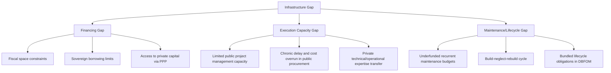

## Addressing Infrastructure Financing and Delivery Gaps

### Overview

The "infrastructure gap" refers to the shortfall between the investment required to build, maintain, and upgrade infrastructure to meet economic and social needs, and the funding/financing actually available through conventional public budgets. PPPs are frequently justified as a mechanism to help close this gap — not by creating new economic resources out of nothing, but by (1) accessing private capital and (2) improving the efficiency of delivery so that a given quantity of resources produces more usable infrastructure. This item examines both the financing dimension (where does the money come from) and the delivery dimension (why might private execution be more efficient), and critically distinguishes between the two, since conflating them is a common source of confusion in PPP policy debates.

### Distinguishing "Financing" from "Funding"

**Key Points**

- **Funding** refers to the ultimate source of repayment for infrastructure investment — in virtually all cases, this is either **taxpayers** (via general taxation or dedicated levies) or **users** (via tariffs, tolls, fares). PPPs do not create a third funding source; they only change the timing and mechanism of extracting funding from these same two ultimate sources.
- **Financing** refers to the upfront capital (debt and equity) that bridges the gap between when construction costs are incurred and when funding (tax or user revenue) is collected over time. PPPs primarily solve a **financing** problem, not a fundamental **funding** problem — private capital markets provide the upfront capital, which is then repaid over the concession period from user tariffs or government availability payments.
- This distinction is central to evaluating claims that PPPs provide "free" infrastructure money: private finance is *never* free — it is repaid, typically at a higher cost of capital than sovereign government borrowing, because private investors demand a risk-adjusted return and bear project-specific risks the government could otherwise absorb more cheaply through its lower cost of debt.

**Why Governments Still Pursue PPP Financing Despite Higher Capital Cost**

$$\text{PPP is preferred when: } \; \underbrace{C_{gov,build} + \Delta_{gov,inefficiency}}_{\text{Public procurement cost}} \; > \; \underbrace{C_{PPP,build} + \Delta_{risk\;premium}}_{\text{PPP cost}}$$

The efficiency case for PPPs rests on the proposition that private delivery efficiency gains ($\Delta_{gov,inefficiency}$ avoided) can exceed the additional cost of private capital ($\Delta_{risk\;premium}$) — this is precisely the logic embedded in **Value for Money (VfM)** analysis and the **Public Sector Comparator (PSC)** framework used to justify PPP procurement decisions.

### The Multidimensional Infrastructure Gap

**Fiscal Space Constraints**

- Many governments, particularly in emerging economies, face binding **fiscal space constraints**: existing debt levels, deficit targets (often codified in fiscal responsibility laws), or IMF/multilateral program conditions limit the government's capacity to finance large infrastructure projects through conventional sovereign borrowing or budget allocation.
- **Off-balance-sheet treatment** (where accounting/statistical rules permit) has historically been a motivation for PPP structuring, since certain PPP liabilities may not immediately count against public debt/deficit metrics under some national accounting frameworks — though this motivation is increasingly scrutinized and constrained by evolving public accounting standards (e.g., IPSAS, Eurostat's ESA rules on government/PPP asset classification) which increasingly require on-balance-sheet treatment when the government retains substantial risk.
- [Inference] The degree to which off-balance-sheet treatment remains a material driver of PPP adoption varies significantly by jurisdiction and has been declining as accounting standards tighten; using PPPs primarily to circumvent fiscal reporting rather than for genuine efficiency gains is widely criticized in the public finance literature as fiscal illusion.

**Capacity and Execution Gaps**

- Beyond pure financing, many governments face **execution capacity constraints**: limited in-house technical, project management, and procurement expertise to design, tender, and deliver complex infrastructure efficiently, leading to chronic public-sector project delays and cost overruns.
- PPPs can address this by transferring execution risk and responsibility to private entities with specialized construction/operational expertise, and by embedding performance incentives (as formalized in the agency-theory mechanisms discussed earlier in this chapter) that public procurement often lacks.

**Maintenance and Lifecycle Gaps**

- A persistent pattern in public infrastructure provision is underinvestment in **maintenance** relative to new construction — capital budgets for new projects are often more politically visible and easier to secure than recurrent maintenance budgets, leading to a "build-neglect-rebuild" cycle.
- Bundled PPP structures (DBFOM) directly target this gap by contractually obligating lifecycle maintenance funding as part of the same commitment that secures new construction, as discussed under the bundling/multitask agency item in this chapter.

### Diagram: Infrastructure Gap Components

### Value for Money (VfM) and the Public Sector Comparator

**Mechanism**

The standard analytical framework for deciding whether a PPP genuinely closes the infrastructure gap more efficiently than conventional procurement is the **Public Sector Comparator (PSC)** — a hypothetical, risk-adjusted cost estimate of delivering the same project through traditional public procurement, benchmarked against the PPP bid:

$$VfM = PSC_{risk-adjusted} - PPP_{cost,risk-adjusted}$$

Where:

$$PSC_{risk-adjusted} = PSC_{raw} + \text{Retained Risk} + \text{Transferable Risk (if publicly delivered)} - \text{Competitive Neutrality Adjustment}$$

A positive $VfM$ implies the PPP route is expected to deliver equivalent infrastructure/services at lower risk-adjusted total cost than public procurement, justifying the higher private cost of capital through superior risk transfer and delivery efficiency. Key components:

- **Risk-adjusted costing**: the PSC must include the monetized value of risks that would remain with government under public delivery (construction overrun risk, demand risk, operational risk) — omitting this systematically biases the comparison in favor of public procurement, since conventional budgeting rarely prices contingent risk explicitly.
- **Competitive neutrality**: adjustments to remove government's inherent advantages (tax exemption, ability to self-insure, lower cost of capital from sovereign credit) that are not available to private bidders, ensuring the comparison isolates genuine efficiency differences rather than financing-structure artifacts.

**Critiques of VfM/PSC Methodology**

- [Inference] VfM/PSC analysis has been criticized in the academic and audit literature (e.g., UK National Audit Office reviews of PFI) for being highly sensitive to discount rate assumptions and subjective risk valuation inputs, which can be manipulated (consciously or not) to justify a pre-determined procurement route — this is a well-documented methodological concern, though the extent of its practical distortion varies by jurisdiction and case.
- The discount rate used to compare PPP and PSC cash flows is particularly consequential: a higher discount rate favors PPP (since PPP delivery typically front-loads private financing costs but defers most public payments), while a lower rate favors conventional procurement.

### Modalities for Closing the Financing Gap

| Mechanism | Description | Primary Gap Addressed |
| --- | --- | --- |
| Availability Payment PPPs | Government pays for asset availability/performance; user demand risk retained by government | Financing gap for non-revenue-generating social infrastructure (schools, hospitals, courts) |
| User-Pays Concessions | Private operator collects tariffs/tolls directly from users | Financing gap for revenue-generating economic infrastructure (toll roads, airports, ports) |
| Viability Gap Funding (VGF) | Government provides a capital grant/subsidy to make an otherwise financially unviable but economically desirable project bankable | Projects with positive economic (social) NPV but negative financial NPV |
| Blended/Concessional Finance | Multilateral development banks or development finance institutions provide below-market-rate capital alongside commercial finance | Projects in higher-risk or lower-income markets where commercial capital alone is insufficient or too expensive |
| Land Value Capture | Monetizing the uplift in adjacent land value generated by new infrastructure (e.g., transit-oriented development rights) | Financing gap where infrastructure generates positive externalities not captured in direct user tariffs |
| Institutional Investor Mobilization | Structuring PPP debt/equity instruments (e.g., project bonds) to be attractive to pension funds and insurers seeking long-duration, inflation-linked assets | Financing gap in mature markets with deep long-term institutional capital pools but limited direct government access to it |

### Worked Example: Viability Gap Funding Calculation

Consider a rural water supply project with an economically justified social NPV (accounting for public health and productivity externalities) but a negative financial NPV to a private operator relying solely on user tariffs:

$$NPV_{financial} = \sum_{t=0}^{T} \frac{Tariff_t \cdot Q_t - OPEX_t}{(1+r)^t} - CAPEX_0 < 0$$

$$NPV_{economic} = NPV_{financial} + \sum_{t=0}^{T} \frac{Externality_t}{(1+r)^t} > 0$$

The required **Viability Gap Funding** grant is the minimum capital subsidy that brings the private operator's financial NPV to zero (the bankability threshold), without exceeding the economic surplus the project generates:

$$VGF_{min} = -NPV_{financial} \quad \text{subject to} \quad VGF_{min} \leq NPV_{economic} - NPV_{financial}$$

This ensures the government subsidizes only the gap between private bankability and full-cost recovery, capturing the externality-driven social value that justifies public intervention, while still requiring the private operator to compete for the minimum subsidy amount via tender (preserving competitive bidding discipline).

### Diagram: Financing Gap Bridging via VGF (svg_diagram)

<svg xmlns="http://www.w3.org/2000/svg" viewBox="0 0 720 300">
<text x="360" y="26" font-size="17" font-weight="bold" text-anchor="middle" fill="#1a1a1a">Viability Gap Funding Bridge (svg_diagram)</text>
<line x1="80" y1="240" x2="640" y2="240" stroke="#374151" stroke-width="1.5" />
<text x="360" y="265" font-size="11" text-anchor="middle" fill="#374151">Project Value Components</text>
<rect x="100" y="140" width="140" height="100" fill="#fee2e2" stroke="#dc2626" />
<text x="170" y="195" font-size="11" font-weight="bold" text-anchor="middle" fill="#7f1d1d">Financial NPV Gap</text>
<text x="170" y="212" font-size="10" text-anchor="middle" fill="#7f1d1d">(negative to operator)</text>
<rect x="290" y="90" width="140" height="150" fill="#dcfce7" stroke="#16a34a" />
<text x="360" y="160" font-size="11" font-weight="bold" text-anchor="middle" fill="#14532d">VGF Grant</text>
<text x="360" y="177" font-size="10" text-anchor="middle" fill="#14532d">Bridges gap to</text>
<text x="360" y="192" font-size="10" text-anchor="middle" fill="#14532d">bankability threshold</text>
<rect x="480" y="60" width="140" height="180" fill="#dbeafe" stroke="#2563eb" />
<text x="550" y="140" font-size="11" font-weight="bold" text-anchor="middle" fill="#1e3a8a">Economic NPV</text>
<text x="550" y="157" font-size="10" text-anchor="middle" fill="#1e3a8a">(includes health,</text>
<text x="550" y="172" font-size="10" text-anchor="middle" fill="#1e3a8a">productivity externalities)</text>

<text x="360" y="50" font-size="11" text-anchor="middle" fill="`#4b5563`">VGF is capped by the surplus of economic value over financial value</text>

</svg>

### Empirical and Policy Notes

- [Inference] The extent to which PPPs have empirically "closed" infrastructure gaps at scale, versus merely reallocating fiscal burden across time (deferring payment obligations to future budget periods via availability payments), remains a debated question in public finance research, with outcomes varying substantially by country, sector, and contract design quality.
- Multilateral institutions (World Bank, regional development banks) commonly publish infrastructure financing gap estimates at global and regional levels; such figures should be treated as methodology-dependent estimates rather than precise measurements, given the difficulty of defining "needed" infrastructure investment independent of assumed growth and policy scenarios.
- A well-designed PPP program does not eliminate the need for sound public investment management generally — poor project selection, weak PSC methodology, or inadequate risk allocation can produce PPPs that are more costly than equivalent public delivery despite superficially "closing" the immediate financing gap.

**Related Topics**

- Principal-Agent Theory, Moral Hazard, and Adverse Selection
- Bundling of Design, Build, Finance, and Operate as a Multitask Agency Problem
- Value for Money Analysis and the Public Sector Comparator
- Risk Allocation Matrices and Optimal Risk-Bearing Party Selection
- Availability Payment vs. User-Pays PPP Structures
- Viability Gap Funding and Blended/Concessional Finance Structuring
- Fiscal Space, Public Debt Accounting, and Off-Balance-Sheet Treatment of PPPs
- Land Value Capture Mechanisms in Infrastructure Finance