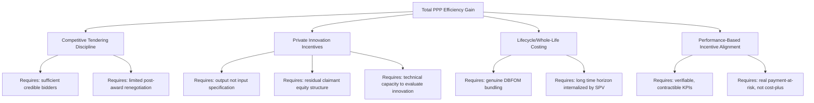

## Efficiency Gains from Private Innovation and Lifecycle Management

### Overview

Beyond financing access, the core efficiency case for PPPs rests on the claim that private delivery generates genuine productive efficiency gains — not merely a shift in who pays, but an increase in the total value produced per unit of resource spent. This item examines the specific mechanisms through which private innovation and integrated lifecycle management are theorized (and empirically observed, with caveats) to produce these gains: competitive market discipline, technical/managerial innovation incentives, and the whole-life costing effects of bundling introduced earlier in this chapter.

### The Efficiency Rationale Decomposed

**Key Points**

- Total PPP efficiency gain can be conceptually decomposed into distinct sources, each with a different underlying economic mechanism:

$$\text{Total Efficiency Gain} = \underbrace{\Delta_{competition}}_{\text{tendering discipline}} + \underbrace{\Delta_{innovation}}_{\text{technical/managerial}} + \underbrace{\Delta_{lifecycle}}_{\text{whole-life costing}} + \underbrace{\Delta_{incentive}}_{\text{performance-based payment}}$$

- This decomposition matters for policy because each source implies a different necessary condition: competitive gains require genuine bidding competition (not a single credible bidder); innovation gains require sufficient contractual flexibility for the private party to deviate from a prescriptive design; lifecycle gains require genuine bundling (see the multitask agency item in this chapter); and incentive gains require payment mechanisms that are actually contingent on verifiable performance (see the principal-agent item).
- Critically, none of these efficiency sources are automatic consequences of "going private" — they are consequences of specific **contract and market design choices**, meaning poorly designed PPPs can fail to realize any of them while still incurring the higher private cost of capital.

### Competitive Tendering Discipline

**Mechanism**

The act of competitive bidding itself — independent of any subsequent private-sector innovation — can generate efficiency gains by forcing bidders to reveal their true minimum viable cost through the auction mechanism (as formalized in the game theory item of this chapter). This is sometimes called the **"competition for the field"** effect (Demsetz, 1968): even where the eventual service is delivered as a natural monopoly (e.g., a single water utility for a region), competitive bidding *for the right to be that monopoly* can approximate the discipline of ongoing market competition, provided:

- There are a sufficient number of credible, independent bidders (avoiding collusion or a "phantom competition" with effectively one qualified bidder).
- The winning bid is genuinely enforceable and cannot be substantially renegotiated post-award (otherwise the hold-up dynamics discussed under Transaction Cost Economics erode the competitive discipline achieved at bid stage).
- Re-tendering or benchmarking at defined intervals (for very long contracts) preserves some ongoing competitive pressure rather than a single one-time competitive event locking in terms for 25–30 years.

### Private Innovation Incentives

**Key Points**

- **Output-based specification** (as opposed to input/prescriptive specification) is the structural precondition for innovation: if government prescribes exactly how a road must be built, the private contractor has no scope to deploy superior methods, materials, or technology. If government instead specifies required *outcomes* (e.g., minimum skid resistance, 30-year design life, specific traffic capacity), the private party can innovate in *how* those outcomes are achieved, capturing any resulting cost savings as profit (subject to competitive bidding eventually passing much of this back to government via lower bids in subsequent tenders).
- **Residual claimant status**: because a private equity investor is the residual claimant on project cash flows (after debt service and operating costs), it internalizes the full financial benefit of successful innovation — a stronger incentive than a public agency employee, whose personal financial upside from an efficiency improvement is typically negligible or absent (a classic public-choice/property-rights argument, related to Alchian's residual claimant theory of the firm).
- **Technology and process transfer**: private operators, especially those active across multiple jurisdictions or sectors, can transfer proven technologies, construction methods, or operational best practices from other projects — a knowledge-spillover benefit less available to a public agency delivering an isolated, one-off project.

**Where Innovation Incentives Can Fail**

- If output specifications are drafted so restrictively (from excessive risk-aversion or legal caution) that they effectively become disguised input specifications, innovation scope collapses.
- If the procuring authority lacks the technical capacity to evaluate genuinely innovative (as opposed to merely cheaper) technical proposals during bid evaluation, competitive scoring may systematically favor conventional, lower-risk-appearing proposals over higher-value innovative ones.
- [Inference] The empirical magnitude of innovation-driven efficiency gains in PPPs, as distinct from other efficiency sources, is difficult to isolate in ex post evaluation studies and is one of the more contested components of the overall efficiency case in the literature.

### Diagram: Efficiency Gain Decomposition

### Lifecycle Management and Whole-Life Costing

**Mechanism**

As established under the bundling/multitask agency item, integrating design, construction, and long-term operation/maintenance responsibility within a single private entity internalizes the temporal externality between upfront capital decisions and downstream operating costs. The efficiency gain specifically attributable to lifecycle management can be expressed as the reduction in total discounted lifecycle cost achievable by optimizing jointly rather than sequentially:

\text{Lifecycle Gain} = \left[ \min_{q} C_{build}(q) + \min_{q} \sum_t \frac{C_{operate,t}(q)}{(1+r)^t} \right]_{\text{sequential, unbundled}} - \left[ \min_{q} \left( C_{build}(q) + \sum_t \frac{C_{operate,t}(q)}{(1+r)^t} \right) \right]_{\text{joint, bundled}}$}

The sequential (unbundled) optimization treats $C_{build}$ and $C_{operate}$ as independently minimized by different parties with no shared objective function, generally producing a higher combined cost than the joint (bundled) minimization, whenever design choices materially affect both cost streams — this gap is the quantifiable essence of the whole-life-costing argument for bundling.

**Preventive Maintenance and Asset Condition Discipline**

- Long-term operators with handback obligations (contractually required minimum asset condition at contract expiry, discussed under bundling) have a structural incentive to adopt **preventive** rather than purely **reactive** maintenance regimes, since preventive maintenance is typically cheaper over the asset's full life than repeated reactive repair-and-replace cycles following deferred maintenance.
- This contrasts with the public-sector "build-neglect-rebuild" pattern discussed under infrastructure financing gaps, where maintenance budgets compete poorly against new capital projects for political and budgetary priority.

### Diagram: Sequential vs. Joint Lifecycle Cost Optimization (svg_diagram)

<svg xmlns="http://www.w3.org/2000/svg" viewBox="0 0 720 320">
<text x="360" y="26" font-size="17" font-weight="bold" text-anchor="middle" fill="#1a1a1a">Lifecycle Cost Optimization Comparison (svg_diagram)</text>

<text x="180" y="55" font-size="12" font-weight="bold" text-anchor="middle" fill="`#374151`">Sequential (Unbundled)</text>

<rect x="60" y="70" width="120" height="70" fill="`#fee2e2`" stroke="`#dc2626`" />

<text x="120" y="100" font-size="10" text-anchor="middle" fill="`#7f1d1d`">Minimize</text>

<text x="120" y="115" font-size="10" text-anchor="middle" fill="`#7f1d1d`">Build Cost Only</text>

<rect x="200" y="70" width="120" height="70" fill="`#fef3c7`" stroke="`#d97706`" />

<text x="260" y="100" font-size="10" text-anchor="middle" fill="`#78350f`">Then Minimize</text>

<text x="260" y="115" font-size="10" text-anchor="middle" fill="`#78350f`">OPEX Given Design</text>

<text x="190" y="165" font-size="11" text-anchor="middle" fill="`#6b7280`">Higher combined discounted lifecycle cost</text>

<line x1="360" y1="60" x2="360" y2="300" stroke="#d1d5db" />

<text x="540" y="55" font-size="12" font-weight="bold" text-anchor="middle" fill="`#374151`">Joint (Bundled)</text>

<rect x="480" y="70" width="120" height="70" fill="`#dbeafe`" stroke="`#2563eb`" />

<text x="540" y="100" font-size="10" text-anchor="middle" fill="`#1e3a8a`">Jointly Minimize</text>

<text x="540" y="115" font-size="10" text-anchor="middle" fill="`#1e3a8a`">Build + Discounted OPEX</text>

<text x="540" y="165" font-size="11" text-anchor="middle" fill="`#6b7280`">Lower combined discounted lifecycle cost</text>

<text x="360" y="230" font-size="11" text-anchor="middle" fill="`#4b5563`">Gap between the two represents the theoretical</text>

<text x="360" y="248" font-size="11" text-anchor="middle" fill="`#4b5563`">lifecycle efficiency gain attributable to bundling</text>

</svg>

### Worked Example: Whole-Life Costing Trade-off

Consider a road pavement design choice between two specifications:

| Specification | Build Cost (CAPEX) | Annual Maintenance (OPEX) | Design Life |
| --- | --- | --- | --- |
| Standard asphalt | $10 million | $500,000/year | 15 years |
| Premium composite | $13 million | $150,000/year | 30 years |

Using a discount rate $r = 6\%$ over a 30-year concession, comparing the two specs on a like-for-like lifecycle basis (including one repaving cycle at year 15 for the standard option):

$$PV_{standard} = 10{,}000{,}000 + \sum_{t=1}^{30}\frac{500{,}000}{(1.06)^t} + \frac{10{,}000{,}000}{(1.06)^{15}} \approx 10{,}000{,}000 + 6{,}885{,}000 + 4{,}173{,}000 \approx \$21.06\text{ million}$$

$$PV_{premium} = 13{,}000{,}000 + \sum_{t=1}^{30}\frac{150{,}000}{(1.06)^t} \approx 13{,}000{,}000 + 2{,}065{,}500 \approx \$15.07\text{ million}$$

Despite the premium specification's 30% higher upfront cost, its lower discounted lifecycle cost ($15.07M vs. $21.06M) makes it the efficient choice under joint optimization — a choice a builder minimizing only $C_{build}$ under unbundled procurement would never make, since the builder bears none of the $500,000/year maintenance cost or the year-15 repaving expense under a design-bid-build arrangement. This numerical illustration is a simplified didactic example; actual specification trade-offs depend on project-specific engineering and cost data. [Inference]

### Limits and Critiques of the Efficiency Case

**Key Points**

- **Higher cost of capital offsets some efficiency gains**: private finance typically costs more than sovereign borrowing (reflecting genuine risk transfer, not merely a financing quirk), so realized efficiency gains from innovation and lifecycle management must be large enough to offset this capital cost differential for the PPP to represent genuine value for money overall.
- **Contract rigidity risk**: very long-term output-based contracts, once signed, can become a constraint on innovation rather than an enabler, if technology or user needs evolve substantially over a 25–30 year concession and the contract's specified outputs become outdated (a manifestation of contractual incompleteness discussed under Transaction Cost Economics).
- **Distributional and equity considerations**: efficiency gains measured in aggregate cost terms do not automatically address distributional questions (e.g., whether tariff-funded user-pays efficiency gains shift cost burden onto lower-income users relative to tax-funded alternatives) — a separate normative consideration from the efficiency case per se.
- [Inference] Systematic empirical reviews (e.g., UK National Audit Office and academic meta-analyses of PFI/PPP programs) have found efficiency outcomes to be heterogeneous across sectors and time periods, with some programs showing clear cost/time performance advantages over public comparators and others showing limited or even negative net value once financing costs and later contract problems are accounted for; this heterogeneity itself is a documented empirical finding, not a settled verdict in either direction.

**Related Topics**

- Addressing Infrastructure Financing and Delivery Gaps
- Bundling of Design, Build, Finance, and Operate as a Multitask Agency Problem
- Principal-Agent Theory, Moral Hazard, and Adverse Selection
- Value for Money Analysis and the Public Sector Comparator
- Output Specifications versus Input Specifications in Contract Design
- Whole-Life Costing and Lifecycle Reserve Account Design
- Demsetz Competition-for-the-Field Theory
- Contractual Incompleteness and Long-Term Contract Rigidity Risk