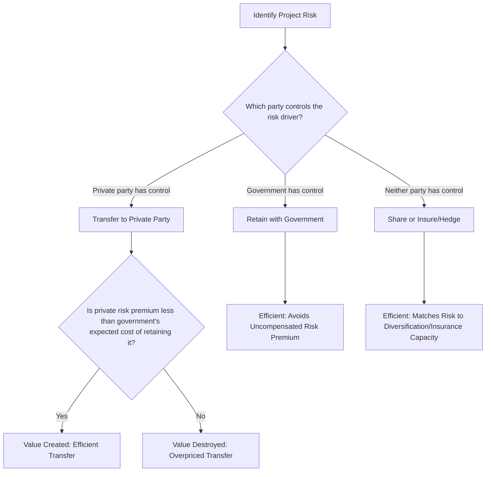

## Risk Transfer as a Source of Value Creation

### Overview

Risk transfer is often described as the single most important mechanism underlying PPP value creation — more consequential to Value for Money outcomes than financing access or even innovation incentives in many empirical decompositions. This item develops the economic logic of *why* transferring risk from government to a private party can create genuine value (rather than merely relocating a cost), the conditions under which this logic holds, and the critical distinction between value-creating risk transfer and risk transfer that merely increases total project cost without any efficiency benefit.

### The Core Logic: Optimal Risk Allocation, Not Maximal Risk Transfer

**Key Points**

- The foundational principle, often summarized as "risk should be allocated to the party best able to manage or absorb it," derives from **risk-bearing efficiency**: a risk imposes a cost on whichever party bears it, and that cost is lower when borne by a party that can either (a) control/mitigate the underlying probability or severity of the risk, or (b) diversify or absorb the risk more cheaply if realized.
- This principle explicitly does **not** imply that maximal risk transfer to the private party is optimal. Transferring a risk to a party that cannot manage or price it efficiently (e.g., transferring political/regulatory risk, which government itself controls, to a private operator) does not eliminate the risk — it merely forces the private party to price in a risk premium for something it cannot mitigate, raising total project cost without any corresponding value benefit. This is the most common and consequential design error critiqued in PPP practice.
- The value-creating logic of risk transfer therefore requires **allocative efficiency**, not allocative maximization: value is created only when the risk moves to whichever party has genuine comparative advantage in managing that specific risk category.

### Formal Framework: Risk-Adjusted Cost Comparison

**Mechanism**

The value created by transferring a given risk $i$ from government ($G$) to the private party ($P$) can be expressed as the difference between the cost of bearing that risk under each party's respective risk-management capability and risk preferences:

$$\text{Value Created}_i = \mathbb{E}[\text{Cost}_i^G] - \left( \mathbb{E}[\text{Cost}_i^P] + \text{Risk Premium}_i^P \right)$$

Where $\mathbb{E}[\text{Cost}_i^G]$ is the expected cost of risk $i$ if retained by government (including the cost of any inefficiency in government's ability to manage or mitigate that specific risk), $\mathbb{E}[\text{Cost}_i^P]$ is the private party's expected cost of managing the same risk (which may be lower if the private party has superior technical control over the risk driver), and $\text{Risk Premium}_i^P$ is the compensation the private party demands for bearing the risk, reflecting its risk aversion and cost of capital.

Transfer of risk $i$ is value-creating if and only if:

$$\mathbb{E}[\text{Cost}_i^P] + \text{Risk Premium}_i^P < \mathbb{E}[\text{Cost}_i^G]$$

This inequality is more likely to hold when the private party has genuine **control** over the risk driver (construction risk, where the contractor's own management choices directly affect outcome probabilities) and less likely to hold for risks the private party cannot influence (macroeconomic risk, regulatory/political risk, force majeure), where $\text{Risk Premium}_i^P$ tends to be large precisely because the risk is uncontrollable and therefore expensive to price and insure against.

### Risk Category Allocation Matrix

| Risk Category | Best-Positioned Party | Rationale |
| --- | --- | --- |
| Construction/completion risk (cost overrun, delay) | Private party | Direct control over contractor selection, construction management, technology choice |
| Design risk (defects, non-compliance with output specs) | Private party | Direct control over design decisions and quality assurance |
| Operating/performance risk (efficiency of service delivery) | Private party | Direct control over operational management and maintenance practices |
| Demand/market risk (usage volume uncertainty) | Shared or Government (context-dependent) | Private party cannot control macroeconomic drivers of demand; full transfer often overpriced (see winner's curse item) |
| Regulatory/political risk (adverse policy change, expropriation) | Government | Government is the source and controller of this risk category |
| Force majeure / uninsurable catastrophic risk | Shared, often via insurance markets or government backstop | Neither party can control occurrence; least-cost risk-bearer is typically an insurer or diversified government balance sheet |
| Land acquisition / right-of-way risk | Government | Government typically holds eminent domain / compulsory purchase authority the private party lacks |
| Currency/inflation risk | Shared via indexation mechanisms | Neither party controls macroeconomic variables; addressed via contract design (tariff indexation) rather than pure allocation |
| Interest rate risk (financing cost) | Private party (with hedging) | Private party controls financing structure choice and can hedge via interest rate swaps |

### Diagram: Risk Transfer Value Creation Logic

### The Winner's Curse Connection: Why Over-Transfer Backfires

**Mechanism**

As formalized in the game theory item of this chapter, when governments transfer risks that private bidders cannot reliably estimate (e.g., long-horizon demand risk), competitive bidding does not discipline the price of that risk efficiently — it instead triggers a **winner's curse dynamic** in which the bidder with the most optimistic (and often least realistic) risk assessment wins, only to seek renegotiation once real-world outcomes reveal the original transfer was mispriced. This produces the paradox that **maximal nominal risk transfer** at contract signature can correlate with **higher effective government risk exposure** later, once renegotiation is accounted for — because the initially "transferred" risk was never genuinely borne at the price quoted; it was concealed by bidder over-optimism rather than efficiently priced. This is a central argument for demand-risk-sharing mechanisms like the LPVR auction structure (see the game theory item) rather than fixed-term, fully user-pays demand-risk transfer.

### Insurable vs. Uninsurable Risk and Third-Party Risk Markets

**Key Points**

- Some project risks (construction all-risk, third-party liability, certain force majeure events) can be transferred not to the private operator directly as a *retained* risk, but *through* the private operator to specialized **insurance and reinsurance markets**, which have comparative advantage in pooling and diversifying idiosyncratic risk across many uncorrelated projects.
- This three-party structure (government → private operator → insurer) is itself a risk allocation efficiency: the insurer prices the risk based on actuarial data across a diversified portfolio, typically more cheaply than either government or a single-project private operator could self-insure the same exposure.
- Where insurance markets for a specific risk are thin or unavailable (e.g., certain political violence or currency inconvertibility risks in frontier markets), multilateral and export credit agencies (e.g., MIGA, national ECAs) often step in as risk absorbers of last resort, effectively substituting for missing private insurance markets — a market failure correction rather than a pure risk allocation choice between government and private operator.

### Diagram: Risk Transfer and Value Under Different Allocation Choices (svg_diagram)

<svg xmlns="http://www.w3.org/2000/svg" viewBox="0 0 720 320">
<text x="360" y="26" font-size="17" font-weight="bold" text-anchor="middle" fill="#1a1a1a">Risk Transfer Cost Comparison (svg_diagram)</text>
<line x1="80" y1="260" x2="640" y2="260" stroke="#374151" stroke-width="1.5" />
<text x="360" y="285" font-size="11" text-anchor="middle" fill="#374151">Risk Category (increasing private-party control →)</text>
<rect x="100" y="90" width="110" height="170" fill="#fee2e2" stroke="#dc2626" />
<text x="155" y="175" font-size="10" font-weight="bold" text-anchor="middle" fill="#7f1d1d">Political/</text>
<text x="155" y="190" font-size="10" font-weight="bold" text-anchor="middle" fill="#7f1d1d">Regulatory Risk</text>
<text x="155" y="70" font-size="10" text-anchor="middle" fill="#7f1d1d">High premium if transferred</text>
<rect x="270" y="140" width="110" height="120" fill="#fef3c7" stroke="#d97706" />
<text x="325" y="200" font-size="10" font-weight="bold" text-anchor="middle" fill="#78350f">Demand Risk</text>
<text x="325" y="120" font-size="10" text-anchor="middle" fill="#78350f">Moderate/mispriced premium</text>
<rect x="440" y="190" width="110" height="70" fill="#dcfce7" stroke="#16a34a" />
<text x="495" y="228" font-size="10" font-weight="bold" text-anchor="middle" fill="#14532d">Construction Risk</text>
<text x="495" y="170" font-size="10" text-anchor="middle" fill="#14532d">Efficiently priced premium</text>

<text x="360" y="45" font-size="11" text-anchor="middle" fill="`#4b5563`">Efficient risk premium falls as private-party control over the risk driver rises</text>

</svg>

### Worked Example: Comparing Two Risk Allocation Structures

Consider a bridge concession where government must decide how to allocate traffic demand risk:

**Structure A — Full Demand Risk Transfer**: Operator collects tolls directly; bears 100% of demand shortfall risk. Suppose the operator, facing genuine forecast uncertainty, demands a risk premium equivalent to $40 million in expected present value terms (reflected in a higher required toll or shorter concession negotiated).

**Structure B — Government-Guaranteed Minimum Revenue with Upside Sharing**: Government guarantees a minimum revenue floor (absorbing the tail-risk of very low demand, a risk it can better absorb given its larger, more diversified balance sheet and lower cost of capital), while the operator retains operating risk and modest demand upside/downside within a band. Suppose this reduces the required risk premium to $15 million, because the operator no longer prices in low-probability, high-severity demand collapse scenarios it cannot influence or diversify away.

Under the value-creation inequality framework, Structure B is preferred whenever the incremental expected cost to government of providing the minimum revenue guarantee (its expected payout under the guarantee, appropriately probability-weighted) is less than the $25 million risk premium saved — illustrating why **partial or shared risk allocation** frequently dominates full transfer for risk categories the private party cannot genuinely control, consistent with the LPVR and availability-payment mechanisms discussed elsewhere in this syllabus. [Inference] This example uses illustrative figures for didactic purposes; actual risk premium magnitudes are project- and market-specific and require project finance modeling to estimate.

### Empirical and Policy Notes

- [Inference] Empirical studies and audit reviews (e.g., UK National Audit Office, IMF PPP fiscal risk assessments) frequently identify risk mis-allocation — particularly the transfer of demand and regulatory risk beyond the private party's genuine control — as a leading cause of underperforming PPP programs and subsequent costly renegotiation, though the specific magnitude of value lost varies substantially by case and is difficult to generalize precisely.
- Risk matrices used in practice (e.g., in PPP contract schedules) are typically negotiated and documented explicitly, assigning named risk categories to government, private party, or shared status, often with detailed sub-clauses defining trigger conditions and compensation mechanisms for each category.
- The theoretical optimum of allocating each risk solely to its best-positioned bearer is a benchmark; actual contracts often reflect negotiated compromises shaped by bargaining power, market risk appetite at the time of tender, and political constraints on what government is willing to formally retain.

**Related Topics**

- Principal-Agent Theory, Moral Hazard, and Adverse Selection
- Game Theory Applications in PPP Negotiation and Bidding
- Addressing Infrastructure Financing and Delivery Gaps
- Efficiency Gains from Private Innovation and Lifecycle Management
- Value for Money Analysis and the Public Sector Comparator
- Availability Payment vs. User-Pays PPP Structures
- Political Risk Guarantees and Multilateral Risk Mitigation Instruments
- Insurance and Reinsurance Markets in Infrastructure Risk Transfer