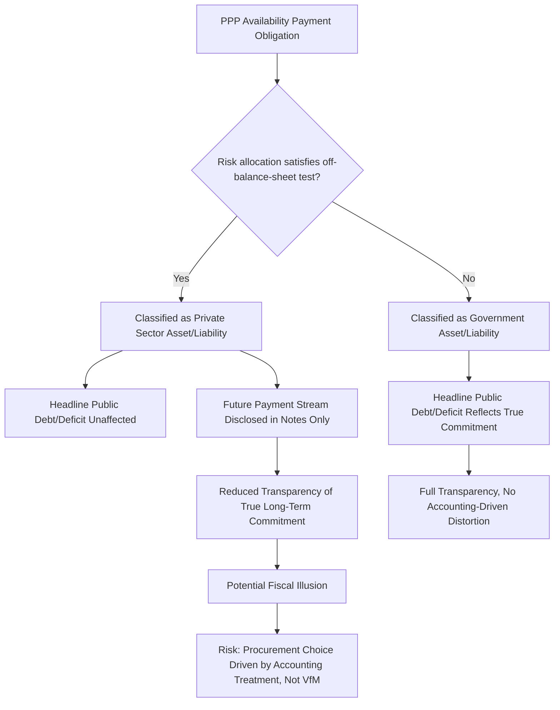

## Off-Balance-Sheet Financing Debates and Fiscal Illusion

### Overview

While the efficiency case for PPPs rests on genuine value-for-money mechanisms (risk transfer, lifecycle bundling, innovation incentives), a parallel and more contested motivation has historically influenced PPP adoption: the ability, under certain accounting and statistical frameworks, to keep PPP-related assets and liabilities **off the government's balance sheet** and outside headline public debt/deficit metrics. This item examines the mechanics of off-balance-sheet treatment, the concept of **fiscal illusion** it can create, the evolving accounting standards designed to close this loophole, and the normative debate over whether such treatment represents legitimate risk-based accounting or a fiscal reporting distortion.

### What "Off-Balance-Sheet" Treatment Means

**Key Points**

- Under conventional public accounting, an asset (e.g., a hospital, toll road, or school building) and its associated financing liability appear on the government's balance sheet, and annual repayments count against the government's deficit, if the government is deemed the substantive economic owner/controller of the asset.
- Under many PPP arrangements, the SPV (a private legal entity) is the nominal owner/operator of the asset during the concession term, and depending on **who bears the majority of risks and rewards of ownership**, statistical and accounting frameworks may classify the asset and associated debt as belonging to the private sector rather than government — even though the government is the sole or primary ultimate source of repayment (via availability payments) and will typically take ownership of the asset at contract expiry.
- This classification determines whether the future stream of availability payments appears as a current liability on the government's balance sheet (on-balance-sheet) or merely as a future operating expense disclosed in notes/off-balance-sheet, with only the current year's payment appearing in the annual budget.

### The Statistical and Accounting Frameworks

| Framework | Governing Body/Standard | Core Test |
| --- | --- | --- |
| Eurostat/ESA (European System of Accounts) | Eurostat, applied to EU member states | Government classification test based on which party bears majority of construction risk AND (availability risk OR demand risk) |
| IPSAS 32 (Service Concession Arrangements) | International Public Sector Accounting Standards Board | Control-based test: asset is recognized by the grantor (government) if government controls/regulates the services AND controls significant residual interest in the asset at contract end |
| GFSM (Government Finance Statistics Manual) | IMF | Economic ownership test based on risk and reward allocation, informing government debt/deficit statistics |
| National GAAP variants | Country-specific (e.g., UK's former IFRS-based public sector accounting) | Often converging toward IPSAS/ESA-style control tests following historical criticism of prior looser standards |

**The Eurostat ESA 2010 Risk Test (Illustrative Logic)**

Under the influential Eurostat framework historically applied to EU PPPs, a project is classified as **government-owned** (on-balance-sheet) if government bears the majority of:

$$\text{Construction Risk} \; \text{AND} \; \left( \text{Availability Risk} \; \text{OR} \; \text{Demand Risk} \right)$$

If the private party genuinely bears the majority of construction risk and at least one of availability or demand risk, the asset can be classified as private-sector-owned (off-balance-sheet) — creating a direct incentive for contract drafters to structure risk allocation clauses specifically to satisfy this test, rather than purely on the basis of genuine efficient risk allocation as discussed in the risk transfer item of this chapter. This is a documented tension: the accounting classification incentive can distort contract design away from the efficiency-optimal risk allocation toward whatever allocation clears the statistical threshold.

### Fiscal Illusion: The Conceptual Problem

**Definition**

**Fiscal illusion** refers to a systematic misperception of the true fiscal cost or fiscal position of government created by the structure of public finance instruments — citizens, legislators, or even finance ministries may underestimate the government's real long-term financial commitments because those commitments are reported in a form that obscures their present value or their functional equivalence to conventional debt.

**Mechanism in PPPs**

- An availability-payment PPP creates a legally binding, multi-decade stream of government payment obligations that is, in substance, very similar to a government bond issued to finance the same asset directly — both represent a contractual commitment to pay a fixed or formula-based amount over a long horizon, ultimately funded by taxpayers.
- If this obligation is reported off-balance-sheet, headline government debt and deficit figures understate the government's true long-term financial commitments, potentially:
  - Allowing government to circumvent fiscal rules (debt ceilings, deficit targets under fiscal responsibility legislation or supranational frameworks like the EU's Stability and Growth Pact) without actually reducing the underlying fiscal burden.
  - Creating a **relative price distortion** in project selection, where officials favor PPP delivery over conventional public procurement or direct budget financing specifically because of its accounting treatment, rather than because it is genuinely more cost-effective — a violation of the "PPP should be chosen on Value for Money grounds, not accounting convenience" principle discussed under the infrastructure financing gaps item.
  - Reducing the transparency available to legislators, auditors, and citizens in assessing the government's true medium-term fiscal sustainability.

**Formal Illustration: Present Value Equivalence**

Consider a government choosing between financing a $500 million hospital via (a) issuing a 25-year sovereign bond directly, or (b) a 25-year availability-payment PPP. If the availability payment $AP_t$ is set such that:

$$\sum_{t=1}^{25} \frac{AP_t}{(1+r_{sovereign})^t} \approx \$500\text{ million} + \text{risk premium and margin}$$

the government's true economic commitment is functionally equivalent to sovereign debt of comparable present value — regardless of whether Option (b) is reported on or off balance sheet. Fiscal illusion arises specifically when the *accounting treatment* diverges from this *economic equivalence*, not from the PPP structure itself.

### Diagram: Fiscal Illusion Mechanism

### Historical Case Reference: UK Private Finance Initiative

- [Inference] The UK's Private Finance Initiative (PFI), launched in the 1990s, is widely cited in the academic and public-audit literature (including repeated UK National Audit Office and Public Accounts Committee reports) as a prominent case where off-balance-sheet accounting treatment was, at least in part, a documented motivating factor for individual project structuring decisions in earlier years of the program, alongside genuine efficiency objectives; the relative weight of accounting motivation versus efficiency motivation is difficult to disentangle precisely and has been debated extensively in that literature.
- Subsequent tightening of UK accounting standards (adoption of IFRS-based tests more closely aligned with control-based recognition, similar in spirit to IPSAS 32) brought most new PFI-equivalent liabilities onto the government balance sheet, and the UK formally discontinued new PFI/PF2 procurement in 2018 following sustained criticism, partly on value-for-money and transparency grounds documented in National Audit Office reviews.
- This case is commonly used as the reference example in comparative public finance teaching for how accounting standard evolution can materially affect PPP program design and adoption incentives over time, though the specific policy conclusions drawn from the UK experience remain subject to ongoing academic and policy debate.

### The Counter-Argument: Legitimate Risk-Based Accounting

**Key Points**

- Proponents of off-balance-sheet treatment (where risk transfer is genuine) argue that accounting classification based on risk and reward allocation is not illusory but *correct*: if the private party genuinely bears construction and demand/availability risk (i.e., government's payment obligation is contingent, not fixed and unconditional), then the arrangement is economically different from a sovereign bond and should be reported differently — a contingent, performance-linked obligation is not equivalent to an unconditional debt obligation.
- Under this view, fiscal illusion criticism applies specifically to cases where risk transfer is **nominal rather than substantive** (i.e., the private party is contractually assigned a risk but expects, and receives, government bailout or renegotiation if that risk materializes) — meaning the accounting debate is ultimately inseparable from the risk allocation quality debate discussed in the risk transfer item of this chapter, not a separate, purely technical accounting question.
- This is why modern standards (IPSAS 32, revised Eurostat guidance) increasingly emphasize **substance-over-form control tests** rather than simple risk-checklist tests, aiming to align accounting treatment more closely with genuine economic ownership and reduce the scope for classification-driven contract engineering.

### Diagram: Substantive vs. Nominal Risk Transfer and Accounting Legitimacy (svg_diagram)

<svg xmlns="http://www.w3.org/2000/svg" viewBox="0 0 720 300">
<text x="360" y="26" font-size="17" font-weight="bold" text-anchor="middle" fill="#1a1a1a">Substantive vs. Nominal Risk Transfer (svg_diagram)</text>
<rect x="80" y="70" width="260" height="180" rx="8" fill="#dcfce7" stroke="#16a34a" stroke-width="1.5" />
<text x="210" y="100" font-size="13" font-weight="bold" text-anchor="middle" fill="#14532d">Substantive Risk Transfer</text>
<text x="210" y="130" font-size="10" text-anchor="middle" fill="#14532d">Private party genuinely bears</text>
<text x="210" y="146" font-size="10" text-anchor="middle" fill="#14532d">construction/demand risk</text>
<text x="210" y="175" font-size="10" text-anchor="middle" fill="#14532d">No expectation of bailout</text>
<text x="210" y="205" font-size="11" font-weight="bold" text-anchor="middle" fill="#14532d">→ Off-balance-sheet treatment</text>
<text x="210" y="222" font-size="11" font-weight="bold" text-anchor="middle" fill="#14532d">is economically justified</text>
<rect x="380" y="70" width="260" height="180" rx="8" fill="#fee2e2" stroke="#dc2626" stroke-width="1.5" />
<text x="510" y="100" font-size="13" font-weight="bold" text-anchor="middle" fill="#7f1d1d">Nominal Risk Transfer</text>
<text x="510" y="130" font-size="10" text-anchor="middle" fill="#7f1d1d">Risk assigned on paper but</text>
<text x="510" y="146" font-size="10" text-anchor="middle" fill="#7f1d1d">government renegotiates/bails out</text>
<text x="510" y="175" font-size="10" text-anchor="middle" fill="#7f1d1d">if risk materializes</text>
<text x="510" y="205" font-size="11" font-weight="bold" text-anchor="middle" fill="#7f1d1d">→ Off-balance-sheet treatment</text>
<text x="510" y="222" font-size="11" font-weight="bold" text-anchor="middle" fill="#7f1d1d">constitutes fiscal illusion</text>

<text x="360" y="280" font-size="11" text-anchor="middle" fill="`#4b5563`">The same accounting classification can be legitimate or illusory depending on whether risk transfer is real</text>

</svg>

### Contingent Liabilities and Fiscal Risk Disclosure

**Key Points**

- Even genuinely off-balance-sheet PPPs generate **contingent liabilities** for government: termination compensation obligations, minimum revenue guarantees, and demand-risk-sharing floors (as discussed in the risk transfer item) represent real, if probabilistic, future fiscal exposure that does not appear in headline debt figures but is increasingly required to be disclosed in **fiscal risk statements** or **contingent liability registers**.
- The IMF and World Bank have promoted **PPP fiscal risk management frameworks** requiring governments to estimate and disclose the expected cost and value-at-risk of contingent PPP obligations alongside headline debt figures, precisely to counteract the fiscal illusion risk created by off-balance-sheet accounting treatment of the primary liability.
- Some jurisdictions impose explicit **PPP fiscal ceilings** (e.g., a cap on the net present value of aggregate committed availability payments as a percentage of GDP or revenue) specifically to prevent off-balance-sheet accounting treatment from being used to circumvent overall fiscal discipline, treating the risk of illusion as a structural feature to be actively managed via policy rather than resolved by accounting reform alone.

### Empirical and Policy Notes

- [Inference] The degree to which off-balance-sheet treatment has historically driven PPP adoption decisions, as opposed to being a secondary consideration alongside genuine efficiency motivations, is difficult to establish definitively and likely varies substantially across countries, time periods, and individual project sponsors; available evidence is largely case-study and audit-report based rather than derived from systematic causal analysis.
- Convergence toward substance-based accounting standards (IPSAS 32, revised ESA guidance) has narrowed, but not eliminated, the scope for accounting-driven PPP structuring, and jurisdictions with weaker accounting enforcement capacity may retain greater practical scope for off-balance-sheet motivated design.
- This debate is a direct extension of the "financing gap versus funding gap" distinction introduced under infrastructure financing gaps: off-balance-sheet treatment can create the *appearance* of having closed a funding gap through PPP financing, when in fact the true funding source (taxpayers) and true fiscal commitment remain unchanged — only the reporting timing and location have shifted.

**Related Topics**

- Addressing Infrastructure Financing and Delivery Gaps
- Risk Transfer as a Source of Value Creation
- Value for Money Analysis and the Public Sector Comparator
- IPSAS 32 Service Concession Arrangements and Eurostat ESA Classification Rules
- Contingent Liability Registers and PPP Fiscal Risk Management Frameworks
- UK Private Finance Initiative (PFI) Case Studies and Program Discontinuation
- Fiscal Responsibility Legislation and PPP Fiscal Ceilings
- Substance-Over-Form Accounting Tests in Public Sector Reporting