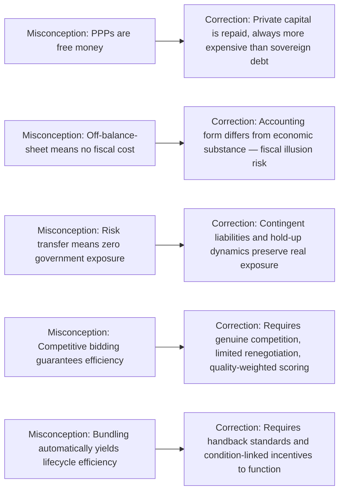

## Common Misconceptions About PPPs as a Financing Shortcut

### Overview

This item synthesizes and directly confronts the recurring misconceptions about PPPs that arise when policymakers, media, or even project sponsors treat PPPs as a mechanism for obtaining infrastructure without genuine fiscal cost — a framing this chapter has already implicitly dismantled across the financing-gap, efficiency, risk-transfer, and off-balance-sheet items. Consolidating these misconceptions explicitly is useful because they tend to recur in combination and reinforce one another in public debate, and because correcting them precisely is necessary for sound Value for Money analysis and public communication about PPP programs.

### Misconception 1: "PPPs Are Free Money" / "Private Finance Doesn't Cost the Public Anything"

**The Misconception**

A commonly repeated claim is that using private capital to build infrastructure allows government to obtain the asset without ultimately using public money — as though private investors provide capital as a form of grant or gift rather than an investment requiring repayment with a return.

**The Correction**

As established under the financing-gap item's funding/financing distinction, private capital is **never free**: it is repaid, with a required return, from one of exactly two ultimate sources — general taxation or user tariffs. Moreover, private capital is virtually always **more expensive** than sovereign borrowing, because private investors demand a risk-adjusted return reflecting genuine project risk exposure, while government's cost of debt reflects its (typically) higher credit quality, larger risk pool, and lower default risk. The correct framing is not "PPPs cost nothing" but "PPPs may still represent good Value for Money **despite** higher financing costs, if efficiency and risk-transfer gains are large enough to offset that cost differential" — a proposition that must be demonstrated project-by-project, not assumed.

### Misconception 2: "Off-Balance-Sheet Means No Fiscal Cost"

**The Misconception**

Because certain PPP structures may not appear on the government's headline balance sheet or count against near-term deficit figures (as detailed in the off-balance-sheet item), some conclude the arrangement has no real fiscal consequence — effectively treating an accounting classification as if it were an economic fact.

**The Correction**

Accounting treatment and economic substance are distinct. A 25-year availability payment commitment is a real, binding, long-term claim on future government (and ultimately taxpayer) resources regardless of its balance-sheet classification. This is precisely the **fiscal illusion** risk formalized in the prior item: the true test of fiscal cost is the present value of government's contractual and contingent obligations, not their statistical presentation.

### Misconception 3: "Risk Transfer Means the Government Bears No Risk"

**The Misconception**

A PPP contract that nominally assigns construction, demand, or operational risk to the private party is sometimes assumed to fully insulate government from any exposure to that risk materializing.

**The Correction**

As discussed in the risk transfer item, risk transfer is only as real as the private party's actual capacity and willingness to absorb the consequences without recourse to government. In practice:

- Governments frequently retain **contingent liabilities** (termination compensation, minimum revenue guarantees) that create real, if probabilistic, exposure even under "fully transferred" risk structures.
- The **hold-up dynamic** discussed under Transaction Cost Economics means that once a private operator faces financial distress from a realized risk, government often faces strong political and practical pressure to renegotiate or bail out the project to avoid service disruption — the so-called "too big/critical to fail" dynamic in essential infrastructure — meaning nominal risk transfer can revert to government exposure precisely when the risk materializes.
- Genuinely effective risk transfer requires structuring the arrangement so that private-party failure does not automatically threaten service continuity (e.g., via lender step-in rights, requiring adequate insurance, and realistic — not just competitively low — risk pricing at bid stage).

### Misconception 4: "Competitive Bidding Alone Guarantees Efficiency"

**The Misconception**

Because PPP concessions are typically awarded via competitive tender, it is sometimes assumed that the resulting contract terms are automatically efficient, since "the market" determined the price.

**The Correction**

As shown in the game theory item, competitive bidding disciplines price only under specific conditions: a sufficient number of genuinely independent bidders, limited scope for post-award renegotiation, and bid evaluation that accurately values technical quality alongside price. Where these conditions fail — as with the winner's curse dynamic in demand-risk contracts, or a market with only one or two credible bidders — competitive bidding can produce a price that reflects bidder over-optimism or effective non-competition rather than a genuine efficient market outcome.

### Misconception 5: "Bundling Automatically Delivers Lifecycle Efficiency"

**The Misconception**

Because DBFOM bundling is theoretically justified by internalizing the design-maintenance cost externality (as shown under the efficiency gains item), it is sometimes assumed that any bundled contract automatically captures this benefit.

**The Correction**

As shown under the multitasking agency item, bundling only delivers its theoretical lifecycle benefit if the payment mechanism and monitoring regime actually incentivize the unobservable long-term stewardship dimension (via handback conditions, lifecycle reserve accounts, or condition-linked KPIs). A poorly designed bundled contract, lacking these mechanisms, can produce the same underinvestment-in-durability outcome the bundling was meant to prevent — bundling is a necessary but not sufficient condition for lifecycle efficiency gains.

### Diagram: Misconception-to-Correction Map

### Misconception 6: "PPPs Are Always More Expensive Than Public Procurement" (The Mirror-Image Fallacy)

**Key Points**

- It is worth noting the opposite misconception also circulates in policy debate: the blanket claim that PPPs are *always* more expensive than conventional public procurement once financing costs are considered, treating the higher cost of private capital as dispositive on its own.
- This ignores the possibility (formalized in the efficiency gains item) that genuine competitive discipline, innovation incentives, and lifecycle bundling can produce cost savings exceeding the financing cost differential — the empirical literature reviewed under that item found heterogeneous, not uniformly negative, outcomes across programs and sectors.
- The accurate position, consistent with Value for Money methodology, is that **neither blanket claim is correct as a general proposition**: whether a specific PPP represents good value depends on project-specific risk allocation quality, competitive tension achieved at bid stage, contract design robustness, and sector characteristics — not on a categorical rule in either direction.

### Misconception 7: "A Signed PPP Contract Eliminates Future Fiscal Uncertainty"

**The Misconception**

Once a PPP contract with fixed payment terms is signed, it is sometimes assumed the government has achieved budget certainty for the life of the concession, in contrast to the perceived unpredictability of managing an asset through annual public budget allocations.

**The Correction**

As discussed under Transaction Cost Economics, contractual incompleteness means long-term PPP contracts cannot fully specify every future contingency, and renegotiation (potentially altering payment terms) remains a live possibility over a 25–30 year horizon, particularly where relationship-specific investment creates bilateral bargaining dependency. Budget certainty from a signed PPP contract is therefore a matter of degree, contingent on contract robustness and dispute-resolution design, not an absolute guarantee — a nuance often lost when PPPs are marketed on the basis of payment predictability alone.

### Diagram: Nominal vs. Genuine Fiscal Certainty Over Contract Life (svg_diagram)

<svg xmlns="http://www.w3.org/2000/svg" viewBox="0 0 720 300">
<text x="360" y="26" font-size="17" font-weight="bold" text-anchor="middle" fill="#1a1a1a">Nominal vs. Genuine Fiscal Certainty (svg_diagram)</text>
<line x1="80" y1="150" x2="640" y2="150" stroke="#374151" stroke-width="1.5" />
<text x="360" y="270" font-size="11" text-anchor="middle" fill="#374151">Contract Timeline (Years)</text>
<line x1="80" y1="150" x2="640" y2="80" stroke="#2563eb" stroke-width="2" stroke-dasharray="6,3" />
<text x="600" y="70" font-size="10" fill="#2563eb">Nominal (contracted) payment path</text>
<path d="M 80 150 Q 300 130, 380 190 T 640 220" fill="none" stroke="#dc2626" stroke-width="2" />
<text x="600" y="235" font-size="10" fill="#dc2626">Genuine expected path with renegotiation risk</text>
<circle cx="380" cy="190" r="5" fill="#dc2626" />
<text x="380" y="215" font-size="9" text-anchor="middle" fill="#7f1d1d">Renegotiation event</text>

<text x="360" y="50" font-size="11" text-anchor="middle" fill="`#4b5563`">A signed contract sets a nominal path; contractual incompleteness leaves</text>

<text x="360" y="290" font-size="11" text-anchor="middle" fill="`#4b5563`">genuine fiscal certainty conditional on renegotiation risk over the contract life</text>

</svg>

### A Synthesis Checklist for Evaluating PPP Claims

**Key Points**

- When evaluating a claim that a proposed PPP "solves" a fiscal or infrastructure problem, the following checklist — drawing on every prior item in this chapter — helps separate genuine value-for-money claims from shortcut framing:
  - Has the funding source (tax or user tariff) been identified, or is the proposal implicitly treating private capital as a substitute for funding rather than financing?
  - Is the accounting/statistical treatment being used as a justification for the procurement route, or is the route justified independently on Value for Money grounds?
  - Are risks allocated to the party genuinely best able to control or absorb them, or is risk transfer maximized nominally regardless of the receiving party's actual capacity to manage it?
  - Does the payment/monitoring mechanism actually incentivize the specific efficiency source being claimed (competition, innovation, lifecycle bundling), or is the mechanism silent on the dimension the efficiency claim depends on?
  - Has contingent liability exposure (termination payments, guarantees) been estimated and disclosed, or does headline fiscal reporting omit it?

### Empirical and Policy Notes

- [Inference] These misconceptions recur across many jurisdictions and time periods in the PPP policy literature and are not specific to any single country's program; their persistence is often attributed in that literature to the genuine complexity of PPP financial structuring combined with political incentives favoring headline-friendly framing of infrastructure announcements, though this attribution is itself an interpretive judgment rather than a directly measured causal finding.
- International bodies (IMF, World Bank, OECD) have published guidance materials explicitly aimed at correcting these misconceptions for finance ministries and legislators, reflecting their assessed prevalence and practical significance in PPP program governance.
- This item functions as a synthesis checkpoint for the chapter: each correction offered here maps directly back to a formal mechanism developed in an earlier item (agency theory, transaction cost economics, game theory, risk transfer economics, and accounting standards), reinforcing that sound PPP evaluation requires applying all of these frameworks jointly rather than relying on any single simplified justification.

**Related Topics**

- Addressing Infrastructure Financing and Delivery Gaps
- Efficiency Gains from Private Innovation and Lifecycle Management
- Risk Transfer as a Source of Value Creation
- Off-Balance-Sheet Financing Debates and Fiscal Illusion
- Principal-Agent Theory, Moral Hazard, and Adverse Selection
- Transaction Cost Economics and Asset Specificity
- Value for Money Analysis and the Public Sector Comparator
- Contingent Liability Registers and PPP Fiscal Risk Management Frameworks