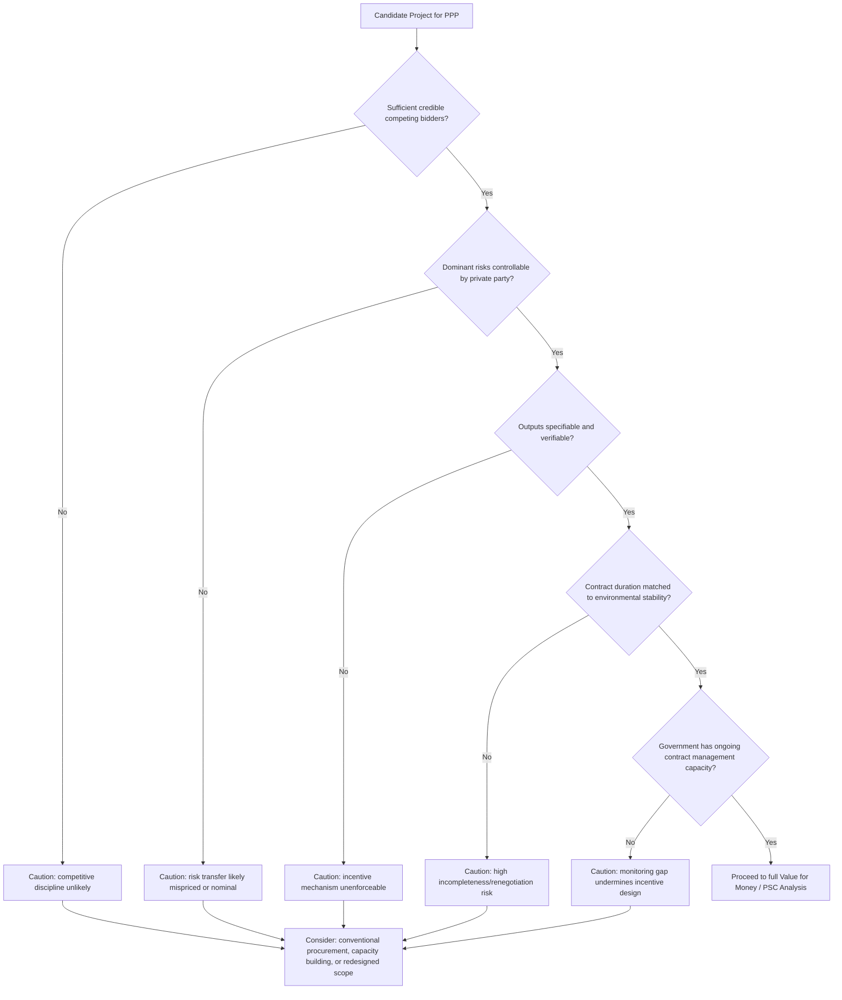

## Screening Criteria for When Not to Use a PPP

### Overview

This item closes the chapter by inverting the efficiency case developed across the preceding items: rather than asking when PPPs create value, it asks when they systematically do not, and formalizes this into screening criteria a government can apply *before* committing procurement resources to a PPP-structured tender. Since every preceding item in this chapter identified specific necessary conditions for PPP value creation (genuine competition, controllable risk, contractible outputs, credible bundling incentives, real financing cost trade-offs), the absence of those conditions constitutes the corresponding disqualifying or cautionary criterion. This item consolidates them into a structured pre-screening framework.

### The General Screening Logic

**Key Points**

- A PPP should be understood as one procurement *option* among several (conventional public procurement, public corporation/state-owned enterprise delivery, management contracts, full privatization), not a default or universally preferred modality — the appropriate screening question is "does this specific project's characteristics favor PPP structuring over the alternatives," not "should we use a PPP."
- Each criterion below corresponds to a **necessary condition for value creation** identified in a prior chapter item; failing a criterion does not automatically mean "never use a PPP" but signals that the specific value-creation mechanism the PPP relies on is unlikely to function, requiring either project redesign, a different procurement route, or explicit acknowledgment that the PPP is being chosen for other (e.g., capacity or fiscal-space) reasons rather than pure efficiency.
- The absence of a rigorous ex ante screening process is itself a documented risk factor: PPPs adopted primarily due to procurement-team incentives, off-balance-sheet motivations (see prior item), or generic policy enthusiasm for private participation, without project-specific screening, are more likely to underperform.

### Criterion 1: Insufficient Genuine Competition

**Mechanism**

As established in the game theory item, competitive tendering discipline is a primary source of PPP value, but only when a sufficient number of independent, credible bidders participate. Where a market has very few capable firms (common in specialized sectors, small economies, or novel technology applications), competitive tension collapses toward a **de facto sole-source negotiation**, eliminating this efficiency channel while still incurring PPP structuring costs (higher transaction costs, extended procurement timelines, specialized advisory fees).

**Screening Question**: Does the sector and project size realistically support at least three to four credible, independent bidders at tender, based on market sounding or comparable precedent?

### Criterion 2: Uncontrollable or Unpriceable Risk Concentration

**Mechanism**

As established in the risk transfer item, value creation from risk transfer requires the private party to have genuine control over the risk driver; risks the private party cannot influence (demand risk in novel/unprecedented infrastructure, extreme regulatory volatility, currency risk in highly unstable macroeconomic environments) generate risk premiums that exceed any efficiency benefit, or produce mispriced bids subject to winner's-curse dynamics and near-certain future renegotiation.

**Screening Question**: Can the dominant project risks be decomposed into categories where the private party has genuine operational or technical control, or does the risk profile consist predominantly of risks (regulatory, demand, macroeconomic) the private party can only price speculatively rather than manage?

### Criterion 3: Outputs That Cannot Be Adequately Specified or Verified

**Mechanism**

As established in the multitasking agency item, PPP incentive mechanisms depend on the ability to write **contractible output specifications** — measurable, verifiable performance criteria. Certain services resist this: functions requiring high discretion, complex professional judgment, or outcomes only observable over very long or diffuse causal chains (e.g., core clinical decision-making in healthcare, curriculum and pedagogical judgment in education, core policing/security functions) are difficult to specify without either (a) writing an overly rigid specification that eliminates beneficial professional discretion, or (b) writing a vague specification that cannot be enforced, reintroducing the moral hazard problem the contract was meant to solve.

**Screening Question**: Can the core service outputs be defined with sufficient precision to support enforceable, unambiguous performance measurement, without so constraining professional/operational discretion that service quality is degraded?

**Sector Pattern**: This is the formal justification behind the "hard FM / soft FM" unbundling pattern discussed under the bundling item — infrastructure provision and facilities management (highly specifiable) are more amenable to PPP structuring than the core professional service itself (clinical care, teaching), which is more commonly retained under direct public management even within an otherwise PPP-delivered facility.

### Criterion 4: High Contractual Incompleteness Risk Relative to Contract Duration

**Mechanism**

As established under Transaction Cost Economics, long-duration contracts in highly uncertain environments (rapid technological change, volatile policy environments, evolving service-need trajectories) are more likely to become materially incomplete relative to actual future conditions, increasing the probability of costly renegotiation that erodes the competitive discipline achieved at tender.

**Screening Question**: Is the project in a sector where technology, demand patterns, or policy requirements are likely to change substantially within the proposed contract term, such that a 20–30 year fixed output specification risks material obsolescence?

### Criterion 5: Insufficient Institutional Capacity to Manage the Contract

**Key Points**

- PPP contracts require sustained, technically sophisticated **contract management capacity** throughout their life — monitoring KPI compliance, managing periodic benchmarking or market testing, handling change requests, and conducting handback condition assessments — not merely capacity to conduct the initial tender.
- Governments or agencies lacking this ongoing institutional capacity risk a scenario where the contract's theoretical incentive mechanisms exist on paper but are not actively enforced in practice, effectively reproducing unmonitored moral hazard exposure despite a well-designed contract.
- This criterion is distinct from Criterion 1 (bidder-side capacity) — it concerns the **principal's** capacity to act as an effective, informed counterparty over the contract's full duration, including staff continuity and institutional memory across the typically much longer PPP contract term relative to normal staff tenure or political cycles.

**Screening Question**: Does the responsible government entity have (or can it credibly build) the dedicated technical and contract-management capacity to actively monitor and enforce this contract for its full duration?

### Diagram: PPP Screening Decision Flow

### Criterion 6: Project Too Small to Absorb PPP Transaction Costs

**Mechanism**

PPP structuring involves substantial fixed transaction costs — legal, financial, and technical advisory fees, extended procurement timelines, and specialized bid evaluation processes — that do not scale proportionally with project size. For sufficiently small projects, these fixed transaction costs can consume a large share of total project value, eliminating any net efficiency benefit even where the underlying risk-allocation and competition conditions are otherwise favorable.

$$\text{Net VfM} = VfM_{gross} - \text{Transaction Costs}_{PPP}$$

Since $\text{Transaction Costs}_{PPP}$ has a substantial fixed component largely independent of project scale, $\text{Net VfM}$ becomes negative below some minimum efficient project size — many jurisdictions apply explicit minimum project value thresholds (e.g., a stated minimum capital value) below which projects are, as policy, directed toward conventional procurement rather than PPP structuring, precisely to avoid this transaction-cost-driven value erosion.

**Screening Question**: Is the project of sufficient scale that expected efficiency and risk-transfer gains plausibly exceed the largely fixed transaction costs of PPP structuring, procurement, and ongoing contract management?

### Criterion 7: Political and Social Acceptability Constraints

**Key Points**

- Certain services carry strong political or social expectations of direct public provision (core policing, judiciary, primary/secondary education instruction, basic healthcare access), independent of any efficiency calculation — attempting PPP structuring against strong social/political resistance can generate implementation risk, contract instability, and reputational cost to the program that a purely technical VfM analysis would not capture.
- User-pays PPP structures in particular raise **distributional/equity** considerations (as noted under the efficiency gains item): services with strong universal-access norms (water, basic transport) may face justified political resistance to tariff-based cost recovery structures regardless of underlying efficiency merit, favoring availability-payment or fully public alternatives even where a pure efficiency screen might favor a user-pays PPP.

**Screening Question**: Does the sector carry political, social, or equity considerations that would make private-sector service delivery poorly accepted or normatively contested, independent of technical efficiency arguments?

### Consolidated Screening Matrix

| Criterion | Underlying Chapter Concept | Disqualifying Signal |
| --- | --- | --- |
| Competition | Game Theory / Auction Theory | Fewer than ~3 credible bidders expected |
| Risk controllability | Risk Transfer as Value Creation | Dominant risks are regulatory, macroeconomic, or otherwise uncontrollable by private party |
| Output specifiability | Multitask Agency / Bundling | Core outputs require high discretion or are unverifiable |
| Contractual stability | Transaction Cost Economics | High expected environmental change relative to contract duration |
| Institutional capacity | Principal-Agent Theory | Government lacks sustained contract-monitoring capability |
| Project scale | Financing/Efficiency Trade-off | Project value too small relative to fixed transaction costs |
| Political/social acceptability | Distributional/Normative | Strong social expectation of direct public provision |

### Worked Example: Applying the Screen

Consider a proposal to deliver a rural primary healthcare clinic network via a full DBFOM PPP including clinical service delivery:

- **Competition**: Likely few bidders with both infrastructure and rural clinical service delivery capability — fails Criterion 1.
- **Risk controllability**: Patient demand and clinical outcome risk are not meaningfully controllable by a private operator in the way construction risk is — partially fails Criterion 2.
- **Output specifiability**: Core clinical care quality is difficult to fully specify/verify via contract KPIs without constraining clinical judgment — fails Criterion 3.
- **Political acceptability**: Basic healthcare access carries strong universal-provision norms in most jurisdictions — likely fails Criterion 7.

This profile suggests a **partial** PPP structure is more appropriate than a full DBFOM: bundle the facility design/build/finance/maintain functions (where competition, risk control, and specifiability conditions are more favorable) while retaining core clinical service delivery under direct public management — directly mirroring the hard-FM/soft-FM unbundling logic discussed under bundling, and illustrating that the screening framework's output is often a **scope redesign recommendation**, not a binary accept/reject verdict.

### Diagram: Screening Outcome as Scope Redesign (svg_diagram)

<svg xmlns="http://www.w3.org/2000/svg" viewBox="0 0 720 280">
<text x="360" y="26" font-size="17" font-weight="bold" text-anchor="middle" fill="#1a1a1a">Screening Outcome: Scope Redesign (svg_diagram)</text>
<rect x="60" y="70" width="600" height="60" rx="6" fill="#f3f4f6" stroke="#6b7280" />
<text x="360" y="105" font-size="12" text-anchor="middle" fill="#374151">Original Proposal: Full DBFOM Including Clinical Services</text>

<text x="360" y="155" font-size="20" text-anchor="middle" fill="`#6b7280`">↓ Screen Applied ↓</text>

<rect x="60" y="180" width="280" height="70" rx="6" fill="#dcfce7" stroke="#16a34a" />
<text x="200" y="210" font-size="11" font-weight="bold" text-anchor="middle" fill="#14532d">PPP-Suitable Scope</text>
<text x="200" y="228" font-size="10" text-anchor="middle" fill="#14532d">Design, Build, Finance, Maintain (Facility)</text>
<rect x="380" y="180" width="280" height="70" rx="6" fill="#fee2e2" stroke="#dc2626" />
<text x="520" y="210" font-size="11" font-weight="bold" text-anchor="middle" fill="#7f1d1d">Retained Public Scope</text>
<text x="520" y="228" font-size="10" text-anchor="middle" fill="#7f1d1d">Clinical Service Delivery</text>
</svg>

### Empirical and Policy Notes

- [Inference] Several jurisdictions and multilateral institutions have published formal PPP screening or "PPP suitability" checklists incorporating criteria similar to those presented here; specific threshold values (minimum project size, minimum bidder counts) vary by jurisdiction and are policy choices rather than derived from a single universal formula.
- The absence of a rigorous, standardized ex ante screening process — as opposed to the specific content of any one country's checklist — is more consistently identified in the literature as a risk factor for PPP underperformance than any single criterion in isolation.
- This screening framework is intended as a diagnostic starting point; passing all criteria is a necessary condition for pursuing full Value for Money analysis (per the financing gaps item), not a sufficient condition for proceeding — the detailed PSC-based VfM analysis remains the definitive quantitative test.

**Related Topics**

- Addressing Infrastructure Financing and Delivery Gaps
- Efficiency Gains from Private Innovation and Lifecycle Management
- Risk Transfer as a Source of Value Creation
- Common Misconceptions About PPPs as a Financing Shortcut
- Bundling of Design, Build, Finance, and Operate as a Multitask Agency Problem
- Transaction Cost Economics and Asset Specificity
- Value for Money Analysis and the Public Sector Comparator
- Hard FM vs. Soft FM Unbundling in Social Infrastructure PPPs