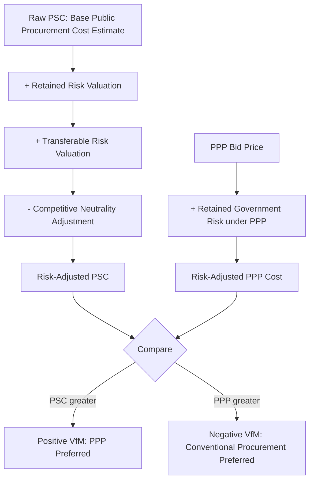

## Qualitative and Quantitative Value for Money Concepts

### Overview

Value for Money (VfM) is the central evaluative framework used to determine whether a PPP procurement route delivers superior overall value relative to conventional public procurement or other delivery alternatives, integrating the efficiency, risk-transfer, and financing considerations developed throughout this syllabus into a formal assessment methodology. VfM assessment operates on two complementary tracks: **quantitative VfM**, which produces a numerical comparison typically via the Public Sector Comparator (PSC) methodology, and **qualitative VfM**, which evaluates dimensions of value that resist precise monetization but materially affect the desirability of a given procurement route. This item establishes the conceptual foundation for both tracks before subsequent items in this chapter develop the PSC mechanics and risk quantification techniques in detail.

### Defining Value for Money

**Key Points**

- VfM is not synonymous with "lowest cost" — it refers to the optimal combination of whole-life cost and quality/fitness-for-purpose that best meets the procuring authority's requirements, explicitly incorporating risk-adjusted cost comparison rather than headline price alone.
- The standard formal definition treats VfM as achieved when a procurement option delivers the required output specification at the lowest risk-adjusted whole-life cost, where "risk-adjusted" is the critical qualifier distinguishing VfM analysis from simple budget comparison.
- VfM assessment is conducted at multiple stages of the PPP lifecycle: an **ex ante** assessment at the procurement-route decision stage (should this project use PPP or conventional procurement), a **bid evaluation** stage VfM test (does the winning bid actually deliver positive VfM relative to the PSC benchmark), and periodic **ex post** VfM reviews during contract implementation (is the realized VfM consistent with the ex ante business case).

### The Quantitative VfM Track

**Mechanism**

Quantitative VfM assessment centers on the **Public Sector Comparator (PSC)**, introduced under the infrastructure financing gaps item, refined here as a formal methodology:

$$VfM_{quantitative} = PSC_{risk-adjusted} - PPP_{bid,risk-adjusted}$$

The PSC construction process typically proceeds through distinct cost layers:

$$PSC_{risk-adjusted} = \underbrace{PSC_{raw}}_{\text{base public-sector cost estimate}} + \underbrace{\text{Retained Risk}}_{\text{risk borne by government under either route}} + \underbrace{\text{Transferable Risk}}_{\text{risk that would be transferred under PPP, valued as if retained}} - \underbrace{\text{Competitive Neutrality Adjustment}}_{\text{removes government's inherent cost advantages}}$$

Each layer serves a distinct analytical function:

- **Base (Raw) PSC**: an estimate of the direct capital and operating cost of delivering the project via conventional public procurement, using standard public-sector costing methods, without risk adjustment.
- **Transferable Risk valuation**: the most methodologically significant and contested layer — an estimate of what it would cost government to bear the risks that would, under a PPP, be transferred to the private party (construction overrun, demand shortfall, and so on, per the risk allocation matrix developed under the risk transfer item). This layer is what allows the PSC to be compared on a like-for-like risk basis against a PPP bid that already has risk pricing embedded in its cost.
- **Retained Risk valuation**: risks that would remain with government under *either* procurement route (e.g., certain force majeure or regulatory risk categories per the risk allocation matrix) are added identically to both sides of the comparison, and in principle should not affect the *relative* VfM outcome, though they are still included for completeness and total fiscal cost transparency.
- **Competitive Neutrality Adjustment**: government typically enjoys structural cost advantages unrelated to genuine operational efficiency — tax-exempt status, ability to self-insure across a large asset portfolio, and access to lower sovereign borrowing costs. Because these advantages do not reflect genuine productive efficiency (the true subject of VfM comparison), competitive neutrality adjustments add back an imputed cost to the PSC to remove this artificial advantage, ensuring the comparison isolates real efficiency differences rather than financing-structure or fiscal-status artifacts.

### Diagram: PSC Construction Layers

### The Qualitative VfM Track

**Key Points**

- Qualitative VfM captures dimensions of comparative value that are difficult or inappropriate to fully monetize within the PSC's numerical framework, but which materially affect whether a procurement route serves the public interest. Common qualitative dimensions include:
  - **Service quality and innovation potential**: the extent to which a route enables higher service standards or genuine technical/operational innovation (per the efficiency gains item), which may only partially manifest in projected cost figures.
  - **Flexibility and adaptability**: the capacity of a procurement route to accommodate changing future needs without excessive renegotiation cost — directly related to the contractual incompleteness concerns raised under Transaction Cost Economics.
  - **Accountability and transparency**: the degree to which each route preserves democratic accountability, public transparency, and legislative oversight over service delivery, a normatively significant dimension independent of cost.
  - **Equity and access implications**: distributional consequences of user-pays versus tax-funded delivery, as flagged under the efficiency gains and screening criteria items, particularly relevant for essential services with universal-access norms.
  - **Implementation and market capacity risk**: the realistic likelihood of successful delivery given current market conditions, institutional capacity, and precedent — related to the screening criteria developed in the prior chapter item.
- Qualitative VfM assessment does not produce a single number to net against the quantitative $VfM_{quantitative}$ figure; rather, it is typically presented as a structured narrative or scored matrix that decision-makers weigh alongside the quantitative result, particularly important when the quantitative result is close to neutral or highly sensitive to key assumptions.

### Why Both Tracks Are Necessary

**Mechanism**

Relying on quantitative VfM alone risks two distinct failure modes:

1. **False precision**: PSC methodology, particularly the transferable risk valuation layer, involves substantial estimation uncertainty (as flagged under the infrastructure financing gaps item's critique of VfM/PSC methodology) — a single net present value figure can convey unwarranted confidence in what is, in reality, a highly assumption-sensitive estimate, especially regarding the discount rate applied.
2. **Omitted dimensions**: purely monetized comparison cannot fully capture legitimate public-interest considerations like democratic accountability or distributional equity, which may appropriately outweigh a modest quantitative VfM advantage in either direction.

Conversely, relying on qualitative VfM alone risks **unfalsifiable justification** — without a disciplined quantitative benchmark, narrative VfM arguments can be constructed to support a procurement decision reached on other grounds (including the off-balance-sheet or capacity motivations discussed earlier in this syllabus), without the analytical discipline the PSC comparison imposes.

Best-practice VfM frameworks therefore typically require **both** a quantitative PSC-based test and a structured qualitative assessment, with explicit documentation of how the two are weighed when they point in different directions.

### Diagram: Quantitative vs. Qualitative VfM Failure Modes (svg_diagram)

<svg xmlns="http://www.w3.org/2000/svg" viewBox="0 0 720 300">
<text x="360" y="26" font-size="17" font-weight="bold" text-anchor="middle" fill="#1a1a1a">Quantitative vs. Qualitative VfM Risks (svg_diagram)</text>
<rect x="70" y="70" width="280" height="170" rx="8" fill="#dbeafe" stroke="#2563eb" stroke-width="1.5" />
<text x="210" y="100" font-size="13" font-weight="bold" text-anchor="middle" fill="#1e3a8a">Quantitative VfM Alone</text>
<text x="210" y="130" font-size="10" text-anchor="middle" fill="#1e3a8a">Risk: False precision from</text>
<text x="210" y="146" font-size="10" text-anchor="middle" fill="#1e3a8a">assumption-sensitive PSC inputs</text>
<text x="210" y="176" font-size="10" text-anchor="middle" fill="#1e3a8a">Risk: Omits accountability,</text>
<text x="210" y="192" font-size="10" text-anchor="middle" fill="#1e3a8a">equity, and flexibility dimensions</text>
<rect x="380" y="70" width="280" height="170" rx="8" fill="#fef3c7" stroke="#d97706" stroke-width="1.5" />
<text x="520" y="100" font-size="13" font-weight="bold" text-anchor="middle" fill="#78350f">Qualitative VfM Alone</text>
<text x="520" y="130" font-size="10" text-anchor="middle" fill="#78350f">Risk: Unfalsifiable narrative</text>
<text x="520" y="146" font-size="10" text-anchor="middle" fill="#78350f">used to justify predetermined route</text>
<text x="520" y="176" font-size="10" text-anchor="middle" fill="#78350f">Risk: Lacks disciplined</text>
<text x="520" y="192" font-size="10" text-anchor="middle" fill="#78350f">cost benchmark for comparison</text>

<text x="360" y="270" font-size="11" text-anchor="middle" fill="`#4b5563`">Robust VfM frameworks combine both tracks with explicit documentation of trade-offs</text>

</svg>

### Worked Example: A Simplified VfM Comparison

Consider a bridge project with the following illustrative inputs (present values, single currency unit millions):

| Component | Conventional Procurement (PSC) | PPP Bid |
| --- | --- | --- |
| Raw construction/operating cost | 200 | 210 |
| Retained risk (both routes) | 15 | 15 |
| Transferable risk (construction overrun, demand shortfall) valued if retained by government | 45 | — (borne by private party, embedded in bid price) |
| Competitive neutrality adjustment | +8 | — |
| **Risk-adjusted total** | **268** | **225** |

$$VfM_{quantitative} = 268 - 225 = 43 \; (\text{positive VfM favoring PPP})$$

In this simplified illustration, even though the PPP's raw construction/operating cost estimate (210) is higher than the conventional route's raw estimate (200), the PPP route shows positive quantitative VfM once the value of risk transferred away from government (45) and the competitive neutrality adjustment (8) are incorporated — directly illustrating why raw headline cost comparison alone (which would incorrectly favor conventional procurement in this example) is analytically insufficient, and why the risk-adjustment layers are the substantive core of the PSC methodology. [Inference] This is a simplified didactic illustration; real PSC calculations involve detailed risk registers with probability-weighted valuations for numerous individual risk line items, typically developed with specialized risk-modeling support.

### Sensitivity and Robustness Considerations

**Key Points**

- Because the transferable risk valuation and discount rate assumptions are the most influential and contested inputs to $VfM_{quantitative}$, sound VfM practice requires **sensitivity analysis**: recalculating VfM under a range of plausible discount rates and risk valuation assumptions to assess whether the conclusion (positive or negative VfM) is robust or fragile to reasonable assumption changes.
- A VfM result that flips sign under modest, defensible changes in the discount rate or risk valuation should be treated as inconclusive from the quantitative track alone, increasing the relative weight properly placed on qualitative VfM factors and on the risk allocation quality criteria developed under the screening criteria item.

### Empirical and Policy Notes

- [Inference] VfM/PSC methodology frameworks vary in specific formula structure and documentation requirements across jurisdictions (e.g., UK Green Book/HM Treasury guidance historically, various World Bank and regional PPP unit toolkits), though the underlying conceptual structure — risk-adjusted cost comparison plus a qualitative overlay — is broadly consistent across major frameworks.
- Academic and audit-body critiques of VfM/PSC practice (introduced under the infrastructure financing gaps item) center substantially on the transferable risk valuation layer's sensitivity to subjective inputs; this remains an active area of methodological debate rather than a fully settled technical question.
- This item establishes the conceptual foundation for the chapter; subsequent items develop the detailed PSC construction methodology, risk quantification techniques, and discount rate selection issues in greater technical depth.

**Related Topics**

- Addressing Infrastructure Financing and Delivery Gaps
- Risk Transfer as a Source of Value Creation
- Screening Criteria for When Not to Use a PPP
- Public Sector Comparator Construction Methodology and Risk Registers
- Discount Rate Selection and Sensitivity Analysis in PPP Appraisal
- Competitive Neutrality Adjustments in Public Sector Cost Estimation
- Common Misconceptions About PPPs as a Financing Shortcut
- Transaction Cost Economics and Asset Specificity