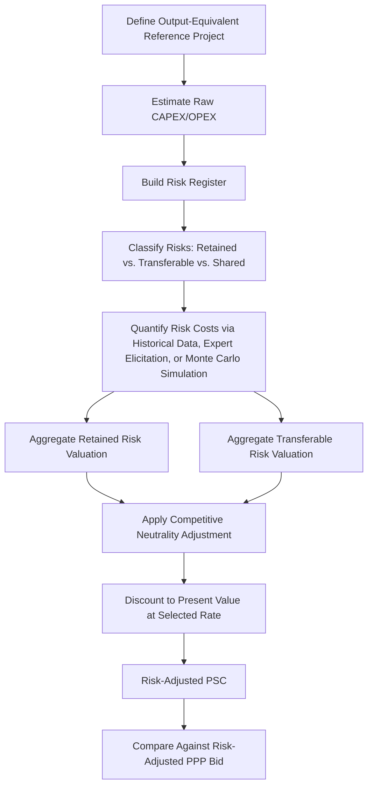

## Constructing the Public Sector Comparator

### Overview

This item develops the detailed methodology for building a Public Sector Comparator (PSC), moving from the conceptual layer structure introduced in the prior item to the practical construction process: defining the reference project, estimating raw costs, building the risk register that drives the transferable and retained risk valuations, selecting appropriate discount rates, and assembling the components into a defensible risk-adjusted benchmark against which a PPP bid can be evaluated.

### Step 1: Define the Reference Project (The "Raw PSC")

**Key Points**

- The starting point for PSC construction is a **reference project**: a hypothetical specification of how the same output (the same service standard, capacity, and quality the PPP is being tendered to deliver) would be procured, designed, constructed, and operated through conventional public-sector procurement.
- This reference project must be **output-equivalent** to the PPP being evaluated — the PSC is not a comparison against a lower-specification, cheaper public alternative, since that would compare two different outputs rather than two delivery routes for the same output; equivalence of scope and service standard is a precondition for a valid comparison.
- The raw PSC cost estimate is typically built using standard public-sector cost-estimation methods: quantity surveying/engineering cost estimates for capital expenditure, historical or benchmarked unit costs for operating expenditure, and standard public-sector procurement timelines and financing assumptions (i.e., assuming the project were financed via normal government borrowing, not private capital).

$$PSC_{raw} = \sum_{t=0}^{T} \frac{CAPEX_t + OPEX_t}{(1+r_{sovereign})^t}$$

where $r_{sovereign}$ reflects the government's own cost of capital, appropriate at this stage since the raw PSC represents the cost of conventional public financing, before any risk adjustment or competitive neutrality correction is applied.

### Step 2: Build the Risk Register

**Mechanism**

The risk register is the analytical backbone of PSC construction — a structured inventory of every material project risk, classified by category (per the risk allocation matrix developed under the risk transfer item), with an estimated probability distribution and cost impact for each, from which the transferable and retained risk valuations are derived.

A standard risk register entry includes:

| Field | Description |
| --- | --- |
| Risk category | E.g., construction cost overrun, completion delay, demand shortfall, latent defect |
| Probability of occurrence | Estimated likelihood, often based on historical project data or expert elicitation |
| Cost impact if realized | Estimated magnitude of cost consequence, often expressed as a distribution (e.g., low/most likely/high) rather than a single point estimate |
| Allocation under conventional procurement | Typically: retained by government |
| Allocation under PPP | Per the project's proposed risk allocation matrix: transferred, retained, or shared |
| Expected value contribution | Probability × cost impact, aggregated across the risk's probability distribution |

**Risk Quantification Approaches**

- **Historical/statistical approach**: using empirical data from comparable completed projects (e.g., average construction cost overrun percentages observed across a portfolio of similar public infrastructure projects) to calibrate probability and impact distributions.
- **Expert elicitation / Delphi-style approach**: where historical data is sparse (novel project types, unique site conditions), structured expert judgment processes are used to estimate probability and impact ranges, often via workshops with technical specialists, cost estimators, and legal/contract advisors.
- **Monte Carlo simulation**: given probability distributions for each individual risk line item, a Monte Carlo simulation aggregates the many risk line items into an overall project cost distribution, from which the expected value (mean) and desired percentile (e.g., 80th percentile, often used as a "P80" contingency benchmark) can be extracted for use in the PSC.

$$\mathbb{E}[\text{Risk Cost}] = \sum_{i=1}^{n} P_i \times I_i$$

where $P_i$ is the probability of risk $i$ occurring and $I_i$ is its expected cost impact if it occurs; for risks with continuous impact distributions rather than simple binary occurrence, this expectation is computed as an integral or approximated via simulation rather than a simple point-probability product.

### Diagram: PSC Construction Process Flow

### Step 3: Apply the Competitive Neutrality Adjustment

**Mechanism**

As introduced in the prior item, government benefits from structural advantages not available to private bidders, which must be added back to the PSC to isolate genuine efficiency differences. The main components typically quantified:

- **Tax neutrality adjustment**: government does not pay corporate income tax, while a private PPP bidder's costs embed tax liabilities (though these are also partially offset by tax revenue government would collect from the private operator, requiring careful treatment to avoid double-counting from a whole-of-government perspective — practice varies on how comprehensively this offset is applied).
- **Cost of capital neutrality**: while the raw PSC appropriately uses $r_{sovereign}$ for discounting government's own hypothetical financing cost, the competitive neutrality adjustment ensures this advantage is not misattributed as an "efficiency" gain of public procurement, since it reflects government's credit standing rather than genuine operational efficiency — the PSC and PPP bid should ultimately be compared using a consistent risk-adjusted discount rate (see Step 4) that does not simply reward the public route for cheaper nominal financing.
- **Self-insurance adjustment**: government's ability to self-insure across a large, diversified asset portfolio (effectively bearing catastrophic risk at a lower cost than a single-project private entity purchasing commercial insurance) is imputed as a notional cost added to the PSC, reflecting what an equivalent private insurance arrangement would cost.

### Step 4: Discount Rate Selection

**Key Points**

- The choice of discount rate is one of the most consequential and contested methodological decisions in PSC construction, since it directly determines the relative present value of near-term versus long-term cash flows, and PPP structures typically have different cash flow timing profiles (front-loaded private financing costs, later government payment streams) than conventional procurement (potentially different capital expenditure timing under public budget cycles).
- Common approaches include:
  - **Government (risk-free) borrowing rate**: used to discount the raw, un-risk-adjusted PSC cash flows, reflecting the pure time value of money from government's financing perspective.
  - **Social discount rate**: a rate reflecting society's time preference and used more broadly in public investment appraisal (cost-benefit analysis), sometimes applied to the underlying project economic assessment distinct from the PSC/PPP financial comparison.
  - **Project-specific risk-adjusted discount rate**: incorporating a risk premium reflecting the specific project's risk profile, used by some frameworks to discount risk-adjusted cash flows on both sides of the comparison consistently.
- [Inference] There is no universal consensus discount rate methodology across jurisdictions; different national PPP appraisal frameworks (e.g., historical UK Green Book guidance, various World Bank/regional toolkits) have adopted different approaches and have revised their guidance over time, reflecting the genuinely unsettled nature of this methodological question in public finance practice.

### Worked Example: Building a Simplified Risk Register Entry

Consider a single risk line item — construction cost overrun — for a hypothetical highway project:

| Scenario | Probability | Cost Impact (Present Value) |
| --- | --- | --- |
| No overrun | 40% | 0 |
| Moderate overrun (10% of CAPEX) | 35% | 10 |
| Severe overrun (25% of CAPEX) | 20% | 25 |
| Extreme overrun (50% of CAPEX) | 5% | 50 |

$$\mathbb{E}[\text{Construction Overrun Cost}] = (0.40)(0) + (0.35)(10) + (0.20)(25) + (0.05)(50) = 0 + 3.5 + 5.0 + 2.5 = 10.0$$

This expected value of 10.0 (in the project's currency units) represents the amount added to the PSC's transferable risk valuation for this single risk category, reflecting what it would cost government, in expectation, to bear construction cost overrun risk itself. Under the PPP route, this specific risk is instead assumed to be borne by the private contractor and priced into their bid — the PSC's inclusion of this expected value ensures the comparison treats this risk consistently across both procurement routes. [Inference] This is a simplified illustrative distribution constructed for pedagogical purposes; real risk registers typically use more granular probability distributions calibrated against project-specific engineering and historical cost-overrun data.

### Diagram: Risk-Adjusted Cost Distribution Comparison (svg_diagram)

<svg xmlns="http://www.w3.org/2000/svg" viewBox="0 0 720 300">
<text x="360" y="26" font-size="17" font-weight="bold" text-anchor="middle" fill="#1a1a1a">Risk Cost Distribution: Construction Overrun (svg_diagram)</text>
<line x1="80" y1="240" x2="640" y2="240" stroke="#374151" stroke-width="1.5" />
<line x1="80" y1="240" x2="80" y2="60" stroke="#374151" stroke-width="1.5" />
<text x="360" y="270" font-size="11" text-anchor="middle" fill="#374151">Overrun Scenario</text>
<rect x="120" y="80" width="80" height="160" fill="#dcfce7" stroke="#16a34a" />
<text x="160" y="255" font-size="9" text-anchor="middle" fill="#374151">No overrun</text>
<text x="160" y="70" font-size="10" text-anchor="middle" fill="#14532d">40%</text>
<rect x="240" y="100" width="80" height="140" fill="#fef3c7" stroke="#d97706" />
<text x="280" y="255" font-size="9" text-anchor="middle" fill="#374151">Moderate</text>
<text x="280" y="90" font-size="10" text-anchor="middle" fill="#78350f">35%</text>
<rect x="360" y="160" width="80" height="80" fill="#fed7aa" stroke="#ea580c" />
<text x="400" y="255" font-size="9" text-anchor="middle" fill="#374151">Severe</text>
<text x="400" y="150" font-size="10" text-anchor="middle" fill="#7c2d12" />
<rect x="480" y="210" width="80" height="30" fill="#fee2e2" stroke="#dc2626" />
<text x="520" y="255" font-size="9" text-anchor="middle" fill="#374151">Extreme</text>

<text x="360" y="45" font-size="11" text-anchor="middle" fill="`#4b5563`">Expected value of 10.0 is the probability-weighted aggregate used in the PSC risk register</text>

</svg>

### Common Methodological Pitfalls in PSC Construction

**Key Points**

- **Optimism bias in the raw PSC**: public capital project cost estimates have been empirically documented (across many jurisdictions and sectors) to systematically understate eventual outturn costs unless explicit optimism bias adjustments are applied — omitting this adjustment biases the PSC downward and understates the true cost of the conventional procurement counterfactual, artificially disfavoring the PPP route.
- **Inconsistent risk transfer assumptions**: the transferable risk valuation should reflect risks that would *genuinely* transfer under the specific proposed PPP structure — using a generic, standardized transferable risk assumption not tailored to the specific project's proposed risk allocation matrix can materially distort the comparison in either direction.
- **Circular reference risk**: since the PSC is sometimes constructed by the same team advocating for a particular procurement route, or under time and political pressure to produce a result supporting a pre-existing preference, transparent documentation of all assumptions and independent review of the PSC (per the qualitative VfM item's transparency concerns) is an important safeguard against motivated methodology choices.
- **Static versus dynamic comparison**: a PSC constructed once at the initial procurement decision stage may not reflect how project risks or costs evolve; some frameworks require periodic ex post VfM re-assessment (as flagged under the qualitative/quantitative VfM item) precisely because initial PSC assumptions may prove inaccurate over a long implementation period.

### Empirical and Policy Notes

- [Inference] Optimism bias adjustment methodologies (e.g., reference class forecasting, drawing on comparable historical project outturns) have been incorporated into several national infrastructure appraisal guidance documents following documented patterns of public project cost overrun, though the specific adjustment factors used vary by sector and jurisdiction and should be treated as calibrated policy parameters rather than universal constants.
- The overall reliability of a PSC is only as strong as the quality and independence of its underlying risk register and cost estimation inputs; a technically sophisticated PSC methodology built on poor-quality or biased input data will still produce an unreliable VfM conclusion.
- This item completes the technical construction methodology; the relationship between PSC outputs and final procurement decision-making, including how qualitative VfM factors are weighed against a marginal quantitative result, was addressed in the prior chapter item and remains the broader decision context within which PSC construction serves as the analytical input.

**Related Topics**

- Qualitative and Quantitative Value for Money Concepts
- Risk Transfer as a Source of Value Creation
- Screening Criteria for When Not to Use a PPP
- Optimism Bias and Reference Class Forecasting in Public Investment Appraisal
- Monte Carlo Simulation and Risk Quantification Techniques
- Discount Rate Selection in Public Sector Appraisal Frameworks
- Competitive Neutrality Adjustments in Public Sector Cost Estimation
- Addressing Infrastructure Financing and Delivery Gaps