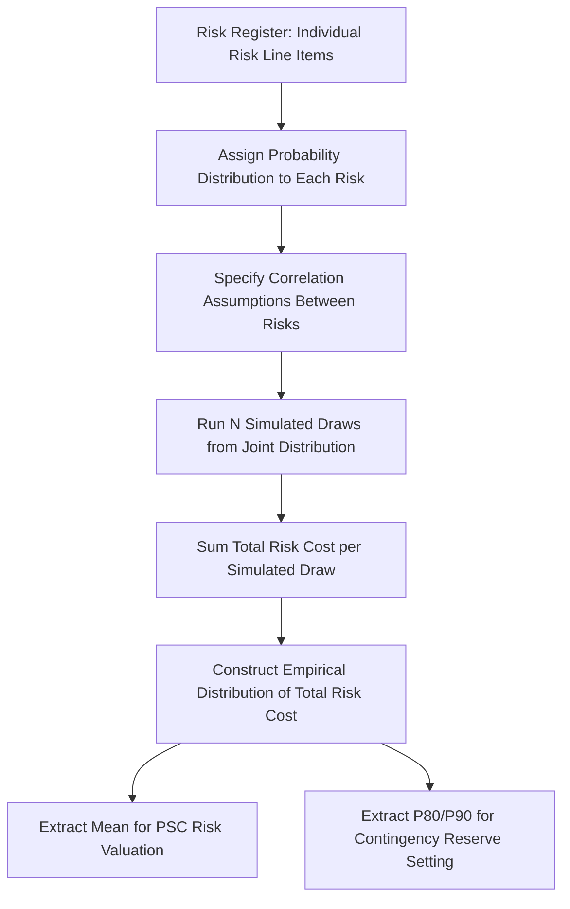

## Risk-Adjusted Cost Comparison Methodologies

### Overview

This item extends the PSC construction methodology from the prior item into a systematic treatment of the specific techniques used to convert raw project risk exposure into comparable monetary figures, and the methodological choices that govern how risk-adjusted costs are aggregated, discounted, and compared across procurement routes. Where the prior item established the risk register as the input, this item focuses on the analytical machinery — probability-impact modeling, simulation techniques, discounting conventions, and sensitivity/robustness testing — that transforms that input into a defensible risk-adjusted comparison.

### The Core Risk-Adjustment Problem

**Key Points**

- Risk-adjusted cost comparison exists to solve a specific analytical problem: a PPP bid price already has risk implicitly "priced in" by the private bidder (via its required return and contingency margins), while a conventional public-sector cost estimate typically does not embed an equivalent risk price unless explicitly adjusted — comparing the two without risk adjustment compares a risk-inclusive price against a risk-exclusive estimate, systematically biasing the comparison toward conventional procurement.
- The methodological goal is therefore to construct a **like-for-like** comparison: either by adding an explicit risk cost to the public-sector estimate (the standard PSC approach), or, less commonly, by attempting to strip the implicit risk premium out of the PPP bid — the former is far more common in practice because the PPP bid's risk premium is not directly observable or separable from the total bid price.

### Probability-Impact Modeling

**Mechanism**

The foundational technique for risk quantification represents each identified risk as a probability distribution over possible cost outcomes, rather than a single deterministic figure. Two common representations:

**Discrete scenario modeling**: as illustrated in the prior item's worked example, a small number of discrete scenarios (e.g., no overrun / moderate / severe / extreme) each assigned a probability, with the expected value computed as:

$$\mathbb{E}[C] = \sum_{s=1}^{n} p_s \cdot c_s$$

where $p_s$ is the probability of scenario $s$ and $c_s$ is its cost impact. This approach is administratively simple and communicable to non-technical stakeholders but can understate genuine variability if too few scenarios are used.

**Continuous distribution modeling**: risks are instead modeled with a continuous probability distribution (commonly triangular, PERT/Beta, or lognormal distributions for cost risk), parameterized by minimum, most-likely, and maximum estimates — a common approach given the frequent unavailability of large historical datasets to fit more complex distributions:

$$\mathbb{E}[C] = \int_{c_{min}}^{c_{max}} c \cdot f(c) \, dc$$

For a triangular distribution with minimum $a$, mode $m$, and maximum $b$, the expected value has a closed-form expression:

$$\mathbb{E}[C] = \frac{a + m + b}{3}$$

This closed-form simplicity is a major practical reason the triangular distribution is widely used in infrastructure risk registers despite being a less precise representation of real-world cost distributions than more complex alternatives.

### Monte Carlo Simulation for Aggregate Risk

**Mechanism**

Individual risk line items are rarely independent, and their combined effect on total project cost is not simply the sum of individual expected values when the underlying distributions are skewed or correlated. Monte Carlo simulation addresses this by:

1. Assigning a probability distribution to each risk line item in the register.
2. Specifying correlation assumptions between risk items where relevant (e.g., a general contractor capacity constraint might simultaneously affect both construction delay risk and cost overrun risk, making them positively correlated rather than independent).
3. Running a large number of simulated draws (typically tens of thousands) from the joint distribution of all risk items, summing the total risk cost for each simulated draw.
4. Constructing an empirical distribution of total project risk cost across all simulated draws, from which summary statistics are extracted.

**Key Output Statistics**

| Statistic | Definition | Typical Use |
| --- | --- | --- |
| Mean (expected value) | Average total risk cost across all simulated draws | Used as the central PSC risk valuation figure |
| P50 (median) | 50th percentile of the simulated distribution | Alternative central estimate, less sensitive to extreme tail scenarios |
| P80 / P90 | 80th/90th percentile of the simulated distribution | Used for setting contingency reserves at a specified confidence level, distinct from the expected-value PSC input |
| Standard deviation | Dispersion of the simulated distribution | Indicates overall project risk volatility, informing sensitivity analysis |

$$P_{80} = \inf\{c : F(c) \geq 0.80\}$$

where $F(c)$ is the empirical cumulative distribution function of simulated total risk cost. Note the important distinction: the **PSC risk valuation** typically uses the **mean (expected value)**, since the PSC represents an expected-cost comparison, while **P80/P90 figures** serve a different purpose — setting management contingency reserves — and using a high-percentile figure in the PSC itself would overstate the expected cost comparison and bias the analysis toward the PPP route.

### Diagram: Monte Carlo Simulation Process

### Discounting Risk-Adjusted Cash Flows

**Key Points**

- Once risk-adjusted cost streams are constructed for both the PSC and PPP comparison, they must be discounted to present value using a consistent methodology across both routes to preserve comparability, following the discount rate selection principles introduced in the prior item.
- A key technical question is whether to discount the **expected value** of risk-adjusted cash flows at a risk-free (or government borrowing) rate, or to instead discount **risk-inclusive** cash flows at a risk-adjusted discount rate that itself embeds a risk premium. These two approaches can, in principle, be made consistent (per certainty-equivalent valuation theory), but applying them inconsistently — e.g., using a risk-adjusted discount rate on cash flows that already have an explicit risk cost added — risks double-counting the value of risk in the comparison.
- [Inference] The specific technical convention adopted (certainty-equivalent expected values discounted at a risk-free rate versus risk-inclusive cash flows discounted at a risk-adjusted rate) varies across national PPP appraisal frameworks, and practitioners should consult the specific governing methodology for their jurisdiction rather than assume a universal convention.

### Sensitivity Analysis and Scenario Testing

**Mechanism**

Given the substantial estimation uncertainty embedded in risk registers and discount rate selection (as flagged in the prior item), robust risk-adjusted cost comparison requires systematic sensitivity analysis: recalculating the VfM outcome under variation of key assumptions to assess result stability.

**Common Sensitivity Dimensions**

- **Discount rate sensitivity**: recalculating $VfM$ across a range of discount rates (e.g., ±1-2 percentage points around the base case) to test whether the sign of the VfM conclusion is robust.
- **Risk valuation sensitivity**: varying the probability and impact assumptions for the largest individual risk line items (typically construction cost overrun and demand risk, given their outsized influence on total risk valuation) to identify which specific risk assumptions the overall conclusion is most sensitive to.
- **Optimism bias adjustment sensitivity**: testing the VfM conclusion's robustness to different optimism bias correction factors applied to the raw PSC estimate, given the documented tendency (noted in the prior item) for public project cost estimates to understate outturn costs.
- **Break-even analysis**: identifying the specific parameter value (e.g., the discount rate, or the probability of a specific major risk) at which the VfM conclusion flips sign — this "break-even" framing is often more informative for decision-makers than a single point estimate, since it directly communicates how much assumption error the conclusion can tolerate before reversing.

### Diagram: Sensitivity Analysis Tornado Chart Logic (svg_diagram)

<svg xmlns="http://www.w3.org/2000/svg" viewBox="0 0 720 320">
<text x="360" y="26" font-size="17" font-weight="bold" text-anchor="middle" fill="#1a1a1a">Sensitivity Analysis: Tornado Chart Structure (svg_diagram)</text>
<line x1="360" y1="60" x2="360" y2="280" stroke="#374151" stroke-width="1.5" />
<text x="360" y="300" font-size="11" text-anchor="middle" fill="#374151">Base Case VfM</text>
<rect x="220" y="70" width="140" height="30" fill="#dbeafe" stroke="#2563eb" />
<text x="290" y="90" font-size="10" text-anchor="middle" fill="#1e3a8a">Discount rate ±1.5%</text>
<rect x="260" y="110" width="100" height="30" fill="#dcfce7" stroke="#16a34a" />
<text x="310" y="130" font-size="10" text-anchor="middle" fill="#14532d">Construction overrun risk</text>
<rect x="290" y="150" width="70" height="30" fill="#fef3c7" stroke="#d97706" />
<text x="325" y="170" font-size="10" text-anchor="middle" fill="#78350f">Demand risk assumption</text>
<rect x="310" y="190" width="50" height="30" fill="#fee2e2" stroke="#dc2626" />
<text x="335" y="210" font-size="10" text-anchor="middle" fill="#7f1d1d">Optimism bias factor</text>

<text x="360" y="45" font-size="11" text-anchor="middle" fill="`#4b5563`">Wider bars indicate parameters to which the VfM conclusion is most sensitive</text>

</svg>

### Worked Example: Sensitivity-Adjusted Comparison

Extending the simplified example from the prior item ($PSC_{risk-adjusted} = 268$, $PPP_{risk-adjusted} = 225$, base-case $VfM = 43$), consider sensitivity testing on the discount rate:

| Discount Rate Scenario | Risk-Adjusted PSC (PV) | Risk-Adjusted PPP (PV) | VfM |
| --- | --- | --- | --- |
| Base case (6%) | 268 | 225 | 43 |
| Lower rate (4.5%) | 291 | 241 | 50 |
| Higher rate (7.5%) | 248 | 211 | 37 |

In this illustration, the VfM conclusion (positive, favoring PPP) is directionally robust across the tested discount rate range, though the magnitude varies — this is the kind of result that supports confident decision-making, in contrast to a scenario where the VfM sign itself flips under plausible rate variation, which would instead signal that the quantitative conclusion is fragile and that qualitative VfM considerations (per the earlier item) should carry correspondingly greater weight in the final decision. [Inference] These figures are illustrative continuations of the earlier simplified example and are not derived from a specific real project.

### Common Technical Pitfalls

**Key Points**

- **Double-counting risk**: applying both an explicit risk cost addition to the PSC and a risk-adjusted (risk-premium-inclusive) discount rate to the same cash flows overstates the total risk adjustment — the two mechanisms should generally be used as alternatives, not additively, unless the specific methodology's documentation explicitly justifies combining them.
- **Ignoring correlation between risks**: treating all risk line items as statistically independent when constructing an aggregate risk valuation (whether via simple summation or Monte Carlo simulation without correlation inputs) can understate the true tail risk of the project, since many infrastructure project risks (contractor capacity, weather-related delay, and material cost inflation, for example) tend to be positively correlated in practice.
- **Static risk registers**: risk registers calibrated once at the initial appraisal stage and not revisited can become stale relative to updated project information (e.g., after detailed geotechnical surveys reduce genuine construction risk uncertainty), producing a PSC that no longer reflects the best available risk information by the time of final bid evaluation.
- **Over-reliance on simulation outputs without communicating uncertainty**: presenting a single mean risk valuation figure from a Monte Carlo simulation without accompanying confidence intervals or sensitivity ranges can convey false precision to decision-makers, undermining the qualitative VfM safeguards discussed in the earlier chapter item.

### Empirical and Policy Notes

- [Inference] The sophistication of risk-adjusted cost comparison methodology in practice varies substantially across jurisdictions and project scales — large, complex projects in well-resourced PPP programs typically employ full Monte Carlo simulation with correlation modeling, while smaller projects or programs with less developed PPP institutional capacity may rely on simpler discrete scenario approaches; neither approach is universally superior, and the appropriate level of methodological sophistication should be proportionate to project scale and risk complexity.
- Reviews of PPP appraisal practice (e.g., national audit office reports referenced under earlier items in this chapter) have repeatedly identified risk quantification methodology — particularly the treatment of demand risk and optimism bias — as the most consequential and most frequently contested technical element of VfM assessment.
- This item completes the technical toolkit for risk-adjusted cost comparison; the subsequent application of these methodologies within the broader procurement decision process, including how sensitivity results inform final Value for Money determinations, connects directly back to the qualitative VfM weighing process introduced earlier in this chapter.

**Related Topics**

- Qualitative and Quantitative Value for Money Concepts
- Constructing the Public Sector Comparator
- Risk Transfer as a Source of Value Creation
- Monte Carlo Simulation and Probability-Impact Risk Modeling
- Discount Rate Selection and Certainty-Equivalent Valuation
- Optimism Bias and Reference Class Forecasting in Public Investment Appraisal
- Break-Even and Tornado-Chart Sensitivity Analysis Techniques
- Screening Criteria for When Not to Use a PPP