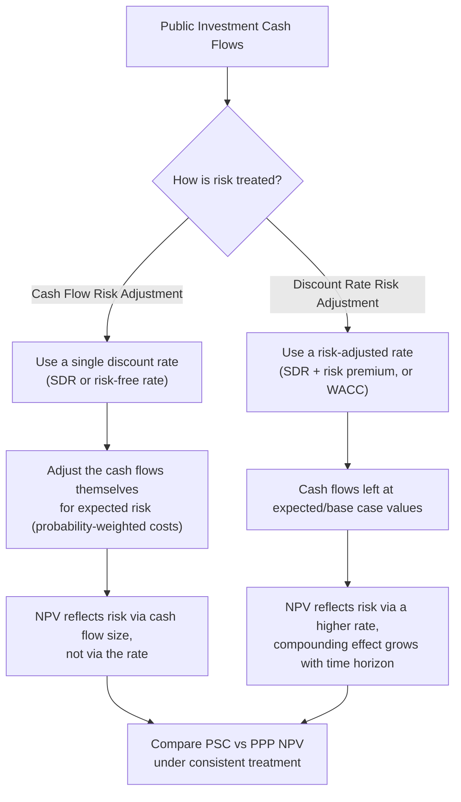

## Discount Rate Selection for Public Investment Appraisal

### Overview

The discount rate is the parameter that converts future costs and benefits into present-value terms, and in Value for Money (VfM) analysis it is frequently the single most decisive assumption in the entire Public Sector Comparator (PSC) versus PPP comparison. Because infrastructure cash flows span 20 to 40 years, small changes in the discount rate compound into large differences in Net Present Value (NPV), and the choice of rate can flip a project's VfM conclusion without any change to the underlying physical or contractual assumptions.

### Why the Discount Rate Matters in VfM Analysis

**Key Points**

- The PSC and the PPP/shadow bid cash flows are each discounted to present value before comparison; the rate chosen directly scales both, but not proportionally, because their risk-adjusted cash flow profiles differ over time.
- A higher discount rate reduces the present value of costs that occur far in the future (such as major maintenance or end-of-concession refurbishment), which tends to *favor* the option with fewer near-term costs and more deferred costs.
- Since PPP structures often shift maintenance and lifecycle costs into predictable, discounted future payments while traditional procurement front-loads capital expenditure, the rate selection can systematically bias the VfM result toward one delivery model. [Inference]
- Because of this sensitivity, most PPP units and multilateral development banks mandate the discount rate as a fixed, government-published parameter rather than leaving it to the individual project appraiser's discretion.

### Conceptual Foundations: Three Rate Concepts

Public investment appraisal conflates three distinct but related concepts, and it is one of the most common technical errors to interchange them.

#### Social Discount Rate (SDR)

The Social Discount Rate reflects society's rate of time preference and the opportunity cost of capital in the public sector as a whole. It is derived, not observed, and is typically calculated using the **Ramsey formula**:

$$r = \rho + \eta \cdot g$$

Where:

- $r$ is the social discount rate
- $\rho$ is the pure rate of time preference (utility discount rate, reflecting impatience and the probability of catastrophe ending the appraisal horizon)
- $\eta$ is the elasticity of marginal utility of consumption (how much utility falls as consumption rises)
- $g$ is the expected growth rate of per-capita consumption

**Example**

If $\rho = 1.5\%$, $\eta = 1.0$, and $g = 2.0\%$, then:

$$r = 0.015 + (1.0)(0.02) = 0.035 = 3.5\%$$

This is conceptually the rate the UK Green Book methodology and several OECD guidance documents use to justify a declining long-term SDR, since $g$ is expected to decelerate or become more uncertain over very long horizons.

#### Weighted Average Cost of Capital (WACC)

WACC reflects the private sector's blended cost of debt and equity financing and is the rate typically used to discount the *PPP bid* cash flows (or to derive the shadow bid in a PSC comparison), since it reflects the actual financing cost a private concessionaire would face.

$$\text{WACC} = \frac{E}{V} \cdot r_e + \frac{D}{V} \cdot r_d \cdot (1 - T)$$

Where:

- $E$ = market value of equity, $D$ = market value of debt, $V = E + D$
- $r_e$ = cost of equity (often derived via CAPM)
- $r_d$ = pre-tax cost of debt
- $T$ = corporate tax rate

The cost of equity under the Capital Asset Pricing Model (CAPM):

$$r_e = r_f + \beta \cdot (r_m - r_f)$$

Where $r_f$ is the risk-free rate, $\beta$ is the asset/equity beta reflecting the project's systematic risk relative to the market, and $r_m - r_f$ is the equity market risk premium.

#### Risk-Free Rate / Government Bond Yield

Many jurisdictions anchor the discount rate for the **public sector comparator** specifically to the government's own long-term cost of borrowing (proxied by sovereign bond yields), on the theory that government financing already reflects the sovereign's actual opportunity cost of funds. This differs from the SDR (a welfare-economics construct) and from WACC (a private financing construct).

### Comparison of Discount Rate Approaches

| Approach | Basis | Typical Use in VfM | Rate Level (illustrative) |
| --- | --- | --- | --- |
| Social Discount Rate (SDR) | Ramsey formula, social time preference | Discounting PSC costs/benefits, especially wider social/economic benefits | 3–7%, often declining over time |
| Risk-Free/Government Bond Rate | Sovereign borrowing cost | Discounting PSC base costs in narrower financial comparisons | Varies by country's sovereign yield curve |
| WACC | Blended private cost of capital | Discounting PPP/shadow bid cash flows | 6–12%, project- and country-risk dependent |
| Risk-Adjusted Social Discount Rate | SDR + project-specific risk premium | Some World Bank/ADB guidance for risk-differentiated public projects | SDR + 1–3 pts |

**[Unverified]** Exact rate levels vary substantially by country, sector, and year of publication; the ranges above are illustrative only and should be verified against the current guidance document in force for the specific jurisdiction (e.g., the Philippine NEDA ICC guidelines, the UK Green Book, or the relevant World Bank PPP Reference Guide edition).

### The Discount Rate Debate: One Rate vs. Two Rates

A central methodological controversy in PSC/PPP appraisal is whether to use:

1. **A single discount rate** for both the PSC and the PPP bid cash flows (usually the government bond rate or SDR), on the argument that this isolates *efficiency* differences between delivery models rather than *financing* differences, or
2. **Differentiated rates** — SDR (or risk-free rate) for the PSC, WACC for the PPP bid — on the argument that the PPP's actual cost of capital is higher because private financing is genuinely more expensive, and using a single low rate would understate the true cost of the PPP.

**Key Points**

- The **HM Treasury Green Book / UK PFI tradition** historically favored discounting both options at the same rate (typically the SDR), separating risk from the discount rate and instead reflecting risk explicitly through risk-adjusted cash flows (a "risk quantification" approach).
- The **risk-adjusted discount rate approach**, more common in some multilateral development bank guidance, embeds risk directly into the rate itself, raising the rate for riskier cash flow streams instead of adjusting the cash flows.
- Mixing these two approaches — adjusting both the cash flows *and* the discount rate for the same risk — causes **double-counting of risk**, which is one of the most frequently cited technical errors in PSC construction. [Inference — this is a widely documented pitfall in PPP unit guidance, though the specific frequency is not independently verifiable]

### Risk-Free Rate vs. Risk-Adjusted Discount Rate: Two Competing Schools

### Optimism Bias and Risk Quantification as Alternatives to Rate Adjustment

Rather than raising the discount rate to capture risk, many contemporary VfM frameworks (following UK Green Book practice) recommend keeping the discount rate at the SDR level and instead:

1. Quantifying **optimism bias** — the empirically observed tendency of project appraisers to underestimate costs and overestimate benefits — and applying an uplift percentage to base capital cost estimates, calibrated from historical outturn data on similar projects.
2. Explicitly modeling **retained risk** (risks that remain with government under a PPP) and **transferred risk** (risks shifted to the private party) as separate cash flow line items in the PSC, each with a probability-weighted expected value.
3. Reserving the discount rate purely for the **time value of money**, not for risk, to avoid the double-counting problem described above.

**[Inference]** This separation of "time preference" from "risk" is considered better practice in most current PPP unit guidance documents, though jurisdictions still vary in implementation, and some retain risk-adjusted rates for simplicity in early-stage screening.

### Sensitivity of NPV to Discount Rate Choice

The core mathematical relationship for a stream of cash flows $C_t$ over $n$ years:

$$NPV = \sum_{t=0}^{n} \frac{C_t}{(1+r)^t}$$

**Example**

Consider a simplified 20-year concession with a large upfront capital cost of ₱2 billion at $t=0$ and a deferred major refurbishment cost of ₱500 million at $t=15$, compared against a traditional procurement PSC with the same ₱2 billion upfront cost but a smaller, more frequent maintenance profile of ₱50 million annually from $t=1$ to $t=20$.

At $r = 4\%$:

$$PV_{\text{refurb}} = \frac{500{,}000{,}000}{(1.04)^{15}} \approx 277{,}780{,}000$$

At $r = 8\%$:

$$PV_{\text{refurb}} = \frac{500{,}000{,}000}{(1.08)^{15}} \approx 157{,}630{,}000$$

The present value of the same future cost falls by roughly 43% when the discount rate doubles from 4% to 8%. This illustrates why the PPP option — which typically pushes large costs further into the future — becomes progressively more favorable in a PSC/PPP comparison as the discount rate rises, independent of any real change in the project's actual efficiency. [Inference — the direction of this effect follows directly from discounting mathematics; the magnitude in any real appraisal depends on the specific cash flow profile]

### Discount Rate Sensitivity Curve (svg_diagram)

<svg xmlns="http://www.w3.org/2000/svg" viewBox="0 0 700 420">
<text x="350" y="25" text-anchor="middle" font-size="16" font-weight="bold" fill="#1a1a1a">Discount Rate Sensitivity Curve (svg_diagram)</text>
<line x1="70" y1="370" x2="650" y2="370" stroke="#333" stroke-width="1.5" />
<line x1="70" y1="370" x2="70" y2="50" stroke="#333" stroke-width="1.5" />

<text x="360" y="405" text-anchor="middle" font-size="13" fill="#333">Discount Rate (%)</text>

<text x="25" y="210" text-anchor="middle" font-size="13" fill="#333" transform="rotate(-90 25 210)">Present Value (₱ millions)</text>

<text x="70" y="390" font-size="11" text-anchor="middle" fill="#555">2%</text>

<text x="215" y="390" font-size="11" text-anchor="middle" fill="#555">4%</text>

<text x="360" y="390" font-size="11" text-anchor="middle" fill="#555">6%</text>

<text x="505" y="390" font-size="11" text-anchor="middle" fill="#555">8%</text>

<text x="650" y="390" font-size="11" text-anchor="middle" fill="#555">10%</text>

<text x="55" y="374" font-size="11" text-anchor="end" fill="#555">0</text>

<text x="55" y="290" font-size="11" text-anchor="end" fill="#555">150</text>

<text x="55" y="210" font-size="11" text-anchor="end" fill="#555">300</text>

<text x="55" y="130" font-size="11" text-anchor="end" fill="#555">450</text>

<text x="55" y="60" font-size="11" text-anchor="end" fill="#555">600</text>

<path d="M 70,90 Q 215,150 360,230 T 650,340" fill="none" stroke="#c0392b" stroke-width="2.5" />
<text x="480" y="290" font-size="12" fill="#c0392b" font-weight="bold">PV of Deferred Cost (t=15)</text>
<line x1="70" y1="330" x2="650" y2="330" stroke="#2471a3" stroke-width="2.5" stroke-dasharray="6,3" />
<text x="480" y="320" font-size="12" fill="#2471a3" font-weight="bold">PV of Near-Term Annual Costs</text>
<line x1="215" y1="50" x2="215" y2="370" stroke="#888" stroke-width="1" stroke-dasharray="3,3" />
<text x="220" y="65" font-size="11" fill="#888">Typical SDR range</text>
<line x1="505" y1="50" x2="505" y2="370" stroke="#888" stroke-width="1" stroke-dasharray="3,3" />
<text x="510" y="65" font-size="11" fill="#888">Typical WACC range</text>
</svg>

### Institutional Guidance and Common Practice

**Key Points**

- Most national PPP units publish a **mandated or default discount rate** for VfM assessments to prevent agencies from selecting a rate that produces a favorable outcome for their preferred procurement route (a form of appraisal gaming).
- The **World Bank PPP Reference Guide** discusses both SDR-based and risk-adjusted approaches, generally recommending consistency in application and transparency in whichever rate is chosen, along with mandatory sensitivity testing.
- The **UK Green Book** (HM Treasury) has historically specified a declining long-term SDR schedule for cash flows extending beyond 30 years, based on the theoretical argument that uncertainty about future growth rates justifies a lower effective discount rate the further into the future one goes.
- In many emerging-market contexts, including the Philippines, the discount rate used in NEDA/ICC project evaluation guidelines is periodically updated and tied to macroeconomic parameters such as the government's long-term borrowing cost or a specified social discount rate; the currently applicable rate should be confirmed against the latest NEDA ICC Project Evaluation guidelines rather than assumed. [Unverified — rates are subject to periodic administrative revision]

### Mandatory Sensitivity Analysis

Because VfM conclusions are so rate-dependent, virtually all credible PSC/PPP appraisal frameworks require **sensitivity and switching-value analysis** on the discount rate as a mandatory, not optional, component of the appraisal:

1. **Base case** run at the officially mandated rate.
2. **Sensitivity bands**, typically the base rate ± 1–3 percentage points, to show how robust the VfM conclusion is.
3. **Switching value / breakeven rate** — solving for the discount rate at which NPV(PSC) = NPV(PPP), i.e., the rate at which the VfM decision flips:

$$NPV_{PSC}(r^*) = NPV_{PPP}(r^*)$$

Solved for $r^*$, the switching rate. If $r^*$ is close to the base case rate, the VfM conclusion is fragile; if $r^*$ is far from the base case (e.g., several percentage points away), the conclusion is considered robust.

**Example**

If the base case rate is 6% and the PPP option only becomes cheaper than the PSC at rates above 9.2%, then $r^* = 9.2\%$ is comfortably outside the plausible range of the mandated rate, and the VfM conclusion (in favor of the PSC/traditional procurement, at the base rate) can be considered relatively robust to discount rate uncertainty. [Inference — illustrative example, not derived from a specific real project]

### Common Errors in Practice

**Key Points**

- **Double-discounting risk**: applying a risk premium to the rate *and* probability-weighting the cash flows for the same risk factors, which systematically understates NPV twice over.
- **Inconsistent rate application**: using WACC for the PPP bid and SDR for the PSC without disclosing or sensitivity-testing the effect of this difference, which can make VfM comparisons appear more favorable to one option than an apples-to-apples comparison would show.
- **Ignoring the term structure of interest rates**: applying a single flat rate across a 30-year horizon when the underlying government bond yield curve is not flat, particularly relevant in inflationary or high-interest-rate-volatility environments.
- **Nominal vs. real rate mismatches**: discounting nominal cash flows (which include inflation) with a real discount rate (which excludes inflation), or vice versa, without applying the Fisher relationship:

$$(1 + r_{nominal}) = (1 + r_{real}) \times (1 + \pi)$$

Where $\pi$ is the expected inflation rate. Mixing nominal cash flows with a real rate (or the reverse) systematically distorts NPV in one direction depending on which combination is used.

### Practical Checklist for Discount Rate Selection

1. Confirm the **currently mandated rate** from the relevant national PPP unit, finance ministry, or planning authority guidance document — do not assume a rate from general international literature applies directly.
2. Determine whether the jurisdiction requires a **single-rate** or **dual-rate (SDR/WACC)** approach for PSC vs. PPP comparison.
3. Verify whether cash flows are being projected in **nominal or real terms**, and match the discount rate type accordingly.
4. Confirm risk is being captured **either** in the cash flows **or** in the rate — never both.
5. Run mandatory **sensitivity analysis** across a plausible band and compute the **switching value**.
6. Document the rate source, methodology, and sensitivity results transparently in the VfM report for auditability, since discount rate selection is a frequent focus of ex-post audits and legislative review of PPP decisions.

**Related Topics**

- Ramsey Growth Model and Social Time Preference Theory
- Weighted Average Cost of Capital (WACC) Estimation for Infrastructure Projects
- CAPM and Beta Estimation for Non-Traded Infrastructure Assets
- Optimism Bias Correction in Public Investment Appraisal
- Risk Transfer Quantification in Public Sector Comparators
- Term Structure of Interest Rates and Government Bond Yield Curves
- Nominal vs. Real Cash Flow Modeling and the Fisher Equation
- Switching Value / Breakeven Analysis in Cost-Benefit Appraisal
- Comparative National Discount Rate Policies (UK Green Book, World Bank, NEDA ICC Guidelines)