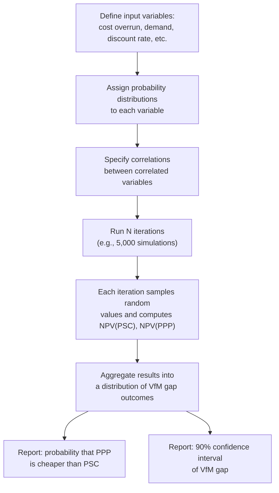

## Sensitivity and Scenario Analysis in Value for Money Assessment

### Overview

Sensitivity and scenario analysis are the risk-testing techniques applied to a Value for Money (VfM) assessment after the base-case Public Sector Comparator (PSC) versus PPP comparison has been built. Because a base-case NPV comparison is a single point estimate built on dozens of uncertain assumptions (discount rate, construction cost, demand forecasts, inflation, risk transfer pricing), presenting it without testing its stability against plausible variation in those assumptions is considered methodologically incomplete by virtually all major PPP appraisal frameworks. These techniques answer the question: *how confident can decision-makers be that the VfM conclusion holds, given the uncertainty inherent in the underlying assumptions?*

### Distinguishing Sensitivity Analysis, Scenario Analysis, and Probabilistic (Monte Carlo) Analysis

**Key Points**

- **Sensitivity analysis** varies **one input at a time** while holding all others at their base-case value, isolating the individual effect of each variable on the VfM outcome (a "one-at-a-time" or OAT approach).
- **Scenario analysis** varies **multiple inputs simultaneously** in internally consistent combinations (e.g., a "pessimistic scenario" that combines higher construction costs, lower demand, and higher interest rates together), reflecting the reality that risk factors are often correlated.
- **Probabilistic analysis** (commonly Monte Carlo simulation) assigns probability distributions to each uncertain input and runs thousands of iterations to generate a distribution of possible NPV outcomes, rather than a small number of discrete point estimates.
- These three approaches are complementary rather than substitutes: sensitivity analysis identifies which variables matter most, scenario analysis tests plausible combined futures, and probabilistic analysis quantifies the overall likelihood of different outcomes. [Inference — this layered relationship is standard practice guidance, though not every jurisdiction mandates all three]

### Why Sensitivity Analysis Is Mandatory in VfM Assessment

A base-case VfM result is only as credible as the assumptions feeding it. Given that PPP appraisals typically involve:

- Discount rates fixed by policy but still subject to debate (see the related discount rate selection topic)
- Construction cost estimates prone to **optimism bias**
- Demand or usage forecasts (traffic, patronage, utility offtake) with wide historical forecasting error margins
- Risk transfer valuations that are inherently judgment-based rather than market-observed prices in many jurisdictions

...the base-case NPV gap between PSC and PPP can be extremely fragile. Sensitivity testing is the primary tool for demonstrating whether the VfM conclusion is **robust** (holds across a wide range of plausible assumption variation) or **fragile** (flips with small, realistic changes).

### Core Method: One-at-a-Time (OAT) Sensitivity Analysis

**Process**

1. Identify the base-case value for each key input variable.
2. Define a plausible range for that variable (e.g., ±10%, ±20%, or a range derived from historical outturn data).
3. Recalculate the PSC and PPP NPVs (or the VfM gap) with only that one variable changed, holding all others constant.
4. Record the resulting change in the VfM outcome.
5. Repeat for each key variable independently.
6. Rank variables by the magnitude of their effect on the outcome — this ranking is often visualized as a **tornado diagram**.

**Example**

Suppose the base-case VfM gap (PSC NPV minus PPP NPV) is ₱150 million in favor of the PPP option. Varying inputs one at a time:

| Variable | Range Tested | Resulting VfM Gap (₱ million) | Range of Swing |
| --- | --- | --- | --- |
| Discount rate | 4% to 8% | +40 to +310 | 270 |
| Construction cost overrun | 0% to 30% | +90 to +260 | 170 |
| Demand/traffic forecast | -20% to +20% | +100 to +200 | 100 |
| Operating cost escalation | -1% to +3% p.a. | +130 to +175 | 45 |
| Risk transfer valuation | -50% to +50% of base | +75 to +225 | 150 |

This table shows the discount rate has the largest single effect on the VfM gap ([Inference] — illustrative figures constructed for demonstration, not derived from a specific real project), which would typically place it at the top of a tornado diagram.

### Tornado Diagram Representation (svg_diagram)

<svg xmlns="http://www.w3.org/2000/svg" viewBox="0 0 700 380">
<text x="350" y="25" text-anchor="middle" font-size="16" font-weight="bold" fill="#1a1a1a">Tornado Diagram of VfM Gap Sensitivity (svg_diagram)</text>
<line x1="350" y1="55" x2="350" y2="340" stroke="#333" stroke-width="1" />
<text x="350" y="355" text-anchor="middle" font-size="12" fill="#333">Base Case VfM Gap</text>

<text x="120" y="70" font-size="12" text-anchor="middle" fill="#333">Discount Rate</text>

<rect x="205" y="78" width="145" height="24" fill="`#c0392b`" opacity="0.85" />

<rect x="350" y="78" width="160" height="24" fill="`#2471a3`" opacity="0.85" />

<text x="150" y="122" font-size="12" text-anchor="middle" fill="#333">Construction Cost</text>

<rect x="255" y="130" width="95" height="24" fill="`#c0392b`" opacity="0.85" />

<rect x="350" y="130" width="75" height="24" fill="`#2471a3`" opacity="0.85" />

<text x="140" y="174" font-size="12" text-anchor="middle" fill="#333">Risk Transfer Value</text>

<rect x="270" y="182" width="80" height="24" fill="`#c0392b`" opacity="0.85" />

<rect x="350" y="182" width="80" height="24" fill="`#2471a3`" opacity="0.85" />

<text x="150" y="226" font-size="12" text-anchor="middle" fill="#333">Demand Forecast</text>

<rect x="290" y="234" width="60" height="24" fill="`#c0392b`" opacity="0.85" />

<rect x="350" y="234" width="55" height="24" fill="`#2471a3`" opacity="0.85" />

<text x="160" y="278" font-size="12" text-anchor="middle" fill="#333">Opex Escalation</text>

<rect x="315" y="286" width="35" height="24" fill="`#c0392b`" opacity="0.85" />

<rect x="350" y="286" width="30" height="24" fill="`#2471a3`" opacity="0.85" />

<rect x="480" y="325" width="15" height="15" fill="#c0392b" opacity="0.85" />
<text x="500" y="337" font-size="11" fill="#333">Downside variation</text>
<rect x="480" y="345" width="15" height="15" fill="#2471a3" opacity="0.85" />
<text x="500" y="357" font-size="11" fill="#333">Upside variation</text>
</svg>

Variables are conventionally ordered top-to-bottom from largest to smallest swing, producing the characteristic "tornado" funnel shape that gives the technique its name.

### Switching Value (Breakeven) Analysis

A specific and particularly decision-relevant form of sensitivity analysis solves for the value of an input variable at which the VfM conclusion flips — i.e., the point at which:

$$NPV_{PSC} = NPV_{PPP}$$

For any variable $x$ (discount rate, cost overrun percentage, demand level, etc.), the switching value $x^*$ satisfies:

$$NPV_{PSC}(x^*) - NPV_{PPP}(x^*) = 0$$

**Key Points**

- If $x^*$ requires an extreme, implausible deviation from the base case (e.g., construction costs would need to fall by 60% for the PSC to become cheaper), the VfM conclusion is considered robust to that variable.
- If $x^*$ falls within a realistic range close to the base case (e.g., only a 5% demand shortfall is needed to flip the conclusion), the VfM conclusion is considered fragile and warrants explicit disclosure to decision-makers, along with possible mitigation strategies.
- Switching values are typically reported alongside the base case in VfM reports specifically because they translate an abstract NPV gap into an intuitive, plain-language statement of risk ("the PPP option only remains cheaper if construction costs do not exceed X%").

### Scenario Analysis: Constructing Internally Consistent Futures

Unlike OAT sensitivity analysis, scenario analysis groups correlated variables into coherent narratives, typically structured as:

1. **Base Case** — most likely values for all variables, as used in the primary VfM comparison.
2. **Optimistic/Upside Scenario** — favorable combinations (e.g., lower financing costs, on-time and on-budget construction, higher-than-expected demand).
3. **Pessimistic/Downside Scenario** — unfavorable combinations (e.g., construction delays and cost overruns occurring together with a demand shortfall and higher interest rates).
4. **Stress Test Scenario** (in some frameworks) — an extreme but plausible combination designed to test resilience under a genuine adverse event (e.g., a macroeconomic shock, natural disaster affecting the region, or a major counterparty default).

**Example**

| Scenario | Discount Rate | Construction Cost | Demand | Resulting VfM Outcome |
| --- | --- | --- | --- | --- |
| Base Case | 6% | On budget | As forecast | PPP favored by ₱150M |
| Optimistic | 5% | -5% | +10% | PPP favored by ₱310M |
| Pessimistic | 7% | +20% | -15% | PSC favored by ₱40M |
| Stress Test | 8% | +35% | -25% | PSC favored by ₱210M |

This table illustrates that under the pessimistic and stress scenarios, the VfM conclusion **reverses** in favor of traditional procurement, which is a materially important finding for decision-makers even though the base case favors the PPP. [Inference — illustrative example constructed for demonstration purposes]

### Correlation and the Danger of Naive Scenario Construction

**Key Points**

- A common technical error is constructing an "optimistic" or "pessimistic" scenario by simply taking the most favorable or unfavorable end of each variable's individual sensitivity range without considering whether those combinations are realistic or mutually consistent.
- Some variables are **positively correlated** in reality (e.g., high inflation often coincides with higher interest rates, and macroeconomic downturns often depress both demand forecasts and government revenue simultaneously), and treating them as independent overstates the plausibility of extreme combined scenarios.
- Other variables may be **negatively correlated or substitutable** (e.g., a government fiscal stimulus response to a downturn might partially offset demand shortfalls), and ignoring this can make a pessimistic scenario appear worse than realistically likely.
- Well-constructed scenario analysis typically involves a review of historical co-movement of key variables, or at minimum, explicit qualitative reasoning about why a given combination represents a coherent, plausible future rather than an arbitrary worst-case stack. [Inference]

### Probabilistic (Monte Carlo) Sensitivity Analysis

For more sophisticated VfM assessments, particularly on large or high-profile projects, appraisers may go beyond discrete scenarios and assign full probability distributions to key uncertain variables, then simulate the model thousands of times.

**Process Outline**

1. Assign a probability distribution to each key uncertain variable (e.g., triangular, normal, or PERT distribution for construction cost overrun; a distribution derived from historical forecasting error for demand).
2. Specify correlations between variables where relevant (e.g., a correlation matrix linking cost overrun and construction delay).
3. Run the PSC and PPP NPV model repeatedly (typically 1,000–10,000+ iterations) with randomly sampled values drawn from each distribution.
4. Aggregate the results into a probability distribution of the VfM gap (PSC NPV − PPP NPV).
5. Report the **probability that the PPP option is cheaper than the PSC** (i.e., the proportion of iterations in which the VfM gap favors the PPP), rather than a single point estimate.

**Key Points**

- Monte Carlo output is often summarized as "the PPP option is cheaper than the PSC in X% of simulated outcomes," which communicates risk more richly than a single-point VfM conclusion.
- This approach requires materially more data and modeling effort than OAT sensitivity or discrete scenarios, and is therefore more commonly applied to large, complex, or high-risk-profile projects rather than routine smaller PPP transactions. [Inference]
- Behavior of specific Monte Carlo software or modeling tools (e.g., @RISK, Crystal Ball, or custom-built simulation in Python/R) may vary in default distribution assumptions and correlation-handling methods; consult the specific tool's documentation for implementation details.

### Institutional Requirements Across Frameworks

**Key Points**

- The **World Bank PPP Reference Guide** and associated toolkits generally recommend sensitivity analysis on key cost drivers, the discount rate, and risk allocation assumptions as a standard component of VfM assessment, alongside disclosure of the resulting range of outcomes.
- The **UK Green Book / HM Treasury** guidance historically emphasizes sensitivity analysis particularly around optimism bias corrections, recommending that appraisers test the effect of both the applied optimism bias uplift and its removal.
- National PPP units and planning authorities (such as NEDA in the Philippines) typically require sensitivity analysis to be presented as part of project evaluation submissions, though the specific mandated variables, ranges, and reporting format should be confirmed against the currently applicable guideline document rather than assumed generically. [Unverified — specific procedural requirements are subject to periodic revision]

### Structuring the Sensitivity Analysis Section of a VfM Report

**Output**

A well-structured sensitivity and scenario analysis section of a VfM report typically includes:

1. **Base case summary** — restating the base-case VfM conclusion and the magnitude of the gap.
2. **Key variable sensitivity table or tornado diagram** — ranking variables by their individual effect on the outcome.
3. **Switching values** for the most material variables, expressed in plain language.
4. **Scenario table** — at minimum optimistic, pessimistic, and base case, with the resulting VfM conclusion under each.
5. **Probabilistic summary** (if performed) — probability of PPP being cheaper than PSC, and confidence interval of the VfM gap.
6. **Narrative interpretation** — an explicit statement of whether the VfM conclusion is considered robust or fragile, and which specific risks or assumptions decision-makers should be most attentive to going forward.
7. **Recommended mitigations or monitoring triggers** — for the variables identified as most material, a discussion of what contractual, procurement, or risk-transfer mechanisms could reduce exposure to that variable's downside (e.g., indexation clauses, minimum revenue guarantees, or demand risk-sharing mechanisms).

### Common Errors in Sensitivity and Scenario Analysis

**Key Points**

- **Testing only "friendly" ranges**: choosing narrow or conservative variation ranges that make the VfM conclusion appear artificially robust, rather than ranges grounded in historical outturn data or independent risk assessment.
- **Ignoring correlation** between variables when constructing scenarios, as discussed above, which produces either implausibly extreme or implausibly mild combined scenarios.
- **Reporting only the base case prominently** while burying sensitivity results in an appendix, which undermines the transparency purpose that sensitivity analysis is intended to serve.
- **Confusing sensitivity analysis with risk transfer valuation**: sensitivity analysis tests the *stability* of the VfM conclusion to assumption uncertainty; it is not a substitute for the separate, more fundamental exercise of properly valuing which risks are transferred to the private party in the first place.
- **Failing to update sensitivity ranges over the project lifecycle**: sensitivity ranges appropriate at the concept/pre-feasibility stage may no longer be appropriate once more detailed design, cost estimates, or market soundings are available, and reusing stale ranges can misstate the residual uncertainty in the appraisal. [Inference]

**Related Topics**

- Discount Rate Selection for Public Investment Appraisal
- Optimism Bias Correction in Public Investment Appraisal
- Risk Transfer Quantification in Public Sector Comparators
- Monte Carlo Simulation Techniques for Infrastructure Finance
- Tornado Diagrams and Variable Ranking Methods in Cost-Benefit Analysis
- Demand Risk Allocation and Minimum Revenue Guarantee Structures
- Correlation Modeling in Project Finance Risk Analysis
- Ex-Post Audit and Review of VfM Assessment Accuracy