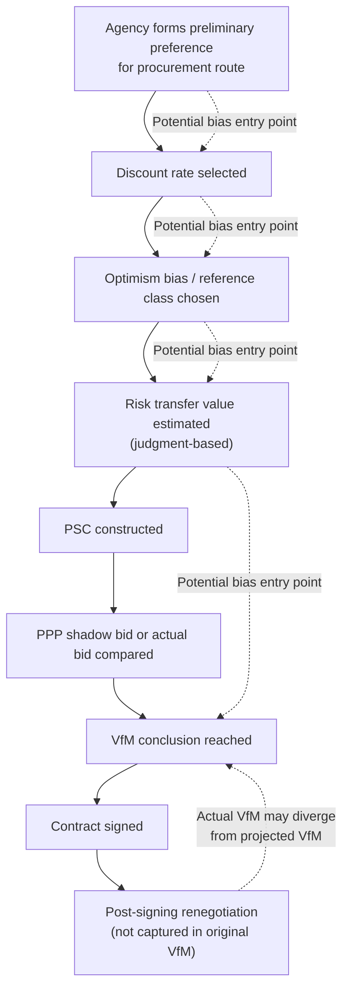

## Critiques and Limitations of Value for Money Methodologies

### Overview

Value for Money (VfM) methodology, and the Public Sector Comparator (PSC) approach specifically, has been the dominant analytical framework for justifying PPP procurement decisions since its widespread adoption beginning in the 1990s (notably in the UK, Australia, and later globally through World Bank and multilateral development bank guidance). Despite its institutional entrenchment, VfM methodology has attracted substantial and persistent academic, auditor, and practitioner criticism. Understanding these critiques is essential not to dismiss VfM analysis, but to apply it with appropriate epistemic humility and to recognize where its conclusions should be weighted alongside other considerations rather than treated as definitive.

### Critique 1: Sensitivity to the Discount Rate Renders Conclusions Manipulable

**Key Points**

- As established in discount rate selection methodology, the VfM conclusion between PSC and PPP is often highly sensitive to the chosen discount rate, and in many documented cases, a plausible range of discount rates spans both a "PPP favored" and "PSC favored" conclusion for the same project.
- Critics argue this creates an opportunity — whether intentional or not — for appraisers or agencies with a pre-existing preference for one procurement route to select a discount rate (or risk adjustment methodology) that produces the desired conclusion, a practice sometimes termed "reverse engineering" the VfM result.
- Several national audit offices, including the UK National Audit Office (NAO) and Australia's state-level auditors-general, have published reports over the years questioning whether discount rate and risk transfer assumptions in specific PSC comparisons were selected to justify decisions rather than to genuinely inform them. [Unverified — specific findings vary by report, jurisdiction, and year; general characterization of this criticism is well-documented in the literature, but citing it accurately requires reference to the specific audit report in question]

### Critique 2: Risk Transfer Valuation Is Inherently Subjective

**Key Points**

- The value assigned to "risk transferred" to the private sector under a PPP — often the single largest adjustment differentiating the PSC from the raw public-sector cost estimate — is rarely based on observable market prices, since there is no liquid market in which "construction risk" or "demand risk" for a specific public asset is priced independently.
- Risk transfer values are typically derived through expert workshops, probability-weighted scenario analysis, or benchmarking against other PPP transactions, all of which involve substantial judgment and are difficult for external reviewers to independently verify.
- Critics, including academic researchers such as those associated with the University of Melbourne's long-running PPP research program and various UK-based public finance scholars, have argued that risk transfer values are sometimes calibrated to be just large enough to make the PPP option appear cheaper than the PSC, precisely because this figure is the least externally verifiable input in the entire model. [Inference — this is a recurring theme in academic PPP critique literature, though attributing it to a specific named finding requires verification against the specific source]
- Because risk transfer valuation is not standardized across jurisdictions, cross-country or cross-project comparisons of VfM outcomes are of limited reliability unless the underlying risk transfer methodology is also compared.

### Critique 3: The Counterfactual Public Sector Comparator Is Never Actually Observed

**Key Points**

- The PSC represents a **hypothetical** cost of delivering the project through traditional public procurement — it is a constructed estimate, not an observed outcome, because the project is (by definition) only actually built once, using one procurement route.
- This means the PSC is inherently unfalsifiable in retrospect: if a project proceeds as a PPP, there is no way to later confirm what the traditional procurement route would actually have cost, making genuine ex-post validation of the original VfM conclusion impossible in the majority of cases.
- Some jurisdictions have attempted partial validation by comparing PSC cost estimates against actual outturn costs of *similar* traditionally-procured projects, but this comparison is confounded by differences in project scope, timing, location, and market conditions, limiting its evidentiary value. [Inference]

### Critique 4: Optimism Bias Corrections Are Themselves Uncertain and Contestable

**Key Points**

- Optimism bias adjustments (uplifting PSC capital cost estimates to reflect the historically observed tendency of public projects to run over budget) are typically calibrated using reference-class forecasting from a database of past projects.
- Critics note that the appropriate reference class — which past projects are considered sufficiently similar to the one being appraised — is itself a judgment call, and different reference class choices can produce substantially different optimism bias uplifts.
- Because optimism bias is applied to the PSC (public sector route) cost estimate but the PPP bid cost is typically treated as a firm, contractually-binding figure from a competitive bid process, some critics argue this creates an asymmetric treatment: the PSC is adjusted upward for expected cost growth, while the PPP is not equivalently stress-tested for its own risk of renegotiation, cost overrun passthrough, or contract variation over a multi-decade concession term. [Inference — this asymmetry critique appears in the academic PPP literature, though the specific framing and terminology vary by author]

### Critique 5: VfM Analysis Undervalues or Omits Broader Social, Distributional, and Qualitative Factors

**Key Points**

- Standard VfM/PSC analysis is fundamentally a **financial and quantitative** comparison, and critics argue it is poorly suited to capturing qualitative considerations such as service quality differences, accountability and democratic oversight implications, workforce and labor conditions, or long-term flexibility to adapt the asset to changing public needs.
- Some frameworks attempt to address this through a **qualitative VfM assessment** conducted alongside the quantitative PSC comparison, but critics note that qualitative factors are often treated as a secondary check rather than being given comparable analytical weight to the headline NPV figure.
- Distributional effects — who bears the cost and who receives the benefit of a project, and how a PPP's user-fee or availability-payment structure affects different income groups — are generally outside the scope of a standard VfM/PSC comparison, which focuses on aggregate cost efficiency rather than distributional equity. [Inference]
- Long-term contractual rigidity is a related concern: PPP contracts spanning 20–30+ years may lock in service specifications that become technologically or socially obsolete, and standard VfM analysis at the point of contract signing does not fully capture the option value lost by committing to a long-term fixed structure. [Inference]

### Critique 6: Off-Balance-Sheet Treatment and Fiscal Illusion

**Key Points**

- A long-standing and well-documented criticism, particularly prominent in the UK Private Finance Initiative (PFI) experience, is that PPP structures have historically been used — in some cases explicitly — to keep infrastructure liabilities **off the government's balance sheet** or outside headline fiscal deficit and debt statistics, even though the government retains substantial long-term payment obligations.
- This creates what critics term "fiscal illusion": the VfM comparison may nominally favor the PPP not because it is genuinely more efficient, but because the accounting and fiscal reporting treatment makes the PPP option appear less fiscally burdensome in the near term, even where the long-term cost to taxpayers is equal to or greater than traditional procurement.
- Accounting standard changes over time (such as evolving guidance under IPSAS, Eurostat's ESA rules for EU member states, and various national government finance statistics frameworks) have progressively tightened the criteria under which PPP liabilities can be excluded from headline government debt figures, reducing but not eliminating this incentive. [Unverified — the current state of accounting treatment varies by jurisdiction and accounting standard, and should be verified against the currently applicable framework]
- Critics argue that VfM assessments conducted under fiscal or accounting pressure to achieve off-balance-sheet treatment are structurally biased toward the PPP option regardless of the underlying analytical merits.

### Critique 7: Confirmation Bias and Sunk Cost in the Appraisal Process

**Key Points**

- By the time a formal quantitative VfM/PSC comparison is conducted, agencies have often already invested substantial time, political capital, and preliminary planning resources into pursuing a PPP structure, creating an institutional and psychological incentive to reach a VfM conclusion that validates the chosen path rather than genuinely testing it.
- This critique is procedural rather than mathematical: it does not allege that the PSC formula itself is wrong, but that the sequence and institutional context in which it is applied can undermine its function as a genuinely independent test. [Inference]
- Some reform proposals call for the VfM/PSC assessment to be conducted by an independent body separate from the procuring agency, or at an earlier decision-gate before significant political or budgetary commitment to a specific procurement route has been made, precisely to mitigate this risk. [Inference]

### Critique 8: Ex-Ante Analysis Cannot Capture Contract Renegotiation Risk

**Key Points**

- VfM/PSC comparisons are conducted **ex-ante**, at the point of procurement decision, based on the terms of the contract as initially structured.
- Empirical research on PPP and concession contracts in multiple countries has documented a pattern of frequent contract renegotiation after financial close, in some studies affecting a substantial share of PPP concessions across sectors such as transport and water utilities, often resulting in terms more favorable to the private party than the original competitively-bid contract. [Unverified — specific renegotiation frequency statistics vary significantly by study, sector, country, and time period studied; general research literature on this topic exists but specific percentages should be sourced from a named study rather than cited generically]
- Because the original VfM analysis is based on the pre-renegotiation contract terms, it cannot account for value erosion that occurs if the contract is later renegotiated in the private party's favor, meaning the actual realized VfM of a project can diverge substantially from its ex-ante projected VfM.
- This has led some researchers and reform advocates to argue for stronger ex-post VfM tracking and periodic re-assessment throughout the life of the concession, rather than treating the initial PSC comparison as a one-time, permanently valid justification. [Inference]

### Summary Table: Key Critiques and Proposed Mitigations

| Critique | Core Concern | Common Proposed Mitigation |
| --- | --- | --- |
| Discount rate manipulability | Rate choice can flip VfM conclusion | Mandated, standardized national discount rate; mandatory sensitivity/switching value analysis |
| Subjective risk transfer valuation | No market price for transferred risk | Benchmarking against comparable transactions; independent peer review of risk valuations |
| Unobservable counterfactual PSC | PSC is hypothetical, never validated | Reference-class forecasting; ex-post tracking studies where feasible |
| Contestable optimism bias | Reference class choice affects uplift | Transparent disclosure of reference class and methodology used |
| Omission of qualitative/distributional factors | Financial NPV dominates decision | Formal qualitative VfM assessment given comparable weight |
| Off-balance-sheet fiscal illusion | Accounting treatment biases toward PPP | Tightened accounting standards (IPSAS, ESA, etc.); explicit fiscal risk disclosure |
| Confirmation bias in process | Agency already committed before test | Independent VfM assessment body; earlier decision-gate placement |
| Renegotiation risk not captured ex-ante | Actual VfM can diverge from projected | Ex-post VfM tracking; periodic contract performance review |

### Structural Diagram: Points of Bias Entry in the VfM Process

### Academic and Institutional Sources of Critique

**Key Points**

- Academic critique of PSC/VfM methodology has come from public finance economists, accounting scholars examining fiscal transparency, and infrastructure policy researchers, published in journals covering public administration, accounting, and infrastructure economics.
- National audit institutions — including the UK National Audit Office, Australian state and federal auditors-general, and equivalent bodies in Canada and other jurisdictions with substantial PPP programs — have periodically published reviews of specific PPP programs that raise many of the critiques above in the context of real project reviews.
- Multilateral development banks, including the World Bank, while generally supportive of PPP as a procurement option, have also published guidance acknowledging many of these methodological limitations and recommending mitigations such as sensitivity analysis, independent review, and improved risk transfer benchmarking.
- **[Unverified]** Specific named reports, their exact findings, and their publication dates should be independently verified before citation in any formal analysis, as this response synthesizes general, well-established themes in the PPP critique literature rather than citing specific documents verbatim.

### Implications for Practice

**Key Points**

- These critiques do not imply that VfM/PSC analysis should be abandoned, but rather that its output should be treated as **one input among several** in a procurement decision, alongside qualitative assessment, market sounding, fiscal capacity analysis, and institutional capability considerations.
- Good practice increasingly emphasizes **transparency of assumptions** (publishing the discount rate, risk transfer methodology, and optimism bias approach used) so that external reviewers, auditors, and the public can scrutinize the analysis rather than treating the headline VfM conclusion as a black-box result.
- **Ex-post evaluation** — tracking actual project performance and costs against the original VfM projection — is increasingly recommended as a complement to ex-ante analysis, both to validate the specific project's outcome and to improve the calibration of future VfM assessments (e.g., refining optimism bias reference classes based on newly observed outturn data). [Inference]
- Decision-makers are generally advised to weight a VfM conclusion more heavily when it is **robust** across sensitivity and scenario testing (see the related sensitivity analysis topic) and to treat a fragile, narrowly-decided VfM conclusion as a weaker basis for a high-stakes, multi-decade procurement commitment.

**Next Steps**

- Ex-Post Evaluation and Performance Tracking of PPP Contracts
- Contract Renegotiation Patterns in PPP and Concession Agreements
- Fiscal Transparency and Government Accounting Treatment of PPP Liabilities (IPSAS, ESA/Eurostat Rules)
- Qualitative Value for Money Assessment Frameworks
- Independent Review and Governance Structures for PPP Appraisal
- Reference-Class Forecasting Methodology in Infrastructure Cost Estimation
- Comparative International Case Studies: UK PFI Program Retrospective Review